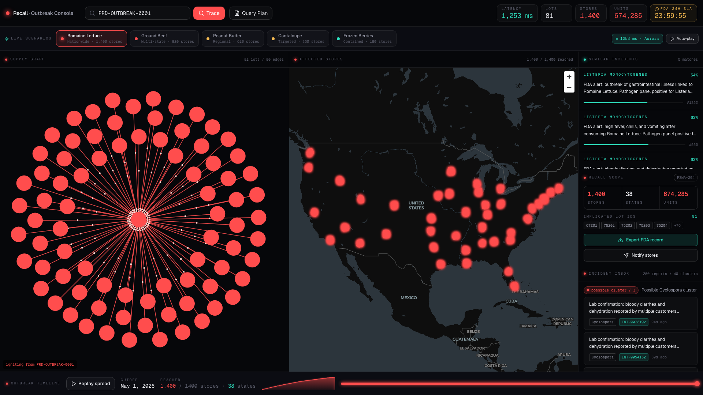
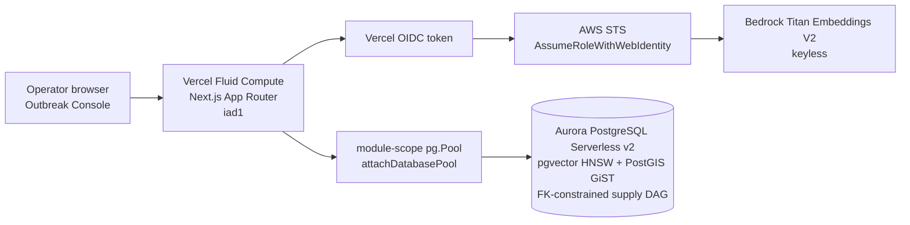

# Recall - The Outbreak Console

One serializable Aurora PostgreSQL query traces a foodborne outbreak from one Traceability Lot Code to every affected store, maps the blast radius with PostGIS, and ranks similar prior incidents with pgvector.

- Live app: https://recall-h0.vercel.app
- Hackathon: H0 - Hack the Zero Stack with Vercel v0 and AWS Databases
- Track: Monetizable B2B
- Demo TLC: `PRD-OUTBREAK-0001`



## Verified Live Numbers

Fresh live trace on June 24, 2026:

- `1,400` affected stores across `38` states
- `674,285` recalled units
- `81` contaminated lots
- `80` supply-chain edges
- `5` similar incident matches

Seed scale:

- `80,000` lots
- `250,000` `lot_links` edges
- `250,000` shipments
- `1,400` stores
- `2,000` embedded incidents

## Why This Is Load-Bearing Aurora

Recall is built around one SQL statement. It fuses:

- Recursive CTE over `lot_links` for supply-DAG traversal
- PostGIS GiST geography path for affected-store mapping
- pgvector HNSW similarity search for incident intelligence
- FK-enforced DAG integrity inside a serializable transaction

DynamoDB cannot do recursive joins. Aurora DSQL has no PostGIS, no pgvector, and no foreign keys. Aurora PostgreSQL is the only designated H0 database that can make the data model itself do the recall.

## Architecture

Full Devpost-ready architecture artifact: [docs/submission/architecture.png](docs/submission/architecture.png)



No long-lived AWS access keys are used. Bedrock is called through Vercel OIDC to AWS STS, and Aurora is reached through a TLS-verified `pg` pool.

## Hero SQL

The full implementation lives in [`lib/db/queries/trace.ts`](lib/db/queries/trace.ts). The important shape is:

```sql
WITH RECURSIVE contaminated AS (
  SELECT l.lot_id, 0 AS depth, ARRAY[l.lot_id] AS path
  FROM lots l WHERE l.tlc = $1
  UNION ALL
  SELECT ll.child_lot_id, c.depth + 1, c.path || ll.child_lot_id
  FROM contaminated c
  JOIN lot_links ll ON ll.parent_lot_id = c.lot_id
  WHERE c.depth < 12 AND ll.child_lot_id <> ALL(c.path)
),
affected AS (
  SELECT s.store_id, s.name, s.chain, s.address,
         ST_Y(s.geom::geometry) AS lat,
         ST_X(s.geom::geometry) AS lng,
         SUM(sh.units) AS units
  FROM shipments sh
  JOIN contaminated c ON c.lot_id = sh.lot_id
  JOIN stores s ON s.store_id = sh.store_id
  GROUP BY s.store_id, s.name, s.chain, s.address, s.geom
),
similar_incidents AS (
  SELECT i.incident_id, i.raw_text, i.pathogen,
         1 - (i.embedding <=> $2::vector) AS score
  FROM incidents i
  WHERE EXISTS (SELECT 1 FROM contaminated)
  ORDER BY i.embedding <=> $2::vector
  LIMIT 5
)
SELECT ...
```

The live Query Inspector calls `/api/explain` and shows the real `EXPLAIN (ANALYZE, BUFFERS)` plan, including Recursive Union, GiST spatial path, and HNSW index scan.

## Reliability

- Aurora pool has bounded connect and statement timeouts on both local and cloud paths.
- `/api/trace` is dynamic, uncached, and has a typed timeout response for scale-from-zero wakeups.
- `/api/health` is liveness only; `/api/ready` performs a bounded `SELECT 1` readiness check.
- Vercel Cron pings `/api/ready` every four minutes during judging to avoid the judge being the cold-start trigger.
- Server logs are newline-delimited JSON with `traceId`, dependency, failure class, and retry metadata; see [docs/ops/observability.md](docs/ops/observability.md).
- Default `pnpm test` is DB-free and covers guards/error behavior; `pnpm test:integration` runs the live seeded-DB contract tests.

## Local Development

Use Node 24+ and pnpm.

```bash
pnpm install
pnpm db:up
pnpm db:migrate
pnpm db:seed
pnpm dev
```

Human-gated note: migration and seed commands may be blocked in protected environments because they touch database state. In that case, run them manually with the intended local/Postgres credentials.

## Verification

```bash
pnpm typecheck
pnpm lint
pnpm test
pnpm build
```

Optional live/integration checks:

```bash
pnpm test:integration
pnpm test:smoke
pnpm bench
```

## Submission Docs

- [Submission writeup](docs/submission/submission.md)
- [Demo script](docs/submission/demo-script.md)
- [Architecture notes](docs/submission/architecture.md)
- [Build-in-public post](docs/submission/build-in-public.md)
