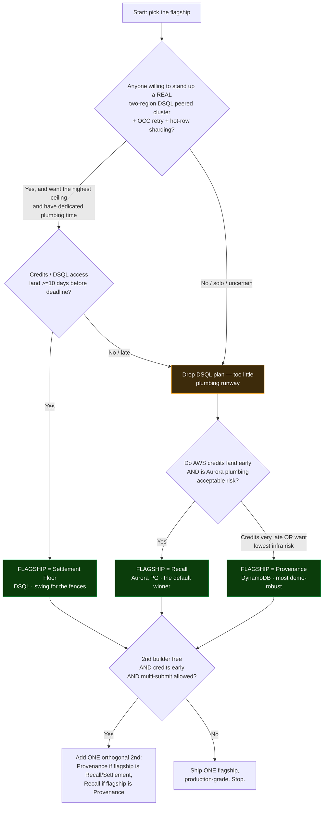

# 05 — The Recommendation: What to Build, and How to Win

**Purpose:** The decisive strategy call for H0. One flagship to build to production-grade (**Recall**), the safest backup (**Provenance**), the highest-ceiling swing (**Settlement Floor**), the best track/segment/DB, the one-vs-many submission call, a route decision tree, scenario plays, and a 14-day countdown to the 2026-06-30 deadline.

> **Last updated / source:** the H0 ideation workflow (22-agent orchestration → grounding → 32 scored concepts → 5 deep dives → recommendation). Expands `IDEATION.md` Phase 6 into a build-ready memo. Numbers labeled "target" are measurement goals, not claimed facts.

---

## Table of Contents

- [TL;DR — the call in five lines](#tldr--the-call-in-five-lines)
- [1. The single best route → BUILD RECALL](#1-the-single-best-route--build-recall)
- [2. The safest backup → PROVENANCE](#2-the-safest-backup--provenance)
- [3. The highest-ceiling risky route → SETTLEMENT FLOOR](#3-the-highest-ceiling-risky-route--settlement-floor)
- [4. The verdicts you asked for](#4-the-verdicts-you-asked-for)
  - [4.1 Best track](#41-best-track-monetizable-b2b)
  - [4.2 Best segment](#42-best-segment-b2b-primary-open-innovation-as-cross-tag)
  - [4.3 One submission or multiple](#43-one-submission-or-multiple-one-flagship-then-maybe-one-more)
  - [4.4 Which database, and why](#44-which-database-and-why-aurora-postgresql-for-the-flagship)
- [5. The decision tree (route picker)](#5-the-decision-tree-route-picker)
- [6. Scenarios → recommended plan](#6-scenarios--recommended-plan)
- [7. The 14-day countdown plan (flagship = Recall)](#7-the-14-day-countdown-plan-flagship--recall)
- [8. Pre-flight kill-checks](#8-pre-flight-kill-checks)
- [Cross-links](#cross-links)

---

## TL;DR — the call in five lines

1. **Build Recall** — *The Outbreak Console* (Aurora PostgreSQL, Monetizable B2B). It topped every judge panel (composite **9.23**; AWS-DB-fit 10, Tech 10, Usefulness 9.7) and is simultaneously the highest-ceiling AND lowest-risk top idea.
2. **Target Monetizable B2B**, cross-tag Open Innovation. Best odds, least crowded, instant real-world + monetization read.
3. **Use Aurora PostgreSQL** for the flagship — the most load-bearing-able engine here (recursion + PostGIS geo + pgvector in one statement); it lets the UI *be* the query and sidesteps the RAG-chatbot trap that swallows the field.
4. **Ship ONE flagship to absolute production-grade.** Only add **Provenance** (DynamoDB) as a second submission *if* credits land early AND you have a second builder — it shares zero infra and hits a different rubric.
5. **Treat Settlement Floor (DSQL) as a swing-for-the-fences** flagship *only* if you have dedicated two-region plumbing time. Never as an "easy second."

> **Bottom line:** Recall is the flagship. Provenance is the robust hedge. Settlement Floor is the high-variance bet. Pick exactly one flagship from the [decision tree](#5-the-decision-tree-route-picker).

---

## 1. The single best route → BUILD RECALL

**Recall — The Outbreak Console.** Aurora PostgreSQL Serverless v2 (pgvector 0.8.0 HNSW + PostGIS). Monetizable B2B (FSMA-204 traceability sold per-facility to grocery chains / distributors / CPG manufacturers); secondary tag Open Innovation (public-good). See the full build in **[./deep-dives/01-recall.md](./deep-dives/01-recall.md)**.

### Why this is the call (no hedging)

It is the rare idea that is **highest-ceiling AND lower-risk than its rivals** at the same time:

| Reason | The detail |
|---|---|
| **The DB is genuinely non-interchangeable** | One verified kill-shot sentence: *"DynamoDB can't do recursive traversal or ad-hoc joins; Aurora DSQL has no PostGIS and no extensions, so no geo and no pgvector — only Aurora PostgreSQL fuses graph recursion + geospatial + vector similarity in one statement."* It fuses recursion + geospatial + vector in **one SERIALIZABLE statement** — a thing no other entrant's stack can do. |
| **It dodges BOTH field failure modes at once** | The UI is a *thesis about the data* (graph = recursion, map = PostGIS spatial join, rail = pgvector), and it shows **evidence** (live `EXPLAIN (ANALYZE, BUFFERS)`, 250k-edge row count, measured latency, CloudWatch ACU) instead of "scales to millions" claims. |
| **Single-region** | Sidesteps the #1 execution risk that haunts the DSQL ideas — standing up a real peered two-region cluster + OCC retry path under deadline pressure. Recall has no cross-region surface to fail on. |
| **Named, dated, mandated, budgeted buyer** | **FSMA 204** (real FDA rule, 24-hour records-to-FDA SLA, enforcement July 2028). Impact & Real-world Applicability scores against a real number, not a hypothetical. |
| **Its one real risk is fully mitigable before any UI** | A quadratic/cycling recursive CTE that hangs on camera. Killed in build step 2: acyclic DAG + visited-set/depth guard, both-direction indexes on `lot_links`, verify EXPLAIN uses index scans every iteration, warm ACU floor, pre-validated demo lot. |

> **Kill-shot you say verbatim on camera (precision note):** DSQL *does* support basic CTEs — do **not** claim it lacks recursive CTEs. The unimpeachable kill-shots are **PostGIS + pgvector + FK-enforced DAG integrity**, none of which DSQL or DynamoDB has.

### What "win" looks like

Win on **Technological Implementation + Originality**: a recursive-CTE + PostGIS + pgvector single-statement trace is genuinely rare. Make Aurora the protagonist and the UI its courtroom evidence — every pixel is a query result, so it can't be mistaken for CRUD or a chatbot. Put the live `EXPLAIN ANALYZE` on screen (most teams hide their SQL; you make it the hero). The demo: report lands → paste a Traceability Lot Code → one query traces backward to source + forward to **~1,400 affected stores across 38 states** in **under a second** (target: measure and show p50/p99), graph ignites red, map drops pins, vector rail surfaces similar past incidents.

---

## 2. The safest backup → PROVENANCE

**Provenance** — agent-observability time-travel debugger. DynamoDB (single-table + Streams→Lambda materialized views + TTL), B2B primary / Open Innovation cross-tag. Composite **8.81** (#2 overall). See **[./deep-dives/02-provenance.md](./deep-dives/02-provenance.md)**.

### Why it's the robust hedge

If Aurora connection/plumbing fights you, or you want a **second submission**, this is the most robust build in the entire set:

- **No connection pool to exhaust.** DynamoDB sidesteps the single most common Vercel+Aurora demo-killer (serverless connection storms). This alone makes it the lowest-infra-risk flagship.
- **Single-region by design** (it's trace ingestion) — no cross-region plumbing.
- **Hot category = instant relevance.** Agent observability is the 2026 zeitgeist; judges feel the market without explanation.
- **A demo that's unforgettable and hard to fake.** Scrub a slider backward through an agent's life and watch state rewind by *folding the raw event log client-side* — true event sourcing. You can show the one-Query timeline trace (X-Ray) and the CloudWatch capacity-vs-flat-p99 graph; the scrubber literally cannot exist without an append-only ordered item collection.
- **Shares ~zero infrastructure with Recall** and targets a **different DB + different judge rubric** (AWS-database-craft lane, not pgvector relevance). That orthogonality is exactly what makes it the ideal *second* entry — it multiplies prize surface without competing with the flagship.

> **Use it as the flagship instead of Recall only if** credits land very late or no one wants to fight Aurora plumbing — DynamoDB has the least setup risk of the three engines. See the [decision tree](#5-the-decision-tree-route-picker).

---

## 3. The highest-ceiling risky route → SETTLEMENT FLOOR

**Settlement Floor** — global parametric-microinsurance settlement exchange. Aurora DSQL (one multi-region peered cluster, us-east-1 + us-west-2, both active writers). B2B + Million-scale global. Composite **8.41** (#5 overall). See **[./deep-dives/05-settlement-floor.md](./deep-dives/05-settlement-floor.md)**.

### Why it's the swing-for-the-fences bet

It has **the most viscerally unforgettable demo in the entire set**:

> *"the app where you watched a double-pay get rejected and a region die without missing a payment."*

- DSQL is the **least-contested lane** — most DSQL entrants will fake active-active with a single region and claim sub-ms latency with no measurement. A real peered cluster + the literal `SQLSTATE 40001 serialization_failure` rejection + a live region-kill is **near-uncontestable**.
- It fuses two judge-rewarded moments (exactly-once-winner + cross-region strong-consistency read + region-survival) into one artifact.

### Why it's the *risky* route (read this before committing)

It is **all-or-nothing**. The entire submission rests on three things landing:

1. A genuine **two-region peered DSQL cluster** (both active writers, strong consistency at commit).
2. The **OCC 40001 retry wrapper** (catch → if `settlement(oracle_event_id)` exists, return idempotently; else backoff retry).
3. The **write-sharded hot-row redesign** — a single shared `coverage_pool` balance row is exactly the anti-pattern AWS warns DSQL punishes; under a storm every payout conflicts on that row → a 40001 retry blizzard → collapsed throughput. Defeat it by splitting the pool into N=16 `pool_shard` rows (debit one random shard; solvency = `SUM(balance)`).

If those land, it can **win the global track outright**. If any one slips, you have no submission. **Only attempt as a flagship with dedicated DSQL plumbing time — never as a side project, and never as your "easy second."**

---

## 4. The verdicts you asked for

### 4.1 Best track: **Monetizable B2B**

Best odds. B2B workloads make the DB *naturally* load-bearing (multi-tenant, audit/event history, billing/metering, reporting with real JOINs), real-world applicability + monetization read instantly, and it's **less crowded** because B2B is "less fun" to build — so a serious one stands out. All three of Recall / Provenance / Settlement Floor are B2B-primary with strong cross-tags. **Avoid B2C as a primary** (most crowded, lowest odds, v0 polish is mere table stakes).

| Track | Odds | One-line why |
|---|---|---|
| **Monetizable B2B** | **Best** | DB naturally load-bearing; less crowded; instant real-world + monetization read. |
| Million-scale global | High ceiling / high risk | Most rewards DSQL multi-region + DynamoDB scale, but easiest to fake → strictest win condition (you must SHOW scale). |
| Open innovation | Wildcard | Originality magnet; highest variance. Strong for a sharp, distinct entry; weak as a hiding place. |
| Monetizable B2C | Lowest | Most crowded, highest concentration of weak archetypes. |

### 4.2 Best segment: **B2B primary, Open Innovation as cross-tag**

Lead B2B (best odds), and **cross-tag Open Innovation** as the safety-net — **Originality is an explicit judging criterion**, and a recall/agent-forensics/UTM domain owns it. Million-scale is the highest ceiling but the strictest win condition. Recall is the textbook fit: lead the copy with the FSMA-204 B2B buyer, tag Open Innovation for the public-good + originality halo.

### 4.3 One submission or multiple: **ONE flagship, then maybe one more**

**Build ONE flagship (Recall) to absolute production-grade.** *If and only if* credits land in time **and** you have a second builder, ship a SECOND in a different track + different DB — **Provenance (DynamoDB)** — because it shares no infra and hits a different rubric, multiplying prize surface without diluting quality.

- ✅ Do: one flagship at production-grade, optionally one orthogonal second.
- ❌ Do not: attempt 3+ submissions.
- ❌ Do not: make the DSQL idea (Settlement Floor) your "easy second" — it's the highest-effort build, not a side project.

> **Assumption (override if wrong):** the rules permit multiple submissions; quality-per-submission still dominates, so we cap at two. Confirm against the live rules — see **[./06-open-questions.md](./06-open-questions.md)** Q2.

### 4.4 Which database, and why: **Aurora PostgreSQL for the flagship**

| DB | Verdict | Why |
|---|---|---|
| **Aurora PostgreSQL** | **#1 — flagship** | The most load-bearing-able engine: recursion + geo + vector + transactional correctness in **one query**. It lets the UI *be* the query and sidesteps the RAG-chatbot trap. Risk it adds: serverless connection exhaustion → mitigated by RDS Proxy + Fluid module-scope pool + `attachDatabasePool`. |
| **DynamoDB** | **Strong #2** | Event-sourcing / scale demos are the most legible "designed for scale" evidence and the **most demo-robust** (no connection pool to exhaust, single-region). The right flagship if credits are very late or you want the lowest-risk path. |
| **Aurora DSQL** | **High-ceiling, only if committed** | Highest payoff (uncontested lane, unforgettable demo) but highest failure surface (two genuine peered regions + OCC retry + hot-row sharding). Only if you dedicate plumbing time. |

---

## 5. The decision tree (route picker)

Answer three questions — team size, DSQL appetite, and credit timing — and the tree outputs your flagship.

**Reading the tree:**
- The **default exit is Recall** — it's where solo builders, uncertain-DSQL teams, and "credits arrive on time" teams all land.
- **Settlement Floor** is gated behind *both* DSQL appetite *and* enough runway. If either fails, fall through to Recall.
- **Provenance** is the fallback when credits are very late or you want the lowest infra risk — and it doubles as the *second* submission when a flagship plus a second builder are available.

---

## 6. Scenarios → recommended plan

| # | Scenario | Flagship | 2nd submission? | DB(s) | Rationale |
|---|---|---|---|---|---|
| **A** | **Solo builder, AWS credits land late** | **Recall** if Aurora access is in hand by Day 3; otherwise **Provenance** | No — one flagship only | Aurora PG (or DynamoDB fallback) | Solo bandwidth can't carry two production-grade builds. If credits slip past Day 3, Provenance's zero-connection-pool, single-region setup is the safer flagship. |
| **B** | **2 builders, credits ready now** | **Recall** | **Yes — Provenance** | Aurora PG **+** DynamoDB | Builder 1 takes Recall to production-grade; Builder 2 owns Provenance (zero shared infra, different rubric). Two orthogonal shots, no quality dilution. Cap at two. |
| **C** | **DSQL-capable team (someone has done peered DSQL + OCC) with dedicated plumbing time** | **Settlement Floor** | Optional: **Provenance** only if a 3rd hand is free | Aurora DSQL (+ DynamoDB) | The uncontested lane and the most unforgettable demo. Spend Days 1–4 proving the double-pay race in a script *before* any UI; if it doesn't land by Day 4, **fall back to Recall** (you still have Aurora-class skills). |

> **Guardrail for Scenario C:** Settlement Floor's spine is "fire the same `oracle_event_id` at both endpoints concurrently → one commits, one gets 40001, pool stays solvent." If that proof isn't green by **Day 4**, abandon DSQL and pivot the remaining runway to Recall. Do not sink the whole timeline into a cluster that won't cooperate.

---

## 7. The 14-day countdown plan (flagship = Recall)

Deadline: **2026-06-30, 02:00 GMT+2.** Count back 14 days → start **2026-06-16**. Days are nominal "build days"; compress if you start later. The spine (schema → hero query → console) is non-negotiable; everything after is cut-protected. Full build detail: **[./deep-dives/01-recall.md](./deep-dives/01-recall.md)**.

| Day | Date | Focus | Definition of done (verify, don't assume) |
|---|---|---|---|
| **D-14** | Jun 16 | **Stand up infra + schema.** Provision Aurora PG Serverless v2 (PG 16+); `CREATE EXTENSION vector; postgis;`. Create the FK-constrained schema (`suppliers, facilities, lots, lot_links, stores, shipments, store_inventory, incidents`) with CHECKs + HNSW + GiST indexes. **Start the OIDC keyless auth task in parallel.** | `\dx` shows `vector` + `postgis`; tables exist with FKs; one OIDC-authed query runs from a Vercel preview. |
| **D-13** | Jun 17 | **Seed generator.** Produce a **true acyclic** supply DAG: ~80k lots, ~250k `lot_links` edges, ~250k shipments, ~1,400 geo stores across 38 states, ~2,000 embedded incidents (precompute embeddings offline via Bedrock, `COPY` in). | Row counts confirmed by `SELECT count(*)`; DAG verified acyclic (no cycle in `lot_links`). |
| **D-12** | Jun 18 | **The hero query (the spine).** Single SERIALIZABLE recursive-CTE forward-trace + PostGIS JOIN + pgvector LEFT JOIN, returning the exact row shape the three panes need. | Returns **~1,400 stores in <1s** for the demo lot; `EXPLAIN (ANALYZE, BUFFERS)` shows index scans at every recursion iteration (no seq scan, no quadratic blowup). |
| **D-11** | Jun 19 | **Harden the query (kill the #1 risk).** Add visited-set/depth guard, cap fan-out depth (~4–7 hops), index both directions of `lot_links`, warm the ACU floor. Add the backward/upstream trace (same pattern). | Adversarial test: random + cyclic-looking lots don't hang; cold-start query still sub-second with warm floor. |
| **D-10** | Jun 20 | **v0 generates the Outbreak Console.** Split layout: force-directed supply graph (left) + synchronized PostGIS US map (right) + "Similar Past Incidents" vector rail (right edge) + top bar (row count, latency, 24h SLA countdown). Dark control-room aesthetic, shadcn/Tailwind. | v0 shell renders on a Vercel preview URL with placeholder data. |
| **D-9** | Jun 21 | **Wire the console to the spine.** RSC first-paint runs the trace server-side (no loading flash); Server Action re-runs on new TLC / node click; graph + map animate client-side off returned rows. | Pasting the demo TLC ignites the graph + drops map pins with real unit counts on the live URL. |
| **D-8** | Jun 22 | **Connection plumbing (the #2 risk).** Vercel Fluid Compute module-scope `pg Pool` + `attachDatabasePool()` → **RDS Proxy** → Aurora. Secrets Manager. Load-test the pool before trusting it. | No "too many connections" under repeated trace fires; OIDC role assumed, zero long-lived keys in env. |
| **D-7** | Jun 23 | **The 10x: Query Inspector.** Render the actual recursive CTE SQL + live `EXPLAIN (ANALYZE, BUFFERS)` with the recursive-union node, HNSW scan, GiST spatial join visible. *(Highest-leverage 30 minutes in the project.)* | Inspector shows the real plan fetched server-side, not a screenshot. |
| **D-6** | Jun 24 | **Lineage drawer + Incident Inbox.** Click a pin/node → one-JOIN four-table parent/child lineage trail. Inbox shows pgvector "possible cluster" badges with cosine-distance scores. | Drill-down reads e.g. "240 units of lot PRD-8841, derived from ING-2207, Verde Farms, shipped June 9." |
| **D-5** | Jun 25 | **Production-grade states + evidence capture.** Real empty/error states (random lot → "clean lot — no shelves at risk"). Capture the **AWS DB screenshot**: RDS console (Serverless v2 cluster) + the `EXPLAIN ANALYZE` plan + a **CloudWatch ACU-scaling graph** during the trace burst. Put real p50/p99 on the top bar. | All four screenshot artifacts saved; latency number on screen is a real measurement. |
| **D-4** | Jun 26 | **Architecture diagram = the DATA MODEL.** ER diagram + the `lot_links` DAG edge table + the annotated hero query (not generic boxes). Optional Vercel Cron trickling synthetic shipments so the live row counter climbs during judging. | Diagram drawn; it reads as a data-model thesis, not a microservice box-art. |
| **D-3** | Jun 27 | **Demo dry-run #1.** Record the ~170s script end-to-end on the **live URL** (never localhost). Time each beat: cold open → inbox cluster → paste TLC + trace → payoff (1,400 stores / latency / row count) → Query Inspector → drill-down → why-only-Aurora kill-shot → RDS + CloudWatch proof → live URL + 24h SLA timer. | Full run under 3:00 (target ~170s + buffer); every beat hits on the deployed URL. |
| **D-2** | Jun 28 | **Polish pass + re-record.** Micro-interactions, badge pulses, animated counters; fix any beat that dragged. Pre-validate the exact demo lot returns ~1,400 stores in <1s with a warm floor. | Final cut < 3:00; the Aurora "Amazon Aurora PostgreSQL" title card + Team ID slate included. |
| **D-1** | Jun 29 | **Assemble submission + bonus.** Text desc naming **Amazon Aurora PostgreSQL**; demo video; working-app footage; AWS-DB-usage explanation; **published Vercel project link + Team ID** (verify in a fresh incognito window); architecture diagram; AWS-DB screenshot. Bonus: one annotated data-model build post + 60–90s clip of the signature screen. | Every required artifact present and re-verified; bonus content drafted (only if core is solid). |
| **D-0** | Jun 30 (by 02:00 GMT+2) | **Submit with buffer.** Final incognito check of the live URL + Team ID resolves. Submit hours early, not at the wire. | Submission confirmed; live URL + Team ID resolve for a logged-out viewer. |

**Spine (never cut):** the recursive CTE, the PostGIS map JOIN, the pgvector rail, the live EXPLAIN, real seed volume, and the live-URL deploy.
**Cut order if scope bites (protect the spine):** backward/upstream trace (narrate it instead) → Cron synthetic-ingest counter → Scope Export action → full Incident Inbox (keep one inline pre-clustered example) → live Bedrock embedding (precompute offline).

> If running **Provenance** or **Settlement Floor** instead, keep the same skeleton but swap the spine: Provenance = single-table + one-Query timeline + **client-side fold/scrub** + Streams→`CURRENT#STATE` (prove OIDC + one Query on Day 1; never let the fold drift server-side). Settlement Floor = **two-region peered cluster + the 40001 double-pay race proven in a script by Day 4** before any UI.

---

## 8. Pre-flight kill-checks

These are the auto-deflate / instant-credibility-killer traps from the judging model. Run them before submitting any route.

- [ ] **Required artifacts all present:** text desc naming the AWS DB, demo video < 3 min, working-app footage, AWS-DB-usage explanation, **published Vercel link + Team ID**, dual-tier architecture diagram, AWS-DB screenshot. *(Missing any one auto-deflates regardless of code quality.)*
- [ ] **Demo runs on the LIVE URL with real data** — never localhost; verified in a fresh incognito window.
- [ ] **The DB choice is provably intentional:** you can say in one sentence why each *other* DB is wrong (Recall: no recursion/joins in Dynamo, no PostGIS/extensions in DSQL).
- [ ] **The signature feature fires in the demo's critical path, visibly** (recursive-union + HNSW + GiST for Recall; client-side fold + Streams for Provenance; 40001 + region-kill for Settlement Floor).
- [ ] **Evidence over claims:** real row counts (250k+ edges / millions of events / 50k policies), a measured p50/p99 on screen, a CloudWatch/RDS/DSQL screenshot of *real activity* — never an empty table or "scales to millions" on a dozen seed rows.
- [ ] **Architecture diagram is the DATA MODEL**, not microservice box-art with Kafka/Redis that appear nowhere in the repo.
- [ ] **No RAG-chatbot smell:** pgvector is JOINed to relational + geospatial data inside a filtered query, not a standalone similarity lookup.
- [ ] **Connection plumbing load-tested** (Aurora routes only): RDS Proxy + Fluid module-scope pool + `attachDatabasePool`, exercised before recording.

---

## Cross-links

- **Flagship build:** [./deep-dives/01-recall.md](./deep-dives/01-recall.md)
- **Backup build:** [./deep-dives/02-provenance.md](./deep-dives/02-provenance.md)
- **Swing-for-the-fences build:** [./deep-dives/05-settlement-floor.md](./deep-dives/05-settlement-floor.md)
- **Open questions + assumption register (Q1 team/DSQL, Q2 one-vs-two, Q3 credit timing):** [./06-open-questions.md](./06-open-questions.md)
- **Why these win / failure modes / track odds:** [./01-judging-model.md](./01-judging-model.md)
- **Full 32-concept scoring matrix:** [./04-scoring-matrix.md](./04-scoring-matrix.md)
- **DB superpowers + screenshot proofs:** [./reference/aws-databases.md](./reference/aws-databases.md)
- **Vercel/v0 patterns + OIDC + Fluid Compute:** [./reference/vercel-v0-playbook.md](./reference/vercel-v0-playbook.md)
- **Submission checklist:** [./reference/submission-checklist.md](./reference/submission-checklist.md)
