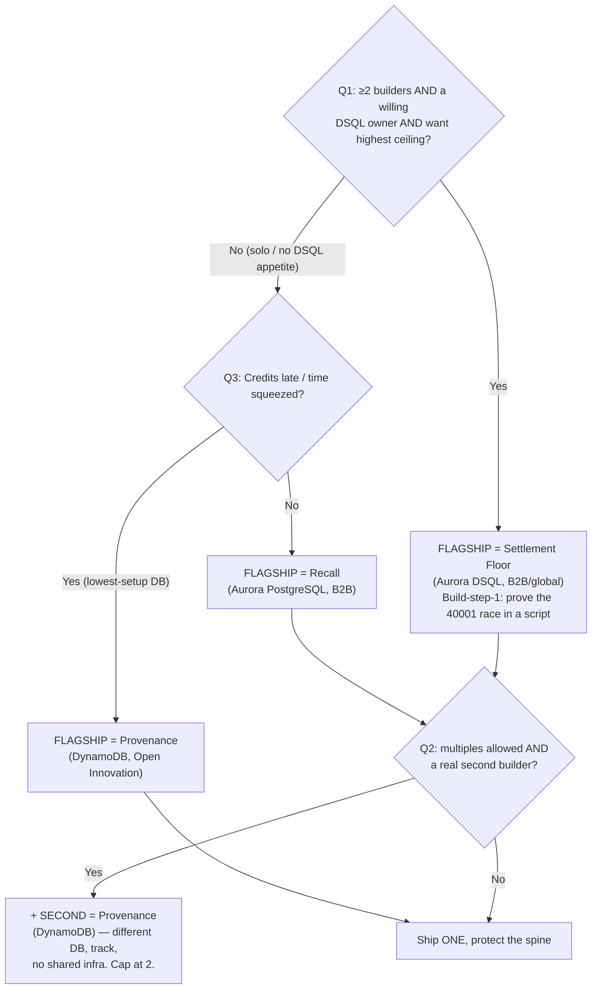

# Open Questions & Assumptions

**Purpose:** Surface the small number of decisions that actually change the build route, separate them from the ones that only sharpen execution, register every assumption the recommendation rests on, and give you a short pre-build decision checklist. Answering the three must-answer questions takes ~10 minutes and locks the flagship, the DB, and the one-vs-two call.

> *Last updated / source: the H0 ideation workflow (Phase 7 of `IDEATION.md`). This doc is downstream of and consistent with the call in [`./05-recommendation.md`](./05-recommendation.md).*

---

## Table of Contents
- [How to use this doc](#how-to-use-this-doc)
- [Must-answer questions (change the route)](#must-answer-questions-change-the-route)
  - [Q1 — Team size & DSQL appetite](#q1--team-size--dsql-appetite)
  - [Q2 — One submission or two](#q2--one-submission-or-two)
  - [Q3 — Credit & timing reality](#q3--credit--timing-reality)
- [Nice-to-answer questions (sharpen execution)](#nice-to-answer-questions-sharpen-execution)
  - [Q4 — Domain access / design partner](#q4--domain-access--design-partner)
  - [Q5 — Build-in-public bandwidth](#q5--build-in-public-bandwidth)
  - [Q6 — Aesthetic preference](#q6--aesthetic-preference)
  - [Q7 — AI / embeddings stance](#q7--ai--embeddings-stance)
  - [Q8 — Vercel Team plan & Team ID](#q8--vercel-team-plan--team-id)
  - [Q9 — AWS account & Region posture](#q9--aws-account--region-posture)
- [Decision flow (the questions, as a tree)](#decision-flow-the-questions-as-a-tree)
- [Assumption register](#assumption-register)
- [Decisions we need from you before build starts](#decisions-we-need-from-you-before-build-starts)

---

## How to use this doc

The recommendation in [`./05-recommendation.md`](./05-recommendation.md) is **Build Recall** (Aurora PostgreSQL, B2B), hold **Provenance** (DynamoDB) as a robust second, treat **Settlement Floor** (Aurora DSQL) as the swing-for-the-fences flagship only with dedicated two-region plumbing time.

That call is **deliberately answer-independent**: if you say nothing, we build Recall solo and ship. The three must-answer questions below exist only because a small number of answers would *override* that default — they flip the flagship to Settlement Floor, or add a second submission, or (if credits are very late) bias toward the lowest-setup DB. Everything in the "nice-to-answer" section changes *how well* we execute, never *what* we build.

Read order: answer Q1–Q3 first (10 min), skim the [decision tree](#decision-flow-the-questions-as-a-tree), then sign off the [pre-build checklist](#decisions-we-need-from-you-before-build-starts).

---

## Must-answer questions (change the route)

These three, and only these three, can move us off the default route. Each has a concrete "what changes based on the answer."

### Q1 — Team size & DSQL appetite

**The question:** How many builders are on this, and is *anyone* comfortable provisioning a real two-region Aurora DSQL peered cluster (`us-east-1` + `us-west-2`, both active writers, one logical DB) and writing the OCC retry wrapper that catches `SQLSTATE 40001` and returns idempotently?

**Why it matters:** Settlement Floor is the highest-ceiling demo in the set (*"watch a double-pay get rejected and a region die without missing a payment"*) and sits in the **least-contested lane** — most DSQL entrants fake active-active with a single region. But the *entire* submission rests on plumbing that does not exist in the other two routes: a genuine peered cluster, the commit-time conflict path, and the **write-sharded hot-row redesign** that defeats DSQL's documented "high-frequency balance update" anti-pattern. There is no graceful degradation — if the two-region cluster or the 40001 retry path doesn't land, there is no demo. Recall and Provenance are both single-region and have no equivalent all-or-nothing dependency.

**What changes based on the answer:**

| Answer | Route |
|---|---|
| **Solo, or no one wants to own DSQL plumbing** | **Recall** as flagship. No further debate. (This is the default.) |
| **≥2 builders AND one will own DSQL, AND you want the highest ceiling** | **Settlement Floor** becomes viable as flagship — but only if that builder treats the two-region cluster + 40001 race proof as build-step-1 (prove the double-pay race in a script *before* any UI). |
| **≥2 builders but DSQL appetite is uncertain** | **Recall** flagship + **Provenance** second (see Q2). Do **not** make DSQL the "easy second" — it is the hardest infra in the set, not the easiest. |

> **Kill-shot to remember:** "Solo + DSQL flagship" is the single worst combination in this whole space. One person standing up active-active multi-region under deadline pressure is how a top-ceiling idea becomes a no-show.

---

### Q2 — One submission or two

**The question:** Are multiple project submissions permitted by H0 rules and desired by you, and do you have a genuine *second* builder (not the flagship owner moonlighting)?

**Why it matters:** Recall and Provenance share **almost zero infrastructure** — different database (Aurora PG vs DynamoDB), different judge rubric (recursion+geo+vector correctness vs append-only scale + event-sourcing), different track emphasis (B2B-FSMA vs Open-Innovation agent-ops). That means a second submission *multiplies prize surface without diluting the flagship's quality*, IF and only if it has dedicated hands. The failure mode is splitting one builder across two apps and shipping two B-minus demos instead of one A.

**What changes based on the answer:**

| Answer | Route |
|---|---|
| **Multiples not allowed, OR you only want one** | Pour everything into **Recall** to absolute production-grade. (Default.) |
| **Allowed, desired, AND a second builder exists** | Ship **Recall** (Aurora PG) + **Provenance** (DynamoDB) in parallel — different DB, different track, no shared infra. Cap at **two**. |
| **Allowed but no real second builder** | Stay at **one**. A diluted flagship loses; a single production-grade entry beats two half-built ones on every judging axis. |

> Hard rule regardless of answer: **never 3+ submissions**, and **never** use Settlement Floor as the "lightweight" second — Provenance is the robust second precisely because it has no connection pool to exhaust and is single-region.

---

### Q3 — Credit & timing reality

**The question:** When do the AWS credits and the Vercel/v0 credits actually land in the accounts you'll build in, and is the **2026-06-30, 02:00 GMT+2** deadline firm for your team?

**Why it matters:** Each flagship has a different setup cost and credit dependency, so "credits land late" is not neutral — it should push us toward the lowest-setup database:
- **Recall** needs Aurora PostgreSQL Serverless v2 + pgvector + PostGIS + **Bedrock embeddings** (precomputed offline) + RDS Proxy. Moderate setup; embeddings can be batched ahead.
- **Settlement Floor** needs **two** DSQL regions provisioned and peered — the heaviest, least-forgiving setup.
- **Provenance** needs only a single DynamoDB table + Streams + a Lambda. **Lowest setup, no connection pool, single region** — the most credit/time-resilient of the three.

**What changes based on the answer:**

| Answer | Route |
|---|---|
| **Credits already in hand, deadline comfortable** | Default holds: **Recall** flagship (+ Provenance if Q2 says two). |
| **Credits land late / setup time is squeezed** | Bias the flagship toward the lowest-setup DB → **Provenance (DynamoDB)** becomes the *flagship*, not just the backup. It is the most demo-robust under time pressure. |
| **Deadline tighter than 2026-06-30 for you** | Same as above, and additionally pre-commit the [Cut-if-scope-bites](./README.md) lists from each deep dive — protect the spine, ship the signature screen, drop everything else. |

> Independent of the answer: **start the seed/data generation on day one** for whichever flagship wins (Recall's 250k-edge DAG, Provenance's millions of events, or Settlement Floor's 50k policies). The seed is on the critical path for the on-screen row-count evidence and is the single most-commonly-underestimated task.

---

## Nice-to-answer questions (sharpen execution)

These change *how good* the build is, not *which* build it is. Defaults are listed; override any.

### Q4 — Domain access / design partner
**Question:** Any connection to food-safety/grocery (Recall), insurance/treasury (Settlement Floor), or AI-agent-ops (Provenance)?
**Why it matters:** A real design partner or a realistic data shape makes the demo's data read as *true* rather than synthetic, and strengthens **Impact & Real-world Applicability** with a named buyer story rather than a hypothetical.
**What changes:** With access → use real-shaped lot codes / policy types / agent traces and quote the partner in the demo voiceover. Without → use the documented synthetic seed shapes; this is fully sufficient to win. *(Default: synthetic, realistic-shaped seed.)*

### Q5 — Build-in-public bandwidth
**Question:** Do you have bandwidth for the optional public-build bonus — one annotated data-model post + a 60–90s clip of the signature screen?
**Why it matters:** It's **near-free points top contenders will claim**; skipping it is a relative penalty. But polished content on a hollow app reads as marketing and *hurts*.
**What changes:** Yes → produce ONE substantive artifact (the access-pattern table / ER diagram / EXPLAIN plan / load-test graph) **only after** the working core + DB proof + required artifacts are solid. No → skip cleanly; do not half-do it. *(Default: do it, last, once the spine is solid.)*

### Q6 — Aesthetic preference
**Question:** Data-dense control-room (Recall / Sky Claim / Settlement Floor) or cleaner consumer product (HourBank)?
**Why it matters:** It sets the v0 prompt direction and the design system from the first generation.
**What changes:** For the recommended flagships this is essentially settled — **dark control-room / debugger aesthetic** (Recall's outbreak console, Provenance's time-travel theater, Settlement Floor's split-screen floor). Only relevant if you pivot toward HourBank. *(Default: dark, data-dense control-room.)*

### Q7 — AI / embeddings stance
**Question:** Comfortable using Bedrock / Vercel AI Gateway for embeddings?
**Why it matters:** Recall (incident clustering) and HourBank (need→skill matching) require real embeddings for the pgvector node to be honest in the EXPLAIN plan. Provenance and Settlement Floor do **not** need any AI at all — and Settlement Floor should explicitly avoid adding a chatbot.
**What changes:** Yes → precompute embeddings offline and `COPY` them in so EXPLAIN shows a true HNSW index scan. No → Provenance or Settlement Floor (neither needs embeddings) become more attractive. *(Default: yes, embeddings precomputed offline.)*

### Q8 — Vercel Team plan & Team ID
**Question:** Is there a Vercel **Team** (not Hobby) with a resolvable **Team ID**, and is OIDC keyless AWS auth acceptable?
**Why it matters:** The submission **requires** a published Vercel project link **+ Team ID** — a missing/unresolvable Team ID auto-deflates regardless of code quality. OIDC keyless (`@vercel/oidc-aws-credentials-provider` → STS AssumeRoleWithWebIdentity, trust keyed to `oidc.vercel.com/[TEAM_SLUG]`) is what a security-minded judge rewards and avoids long-lived keys.
**What changes:** No team yet → create one before build (5 min) and capture the Team ID into the submission checklist now. *(Default: Team plan exists; OIDC keyless used.)*

### Q9 — AWS account & Region posture
**Question:** Which AWS account/Region, and is DSQL available there if Settlement Floor is in play?
**Why it matters:** Recall/Provenance default to `us-east-1`. Settlement Floor needs a region pair where DSQL multi-region peering is available (`us-east-1` + `us-west-2`). Picking the wrong region late forces a re-provision.
**What changes:** Confirm `us-east-1` for the single-region flagships; confirm the DSQL-supported pair up front if going Settlement Floor. *(Default: `us-east-1`; pair confirmed only if DSQL.)*

---

## Decision flow (the questions, as a tree)

---

## Assumption register

These are the assumptions the recommendation runs on. Override any. Sorted by impact-if-wrong (highest first).

| # | Assumption | Confidence | Impact if wrong | How to validate |
|---|---|---|---|---|
| **A1** | We optimize for **winning a prize**, not shipping a startup — demo legibility + DB-as-protagonist beat feature breadth. | High | High — if you actually want a product, scope/roadmap/auth/billing would all change and the "one signature screen" strategy is wrong. | One sentence from you: "prize" vs "startup". Confirm in [pre-build checklist](#decisions-we-need-from-you-before-build-starts). |
| **A2** | **Time and building ability are not the binding constraint** (per the brief); the binding constraint is **credits/setup risk** — which is why single-region Aurora (Recall) is favored over two-region DSQL. | Medium | High — if time *is* tight, the calculus tips toward the lowest-setup DB (Provenance), and the DSQL flagship is off the table entirely. | Answer **Q3** (credit/timing). If time is tight, re-run the [decision tree](#decision-flow-the-questions-as-a-tree). |
| **A3** | **Multiple submissions are permitted** by H0 rules; quality-per-submission still dominates, so we cap at two. | Medium | High — if multiples are banned, the Provenance-as-second plan is dead and we go all-in on one. If allowed but we over-commit to 3+, every entry suffers. | Read the official H0 rules on multiple project submissions. Answer **Q2**. |
| **A4** | The required submission artifacts (published Vercel URL + **Team ID**, dual-tier architecture diagram, AWS-DB screenshot, demo <3 min) are **mandatory and auto-deflate if missing**, and "production-grade feel" (real volume, live URL, measured latency) outweighs any extra feature. | High | High — a missing Team ID or DB screenshot deflates an otherwise winning build; mis-prioritizing a feature over the spine loses on every axis. | Cross-check against [`./reference/submission-checklist.md`](./reference/submission-checklist.md); capture Team ID + a placeholder screenshot on day one. |
| **A5** | **B2B is the target segment**, with **Open Innovation as the cross-tag** for Originality. | High | Medium — if you specifically want a different track (e.g. pure Million-scale), Settlement Floor/Tempo-class ideas re-rank and the "show real scale" win-condition gets stricter. | Confirm target track in the [pre-build checklist](#decisions-we-need-from-you-before-build-starts). |
| **A6** | The flagship is **single-region** (Recall/Provenance, `us-east-1`); only Settlement Floor goes multi-region. | High | Medium — if a multi-region story is mandatory for your chosen track, only the DSQL route satisfies it honestly. | Answer **Q1** + **Q9**; confirm region. |
| **A7** | **Bedrock / AI Gateway embeddings are acceptable**, precomputed offline so EXPLAIN shows a true HNSW index scan. | Medium-High | Medium — only bites Recall/HourBank (pgvector). If AI is off-limits, pivot to Provenance/Settlement Floor (neither needs embeddings). | Answer **Q7**. Spike one embedding batch early. |
| **A8** | A **Vercel Team plan with a resolvable Team ID** exists (or can be created in minutes), and **OIDC keyless** AWS auth is acceptable. | Medium-High | Medium — Hobby plan / no Team ID risks the required artifact; long-lived keys are a security-judge red flag. | Answer **Q8**; create the team and paste the Team ID into the checklist now. |
| **A9** | **Synthetic, realistic-shaped seed data is sufficient** (no real design partner required). | High | Low-Medium — a real partner strengthens Impact but is not needed to win; the documented seed shapes carry the demo. | Answer **Q4**. If a partner appears, swap in real-shaped data. |
| **A10** | The **public-build bonus is worth doing**, but only *after* the working core + DB proof + required artifacts are solid. | Medium | Low — skipping it is a minor relative penalty; doing it on a hollow app actively hurts. | Answer **Q5**; gate the content task behind "spine complete". |
| **A11** | The seed/data-generation task is on the **critical path** and is the most commonly underestimated task. | High | Medium — under-volume seed → "scales to millions on 12 rows," the field's #1 credibility killer. | Start the seed generator on day one; put live row count on screen. |

---

## Decisions we need from you before build starts

Answer the first three and we lock the route in minutes; the rest just sharpen it.

**Must-answer (blocks route selection):**
- [ ] **Q1 — Team size & DSQL appetite:** How many builders, and will anyone own a real two-region DSQL cluster + 40001 retry path? *(Determines Recall vs Settlement Floor.)*
- [ ] **Q2 — One submission or two:** Multiples allowed/desired, and is there a genuine second builder? *(Determines whether we also build Provenance.)*
- [ ] **Q3 — Credit & timing reality:** When do AWS + Vercel credits land, and is 2026-06-30 02:00 GMT+2 firm for you? *(If late/tight → bias flagship to Provenance/DynamoDB.)*

**Confirm-or-override (assumptions that gate the plan):**
- [ ] **A1:** Optimizing to **win a prize**, not ship a startup. (Confirm.)
- [ ] **A5:** Target track = **Monetizable B2B**, Open Innovation as cross-tag. (Confirm or pick another.)
- [ ] **Q8 / A8:** Vercel **Team** exists; **Team ID captured** into [`./reference/submission-checklist.md`](./reference/submission-checklist.md); OIDC keyless OK.
- [ ] **Q9 / A6:** AWS account + Region confirmed (`us-east-1` default; DSQL pair if Settlement Floor).

**Nice-to-have (no blockers):**
- [ ] **Q4:** Any food-safety / insurance-treasury / agent-ops design partner or real data shape?
- [ ] **Q5:** Bandwidth for the build-in-public bonus (one annotated data-model post + 60–90s clip)?
- [ ] **Q6:** Aesthetic = dark control-room (default) vs cleaner consumer product?
- [ ] **Q7:** OK to use Bedrock / AI Gateway embeddings (precomputed offline)?

**Day-one, regardless of answers:**
- [ ] Start the **seed/data generator** for the chosen flagship (critical path; powers the on-screen row-count evidence).
- [ ] Capture **Vercel Team ID** + a placeholder for the **AWS DB screenshot** so the required-artifact slots are never empty.
- [ ] Prove the flagship's **riskiest correctness claim in a script first** (Recall: the recursive CTE returns ~1,400 stores sub-second; Provenance: client-side fold reconstructs state from one Query; Settlement Floor: the concurrent double-pay → one commit, one `40001`).

> See [`./05-recommendation.md`](./05-recommendation.md) for the full call, decision rationale, and scenario walkthroughs that these questions feed into.
