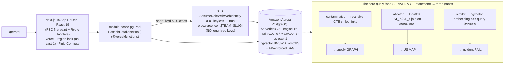

# Phase 11 — Demo Video & Submission Packaging

**Outcome:** A rehearsed, timecoded demo video (**< 180s**) recorded entirely on the **live Vercel URL**, plus every required H0 submission artifact (A1–A9) staged in `/submission/`, verified in a fresh incognito window, with each judging criterion mapped to a specific on-screen moment — ready to paste into the submission form at T-45m.

**Depends on / Unblocks:** Depends on [`PHASE-10-vercel-deploy.md`](./PHASE-10-vercel-deploy.md) (live production URL reaching Aurora with real data) and [`PHASE-09-aws-aurora.md`](./PHASE-09-aws-aurora.md) (RDS console + CloudWatch ACU graph available). Unblocks the **final submit** and [`PHASE-12-build-in-public.md`](./PHASE-12-build-in-public.md) (the bonus post reuses this phase's diagram + EXPLAIN + load graph). This is the **terminal spine-adjacent phase**: nothing ships if A1–A8 are not green.

**Effort:** ~0.75 day (script lock + 3–4 recording takes + edit-to-under-180s) + ~0.5 day (artifact capture, diagram export, incognito verification). Start no later than **T-3h** before the deadline (**2026-06-30, 02:00 GMT+2**).

---

## 1. Objectives

1. Reproduce the [deep-dive storyboard](../deep-dives/01-recall.md#10-demo-video-storyboard) as a **timecoded shot list** with columns `time | on-screen | voiceover | cursor/camera action`, total runtime **< 180s** (target 2:30–2:55), recorded on the **live Vercel URL** throughout (never `localhost`).
2. Open on the **FSMA-204 stakes** (which shelves, right now? — 24-hour FDA SLA) and land the **EXPLAIN / why-only-Aurora** beat as the single most memorable moment.
3. Produce a **recording checklist** (screen resolution, no localhost, real seed data on screen, the demo lot pre-validated to ~1,400 stores in <1s).
4. Assemble the **submission artifacts checklist (A1–A9)** with pass/fail acceptance criteria, including drafted prose for the **A1 text description** and the **A4 AWS-DB-usage explanation paragraph**.
5. Specify the **architecture diagram (A7)** so it *draws the data model* — ER + the `lot_links` DAG edge table + the annotated hero query + the Vercel → OIDC → Aurora request path.
6. Specify the **AWS-DB-usage screenshot (A8)** composite — RDS console + live `EXPLAIN (ANALYZE, BUFFERS)` + CloudWatch ACU graph.
7. **Map each judging criterion** (Technological Implementation, Design, Impact & Real-world Applicability, Originality) to the exact demo second that scores it.
8. Run the **day-of pre-submission sequence** in a fresh incognito window before clicking submit.

---

## 2. Prerequisites (checklist)

- [ ] **Live production URL** resolves cold in incognito and reaches Aurora with real data (Phase 10 DoD). Record the exact string: `https://<project>.vercel.app`.
- [ ] **Vercel Team ID** copied (`team_xxxxxxxxxxxxxxxxxxxxxxxx`) from Vercel → Settings → General → Team ID, and it owns the deployment above.
- [ ] **Seed at real volume confirmed in the PROD Aurora DB** — `SELECT count(*) FROM lot_links;` ≈ 250,000; ~1,400 stores across 38 states; ~2,000 incidents with real embeddings (Phase 02 / Phase 09).
- [ ] **`DEMO_TLC` pre-validated** (canonical: `PRD-OUTBREAK-0001`) — traces to **~1,400 stores in <1s** on the live URL. Run it twice so the second on-camera run is warm (Aurora MinACU=0 means the first call after idle scales up; **warm it before recording**).
- [ ] **Query Inspector** surfaces the real `trace.sql` string and `POST /api/explain` returns a live `EXPLAIN (ANALYZE, BUFFERS)` plan (Phase 06).
- [ ] **Clean-lot empty state** works (type a random TLC → "Clean lot — no shelves at risk") in case a judge tries it; have it ready as a fallback B-roll clip.
- [ ] **RDS console** open on the Aurora Serverless v2 cluster page (name + engine 16+ + region `us-east-1` visible).
- [ ] **CloudWatch** open on the `ServerlessDatabaseCapacity` (ACU) metric for the cluster; a recent trace burst visible in the graph (run the [Phase 08 k6 load test](./PHASE-08-testing.md) ~5 min before capture so the ACU curve shows scale-up → scale-down).
- [ ] **Screen recorder** ready at **1080p minimum** (1920×1080), screen-only (no webcam overlay covering the data), system audio + mic clean.
- [ ] `/submission/` folder created at repo root (gitignored if it contains the team ID; see [Appendix B](#appendix-b--artifact-file-manifest)).

> **Anti-fake gate (read before recording):** the latency on screen is a **real measurement**, the row count is real seed volume, the URL is the deployed Vercel URL, and the EXPLAIN is live. No hardcoded badges, no fixtures, no `localhost`. See [`CONVENTIONS.md` §12](./CONVENTIONS.md#12-global-rules-every-phase).

---

## 3. Step-by-step

### 3.1 The timecoded shot list (record this, beat for beat)

**Total: 170s (under the 180s cap, ~10s buffer).** Demo on the **live Vercel URL** throughout — never `localhost`. Open with the FSMA-204 stakes; the EXPLAIN / why-only-Aurora beat at `1:08–1:43` is the load-bearing moment. This reproduces and tightens [`../deep-dives/01-recall.md` §10](../deep-dives/01-recall.md#10-demo-video-storyboard).

| Time | On-screen | Voiceover (read verbatim) | Cursor / camera action |
|---|---|---|---|
| `0:00–0:18` | Black → a real FDA recall headline (e.g. "Listeria outbreak — leafy greens, multi-state") → cut to the live Vercel URL **in the address bar** loading the console | *"When a contaminated lot ships, the question is always the same — which shelves, right now? Today food-safety teams burn hours on spreadsheets. FSMA 204 gives them 24 hours by law, with enforcement in 2028. We answer it in under a second."* | Hold 2s on the headline; cut to the console first-paint with the address bar **clearly showing `https://…vercel.app`** |
| `0:18–0:33` | Incident Inbox: three differently-worded complaints grouped under one cluster badge | *"pgvector already clustered these three differently-worded reports as one pathogen signature — before anyone connected them."* | Click the cluster badge; let the cosine-distance badges show on the cards |
| `0:33–0:48` | Paste the demo TLC `PRD-OUTBREAK-0001`, hit **Trace**; the supply graph ignites red left→right; the US map drops pins | *"One recursive query, inside a serializable transaction, over a quarter-million shipment edges."* | Type the lot code on camera; click **Trace**; let both panes animate in sync with the query completing |
| `0:48–1:08` | Both panes settled; the unit counter ticks up; top bar locks **real latency (e.g. `847ms`)** + the affected-store row count + the 24h SLA countdown | *"Fourteen hundred affected stores across thirty-eight states. Graph recursion, a geospatial join, and vector similarity — one statement, one round trip."* | Pan slowly graph → map → the **latency chip** so the real `ms` number is unmistakable |
| **`1:08–1:28`** ⭐ | **Query Inspector** drawer opens: the recursive-CTE SQL on the left, the live `EXPLAIN (ANALYZE, BUFFERS)` plan on the right | *"The database is doing the work — here's the plan. The graph IS the recursion, the map IS the geo join, the rail IS the vector search."* | Click the Query Inspector toggle on camera; **point the cursor** at the **Recursive Union node → the HNSW index scan → the GiST/PostGIS spatial path** as you name each |
| `1:28–1:43` | Click a store pin → the Lineage Drawer slides in with the parent/child trail | *"One click, one join, four tables — this store received units of a finished lot, derived from an ingredient lot, from a named supplier, on a dated shipment. FK-enforced — the edges are trustworthy because the database guarantees the DAG."* | Click a pin; read the parent/child lineage trail aloud |
| `1:43–1:56` | Comparison overlay: **DynamoDB ✗ / Aurora DSQL ✗ / Aurora PostgreSQL ✓** | *"DynamoDB can't traverse a graph or join ad hoc. Aurora DSQL has no PostGIS and no extension ecosystem, so no geospatial and no pgvector. Only Amazon Aurora PostgreSQL runs all three in one statement, inside one serializable transaction."* | Cards snap in one at a time; land on the green Aurora row |
| `1:56–2:10` | Cut to the **RDS console** (Serverless v2 cluster, name + engine + `us-east-1`) then the **CloudWatch ACU graph** scaling up then back down | *"Real Aurora Serverless v2, real volume — it scales up for the recall and back to near-zero between. The report lands, and the whole outbreak is on the table."* | End on the **live URL + the 24h SLA timer reading well under budget** |
| `2:10–2:50` (buffer ≤ end card) | **End card**: the live Vercel URL · the Vercel Team ID · "**Amazon Aurora PostgreSQL** (Serverless v2) · pgvector HNSW · PostGIS" | *(silence or a 2-second outro)* | Static title card, ~5–8s; this guarantees the URL + Team ID + named DB are on screen even for a viewer who only watches the end |

> **The single most memorable beat is `1:08–1:43`** — popping the Query Inspector to show the live `EXPLAIN ANALYZE` (Recursive Union + HNSW scan + GiST spatial path) while saying *"the graph IS the recursion, the map IS the geo join, the rail IS the vector search,"* then the FK-enforced lineage. Most teams hide SQL; making the plan the hero is what converts "nice demo" into "these people understand the engine." This beat alone scores **Technological Implementation** and **Originality**.

### 3.2 Recording checklist (tick before you hit record)

- [ ] **Resolution:** record at **1080p (1920×1080) minimum**; if your display is Retina/HiDPI, set the capture region to exactly 1920×1080 or 2560×1440 — never a tiny window that makes the EXPLAIN text illegible.
- [ ] **Screen-only:** no webcam overlay on top of the graph/map/EXPLAIN. A small corner cam is acceptable only if it never covers data.
- [ ] **Address bar visible:** the **deployed Vercel URL** is on screen in the first 18s and on the end card. **Never `localhost`** anywhere in the recording (auto-deflate — see [§6](#6-common-pitfalls--fixes) and [`submission-checklist.md` §5](../reference/submission-checklist.md#5-auto-deflate-avoidance-list)).
- [ ] **Real data on screen:** the row count (~1,400 stores, ~250k edges) and the **measured latency badge** are both visible and non-zero during the trace.
- [ ] **Demo lot pre-validated and warm:** `PRD-OUTBREAK-0001` traced once off-camera (to scale Aurora up from MinACU=0), then on-camera. Confirm it returns ~1,400 stores in <1s on this exact build.
- [ ] **Browser hygiene:** fresh window, no dev-tools open (unless deliberately showing the network panel), no personal bookmarks/tabs, zoom at 100%, dark mode on (control-room aesthetic).
- [ ] **Audio:** mic level checked, no background noise; narration intelligible; one practice read-through of the script aloud against a stopwatch.
- [ ] **Tabs pre-staged:** console tab, RDS console tab, CloudWatch ACU tab — all loaded and logged in **before** recording so there are no spinners on camera.
- [ ] **Clean-lot B-roll captured** separately (random TLC → "no shelves at risk") as insurance and as an answer to "what if I type garbage?"
- [ ] **Stopwatch discipline:** export and **verify the actual file duration is < 3:00** (read the exported file's length, not the editor's estimate). Target 2:30–2:55.

### 3.3 Capture the screenshots (run the app first, then shoot)

Run a real trace and the load test **before** capturing, so every screenshot shows real activity (an empty table proves nothing — [`submission-checklist.md` §5](../reference/submission-checklist.md#5-auto-deflate-avoidance-list)).

```bash
# 1) Warm Aurora + generate ACU activity for the CloudWatch shot (Phase 08 k6 sketch)
BASE="https://<project>.vercel.app" k6 run --vus 50 --duration 60s test/trace_load.js

# 2) Capture the live EXPLAIN plan as text (also drives the A8 composite)
psql "$AURORA_PSQL_URL" -c "EXPLAIN (ANALYZE, BUFFERS) <paste the trace.sql with the demo TLC + a real embedding literal>"

# 3) Prove the volume on screen
psql "$AURORA_PSQL_URL" -c "SELECT count(*) AS lot_links FROM lot_links;"   # ~250000
psql "$AURORA_PSQL_URL" -c "SELECT count(*) AS stores FROM stores;"          # ~1400
psql "$AURORA_PSQL_URL" -c "SELECT count(*) AS incidents FROM incidents;"    # ~2000
```

Then capture these five shots into `/submission/`:

| Shot | File | What MUST be visible |
|---|---|---|
| RDS console | `db-proof-rds.png` | Aurora PostgreSQL **Serverless v2** cluster page; cluster name (matches repo), **engine 16+**, region **`us-east-1`** |
| Live EXPLAIN | `db-proof-explain.png` | `EXPLAIN (ANALYZE, BUFFERS)` text showing the **Recursive Union** node, the **HNSW Index Scan** on `idx_incidents_hnsw`, and the **GiST** path on `idx_stores_geom`, with real timing (sub-second) |
| CloudWatch ACU | `db-proof-acu.png` | `ServerlessDatabaseCapacity` scaling **up for the burst then back toward MinACU=0** |
| Volume proof | `db-proof-rowcount.png` | `SELECT count(*) FROM lot_links;` ≈ 250k beside the console top bar showing the same scale |
| Composite (best) | `db-proof.png` | One frame: RDS console (cluster name + ARN) **on one half** and the **live Vercel URL + Team ID** on the other — answers "named DB?", "real activity?", and "really wired up?" at once |

### 3.4 Export the architecture diagram (A7 = the data model)

Keep a `docs/build/architecture.mmd` (or reuse the mermaid in [`CONVENTIONS.md` §2](./CONVENTIONS.md#2-system-diagram), [`../deep-dives/01-recall.md` §5.2](../deep-dives/01-recall.md#52-er-diagram) and [§6.1](../deep-dives/01-recall.md#61-component--request-path-diagram)) so the diagram is versioned and reproducible, then export to `/submission/architecture.png`.

**The diagram MUST contain all four of these (most teams draw only the third — the winner draws the data model):**

1. **The ER diagram** — `suppliers → facilities → lots`, `stores`, `shipments`, `store_inventory`, `incidents`, `incident_lot_matches`; with the **FK + CHECK constraints labeled** (this enforced-DAG-integrity is the thesis — the property Aurora DSQL provably lacks).
2. **The `lot_links` DAG edge table** drawn explicitly — `(parent_lot_id, child_lot_id)` PK with `transform_event` and `CHECK(parent_lot_id <> child_lot_id)` — shown as the edge set the recursion walks, with the `vector(EMBED_DIM)` HNSW column on `incidents` and the `geography(Point,4326)` GiST column on `stores` called out.
3. **The annotated hero query** — a callout box mapping the three CTEs to the three panes: `contaminated` (recursive CTE) **→ graph**, `affected` (PostGIS `ST_X/ST_Y` join) **→ map**, `similar` (pgvector `<=>` HNSW) **→ rail** — i.e. "the graph IS the recursion, the map IS the geo join, the rail IS the vector search."
4. **The Vercel → OIDC → Aurora request path** (both tiers, connected): `Browser → Next.js RSC / Route Handlers on Vercel (region iad1) → module-scope pg.Pool + attachDatabasePool → STS AssumeRoleWithWebIdentity (OIDC keyless, no static keys) → Aurora PostgreSQL Serverless v2 (MinACU=0 / MaxACU=2, us-east-1)`.

> **Verify every box exists in the repo before exporting.** No phantom Kafka / Redis / RDS Proxy / microservices — a diagram component with no code behind it is an instant credibility kill ([`submission-checklist.md` §5](../reference/submission-checklist.md#5-auto-deflate-avoidance-list)). Note: this stack uses **NO RDS Proxy and NO NAT Gateway** by contract ([`CONVENTIONS.md` §3](./CONVENTIONS.md#3-pinned-tech-stack)) — do **not** draw them.

Reference mermaid for the request-path half (the data-model half reuses the ER diagram from `01-recall.md` §5.2):



### 3.5 Draft A1 — the text description (NAMES the database)

Stage this in `/submission/description.md`. Open with the data model + the named DB, include the why-this-DB / why-not-the-other-two kill-shot, and name the track + buyer.

> **Recall — The Outbreak Console** is a recall-readiness console for grocery chains, distributors, and CPG manufacturers. It runs on **Amazon Aurora PostgreSQL** (Serverless v2, engine 16+) with **pgvector** (HNSW) and **PostGIS**. One `SERIALIZABLE` statement fuses three things only Postgres can do at once: a **recursive CTE** that walks the supply-chain lineage DAG over a quarter-million `lot_links` edges, a **PostGIS spatial join** that places affected stores on a map, and a **pgvector HNSW** match over prior-incident embeddings — so graph recursion, geospatial, and vector similarity are all visible on one screen as the trace fires. **Amazon DynamoDB** can't recurse or join ad hoc; **Amazon Aurora DSQL** has no PostGIS and no extension ecosystem, so no pgvector and no FK-enforced DAG integrity. The choice was forced, not picked from a dropdown. **Track: Monetizable B2B.** Buyer: a VP of Food Safety with a federal deadline — **FSMA 204** mandates producing traceability records to the FDA within **24 hours**, enforcement beginning **July 2028**. This turns a multi-day recall into a sub-second, provably-correct query. **The database is not where the lots are stored — the database IS the recall.**

### 3.6 Draft A4 — the AWS-DB-usage explanation paragraph

Stage this in `/submission/description.md` (below A1). It must cover the **data model**, the **signature feature on the critical path**, and the **hard problem designed around**.

> **How we use Amazon Aurora PostgreSQL.** The data model is a foreign-key-constrained supply DAG: `suppliers → facilities → lots`, with a `lot_links(parent_lot_id, child_lot_id)` edge table (PK on the pair, `CHECK(parent_lot_id <> child_lot_id)`) representing each FSMA-204 transformation event; `shipments` link lots to `stores` (`geography(Point,4326)` for the map), and `incidents` carry a `vector(EMBED_DIM)` embedding indexed with **HNSW**. The signature feature on the critical path is a **single `SERIALIZABLE` recursive CTE**: a `WITH RECURSIVE contaminated` term walks `lot_links` forward with a `path` visited-set and a `depth < 12` guard, then the same statement geo-joins affected stores (`ST_X`/`ST_Y` over a **GiST** index) and selects the top-5 similar incidents by cosine distance (`embedding <=> $2` over the **HNSW** index). `EXPLAIN (ANALYZE, BUFFERS)` confirms an Index Scan on `lot_links` at every recursive iteration, the HNSW index scan, and the GiST spatial path — sub-second over ~250k edges. The hard problems we designed around: (1) **recursion termination** — the DAG is acyclic by construction (older→newer links only) plus the in-query visited-set and depth guard, so it can't cycle or go quadratic; (2) **scope stability** — running inside `ISOLATION LEVEL SERIALIZABLE` means a shipment ingested mid-trace can't shift the recall scope; (3) **connection pressure under serverless** — a module-scope `pg.Pool` with `attachDatabasePool` releases idle clients before the Fluid Compute function suspends. Credentials are **OIDC keyless** — the Vercel function assumes an IAM role via STS `AssumeRoleWithWebIdentity`; there are no long-lived AWS keys anywhere in the app.

### 3.7 Stage the remaining artifacts

```bash
# A5 — the live production URL (copied from the incognito address bar in §3.8)
printf '%s\n' "https://<project>.vercel.app" > /submission/live-url.txt

# A6 — the Vercel Team ID (Vercel → Settings → General → Team ID); must own the deployment above
printf '%s\n' "team_xxxxxxxxxxxxxxxxxxxxxxxx" > /submission/team-id.txt

# A2/A3 — export the video, then VERIFY actual duration < 3:00
ffprobe -v error -show_entries format=duration -of csv=p=0 /submission/demo.mp4   # expect < 180
printf '%s\n' "<unlisted YouTube/Vimeo/Loom link>" > /submission/demo-link.txt
```

### 3.8 Day-of pre-submission sequence (run in order; pull from `submission-checklist.md` §6)

Run this on submission day, in order; stop and fix before proceeding past any failed step. Authoritative source: [`../reference/submission-checklist.md` §6](../reference/submission-checklist.md#6-day-of-pre-submission-checklist).

1. **Freeze & deploy (T-3h):** final code on `main`; production deploy green; all env vars set for the **Production** scope (`DEPLOY_TARGET=aurora`, `AWS_ROLE_ARN`, `AURORA_*`, `EMBED_*`, `DEMO_TLC`); seed at real volume confirmed in the prod DB.
2. **Verify live artifacts in a FRESH INCOGNITO window (T-2h):** open the published URL — no login wall, no 401/403, no "deployment not found"; the console renders **real Aurora data**; run the demo trace and watch the graph/map/rail light up; the **measured latency badge + row count** are non-zero. Copy the exact production URL from the incognito address bar into `/submission/live-url.txt`. Copy the **Team ID** and confirm it owns the deployment.
3. **Verify every required artifact (T-1.5h):** walk A1–A9 below; each must pass its acceptance criterion.
4. **Adversarial self-review (T-1h):** walk the [auto-deflate list](#6-common-pitfalls--fixes) line by line — not one ❌ may apply; have a teammate open the live URL cold on a different machine/network and click for 60s without it breaking; re-watch the video end-to-end on the **hosted** link.
5. **Submit (T-45m, never at T-0):** paste all fields; double-check the URL and Team ID character-for-character; attach/link video, diagram, screenshot, bonus post; submit; re-open the submitted entry as a third party and confirm every link resolves; screenshot the confirmation.

---

## 4. The submission artifacts checklist (A1–A9) with acceptance criteria

Every box maps to an explicit H0 requirement. **A missing required artifact auto-deflates the entry regardless of code quality.** Treat each acceptance line as pass/fail. Full source: [`../reference/submission-checklist.md` §1](../reference/submission-checklist.md#1-the-required-artifacts-checklist-with-acceptance-criteria).

- [ ] **A1 — Text description that NAMES the AWS database.** *(draft: [§3.5](#35-draft-a1--the-text-description-names-the-database) → `/submission/description.md`)*
  - States the exact engine in plain words: **Amazon Aurora PostgreSQL** (not "an AWS database," not a logo).
  - Includes the why-this-DB / why-not-the-other-two kill-shot (recursion + PostGIS + pgvector + FK DAG in one statement; DynamoDB can't join/recurse; DSQL has no PostGIS/pgvector/FKs).
  - Names the track (**Monetizable B2B**) and the buyer (VP of Food Safety, FSMA-204, 24h SLA) in one line.

- [ ] **A2 — Demo video, strictly under 3:00.** *(shot list: [§3.1](#31-the-timecoded-shot-list-record-this-beat-for-beat))*
  - Verified exported file duration **< 3:00** (target 2:30–2:55) via `ffprobe`, not the editor's estimate.
  - The signature moment (the trace igniting / the live EXPLAIN) appears in the **first 30–75s** — never a 60s intro before the payoff.
  - Hosted on a link judges can open (unlisted YouTube/Vimeo/Loom), playback verified in incognito, audio present and intelligible.

- [ ] **A3 — Working-app footage (real interaction, not a slideshow).**
  - Shows a **live interaction performed on camera** that propagates — paste the TLC → click Trace → graph re-traverses and map pins drop (not static fixtures).
  - Footage is the **deployed Vercel URL** visible in the address bar — **not `localhost`**.
  - At least one moment shows real volume (row count in the hundreds of thousands → ~1,400 stores) **and** a measured latency badge.

- [ ] **A4 — Explanation of how the AWS database is used.** *(draft: [§3.6](#36-draft-a4--the-aws-db-usage-explanation-paragraph) → `/submission/description.md`)*
  - Describes the **data model** (the ER + the `lot_links` DAG edge table), not just "we store data in it."
  - Names the **signature feature on the critical path**: the `SERIALIZABLE` recursive CTE + PostGIS join + pgvector HNSW in one statement.
  - Names the **hard problem(s)** designed around: acyclic-by-construction + visited-set/depth guard; SERIALIZABLE scope stability; module-scope pool + `attachDatabasePool` for serverless connections.

- [ ] **A5 — Published Vercel project link (the LIVE deployed URL).** *(→ `/submission/live-url.txt`)*
  - A **production** deployment URL (`https://<project>.vercel.app` or custom domain) — **not** a `*-git-*` preview and **not** the v0 editor link.
  - Opens cold in a fresh incognito window: no login wall, no `vercel login` redirect, no 401/403, no "deployment not found."
  - The deployed app **reaches Aurora and shows real data** (the prod function's OIDC/STS path works — not localhost-only).

- [ ] **A6 — Vercel Team ID.** *(→ `/submission/team-id.txt`)*
  - The literal `team_xxxxxxxxxxxxxxxxxxxxxxxx` string is in the submission text (Vercel → Settings → General → Team ID).
  - The Team ID **owns the deployment in A5** (judges cross-check).

- [ ] **A7 — Architecture diagram showing frontend AND backend (= the data model).** *(spec: [§3.4](#34-export-the-architecture-diagram-a7--the-data-model) → `/submission/architecture.png`)*
  - Both tiers present and connected: Next.js on Vercel → Vercel Function/Route Handler → **OIDC keyless / STS hop** → Amazon Aurora PostgreSQL.
  - It is **also a data-model diagram**: the ER diagram + the `lot_links` DAG edge table + the annotated hero query (recursion→graph, geo join→map, vector→rail).
  - Every component drawn **exists in the repo** (no RDS Proxy, no NAT Gateway, no phantom Kafka/Redis/microservices).

- [ ] **A8 — Screenshot proving AWS DB usage.** *(capture: [§3.3](#33-capture-the-screenshots-run-the-app-first-then-shoot) → `/submission/db-proof*.png`)*
  - The AWS console / a real query tool showing **real activity** — row counts + the live `EXPLAIN (ANALYZE, BUFFERS)` plan + the CloudWatch ACU graph — **not an empty table**.
  - Ties to **your** resource (cluster name matching the repo); ideally shares the frame with the Vercel URL + Team ID (the `db-proof.png` composite).
  - Shows the **DB's unique property**: the EXPLAIN plan with the **HNSW Index Scan node beside the recursive-CTE + PostGIS join nodes** — a shot no other engine could produce (Aurora recipe in [`submission-checklist.md` Appendix A](../reference/submission-checklist.md#appendix-a--per-db-screenshot-recipe)).

- [ ] **A9 — (Optional, bonus) Public build content.** *(handled in [`PHASE-12-build-in-public.md`](./PHASE-12-build-in-public.md))*
  - ONE substantive, evidence-rich post titled around the load-bearing DB decision, with the A7 diagram + the EXPLAIN/load graph + a code snippet of the recursive CTE, echoing "front-end in minutes, back-end designed for scale." Published **only after A1–A8 are solid**.

---

## 5. Judging-criterion → demo-moment map

The four H0 criteria are **Technological Implementation, Design, Impact & Real-world Applicability, Originality.** Every criterion must have explicit on-screen evidence; if one has none, the video is not done. Sequencing rule: open with Tech + Design fused in the first 30s, land Originality in the middle, close with Impact over the data model + end card. Source: [`../reference/submission-checklist.md` §4](../reference/submission-checklist.md#4-demo-video-rubric-criterion--what-to-show).

| Criterion | Scoring demo moment(s) | What the judge sees that scores it |
|---|---|---|
| **Technological Implementation** | **`1:08–1:43`** (Query Inspector + EXPLAIN) and **`1:56–2:10`** (RDS console + CloudWatch ACU) | The live `EXPLAIN (ANALYZE, BUFFERS)` with the **Recursive Union + HNSW Index Scan + GiST spatial path** in one sub-second plan over ~250k edges; the FK-enforced lineage; real Aurora Serverless v2 + ACU scaling. The signature feature is provably on the critical path and the DB — not app code — does the work. |
| **Design** | **`0:33–1:08`** (the tri-pane console igniting) and **`1:28–1:43`** (Lineage Drawer) | The graph (recursion) → map (spatial) → rail (vector) tri-panel; click a pin and the lineage re-traverses; dark control-room aesthetic, the real latency/row-count chips, the cosine badges. The screen is **unintelligible without the backend** — every pixel is a query result. |
| **Impact & Real-world Applicability** | **`0:00–0:18`** (FSMA-204 cold open) and **`1:56–2:10`** (close over the buyer + DB) | A named, dated, mandated, budgeted buyer: FSMA 204, the 24-hour FDA traceback SLA, July-2028 enforcement; "turns a multi-day recall into under a second." A real operator's exact workflow. |
| **Originality** | **`0:18–0:33`** (pgvector pre-clustered inbox) and **`1:08–1:28`** (the fused query) and **`1:43–1:56`** (the DB comparison overlay) | An interaction that could only exist on this data model — lineage traversal + spatial blast-radius + semantic incident-match fused in one statement; pgvector clustering reports *before* a human connects them. No RAG-chatbot/CRUD archetype; no other entrant's stack can express this query. |

---

## 6. Common pitfalls & fixes

| Pitfall | Symptom | Fix |
|---|---|---|
| **`localhost` in the recording** | Address bar shows `localhost:3000` instead of the Vercel URL | Re-record on the **deployed URL**; this is an instant auto-deflate ([`submission-checklist.md` §5](../reference/submission-checklist.md#5-auto-deflate-avoidance-list)). |
| **Cold scale-up on the first on-camera query** | The hero trace takes 3–5s because Aurora was idle at MinACU=0 | Run one trace off-camera to warm the cluster, then record the second (warm) run; do not edit the cold call into the video. |
| **EXPLAIN text illegible** | The plan is too small to read at 1080p | Increase the Query Inspector font / zoom that pane to 125%; capture the EXPLAIN as a separate high-res still (`db-proof-explain.png`) for A8. |
| **Editor-reported vs. actual duration** | "It's 2:58 in the editor" but the export is 3:04 | Verify the **exported file** with `ffprobe`; trim the buffer/outro until it's ≤ 2:55. |
| **Empty-table screenshot for A8** | Screenshotted before running the demo | Run the trace + the k6 load test first, *then* capture — the ACU graph and EXPLAIN must show real activity. |
| **Team ID mismatch** | The pasted Team ID doesn't own the deployed project | Re-copy from Vercel → Settings → General of the **team that owns the production deployment**; judges cross-check A5↔A6. |
| **Phantom infra in the diagram** | Diagram shows RDS Proxy / NAT Gateway / Kafka not in the repo | Remove them — this stack uses **no RDS Proxy, no NAT Gateway** by contract; draw only what exists. |
| **Hardcoded latency badge** | Latency reads a suspiciously round number, same every run | The top-bar latency is a **real measurement** from `runTrace`; never substitute a constant (anti-fake rule, [`CONVENTIONS.md` §12](./CONVENTIONS.md#12-global-rules-every-phase)). |
| **Video link gated** | Judge can't play it (private/unlisted-with-login) | Set the host to **unlisted public**, verify playback in incognito on the hosting platform. |
| **Random-TLC crash on camera** | A judge types garbage and the app errors | The **clean-lot empty state** ("no shelves at risk") must render — keep the B-roll clip and demo it if asked. |

---

## 7. Cut-if-scope-bites

If time is short on the day, cut **in this order** — but never below the floor:

1. **Cut the A9 bonus post** ([Phase 12](./PHASE-12-build-in-public.md)) — it's optional; ship A1–A8 first.
2. **Cut the polished end-card animation** — a static title card with the URL + Team ID + "Amazon Aurora PostgreSQL" is sufficient.
3. **Cut the inbox-cluster beat (`0:18–0:33`)** from the video if over time — fold pgvector into the trace's rail at `0:48–1:08` instead. Keep the *vector moment*, drop the standalone screen.
4. **Cut the CloudWatch ACU beat (`1:56–2:10`)** from the video only as a last resort — but still capture the ACU screenshot for **A8** (the screenshot is non-negotiable even if it's not in the video).

> **NEVER cut (the floor):** the **live URL** on camera, the **trace igniting over real seed volume**, the **live `EXPLAIN ANALYZE`** beat, the **measured latency on screen**, the **A1 named-DB description**, the **A7 data-model diagram**, the **A8 DB-proof screenshot**, the **A5 live URL**, and the **A6 Team ID**. A missing required artifact (A1–A8) auto-deflates the entry regardless of how good the code is. The minimum winning demo: paste a lot → one query fires → graph + map + vector light up over 250k real edges → the EXPLAIN plan is on screen → end card with URL + Team ID + Aurora.

---

## 8. BUILD_LOG entry to append

```markdown
## Phase 11 — Demo Video & Submission Packaging — <date>

**Outcome:** Demo video recorded on the live Vercel URL and exported at <m:ss> (verified < 3:00 via ffprobe);
all required artifacts A1–A8 staged in /submission/ and verified in a fresh incognito window.

- Shot list executed beat-for-beat (170s plan; final export <m:ss>); FSMA-204 cold open; EXPLAIN/why-only-Aurora
  beat at 1:08–1:43 landed.
- A1 description names Amazon Aurora PostgreSQL + the why-not-DynamoDB/DSQL kill-shot + track + buyer.
- A4 DB-usage paragraph covers data model + SERIALIZABLE recursive-CTE/PostGIS/pgvector + hard problems
  (acyclic+visited-set, SERIALIZABLE scope, pool+attachDatabasePool).
- A5 live URL: <https://...vercel.app> — opened cold in incognito, reached Aurora, real data, measured latency badge.
- A6 Team ID: team_... (confirmed owns the deployment).
- A7 architecture.png exported: ER + lot_links DAG edge table + annotated hero query (recursion→graph,
  geo join→map, vector→rail) + Vercel→OIDC→Aurora path; every box exists in the repo (no RDS Proxy/NAT).
- A8 db-proof composite: RDS console (cluster <name>, engine 16+, us-east-1) + live EXPLAIN (Recursive Union +
  HNSW + GiST, <Xms>) + CloudWatch ACU scale-up→scale-down; row count ~250k on screen.
- Judging-criterion → moment map verified: Tech (1:08–2:10), Design (0:33–1:43), Impact (0:00–0:18 + 1:56–2:10),
  Originality (0:18–0:33 + 1:08–1:56).
- Day-of sequence rehearsed; auto-deflate list walked, zero ❌.

**Anti-fake confirmation:** latency on screen is a real measurement; row count is real seed volume; URL is the
deployed Vercel URL (no localhost in frame); EXPLAIN is live.

**Next:** Phase 12 — publish the build-in-public post (A9), reusing architecture.png + the EXPLAIN/ACU graph.
```

---

## 9. Related docs

- [`./CONVENTIONS.md`](./CONVENTIONS.md) — the contract (single source of truth); §2 system diagram, §7 hero query, §12 global rules
- [`./README.md`](./README.md) — build index & navigation
- [`./PHASE-09-aws-aurora.md`](./PHASE-09-aws-aurora.md) — Aurora provisioning; source of the RDS console + CloudWatch ACU screenshots
- [`./PHASE-10-vercel-deploy.md`](./PHASE-10-vercel-deploy.md) — the live production URL + OIDC + Fluid pooling this phase records on
- [`./PHASE-08-testing.md`](./PHASE-08-testing.md) — the k6 load run that generates the ACU scale-up for the A8 screenshot
- [`./PHASE-06-query-inspector.md`](./PHASE-06-query-inspector.md) — the live `EXPLAIN ANALYZE` panel that is the hero on-camera beat
- [`./PHASE-12-build-in-public.md`](./PHASE-12-build-in-public.md) — the A9 bonus post (reuses this phase's diagram + EXPLAIN + load graph)
- [`../deep-dives/01-recall.md`](../deep-dives/01-recall.md) — the flagship spec; §9 submission artifacts, §10 demo storyboard (reproduced + tightened here)
- [`../reference/submission-checklist.md`](../reference/submission-checklist.md) — required artifacts (§1), how-to-nail (§2), demo rubric (§4), auto-deflate list (§5), day-of sequence (§6), per-DB screenshot recipe (Appendix A)
- [`../reference/aws-databases.md`](../reference/aws-databases.md) — Aurora PG superpowers + the screenshot-proof catalog
- [`../reference/vercel-v0-playbook.md`](../reference/vercel-v0-playbook.md) — OIDC keyless, Fluid Compute pooling, deploy pitfalls
