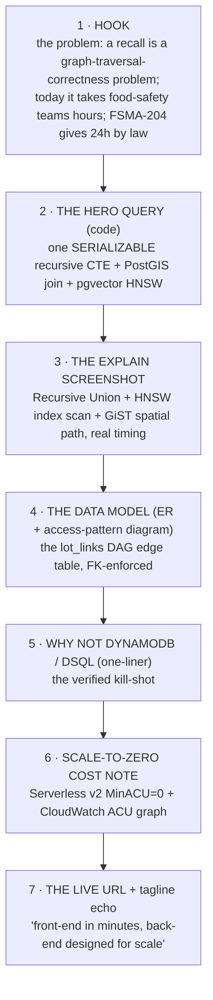

# Phase 12 — Build-in-Public Bonus Content

**Outcome:** ONE published, evidence-rich build-in-public post/thread — titled around the load-bearing decision ("Why a product recall is one Postgres query: recursive CTE + PostGIS + pgvector") — containing the hero query code, the live `EXPLAIN (ANALYZE, BUFFERS)` screenshot, the ER/access-pattern diagram, the "why DynamoDB and DSQL can't do this" one-liner, the scale-to-zero cost note, and the live Vercel URL, with the hackathon tagline echoed — drafted in `docs/build/POST-build-in-public.md` and published **only after** the working core + required artifacts (A1–A8) are green.

**Depends on / Unblocks:** Depends on [`PHASE-11-demo-and-submission.md`](./PHASE-11-demo-and-submission.md) (this post **reuses** that phase's A7 architecture diagram, A8 `EXPLAIN`/CloudWatch screenshots, and the measured-latency clip — do **not** regenerate them here) and on a green spine (Phases 00–10 — the live URL must run over real seed volume). This is the **A9 bonus artifact** and the **terminal phase**; it unblocks nothing downstream. It also doubles as the public-facing rollup of every `BUILD_LOG.md` entry accumulated across Phases 00–11.

**Effort:** ~0.5 day (≈2–3h to draft from `BUILD_LOG.md` + assemble the already-captured assets; ≈1h to lay out and publish). Do this the **day before** submission, after A1–A8 lock — never instead of them.

> **The gate (read first):** A9 is **optional and bonus**. Polished build content on a hollow app reads as marketing and *hurts* the entry. **Do not start drafting until A1–A8 are solid** ([`submission-checklist.md` §3](../reference/submission-checklist.md#3-bonus-content-strategy-one-evidence-rich-post)). The post is a *rollup of evidence you already captured*, not new work. If the spine is at risk, **cut this entire phase** and ship A1–A8.

---

## 1. Objectives

1. Turn the accumulated `BUILD_LOG.md` entries (one per phase, Phases 00–11) into **ONE** substantive, evidence-rich public artifact (blog post or X/Bluesky/LinkedIn thread) — not five shallow posts.
2. Title it around the **load-bearing decision**, so a reader who knows the three AWS DBs finishes the hook already agreeing the DB choice was *forced, not picked from a dropdown*.
3. Structure the post as a fixed evidence sequence: **hook (the problem) → the single-statement hero query (code) → the live `EXPLAIN` screenshot → the ER / access-pattern diagram → the "why DynamoDB and DSQL can't do this" one-liner → the scale-to-zero cost note → the live URL**.
4. **Reuse** the Phase 11 submission assets verbatim (A7 diagram, A8 `EXPLAIN`/CloudWatch screenshots, the latency clip) so the post *doubles as judge evidence* — judges often open the linked content.
5. **Echo the literal hackathon tagline** — *"front-end in minutes, back-end designed for scale"* — so the bonus-content rubric box is unambiguously ticked.
6. Provide a **ready-to-edit draft** (copy-paste skeleton with placeholders) and a **publish checklist** with pass/fail acceptance.
7. Enforce the **ship-after-A1–A8 gate** as a hard precondition in the Definition of Done.

---

## 2. Prerequisites (checklist)

- [ ] **A1–A8 are GREEN.** Run the Phase 11 [§6 day-of checklist](./PHASE-11-demo-and-submission.md) Phase 3 (A1–A8 pass/fail) — every box ticked. **This is the gate; do not proceed otherwise.**
- [ ] **Live Vercel URL** resolves cold in incognito and reaches Aurora with real data ([`PHASE-10-vercel-deploy.md`](./PHASE-10-vercel-deploy.md) DoD). Have the exact `https://<project>.vercel.app` string.
- [ ] **A7 architecture diagram** exported to PNG (`/submission/architecture.png`) — the ER + `lot_links` DAG edge table + annotated hero query + Vercel→OIDC→Aurora request path ([Phase 11 §3.4](./PHASE-11-demo-and-submission.md)).
- [ ] **A8 `EXPLAIN (ANALYZE, BUFFERS)` screenshot** captured (`/submission/db-proof.png`) showing the **Recursive Union** node, the **HNSW index scan** (`idx_incidents_hnsw`), and the **GiST spatial path** (`idx_stores_geom`) with real timing ([Phase 11 §3.3](./PHASE-11-demo-and-submission.md), [Phase 06](./PHASE-06-query-inspector.md)).
- [ ] **CloudWatch ACU graph** captured ([`PHASE-09-aws-aurora.md`](./PHASE-09-aws-aurora.md)) — `ServerlessDatabaseCapacity` scaling up for the trace burst then back toward MinACU=0 (the scale-to-zero cost story).
- [ ] **A 60–90s signature-screen clip** exported (the trace igniting + the Query Inspector beat) — reuse the Phase 11 recording, not a new take.
- [ ] **`BUILD_LOG.md`** has entries from Phases 00–11 (each phase appends one — see every PHASE doc's §8). This is the **raw material** for the narrative; the post is its public distillation.
- [ ] **The hero `trace.sql` string** is the exact one surfaced by the Query Inspector (`lib/db/queries/trace.ts`) — copy it from there so the post and the app are identical, not a paraphrase. ([CONVENTIONS Hero Query](./CONVENTIONS.md), [`../deep-dives/01-recall.md` §5.4](../deep-dives/01-recall.md#54-the-hero-query-forward-trace--written-out-in-full-sql).)
- [ ] **The verified kill-shot sentence** (camera-honesty caveat included) from [`../deep-dives/01-recall.md` §2.1–2.2](../deep-dives/01-recall.md#2-the-load-bearing-thesis) — lead with **PostGIS + pgvector + FK-enforced DAG integrity** (unimpeachable); do **not** claim "DSQL has no recursive CTE" (it supports basic CTEs).
- [ ] Decide the channel: **one** of a Hashnode/dev.to/personal blog post, an X/Bluesky thread, or a LinkedIn long-form post. (Blog is best for the long code+image format; a thread can link back to it.)

---

## 3. Step-by-step

### 3.1 Distill `BUILD_LOG.md` into the narrative spine

The post is **not** a new piece of research — it is the public, evidence-backed distillation of the build journal. Pull the load-bearing beats out of `BUILD_LOG.md`:

```bash
# Skim the journal for the moments worth telling publicly.
# (Read, do not cat — but the grep below surfaces the headline beats.)
grep -nE '^(##|- )' /Users/eklavyagoyal/Projects/hackathons/etc/3.7-aws-vercel-h0/BUILD_LOG.md
```

Map journal entries → post sections (the post keeps only the load-bearing decisions, not the chronological diary):

| `BUILD_LOG.md` source (phase) | Becomes this post section |
|---|---|
| Phase 03 — hero query built & benched | **The single-statement hero query** (the code block) |
| Phase 06 — Query Inspector + live `EXPLAIN` | **The proof: the live `EXPLAIN` plan** (the screenshot) |
| Phase 01 — schema + FK-enforced DAG | **The data model** (ER + access-pattern table) |
| Phase 03/benchmark — p50 over ~250k edges | **The number** (measured latency, real volume) |
| Phase 09 — Aurora Serverless v2, MinACU=0 | **Scale-to-zero cost note** (CloudWatch graph) |
| Phase 10/11 — live deploy + OIDC keyless | **The live URL + the security one-liner** |

### 3.2 Lock the title around the load-bearing decision

The title must name the *fusion* (recursion + geo + vector) so the hook does the persuasion before the body. Pick ONE:

- ✅ **"Why a product recall is one Postgres query: recursive CTE + PostGIS + pgvector"** (primary — recommended)
- "We built a food-recall console where the database *is* the product — one SERIALIZABLE Aurora query"
- "Front-end in minutes, back-end designed for scale: tracing a 250k-edge supply graph in one statement"

> Rule: the title states the *non-interchangeable* claim. A reader who knows DynamoDB/DSQL should feel the tension ("can you really do all three in one query?") and read on to see the `EXPLAIN`.

### 3.3 The fixed evidence sequence (the structure to fill)

Lay the post out in this exact order — each block carries one piece of evidence:



### 3.4 Drop in the assets you already captured (no regeneration)

| Block | Asset | Where it comes from |
|---|---|---|
| 2 — hero query | The exact `trace.sql` string | `lib/db/queries/trace.ts` (the same string the Query Inspector shows) |
| 3 — `EXPLAIN` | `db-proof.png` | Phase 11 A8 capture / Phase 06 |
| 4 — data model | `architecture.png` (or just the ER mermaid) | Phase 11 A7 / [`../deep-dives/01-recall.md` §5.2](../deep-dives/01-recall.md#52-er-diagram) |
| 6 — cost | CloudWatch ACU graph PNG | Phase 09 |
| (optional) clip | 60–90s signature-screen video | Phase 11 recording |
| 7 — live URL | `https://<project>.vercel.app` | Phase 10 |

### 3.5 Write the draft

Write the draft to `docs/build/POST-build-in-public.md`, then copy-paste into the chosen channel. The ready-to-edit draft is in [§3.6](#36-ready-to-edit-draft) below — fill every `<PLACEHOLDER>`.

```bash
# create the draft file from the skeleton in §3.6 (edit placeholders before publishing)
$EDITOR /Users/eklavyagoyal/Projects/hackathons/etc/3.7-aws-vercel-h0/docs/build/POST-build-in-public.md
```

### 3.6 Ready-to-edit draft

> Copy everything between the rules into `docs/build/POST-build-in-public.md`. Replace every `<PLACEHOLDER>`. The blocks are numbered to match [§3.3](#33-the-fixed-evidence-sequence-the-structure-to-fill). For a **thread**, each `##` block becomes 1–3 posts; keep the order.

---

```markdown
# Why a product recall is one Postgres query: recursive CTE + PostGIS + pgvector

*Built for the "Hack the Zero Stack with Vercel v0 and AWS Databases" hackathon. Front-end in minutes, back-end designed for scale.*

## 1 · The problem

When a contaminated food lot ships, the question is always the same: **which shelves have this product, right now?** Today, food-safety teams answer it with hours-to-days of spreadsheet reconciliation across supplier EDI exports and warehouse systems. **FSMA 204** — the FDA Food Traceability Final Rule — makes that a *legal* 24-hour SLA, with enforcement beginning July 2028.

A recall isn't a CRUD problem. It's a **graph-traversal-correctness problem over a foreign-key-constrained supply DAG**: from one contaminated traceability lot code (TLC), find *every* downstream store that received derived product, while the data is still being ingested. We built **Recall — The Outbreak Console** to answer it in **under a second over ~<EDGE_COUNT≈250,000> supply-chain edges**.

## 2 · The whole product is one query

The entire backend is a **single `SERIALIZABLE` statement**: a recursive CTE walks the `lot_links` DAG (the graph), JOINs PostGIS store geography (the map), and orders a pgvector HNSW cluster of similar prior incidents (the rail). Three database superpowers, one round trip.

​```sql
-- runs inside BEGIN ISOLATION LEVEL SERIALIZABLE; ($1=tlc, $2=query_embedding::vector, $3=as_of)
WITH RECURSIVE contaminated AS (
  SELECT l.lot_id, 0 AS depth, ARRAY[l.lot_id] AS path
  FROM lots l WHERE l.tlc = $1
  UNION ALL
  SELECT ll.child_lot_id, c.depth + 1, c.path || ll.child_lot_id
  FROM contaminated c JOIN lot_links ll ON ll.parent_lot_id = c.lot_id
  WHERE c.depth < 12 AND ll.child_lot_id <> ALL(c.path)   -- depth guard + cycle guard
),
edges AS (
  SELECT DISTINCT ll.parent_lot_id, ll.child_lot_id, ll.transform_event
  FROM lot_links ll JOIN contaminated p ON p.lot_id = ll.parent_lot_id
                    JOIN contaminated c ON c.lot_id = ll.child_lot_id
),
affected AS (
  SELECT s.store_id, s.name, s.chain, s.address,
         ST_Y(s.geom::geometry) AS lat, ST_X(s.geom::geometry) AS lng, SUM(sh.units) AS units
  FROM shipments sh JOIN contaminated c ON c.lot_id = sh.lot_id
                    JOIN stores s ON s.store_id = sh.store_id
  WHERE ($3::timestamptz IS NULL OR sh.shipped_at <= $3)
  GROUP BY s.store_id, s.name, s.chain, s.address, s.geom
),
similar AS (
  SELECT i.incident_id, i.raw_text, i.pathogen, 1 - (i.embedding <=> $2::vector) AS score
  FROM incidents i
  WHERE i.suspected_lot_id IN (SELECT lot_id FROM contaminated) OR i.suspected_lot_id IS NULL
  ORDER BY i.embedding <=> $2::vector LIMIT 5
)
SELECT (SELECT count(*) FROM contaminated) AS lot_count,
       (SELECT json_agg(edges) FROM edges) AS edges,
       (SELECT json_agg(affected ORDER BY units DESC) FROM affected) AS stores,
       (SELECT coalesce(sum(units),0) FROM affected) AS total_units,
       (SELECT count(*) FROM affected) AS store_count,
       (SELECT json_agg(similar) FROM similar) AS incidents;
​```

The graph IS the recursion, the map IS the geo JOIN, the rail IS the vector search. The cycle defense is belt-and-suspenders: the seed DAG is acyclic by construction (we only link older→newer lots), and the recursive term carries a `path` visited-set + a `depth < 12` guard.

## 3 · Proof: the database does the work, live

We don't *assert* the DB does the work — we show the plan. Here's the live `EXPLAIN (ANALYZE, BUFFERS)` from the deployed app's Query Inspector:


Note the three nodes: the **Recursive Union** walking the DAG with an **Index Scan** on `idx_lot_links_parent` at *every* iteration (never a seq scan), the **HNSW index scan** on `idx_incidents_hnsw`, and the **GiST spatial path** on `idx_stores_geom` — measured at **<P50_LATENCY≈847ms>** over **<EDGE_COUNT≈250,000> edges**. That number on the console top bar is a live measurement, not a hardcoded badge.

## 4 · The data model is the architecture

Most teams draw boxes; we draw the schema, because the schema is the point. The trace is only trustworthy because the `lot_links` DAG is **foreign-key-enforced** — the engine guarantees the edges are valid.


The access pattern is the hero: *forward trace* = recursive CTE on `lot_links(parent→child)` + JOIN `shipments`/`stores` + a pgvector subquery **filtered to the implicated lots**, all in one SERIALIZABLE txn. The vector search is *evidence inside the trace* — not a standalone top-k over the whole corpus.

## 5 · Why not DynamoDB or DSQL

> **DynamoDB can't do recursive traversal or ad-hoc joins, and Aurora DSQL has no PostGIS and no extension ecosystem so no pgvector — only Amazon Aurora PostgreSQL fuses graph recursion + geospatial + vector similarity in one statement, inside one serializable transaction, so the recall scope can't shift while shipments are still being ingested.**

(Honest caveat: DSQL *does* support basic CTEs — so the unimpeachable kill-shots are **PostGIS + pgvector + FK-enforced DAG integrity**, three things DSQL provably lacks.)

## 6 · And it costs almost nothing at rest

Aurora PostgreSQL **Serverless v2** with **MinCapacity = 0** scales to zero between recalls and bursts up for the trace, then back down. Idle cost is ~$0; you pay for the seconds you're actually tracing an outbreak. Here's the CloudWatch `ServerlessDatabaseCapacity` (ACU) graph scaling up for the trace burst and back toward zero:


No NAT Gateway, no idle compute, OIDC keyless auth from Vercel (STS `AssumeRoleWithWebIdentity` — never long-lived AWS keys in the app).

## 7 · Try it

Live, on real seed volume: **<LIVE_VERCEL_URL>** — paste a TLC, watch the graph ignite, the map drop ~1,400 pins across 38 states, and the vector rail surface similar incidents. Then open the Query Inspector and read the plan yourself.

Front-end in minutes (Vercel + v0), back-end designed for scale (Amazon Aurora PostgreSQL · pgvector HNSW · PostGIS).

*Stack: Next.js 15 (App Router) on Vercel · Amazon Aurora PostgreSQL Serverless v2 · pgvector HNSW · PostGIS · OIDC keyless STS. #VercelHackathon #AWS*
```

---

### 3.7 Thread variant (if posting on X / Bluesky instead of a blog)

Collapse each `##` block into 1–3 posts, in order, attaching the matching asset:

1. **Hook** — the problem + "we do it in one Postgres query" + the FSMA-204 24h SLA. (text)
2. **The query** — a screenshot of the SQL (legible) + "one SERIALIZABLE statement: recursion + PostGIS + pgvector." (code image)
3. **The proof** — the `EXPLAIN` screenshot + "the DB does the work — here's the plan." (`db-proof.png`)
4. **The model** — the ER/architecture diagram + "FK-enforced DAG; the schema *is* the architecture." (`architecture.png`)
5. **Why not Dynamo/DSQL** — the one-liner (with the honesty caveat). (text)
6. **Cost** — the CloudWatch ACU graph + "scales to zero between recalls." (`acu-graph.png`)
7. **CTA** — the live URL + the tagline + hashtags. (link + 60–90s clip)

---

## 4. Key files

| Path | Purpose |
|---|---|
| `/Users/eklavyagoyal/Projects/hackathons/etc/3.7-aws-vercel-h0/docs/build/POST-build-in-public.md` | The drafted post (from [§3.6](#36-ready-to-edit-draft)); the source you copy into the channel |
| `/Users/eklavyagoyal/Projects/hackathons/etc/3.7-aws-vercel-h0/BUILD_LOG.md` | Raw material: per-phase journal entries distilled into the post ([§3.1](#31-distill-build_logmd-into-the-narrative-spine)) |
| `/submission/architecture.png` | A7 diagram, reused as the post's data-model image (Phase 11 §3.4) |
| `/submission/db-proof.png` | A8 live `EXPLAIN` screenshot, reused as the proof image (Phase 11 §3.3) |
| `/submission/acu-graph.png` | CloudWatch ACU graph, the scale-to-zero cost image (Phase 09) |
| `/submission/bonus-post-link.txt` | The published URL of the post (the A9 artifact reference for the submission form) |
| `lib/db/queries/trace.ts` | Source of truth for the exact `trace.sql` string in block 2 (copy, don't paraphrase) |

---

## 5. Definition of Done

> **Gate first:** every box in this section is moot until **A1–A8 are green**. Verify the gate, then verify the post.

- [ ] **GATE — A1–A8 are all ticked** in [`PHASE-11` §6 Phase 3](./PHASE-11-demo-and-submission.md). The post is published **only after** this. *(Verification: re-run the Phase 11 day-of A1–A8 checklist; all ✅. If any A1–A8 box fails, STOP — do not publish.)*
- [ ] **Exactly ONE post** drafted in `docs/build/POST-build-in-public.md` — not a series of shallow ones.
  - Verify: `test -s docs/build/POST-build-in-public.md && grep -c '^## ' docs/build/POST-build-in-public.md` → file non-empty and **7** `##` blocks.
- [ ] **Title names the load-bearing decision** (recursion + PostGIS + pgvector fused). Verify: title line contains all of `recursive`/`CTE`, `PostGIS`, `pgvector` (case-insensitive).
  - `grep -iE 'recursive|cte' docs/build/POST-build-in-public.md | head -1` and `grep -iE 'postgis' …` and `grep -iE 'pgvector' …` each match in the first heading.
- [ ] **All seven evidence blocks present** ([§3.3](#33-the-fixed-evidence-sequence-the-structure-to-fill)): hook, hero query (code), `EXPLAIN` screenshot, ER/access-pattern diagram, why-not-Dynamo/DSQL one-liner, scale-to-zero cost note, live URL.
- [ ] **The hero query code block is the EXACT `trace.sql`** the app's Query Inspector shows (copied from `lib/db/queries/trace.ts`, not paraphrased).
- [ ] **The `EXPLAIN` screenshot** is included and shows the Recursive Union + HNSW index scan + GiST spatial path with real timing (`db-proof.png`).
- [ ] **The ER / access-pattern diagram** is included (`architecture.png` or the inline ER mermaid) — it *draws the data model*, not just boxes.
- [ ] **The why-not one-liner is the VERIFIED kill-shot** and includes the honesty caveat (does NOT claim "DSQL has no recursive CTE"; leads with PostGIS + pgvector + FK-enforced DAG integrity). Cross-check against [`../deep-dives/01-recall.md` §2.2](../deep-dives/01-recall.md#2-the-load-bearing-thesis).
- [ ] **The scale-to-zero cost note** names Serverless v2 MinACU=0 and includes the CloudWatch ACU graph (`acu-graph.png`).
- [ ] **The live Vercel URL** is present and resolves cold in incognito.
  - Verify: `curl -sS -o /dev/null -w '%{http_code}\n' <LIVE_VERCEL_URL>` → `200`.
- [ ] **The hackathon tagline is echoed verbatim** — *"front-end in minutes, back-end designed for scale."*
  - Verify: `grep -i 'back-end designed for scale' docs/build/POST-build-in-public.md` → matches.
- [ ] **No placeholders remain.** Verify: `grep -n '<[A-Z_]*>' docs/build/POST-build-in-public.md` → **no output**.
- [ ] **No anti-fake claims:** every number in the post is a real measurement (latency, edge count, store count, ACU) — no hardcoded badge, no `localhost`, no fabricated history. Verify: `grep -in 'localhost' docs/build/POST-build-in-public.md` → no output.
- [ ] **Published** to the chosen channel; the public URL is pasted into `/submission/bonus-post-link.txt` and into the submission form's A9 field.
  - Verify: open the published URL in incognito — it renders, all images load, the live-URL link works.
- [ ] **BUILD_LOG entry appended** ([§8](#8-build_log-entry-to-append)).

---

## 6. Common pitfalls & fixes

| Pitfall | Symptom | Fix |
|---|---|---|
| **Publishing before A1–A8** | A polished post points at a half-working app; reads as marketing and *hurts* the entry | Hard gate: the DoD's first box. Publish A9 **last**, day before submission only. |
| **Five shallow posts instead of one** | Build time burned chasing volume; none is evidence-rich | Ship **exactly one** substantive artifact ([`submission-checklist.md` §3](../reference/submission-checklist.md#3-bonus-content-strategy-one-evidence-rich-post)). |
| **Claiming "DSQL has no recursive CTE"** | A knowledgeable reader corrects you; you look sloppy and the whole post loses credibility | DSQL *does* have basic CTEs. Lead with **PostGIS + pgvector + FK-enforced DAG integrity** ([`../deep-dives/01-recall.md` §2.2 honesty note](../deep-dives/01-recall.md#22-why-the-other-two-databases-fail)). |
| **Paraphrasing the hero SQL** | The post's query ≠ the app's query; an attentive judge notices the mismatch | Copy the *exact* `trace.sql` from `lib/db/queries/trace.ts`. |
| **Empty/illegible `EXPLAIN` screenshot** | Proves nothing; the highest-leverage asset is wasted | Run a real trace first, then capture; ensure the Recursive Union / HNSW / GiST nodes and timings are legible (1080p+). |
| **"Boxes" architecture diagram** | Looks like every other entry | Use the ER + DAG-edge-table diagram — *the data model is the architecture* ([Phase 11 §3.4](./PHASE-11-demo-and-submission.md)). |
| **Hardcoded / rounded latency** | Reads as a fake "scales-to-millions" claim | Quote the **measured** number from the bench/top bar; label it a measurement. |
| **Tagline missing** | The bonus-content rubric box is ambiguous | Echo *"front-end in minutes, back-end designed for scale"* verbatim. |
| **`localhost` in a screenshot/clip** | Auto-deflate signal even in bonus content | Every asset shows the deployed `…vercel.app` URL; reuse Phase 11's incognito-verified captures. |
| **Regenerating assets from scratch** | Wasted hours re-capturing what Phase 11 already produced | **Reuse** `architecture.png` / `db-proof.png` / `acu-graph.png` and the signature clip. |

---

## 7. Cut-if-scope-bites

**This entire phase is the first thing to cut.** A9 is **optional bonus** — if A1–A8 are not locked, **skip Phase 12 entirely** and ship the required artifacts. There is no partial-credit risk in skipping it; there *is* a penalty for publishing polished content over a hollow app.

If you have *some* time but not enough for a full blog post: ship the **thread variant** ([§3.7](#37-thread-variant-if-posting-on-x--bluesky-instead-of-a-blog)) — it reuses the identical assets and takes ~30 min. If you have even less: post the **`EXPLAIN` screenshot + the one-line kill-shot + the live URL** as a single post with the tagline. The `EXPLAIN` screenshot is the single highest-leverage asset.

> **Never-cut reminder (applies to the *product*, not this phase):** the recursive CTE, the PostGIS map JOIN, the pgvector rail, the live `EXPLAIN ANALYZE` inspector, real seed volume, and the live-URL deploy are never cut — Phase 12 is *garnish on top of* that working spine. Cut Phase 12 before you cut any of those. ([CONVENTIONS §12 Global Rules](./CONVENTIONS.md#12-global-rules-every-phase).)

---

## 8. BUILD_LOG entry to append

````markdown
## Phase 12 — Build-in-Public Bonus Content (A9)

- **What shipped:** One evidence-rich public post — _"Why a product recall is one Postgres query: recursive CTE + PostGIS + pgvector"_ — published at <PUBLISHED_POST_URL>.
- **Gate honored:** Drafted/published **only after** A1–A8 verified green (Phase 11 §6 Phase 3). Bonus content rides on top of a working spine, never before it.
- **Evidence assets (reused from Phase 11, not regenerated):**
  - Hero query code block = exact `trace.sql` from `lib/db/queries/trace.ts`.
  - Live `EXPLAIN (ANALYZE, BUFFERS)` screenshot (`db-proof.png`) — Recursive Union + HNSW index scan + GiST spatial path, p50 ≈ <P50_LATENCY>ms over ≈<EDGE_COUNT> edges.
  - ER / access-pattern diagram (`architecture.png`) — FK-enforced `lot_links` DAG.
  - CloudWatch ACU graph (`acu-graph.png`) — Serverless v2 MinACU=0 scale-to-zero cost note.
  - Live Vercel URL: <LIVE_VERCEL_URL>.
- **Why-not one-liner:** verified kill-shot with the DSQL-CTE honesty caveat (led with PostGIS + pgvector + FK-enforced DAG integrity).
- **Tagline echoed:** "front-end in minutes, back-end designed for scale."
- **Channel:** <blog | X/Bluesky thread | LinkedIn>; link recorded in `/submission/bonus-post-link.txt` and pasted into the submission A9 field.
- **DoD:** ✅ one post · ✅ all 7 evidence blocks · ✅ tagline echoed · ✅ no placeholders · ✅ live URL 200 in incognito · ✅ A1–A8 gate honored.
````

---

## 9. Related docs

- [`./CONVENTIONS.md`](./CONVENTIONS.md) — the contract (global rules, never-cut list, anti-fake gate)
- [`./README.md`](./README.md) — the master playbook index & Golden Path
- [`./PHASE-11-demo-and-submission.md`](./PHASE-11-demo-and-submission.md) — A1–A8 artifacts, the A7 diagram, the A8 `EXPLAIN`/CloudWatch captures, and the signature clip this post reuses (and the gate to clear first)
- [`./PHASE-10-vercel-deploy.md`](./PHASE-10-vercel-deploy.md) — the live Vercel URL the post links to
- [`./PHASE-09-aws-aurora.md`](./PHASE-09-aws-aurora.md) — Aurora Serverless v2 MinACU=0 + the CloudWatch ACU graph (the scale-to-zero cost note)
- [`./PHASE-06-query-inspector.md`](./PHASE-06-query-inspector.md) — the live `EXPLAIN` plan surfaced in-app (the proof screenshot)
- [`./PHASE-01-database-schema.md`](./PHASE-01-database-schema.md) — the FK-enforced `lot_links` DAG + the ER diagram source
- [`../deep-dives/01-recall.md`](../deep-dives/01-recall.md) — the product/architecture spec; §2 (kill-shot + honesty note), §5.2 (ER diagram), §5.4 (hero query), §9 (submission artifacts)
- [`../reference/submission-checklist.md`](../reference/submission-checklist.md) — §3 (bonus-content strategy, the gate), §5 (auto-deflate list), Appendix A (per-DB screenshot recipe)
- [`../reference/aws-databases.md`](../reference/aws-databases.md) — Aurora PG superpowers + the screenshot-proof catalog
- [`../reference/vercel-v0-playbook.md`](../reference/vercel-v0-playbook.md) — OIDC keyless, Fluid Compute pooling, deploy pitfalls
