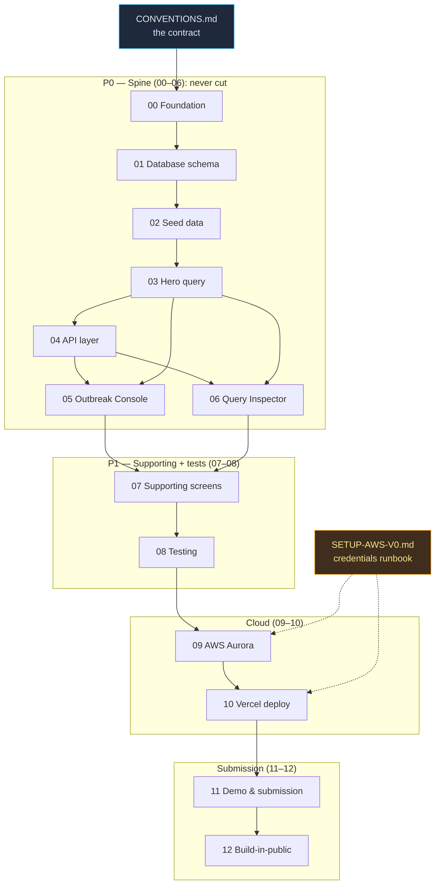

# Recall — The Outbreak Console · Master Playbook Index

> **The database is the protagonist; the UI is its courtroom evidence.** This is the build index for **Recall**, the H0 entry where a food recall is reframed as a *graph-traversal-correctness problem* over a foreign-key-constrained supply DAG, and **Amazon Aurora PostgreSQL** is the one database that can do it. Read this page first, then build phase-by-phase down the [Golden Path](#golden-path).

---

## Purpose

This README is the **single entry point** to the Recall build. It tells you, in order:

1. **What we are building and why it wins** — the one-paragraph thesis.
2. **The Golden Path** — the exact command sequence from empty repo to a running local app, then to cloud and deploy.
3. **The phase dependency graph** — what unblocks what.
4. **All 13 phases + the contract + the setup doc**, each with a one-line outcome and a link.
5. **Spine vs polish priority** — what to cut last (P0 → P1 → cloud → submission).
6. **The definition of winning** — a checklist tied to the four judging criteria.
7. **Cost** and **credentials** pointers.

The authoritative rules live in **[CONVENTIONS.md](./CONVENTIONS.md)** (the contract). Where this index and the contract disagree, **the contract wins**. The product/architecture spec is **[../deep-dives/01-recall.md](../deep-dives/01-recall.md)** — read it fully before writing code.

---

## What we are building and why it wins

A recall is fundamentally a *graph-traversal-correctness problem over a foreign-key-constrained supply DAG*: given a contaminated traceability lot code (TLC), find every downstream store that received derived product (forward trace) and every upstream supplier that could have introduced the contaminant (backward trace). **Recall** executes that as **one `SERIALIZABLE` recursive CTE** that walks a `lot_links` edge table, JOINs PostGIS store geography for the map, and orders a pgvector HNSW cluster of similar prior incidents — so three different database superpowers (**graph recursion + geospatial join + vector similarity**) are visible on **one screen** as the trace fires, in **under a second over ~250k edges**, with the live `EXPLAIN (ANALYZE, BUFFERS)` plan as the hero artifact. Every visible pixel is a query result, which makes Recall impossible to mistake for the two failure modes that sink ~70% of the 6,000-entrant field (pretty-v0-with-interchangeable-backend, and "scales-to-millions"-with-no-proof). The DB is provably **non-interchangeable** — DynamoDB has no recursion or ad-hoc joins; DSQL has no PostGIS and no extension ecosystem, so no pgvector and no FK-enforced DAG integrity — and we say so in one verified sentence on camera. Bolted on top is a **named, dated, mandated, budgeted buyer**: FSMA 204 legally requires traceability records to the FDA within 24 hours, enforcement beginning **July 2028**. **The DB is not where the lots are stored — the DB *is* the recall.**

---

## Golden Path

The exact ordered sequence to go from an empty repo to a running local app, then to cloud and a live deploy. Each step has its own phase doc; run the commands in order. **Build the spine before any polish** — schema → seed → hero query → console → inspector.

### Local (the spine — Phases 00 → 08)

```bash
# 0. Foundation: scaffold the Next.js app at the repo root, install toolchain.
#    (See PHASE-00. Node 24 LTS + pnpm + Next 15 + TS strict + Tailwind v4 + shadcn.)
pnpm install                 # install all deps (pg, maplibre-gl, @xenova/transformers, zod, vitest, tsx, …)

# 1. Database up (local Postgres = PostGIS + pgvector in Docker).
pnpm db:up                   # docker compose up -d  → postgis/postgis:16-3.4 + postgresql-16-pgvector

# 2. Apply forward-only SQL migrations (extensions → schema → indexes).
pnpm db:migrate              # tsx scripts/migrate.ts  → 0001_extensions, 0002_schema, 0003_indexes

# 3. Seed real volume (generate the acyclic DAG, then load it).
pnpm db:seed                 # tsx db/seed/load.ts  → ~80k lots, ~250k edges, ~1,400 stores, ~2k incidents
                             #   PRINTS ACTUAL COUNTS — these must hit the seed targets.

# 4. Run the app and open the Outbreak Console.
pnpm dev                     # http://localhost:3000  → paste DEMO_TLC, watch the trace ignite

# 5. Prove the spine is real (do these before you trust the screen).
pnpm typecheck               # tsc --noEmit            → 0 errors
pnpm lint                    # next lint               → clean
pnpm test                    # vitest                  → trace.test.ts green
pnpm bench                   # tsx scripts/trace-bench.ts → p50 < 1s over ~250k edges; DEMO_TLC ≈ 1,400 stores
```

At this point you have a **working local app over real seed volume** with a measured sub-second hero query. That is the spine. Everything after this is cloud + proof + polish.

### Cloud + deploy (Phases 09 → 12)

```bash
# 6. Provision Aurora PostgreSQL Serverless v2 (us-east-1, MinCapacity=0, vector + postgis).
#    Then point DEPLOY_TARGET=aurora and re-run migrate + seed against the cloud endpoint.
#    (See PHASE-09 and SETUP-AWS-V0.md for the AWS console / CLI runbook + OIDC keyless role.)
DEPLOY_TARGET=aurora pnpm db:migrate
DEPLOY_TARGET=aurora pnpm db:seed     # PRINT cloud counts; confirm DEMO_TLC still traces <1s

# 7. Deploy to Vercel (App Router, Fluid Compute, OIDC keyless AWS creds — NO long-lived keys).
pnpm dlx vercel link
pnpm dlx vercel --prod                # → published live URL talking to Aurora over STS AssumeRoleWithWebIdentity

# 8. Capture submission proof + record the demo, then assemble the submission.
#    CloudWatch ACU graph, RDS console, EXPLAIN screenshot, Team ID pairing, <3-min video. (PHASE-11)
# 9. Publish build-in-public content for the bonus. (PHASE-12)
```

> **Never cut from the Golden Path:** the recursive CTE, the PostGIS map JOIN, the pgvector rail, the live `EXPLAIN`, the real seed volume, or the live-URL deploy. Latency on screen is always a real measurement — never hardcoded.

---

## Phase dependency graph



**Read the edges:** `00 → 01 → 02 → 03 → 04` is a strict chain (foundation, then schema, then data, then the hero query, then the API). **Phases 05, 06, and 07 depend on both 03 (the hero query) and 04 (the API)** — you cannot build the Console, the Inspector, or the supporting screens until the query and its endpoints exist. `08` (tests) wraps the app; then `09 → 10 → 11 → 12` is the cloud-and-submission tail. `SETUP-AWS-V0.md` feeds credentials into Phases 09–10.

---

## All phases at a glance

| Phase | Doc | Outcome (one line) |
|---|---|---|
| — | [CONVENTIONS.md](./CONVENTIONS.md) | The contract: stack, repo layout, DB objects, the canonical hero query, API response shapes, env vars, global rules. **Overrides everything.** |
| 00 | [PHASE-00-foundation.md](./PHASE-00-foundation.md) | Empty repo → Next.js 15 App Router app at root with TS strict, Tailwind v4 + shadcn, pnpm scripts, `lib/config.ts`, and a GREEN `typecheck`/`lint`/`test`. |
| 01 | [PHASE-01-database-schema.md](./PHASE-01-database-schema.md) | Forward-only SQL migrations create the 9 tables, FK + CHECK constraints, and all indexes (HNSW, GiST, btree) in local PostGIS+pgvector. |
| 02 | [PHASE-02-seed-data.md](./PHASE-02-seed-data.md) | Generator + loader produce real volume — ~250k **acyclic** edges, ~1,400 geo-located stores, ~2k incidents with **real** embeddings; actual counts printed. |
| 03 | [PHASE-03-hero-query.md](./PHASE-03-hero-query.md) | The one `SERIALIZABLE` recursive-CTE + PostGIS + pgvector statement and `runTrace`; p50 < 1s over ~250k edges; EXPLAIN shows index scans every iteration. |
| 04 | [PHASE-04-api-layer.md](./PHASE-04-api-layer.md) | Zod-validated routes `/api/trace`, `/api/explain`, `/api/incidents`, `/api/lineage`, `/api/metrics` returning the canonical response contract. |
| 05 | [PHASE-05-outbreak-console.md](./PHASE-05-outbreak-console.md) | The split Console: igniting supply graph + PostGIS store-pin map + pgvector incident rail, wired to the live trace via RSC + Server Action. |
| 06 | [PHASE-06-query-inspector.md](./PHASE-06-query-inspector.md) | The 10x panel: live `EXPLAIN (ANALYZE, BUFFERS)` text + parsed nodes (recursive-union, HNSW, GiST) surfaced in a toggleable inspector. |
| 07 | [PHASE-07-supporting-screens.md](./PHASE-07-supporting-screens.md) | Lineage Drawer (one-JOIN trail), Incident Inbox with cluster badges, Scope Export with the 24-hour SLA timer. |
| 08 | [PHASE-08-testing.md](./PHASE-08-testing.md) | vitest suite (cycle/depth guards, empty-state, row-shape) + optional Playwright smoke; the app is provably correct, not just pretty. |
| 09 | [PHASE-09-aws-aurora.md](./PHASE-09-aws-aurora.md) | Aurora PostgreSQL Serverless v2 in us-east-1 (MinCapacity=0, vector + postgis), migrated + seeded; DEMO_TLC traces <1s in the cloud. |
| 10 | [PHASE-10-vercel-deploy.md](./PHASE-10-vercel-deploy.md) | Published Vercel URL on Fluid Compute, OIDC keyless STS to Aurora (no long-lived keys); the live link runs over real data. |
| 11 | [PHASE-11-demo-and-submission.md](./PHASE-11-demo-and-submission.md) | <3-min demo video, architecture diagram (data model), DB-usage screenshot, CloudWatch/RDS proof, Team ID pairing — submission assembled. |
| 12 | [PHASE-12-build-in-public.md](./PHASE-12-build-in-public.md) | One evidence-rich public post (BUILD_LOG distilled) for the originality/bonus content points. |
| — | [SETUP-AWS-V0.md](./SETUP-AWS-V0.md) | Credentials runbook: AWS account + IAM OIDC trust to `oidc.vercel.com/[TEAM_SLUG]`, Bedrock access, Vercel/v0 setup. **Read before Phases 09–10.** |

---

## Spine vs polish — priority

> If time runs out, cut from the **bottom up**. The spine is the product; everything else rides on top of a working spine and never before.

| Tier | Phases | Why this tier | Cut rule |
|---|---|---|---|
| **P0 — Spine (never cut)** | **00 – 06** | Schema → seed → **hero query** → API → Console → **Query Inspector**. This is the whole thesis: a real recursive-CTE + PostGIS + pgvector statement, visible on one screen, with a live `EXPLAIN`. Without this there is no entry. | **Never.** Wire OIDC + connection pooling early (even in 05) — connection exhaustion is the #1 demo-killer. |
| **P1 — Supporting + tests** | **07 – 08** | Lineage Drawer, Incident Inbox, Scope Export, and the test suite. These deepen the story and prove correctness, but the spine already demos. | Trim individual screens before the spine; keep at least the cycle/depth-guard test. |
| **Cloud** | **09 – 10** | Move to Aurora Serverless v2 and a published Vercel URL with OIDC keyless auth. The live URL over real data is a **hard submission requirement**. | Don't cut the live deploy; if Aurora misbehaves, demo on the spine while you fix plumbing — but ship a live URL. |
| **Submission** | **11 – 12** | The <3-min video, the data-model diagram, the DB-usage + CloudWatch proof, the Team ID pairing, and the bonus public post. | 12 (build-in-public) is the only truly optional tier; 11 is mandatory. |

---

## Definition of winning — checklist (tied to the judging criteria)

Judged on **Technological Implementation · Design · Impact & Real-world Applicability · Originality**. We win when every box below is true and on camera.

**Technological Implementation**
- [ ] The hero query is **one `SERIALIZABLE` recursive CTE** fusing recursion + PostGIS JOIN + pgvector ordering — not three separate calls.
- [ ] Live `EXPLAIN (ANALYZE, BUFFERS)` shows an **Index Scan on `lot_links` at every recursive iteration**, plus an **HNSW index scan** and a **GiST spatial path** — no seq scan on the hot path.
- [ ] Measured **p50 < 1s over ~250k acyclic edges**; the on-screen latency is a real measurement, never hardcoded.
- [ ] **Clean AWS plumbing:** Aurora Serverless v2, OIDC keyless STS, Fluid Compute pooling — no long-lived AWS keys in the app.

**Design**
- [ ] A **v0-generated UI, then refined** — control-room dark mode, consistent shadcn/Tailwind system, real empty/loading/error states.
- [ ] The UI **exposes the data model** (igniting graph, PostGIS map, relevance-ranked rail), not generic CRUD; the Query Inspector makes the backend legible.
- [ ] Server-side data fetching (no leaked creds); freshness over caching for the trace (we deliberately don't cache a recall scope).

**Impact & Real-world Applicability**
- [ ] The **FSMA-204** buyer is named, dated (enforcement July 2028), and mandated; the demo produces an **FDA-ready recall scope** with the 24-hour SLA timer.
- [ ] **Scope precision** is shown: exactly-affected stores, not the whole metro — the over-recall tax made concrete.

**Originality**
- [ ] The one-sentence **kill-shot** is delivered verbatim and is **verified true**: DynamoDB can't recurse or join; DSQL has no PostGIS/pgvector/FK-enforced DAG integrity — only Aurora PostgreSQL fuses all three in one statement.
- [ ] pgvector is **JOINed/filtered to the implicated supply path**, not a standalone top-k — visibly *evidence inside the trace*, not a bolt-on RAG feature.

**Submission gate (all required artifacts present)**
- [ ] Text description naming **Amazon Aurora PostgreSQL** · demo video **< 3 min** with working-app footage · AWS-DB-usage explanation · **published Vercel URL + Team ID** · architecture diagram (frontend + backend = the data model) · screenshot proving AWS DB usage. *(See [../reference/submission-checklist.md](../reference/submission-checklist.md).)*

---

## Cost note

The **$100 AWS budget is set and fine to use fully.** Aurora Serverless v2 runs at **MinCapacity=0 (scale-to-zero)**, so idle cost is **~$0** between work sessions; cost only accrues during seeding, benchmarking, and the demo burst. There is **no NAT Gateway** and **no RDS Proxy** unless connection limits force it. Vercel/v0 credits are fully available. **After submission, DELETE the Aurora cluster and any snapshots** to stop all charges. Embeddings stay free locally via `@xenova/transformers` (384-dim); the Bedrock Titan path is opt-in and the only embedding spend.

---

## Credentials & setup

All AWS + Vercel/v0 credential setup — the IAM OIDC trust to `oidc.vercel.com/[TEAM_SLUG]`, the `AssumeRoleWithWebIdentity` role, Bedrock access, and the Vercel project/Team ID — lives in **[SETUP-AWS-V0.md](./SETUP-AWS-V0.md)**. Read it **before** Phases 09–10. Never commit secrets; AWS credentials are server-side only via OIDC keyless auth.

---

## Related docs

- **Contract:** [./CONVENTIONS.md](./CONVENTIONS.md) — the single source of truth; overrides this index on any conflict.
- **Credentials runbook:** [./SETUP-AWS-V0.md](./SETUP-AWS-V0.md)
- **Product + architecture spec (read fully):** [../deep-dives/01-recall.md](../deep-dives/01-recall.md)
- **Reference:** [../reference/aws-databases.md](../reference/aws-databases.md) · [../reference/vercel-v0-playbook.md](../reference/vercel-v0-playbook.md) · [../reference/submission-checklist.md](../reference/submission-checklist.md)
- **Phase docs:** [00](./PHASE-00-foundation.md) · [01](./PHASE-01-database-schema.md) · [02](./PHASE-02-seed-data.md) · [03](./PHASE-03-hero-query.md) · [04](./PHASE-04-api-layer.md) · [05](./PHASE-05-outbreak-console.md) · [06](./PHASE-06-query-inspector.md) · [07](./PHASE-07-supporting-screens.md) · [08](./PHASE-08-testing.md) · [09](./PHASE-09-aws-aurora.md) · [10](./PHASE-10-vercel-deploy.md) · [11](./PHASE-11-demo-and-submission.md) · [12](./PHASE-12-build-in-public.md)
