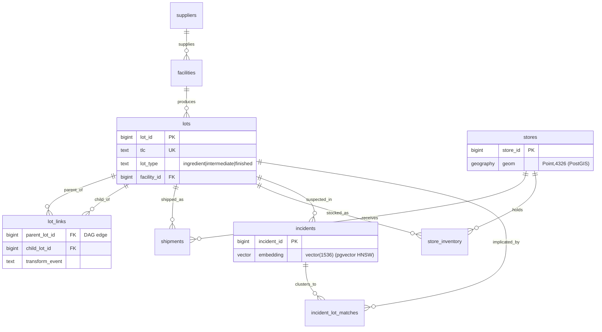
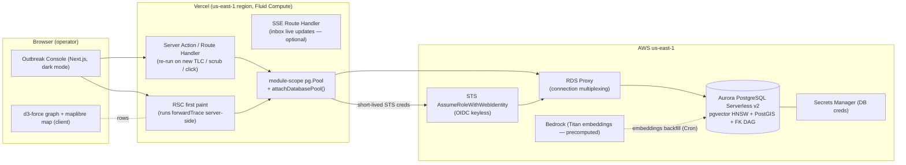

# Recall — The Outbreak Console

**Purpose:** The build-ready flagship spec for **Recall**, the H0 entry where a recall is reframed as a *graph-traversal-correctness problem* and **Amazon Aurora PostgreSQL** is the protagonist — fusing recursive-CTE graph recursion + PostGIS geospatial + pgvector similarity into one SERIALIZABLE statement, with the live `EXPLAIN ANALYZE` plan as the hero artifact. Track: **Monetizable B2B (FSMA-204 traceability)**.

> **Last updated:** 2026-06-18 · **Source:** the H0 ideation workflow (`/tmp/h0_deepdives.txt` → "DEEP DIVE: Recall [G1]"; cross-checked against `IDEATION.md` Phase 5 §1 and `/tmp/h0_dbground.json`). This is the **flagship** — the most detailed doc in the set.

---

## Table of contents

1. [Snapshot](#1-snapshot)
2. [The load-bearing thesis](#2-the-load-bearing-thesis)
3. [Personas & jobs-to-be-done](#3-personas--jobs-to-be-done)
4. [Product spec](#4-product-spec)
5. [Data model](#5-data-model)
6. [System architecture](#6-system-architecture)
7. [AWS provisioning runbook](#7-aws-provisioning-runbook)
8. [Vercel / v0 build plan](#8-vercel--v0-build-plan)
9. [Submission artifacts for this project](#9-submission-artifacts-for-this-project)
10. [Demo video storyboard](#10-demo-video-storyboard)
11. [Build plan & milestones](#11-build-plan--milestones)
12. [Scope triage](#12-scope-triage)
13. [Risk register](#13-risk-register)
14. [Test plan](#14-test-plan)
15. [Production-grade polish checklist](#15-production-grade-polish-checklist)
16. [Open decisions for this project](#16-open-decisions-for-this-project)
17. [Related docs](#17-related-docs)

---

## 1. Snapshot

| Field | Value |
|---|---|
| **Final name** | Recall — The Outbreak Console |
| **Track (primary)** | Monetizable **B2B** — sold per-facility to grocery chains, distributors, and CPG manufacturers as a recall-readiness / FSMA-204 traceability console |
| **Track (secondary tag)** | Open Innovation (public-good: faster recalls = fewer foodborne illnesses). **Lead B2B**; mention public-good once. |
| **Database** | **Amazon Aurora PostgreSQL** (Serverless v2, PostgreSQL 16+), `pgvector` 0.8.0 with **HNSW** index + **PostGIS** extension |
| **Prize strategy** | Win on **Technological Implementation + Originality** (a recursive-CTE + PostGIS + pgvector single-statement trace is genuinely rare); ride the **FSMA-204** regulatory tailwind for Impact & Real-world Applicability |
| **Composite score** | **9.23** (panel: AWS-DB-fit **10**, Tech **10**, Usefulness **9.7**, Design 9.3, Originality 9.0) — topped every panel; see [`../04-scoring-matrix.md`](../04-scoring-matrix.md) |
| **Region** | **Single region, `us-east-1`** — by design. The workload is correctness + recursion + geo + vector, **not** multi-region active-active. (Do **not** reach for DSQL.) |
| **Live artifact bar** | Published Vercel URL that runs over real seed volume; on-screen latency + row count; live `EXPLAIN (ANALYZE, BUFFERS)`; RDS console + CloudWatch ACU screenshot |

**Why it wins (one paragraph).** A recall is fundamentally a *graph-traversal-correctness problem over a foreign-key-constrained supply DAG*: given a contaminated traceability lot, find every downstream store that received derived product (forward trace) and every upstream supplier/ingredient that could have introduced the contaminant (backward trace). Recall executes that as **one SERIALIZABLE recursive CTE** that walks a `lot_links` edge table, JOINs PostGIS store geography for the map, and LEFT-JOINs a pgvector HNSW cluster of similar prior incidents — so three different database superpowers (graph recursion, geospatial join, vector similarity) are visible on **one screen** as the trace fires. Every visible pixel is a query result, which makes it impossible to mistake for the two failure modes that consume ~70% of the 6,000-entrant field (pretty-v0-with-interchangeable-backend, and "scales-to-millions"-with-no-proof). The DB is provably non-interchangeable — DynamoDB has no recursion or ad-hoc joins; DSQL has no PostGIS and no extension ecosystem, so no pgvector and no FK-enforced DAG integrity — and we say so in one verified sentence on camera. Bolted on top is a **named, dated, mandated, budgeted buyer**: FSMA 204 legally requires traceability records to the FDA within 24 hours, with enforcement beginning **July 2028**. The DB is not "where the lots are stored" — **the DB IS the recall.**

---

## 2. The load-bearing thesis

### 2.1 The on-camera kill-shot (say verbatim)

> **"DynamoDB can't do recursive traversal or ad-hoc joins, and DSQL has no PostGIS and no extensions so no pgvector — only Aurora PostgreSQL fuses graph recursion + geospatial + vector similarity in one statement, inside one serializable transaction, so the recall scope can't shift while shipments are still being ingested."**

This is verified true against AWS docs (June 2026). One precision caveat for camera honesty below.

### 2.2 Why the other two databases fail

| Capability the workload needs | DynamoDB | Aurora DSQL | Aurora PostgreSQL |
|---|---|---|---|
| **Recursive graph traversal** over the supply DAG (one statement, N hops) | ❌ no recursion — must fan out N round-trips per hop in app code, losing transactional scope | ⚠️ supports *basic* recursive CTEs *(see honesty note)* | ✅ recursive CTE, indexed at every iteration |
| **Ad-hoc multi-table JOIN** (lots × shipments × stores × suppliers) | ❌ no joins; you rebuild a query planner in app code | ✅ has JOINs | ✅ native |
| **PostGIS geography** for the store-pin map / spatial bounds | ❌ none | ❌ **geometry/geography types entirely unsupported** | ✅ `geography(Point,4326)` + GiST |
| **pgvector HNSW** similarity for incident clustering | ❌ no vectors | ❌ **no extension ecosystem → no pgvector** | ✅ `vector(1536)` + HNSW |
| **FK-enforced DAG integrity** (the trace is only trustworthy if the edges are valid) | ❌ no FKs | ❌ **no foreign keys** | ✅ `FOREIGN KEY` + `CHECK` |
| **SERIALIZABLE isolation** so scope can't shift mid-trace | ⚠️ TransactWriteItems (limited) | ✅ snapshot/OCC | ✅ `ISOLATION LEVEL SERIALIZABLE` |

> **Honesty note for camera (do NOT get this wrong):** DSQL **does** support basic CTEs, so never claim "DSQL has no recursive CTE." The *unimpeachable* kill-shots are **PostGIS + pgvector + FK-enforced DAG integrity** — three things DSQL provably lacks. If a judge corrects you on CTEs, you look sloppy; if you lead with PostGIS/pgvector/FK you are unassailable.

### 2.3 Why this is not the #1 RAG-chatbot submission

The single most common H0 entry will be "chat with your docs" where pgvector is just an embedding store and the DB is interchangeable. Recall's pgvector usage is **JOINed to relational + geospatial data in the same statement and filtered to the implicated supply path** — `similar incidents` are restricted to incidents touching the lots the recursion just found, not a standalone top-k over the whole corpus. The access pattern is non-trivial; the vector search is *evidence inside the trace*, not a side feature.

### 2.4 Judge Q&A rehearsal

| Anticipated hard question | Crisp answer |
|---|---|
| "Isn't this just a fancy JOIN you could do in any SQL DB?" | "The recursion is the point — the supply DAG is arbitrary depth, so it's a recursive CTE, not a fixed JOIN. And the same statement fuses PostGIS geography and a pgvector HNSW scan. DSQL can't run two of those three; DynamoDB can't run any." |
| "Why not DynamoDB — recalls are read-heavy and you know the access pattern?" | "The access pattern is *recursive graph traversal of unknown depth*. DynamoDB would need N round-trips per hop and would lose the serializable scope, so a shipment ingested mid-trace could corrupt the recall scope." |
| "Why not DSQL? It's the new hotness and it's relational." | "DSQL's superpower is multi-region active-active strong consistency — which this workload never exercises; it's single-region correctness. And DSQL has no PostGIS and no pgvector, so it literally cannot run our hero query." |
| "Is your sub-second number real or hardcoded?" | "It's a live measurement of the trace query, shown on the top bar, and here's the `EXPLAIN (ANALYZE, BUFFERS)` plan behind it" → pop the Query Inspector. |
| "How do you avoid the recursion going quadratic / cycling on a 250k-edge graph?" | "The DAG is seeded acyclic, we carry a visited-set / path array with a depth guard in the recursive term, and both directions of `lot_links` are indexed — EXPLAIN shows an index scan at every iteration, never a seq scan." |
| "What happens if I type a random lot code?" | "You get a clean empty state — 'clean lot, no shelves at risk.' Try it." (A judge *will* do this.) |
| "Why not cache the trace for speed?" | "We deliberately don't cache the trace — a stale recall scope is dangerous. Freshness is the product. We only `revalidateTag` the incident inbox." |
| "Is the vector search real or a `LIKE` in disguise?" | "Each similar-incident badge shows its cosine distance, so it's visibly relevance-ranked; and the EXPLAIN shows the HNSW index scan node." |
| "Is this really wired to Aurora or a local mock?" | "It's the live Vercel URL talking to Aurora Serverless v2 over OIDC keyless STS through RDS Proxy — here's the RDS console and the CloudWatch ACU graph scaling for the burst." |

---

## 3. Personas & jobs-to-be-done

**Primary persona — Dana, Food-Safety / QA Director (or Recall Coordinator)** at a 400-store regional grocery chain or a CPG manufacturer shipping to thousands of retail locations.

- **Job:** "When a contamination report lands, tell me *which stores have product from this lot, right now*, so I can pull exactly those shelves and produce an FDA-ready record."
- **Today's pain:** frantic manual reconciliation across spreadsheets, supplier EDI exports, and warehouse-management systems. It takes **hours-to-days** to answer "which stores?" — and during that window contaminated product stays on shelves and liability compounds.
- **The over-recall tax:** because they can't trace precisely, chains over-recall the whole region. Recall's value is **scope precision** — pull the exactly-affected stores, not the metro.
- **The regulatory gun:** **FSMA 204 (FDA Food Traceability Final Rule)** legally requires producing traceability records to the FDA **within 24 hours of request**, with enforcement beginning **July 2028**. This is a budgeted, board-visible, *mandated* pain — not a nice-to-have.

**Secondary persona — a Recall-as-a-Service / food-safety consultancy** that would white-label Recall across many client facilities.

- **Job:** "Onboard each client facility as a traceable node and bill per facility."
- **Buyer logic:** they pay per-facility because every facility is a node that must be traceable; value is measured in **hours-to-trace reduced** and **recall-scope precision**.

**Tertiary (demo narrative) — the QA analyst triaging the inbox** who sees "these 3 complaints may be one outbreak" (pgvector cluster) *before* anyone connected them.

---

## 4. Product spec

### 4.1 Core loop (numbered)

1. **A report lands** — a consumer complaint, a positive lab test, or an FDA alert appears in the Incident Inbox.
2. **Operator selects/pastes a Traceability Lot Code (TLC)** into the console (or clicks a pre-clustered incident's "Trace" button).
3. **One SERIALIZABLE recursive-CTE query fires** — traces the lot **backward** to source suppliers and **forward** to every affected store, JOINing PostGIS store geography and LEFT-JOINing a pgvector cluster of similar prior incidents.
4. **The split console ignites** — the supply graph propagates red along contaminated edges (the recursion unfolding); the US map drops pins on affected stores with recalled-unit counts ticking up (the spatial join); the right-edge rail surfaces vector matches with cosine-distance relevance badges (the similarity search).
5. **Operator drills in** — clicks a store pin or graph node → a Lineage Drawer shows the exact shipment/lot lineage (one JOIN, four tables) as a parent/child trail.
6. **Operator exports an FDA-ready recall scope** — affected stores, lot codes, unit counts, the 24-hour SLA timer — and triggers shelf-pull notifications.
7. **Re-run / scrub** — pasting a different lot or scrubbing the time slider re-fires the query and re-animates. *The product is the query made visible and interactive.*

> The loop in one line: **report in → outbreak scope out, in under a second, provably correct.**

### 4.2 Screen-by-screen breakdown

| Screen | Purpose | DB superpower exposed |
|---|---|---|
| **Incident Inbox / Triage** (landing) | Live list of inbound reports with a pgvector "possible cluster" badge grouping differently-worded reports sharing a pathogen/lot signature | pgvector clustering (pre-trace) |
| **The Outbreak Console** (signature/hero) | Split map+graph; the whole trace lights up at once; top bar shows live row count, latency (ms), 24h SLA countdown | recursion + geo JOIN + vector — all three |
| **Lot Lineage Drawer** | Click a node/pin → detail sheet with exact lineage ("240 units of lot PRD-8841, derived from ING-2207, Verde Farms, shipped 2026-06-09") | one JOIN, four tables |
| **Query Inspector** (the 10x moment) | Collapsible panel showing the actual recursive CTE SQL + live `EXPLAIN (ANALYZE, BUFFERS)` plan (recursive-union node, HNSW scan, GiST spatial join) | proves the DB, not app code, does the work |
| **Recall Scope Export** | Confirmation of computed scope (N stores across M states, lot codes, total units) + "Export FDA traceability record" + "Notify affected stores" | closes the loop; grounds the FSMA-204 SLA story |

### 4.3 Hero screen — The Outbreak Console — states & micro-interactions

**Layout.** Dark control-room aesthetic (on by default). Three regions:
- **Left pane:** animated force-directed supply graph (suppliers → ingredient lots → product lots → shipments → stores).
- **Right pane:** synchronized US map (PostGIS pins).
- **Right-edge rail:** "Similar Past Incidents" (pgvector matches with cosine-distance badges).
- **Top bar:** live `EXPLAIN ANALYZE` row count · query latency in ms (real measurement, e.g. `847ms`) · 24-hour FDA SLA countdown.

**States:**

| State | What renders |
|---|---|
| **Empty** (no lot entered) | Calm map of all stores (dimmed), graph collapsed to "Paste a Traceability Lot Code to begin," SLA timer paused. |
| **Loading** (trace firing) | Top bar shows a live "tracing…" pulse; graph edges shimmer outward hop-by-hop; map pins fade in by state; skeleton cards in the vector rail (`<Suspense>` streaming). Target: animation tracks real query completion, not a fake spinner. |
| **Success** | Graph fully ignited red along contaminated edges; map shows ~1,400 pins across 38 states with unit counts; rail shows top-5 similar incidents with cosine badges; top bar locks the final latency + row count. |
| **Error** (query/connection fail) | Inline banner: "Trace failed — retry" with the SQLSTATE surfaced in a dev detail; never a blank screen. |
| **Clean lot** (zero affected stores) | Explicit success-empty: "Clean lot — no shelves at risk." (A judge *will* type a random code; this state must be designed, not a crash.) |

**Key interactions / micro-interactions:**
- **Animated unit counter** on the map header ticks up as pins resolve (count-up number, not static).
- **Badge pulse** on each new pin as it lands.
- **Edge-by-edge red propagation** synced left-to-right with the recursion (the graph *is* the recursive query unfolding).
- **Cosine-distance badge** on each incident card (e.g. `0.91`) so the vector search is visibly relevance-ranked.
- **Click a node/pin** → Lineage Drawer slides in (one extra JOIN query).
- **Time slider** at the bottom re-fires the query for a historical window and re-animates.
- **Query Inspector toggle** in the top bar pops the live EXPLAIN panel open on camera.

---

## 5. Data model

### 5.1 Full DDL (Aurora PostgreSQL)

FK-constrained so DAG integrity is *enforced by the engine* — the property DSQL cannot provide and the reason the trace is trustworthy.

```sql
-- Extensions (run once on the cluster)
CREATE EXTENSION IF NOT EXISTS vector;    -- pgvector 0.8.0
CREATE EXTENSION IF NOT EXISTS postgis;   -- geography/geometry types

-- ── Entities ───────────────────────────────────────────────────────────────
CREATE TABLE suppliers (
  supplier_id  bigint GENERATED ALWAYS AS IDENTITY PRIMARY KEY,
  name         text NOT NULL,
  region       text NOT NULL,
  geom         geography(Point, 4326)            -- PostGIS: supplier location
);

CREATE TABLE facilities (
  facility_id  bigint GENERATED ALWAYS AS IDENTITY PRIMARY KEY,
  name         text NOT NULL,
  type         text NOT NULL CHECK (type IN ('farm','processor','distributor','warehouse')),
  supplier_id  bigint NOT NULL REFERENCES suppliers(supplier_id)
);

CREATE TABLE lots (
  lot_id       bigint GENERATED ALWAYS AS IDENTITY PRIMARY KEY,
  tlc          text UNIQUE NOT NULL,             -- Traceability Lot Code (FSMA-204)
  product_name text NOT NULL,
  lot_type     text NOT NULL CHECK (lot_type IN ('ingredient','intermediate','finished')),
  produced_at  timestamptz NOT NULL,
  facility_id  bigint NOT NULL REFERENCES facilities(facility_id)
);

-- The DAG edge table: child lot derived from parent lot (a "Transformation" in FSMA-204 terms)
CREATE TABLE lot_links (
  parent_lot_id   bigint NOT NULL REFERENCES lots(lot_id),
  child_lot_id    bigint NOT NULL REFERENCES lots(lot_id),
  transform_event text NOT NULL,
  PRIMARY KEY (parent_lot_id, child_lot_id),
  CHECK (parent_lot_id <> child_lot_id)          -- no self-loops (first line of cycle defense)
);

CREATE TABLE stores (
  store_id  bigint GENERATED ALWAYS AS IDENTITY PRIMARY KEY,
  name      text NOT NULL,
  chain     text NOT NULL,
  address   text NOT NULL,
  geom      geography(Point, 4326) NOT NULL      -- PostGIS: store location for the map
);

CREATE TABLE shipments (
  shipment_id bigint GENERATED ALWAYS AS IDENTITY PRIMARY KEY,
  lot_id      bigint NOT NULL REFERENCES lots(lot_id),
  store_id    bigint NOT NULL REFERENCES stores(store_id),
  units       int NOT NULL CHECK (units > 0),
  shipped_at  timestamptz NOT NULL,
  received_at timestamptz
);

CREATE TABLE store_inventory (
  store_id      bigint NOT NULL REFERENCES stores(store_id),
  lot_id        bigint NOT NULL REFERENCES lots(lot_id),
  units_on_hand int NOT NULL CHECK (units_on_hand >= 0),
  PRIMARY KEY (store_id, lot_id)
);

CREATE TABLE incidents (
  incident_id     bigint GENERATED ALWAYS AS IDENTITY PRIMARY KEY,
  reported_at     timestamptz NOT NULL,
  raw_text        text NOT NULL,
  embedding       vector(1536),                  -- pgvector column (Titan/OpenAI dims)
  suspected_lot_id bigint REFERENCES lots(lot_id),
  pathogen        text
);

-- Materialized clustering output (Streams-free: refreshed by the inbox ingest job)
CREATE TABLE incident_lot_matches (
  incident_id bigint NOT NULL REFERENCES incidents(incident_id),
  lot_id      bigint NOT NULL REFERENCES lots(lot_id),
  PRIMARY KEY (incident_id, lot_id)
);

-- ── Load-bearing indexes (these show up in EXPLAIN) ──────────────────────────
CREATE INDEX idx_lot_links_parent ON lot_links(parent_lot_id);  -- forward recursion
CREATE INDEX idx_lot_links_child  ON lot_links(child_lot_id);   -- backward recursion
CREATE INDEX idx_shipments_lot    ON shipments(lot_id);
CREATE INDEX idx_shipments_store  ON shipments(store_id);
CREATE INDEX idx_incidents_hnsw   ON incidents USING hnsw (embedding vector_cosine_ops);  -- pgvector HNSW
CREATE INDEX idx_stores_geom      ON stores USING gist (geom);  -- PostGIS spatial index
```

### 5.2 ER diagram



### 5.3 Access pattern → key/query table

| # | Access pattern | How it's served |
|---|---|---|
| 1 | **Forward trace** — lot → every affected store (the hero) | recursive CTE on `lot_links(parent→child)` + JOIN `shipments`/`stores` + LEFT JOIN pgvector subquery, in one SERIALIZABLE txn |
| 2 | **Backward trace** — lot → source suppliers/ingredients | same CTE shape walking `lot_links(child→parent)` |
| 3 | **Lineage for one store/lot** (drill-down) | one JOIN across `lots × shipments × store_inventory × suppliers` keyed by node id |
| 4 | **Map bounds query** | PostGIS `ST_DWithin` / bbox on `idx_stores_geom` (GiST) |
| 5 | **Similar incidents to a query string** | `ORDER BY embedding <=> :q LIMIT 5` on `idx_incidents_hnsw`, filtered to implicated lots |
| 6 | **Inbox cluster badge** | precomputed `incident_lot_matches` + pgvector self-similarity at ingest |
| 7 | **Idempotent ingest of a new shipment** | `INSERT ... ON CONFLICT DO NOTHING` keyed on a natural shipment key |

### 5.4 The hero query (forward trace) — written out in full SQL

This is *the entire product*. Get it correct and sub-second over 250k edges **before any UI**.

```sql
-- Run inside: BEGIN ISOLATION LEVEL SERIALIZABLE;  ... ; COMMIT;
-- Params: :tlc (contaminated lot code), :query_embedding (vector(1536) of the incident text)
WITH RECURSIVE
-- 1) seed at the contaminated lot
seed AS (
  SELECT lot_id FROM lots WHERE tlc = :tlc
),
-- 2) walk the DAG forward, carrying a path array as a visited-set + a depth guard
trace AS (
    SELECT  l.lot_id,
            0                              AS depth,
            ARRAY[l.lot_id]                AS path      -- visited-set for cycle defense
    FROM    lots l
    JOIN    seed s ON s.lot_id = l.lot_id
  UNION ALL
    SELECT  ll.child_lot_id,
            t.depth + 1,
            t.path || ll.child_lot_id
    FROM    trace t
    JOIN    lot_links ll ON ll.parent_lot_id = t.lot_id
    WHERE   t.depth < 12                              -- hard depth guard (real DAGs are ~4–7 hops)
      AND   ll.child_lot_id <> ALL(t.path)           -- visited-set: never re-enter a lot → no cycles
),
-- 3) distinct implicated lots (UNION above can revisit via different paths; collapse here)
implicated AS (
  SELECT DISTINCT lot_id FROM trace
),
-- 4) the pgvector cluster, FILTERED to incidents touching the implicated lots (not the whole corpus)
similar_incidents AS (
  SELECT  i.incident_id,
          i.raw_text,
          i.pathogen,
          (i.embedding <=> :query_embedding) AS cosine_distance
  FROM    incidents i
  JOIN    incident_lot_matches m ON m.incident_id = i.incident_id
  WHERE   m.lot_id IN (SELECT lot_id FROM implicated)
  ORDER BY i.embedding <=> :query_embedding          -- HNSW index scan
  LIMIT 5
)
-- 5) the affected-store result set: map pins (geom) + unit counts + the contaminated edge set
SELECT
  st.store_id,
  st.name                              AS store_name,
  st.chain,
  ST_Y(st.geom::geometry)              AS lat,        -- PostGIS → map
  ST_X(st.geom::geometry)              AS lng,
  st.address,
  sh.lot_id,
  lo.tlc,
  SUM(sh.units)                        AS recalled_units,
  MAX(sh.shipped_at)                   AS last_shipped_at,
  (SELECT json_agg(si) FROM similar_incidents si) AS similar_incidents  -- vector rail payload
FROM   shipments sh
JOIN   implicated im ON im.lot_id = sh.lot_id          -- only shipments of implicated lots
JOIN   stores st     ON st.store_id = sh.store_id
JOIN   lots   lo     ON lo.lot_id   = sh.lot_id
GROUP BY st.store_id, st.name, st.chain, st.geom, st.address, sh.lot_id, lo.tlc;
```

> **What this single statement returns:** affected store rows with `lat`/`lng` (the map) + `recalled_units`; the implicated-lot edge set drives the graph (a companion `SELECT parent_lot_id, child_lot_id FROM lot_links WHERE parent_lot_id IN (SELECT lot_id FROM implicated)` returns the red edges); and the `similar_incidents` JSON drives the vector rail. **The graph IS the recursion, the map IS the geo JOIN, the rail IS the vector search.**

**Backward trace** is the *same statement* with the recursive term flipped: `JOIN lot_links ll ON ll.child_lot_id = t.lot_id ... SELECT ll.parent_lot_id`. (Cut backward first under scope pressure — narrate it as "also supported.")

### 5.5 Server-side query call (TypeScript / `pg`)

```ts
// lib/trace.ts — runs server-side only (RSC / Server Action)
import { pool } from "./db"; // module-scope pg.Pool (see §6.3)

export type TraceRow = {
  store_id: number; store_name: string; chain: string;
  lat: number; lng: number; address: string;
  lot_id: number; tlc: string; recalled_units: number;
  last_shipped_at: string;
  similar_incidents: { incident_id: number; raw_text: string; pathogen: string | null; cosine_distance: number }[] | null;
};

export async function forwardTrace(tlc: string, queryEmbedding: number[]) {
  const client = await pool.connect();
  try {
    await client.query("BEGIN ISOLATION LEVEL SERIALIZABLE");
    const t0 = performance.now();
    const res = await client.query<TraceRow>(HERO_SQL, [tlc, toVectorLiteral(queryEmbedding)]);
    const edges = await client.query(EDGE_SQL, [tlc]); // companion: red edge set for the graph
    const latencyMs = Math.round(performance.now() - t0);
    await client.query("COMMIT");
    return { rows: res.rows, edges: edges.rows, latencyMs, rowCount: res.rowCount };
  } catch (e) {
    await client.query("ROLLBACK");
    throw e;
  } finally {
    client.release(); // returns to pool — never close in serverless
  }
}

// pgvector wants a string literal like '[0.1,0.2,...]'
const toVectorLiteral = (v: number[]) => `[${v.join(",")}]`;
```

---

## 6. System architecture

### 6.1 Component / request-path diagram



### 6.2 The request/data path

1. First navigation → **React Server Component** runs `forwardTrace()` server-side for the demo lot, so the console renders with real data and **no client loading flash** (creds + SQL stay server-side).
2. Operator pastes a new TLC / scrubs the slider / clicks a node → a **Server Action** (or Route Handler) re-runs the query and returns the row shape; the graph and map animate **client-side** off the returned rows (d3-force + maplibre/react-map-gl).
3. The slow/aggregate **"Similar Incidents" rail** is wrapped in `<Suspense>` and streamed in.
4. The **Incident Inbox** uses `revalidateTag('inbox')` after each ingest. The **trace is never cached** (a stale recall scope is dangerous — this is a deliberate, on-camera talking point).

### 6.3 OIDC keyless auth + connection pooling (do this early)

- **Keyless AWS auth:** `@vercel/oidc-aws-credentials-provider` + `awsCredentialsProvider({ roleArn })`. The Vercel Function assumes an IAM role via `AssumeRoleWithWebIdentity` (short-lived STS creds), trust policy keyed to `oidc.vercel.com/[TEAM_SLUG]`. **No long-lived AWS keys anywhere.** Say "OIDC keyless" on camera — it scores "production-shaped."
- **Connection pooling (the #1 Vercel+Aurora demo-killer):** create a `pg.Pool` **once at module scope** and call `attachDatabasePool(pool)` from `@vercel/functions` so idle clients release before the function suspends. Enable `fluid: true` in `vercel.json`. Put **RDS Proxy** in front of Aurora for connection multiplexing under the spiky serverless caller.

```ts
// lib/db.ts
import { Pool } from "pg";
import { attachDatabasePool } from "@vercel/functions";
import { awsCredentialsProvider } from "@vercel/functions/oidc";

// creds resolved per-connection via OIDC → STS (no static keys)
export const pool = new Pool({
  host: process.env.RDS_PROXY_ENDPOINT,
  database: process.env.PGDATABASE,
  // password fetched from Secrets Manager at boot, or IAM auth token via the provider
  max: 5,
  idleTimeoutMillis: 10_000,
});
attachDatabasePool(pool); // releases idle clients before the Fluid function suspends
```

### 6.4 Real-time & caching matched to the consistency model

| Surface | Strategy | Rationale |
|---|---|---|
| Trace query | **`no-store`, never cached** | freshness is the product; a stale recall scope is dangerous |
| Incident inbox | `revalidateTag('inbox')` after ingest; optional SSE for live "new report" toasts | eventually-consistent triage view |
| Live row counter | Optional **Vercel Cron** trickles synthetic shipments so the counter visibly climbs during judging | "designed for scale" without faking |

---

## 7. AWS provisioning runbook

### 7.1 Ordered steps

- [ ] **1. Region:** create everything in **`us-east-1`** (co-locate the Vercel function region — a cross-region hop adds 100–300ms and kills the "sub-second" story).
- [ ] **2. Aurora PostgreSQL Serverless v2** cluster, engine **PostgreSQL 16+**. Set a sane **ACU floor** (e.g. min 2 ACU) so the on-camera query is warm, not a cold scale-up; max high enough to build the HNSW index and absorb the trace burst.
- [ ] **3. Extensions:** connect via `psql` and run `CREATE EXTENSION vector; CREATE EXTENSION postgis;`.
- [ ] **4. Schema:** apply the DDL in [§5.1](#51-full-ddl-aurora-postgresql) — real FKs + CHECK constraints (the enforced-DAG-integrity property is the whole point).
- [ ] **5. Indexes:** create the HNSW index on `incidents.embedding` and the GiST index on `stores.geom` (build HNSW *after* seeding embeddings so it indexes real vectors).
- [ ] **6. RDS Proxy** in front of the cluster for connection multiplexing.
- [ ] **7. Secrets Manager:** store DB credentials; never put them in the client or env in plaintext.
- [ ] **8. IAM role** for the Vercel OIDC provider (trust + least-privilege below).
- [ ] **9. Seed at scale** (see [§7.4](#74-seeding-strategy)).
- [ ] **10. Validate the demo lot** returns ~1,400 stores in <1s; capture `EXPLAIN (ANALYZE, BUFFERS)` and the CloudWatch ACU graph.

### 7.2 IAM role — trust policy (JSON)

```json
{
  "Version": "2012-10-17",
  "Statement": [
    {
      "Effect": "Allow",
      "Principal": { "Federated": "arn:aws:iam::<ACCOUNT_ID>:oidc-provider/oidc.vercel.com" },
      "Action": "sts:AssumeRoleWithWebIdentity",
      "Condition": {
        "StringEquals": {
          "oidc.vercel.com:aud": "https://vercel.com/<TEAM_SLUG>"
        },
        "StringLike": {
          "oidc.vercel.com:sub": "owner:<TEAM_SLUG>:project:recall:environment:production"
        }
      }
    }
  ]
}
```

### 7.3 Least-privilege action list (permissions policy)

```json
{
  "Version": "2012-10-17",
  "Statement": [
    {
      "Sid": "RdsIamAuth",
      "Effect": "Allow",
      "Action": ["rds-db:connect"],
      "Resource": "arn:aws:rds-db:us-east-1:<ACCOUNT_ID>:dbuser:<PROXY_RESOURCE_ID>/recall_app"
    },
    {
      "Sid": "ReadDbSecret",
      "Effect": "Allow",
      "Action": ["secretsmanager:GetSecretValue"],
      "Resource": "arn:aws:secretsmanager:us-east-1:<ACCOUNT_ID>:secret:recall/db-*"
    },
    {
      "Sid": "BedrockEmbeddings",
      "Effect": "Allow",
      "Action": ["bedrock:InvokeModel"],
      "Resource": "arn:aws:bedrock:us-east-1::foundation-model/amazon.titan-embed-text-v2:0"
    }
  ]
}
```

### 7.4 Seeding strategy

**Target volume (the anti-"12 rows" move — row counts shown on screen):**

| Entity | Target | Why |
|---|---|---|
| suppliers / facilities | ~5,000 | a credible supply base |
| lots | ~80,000 | real corpus, not a toy |
| `lot_links` (DAG edges) | **~250,000** | the graph the recursion walks |
| shipments | ~250,000+ | the edges to stores |
| stores | ~1,400 hit in the demo path | **across 38 states** with real lat/long |
| incidents | ~2,000 | **with genuine embeddings** (precompute — never fake) |

**Seed-generator outline (TypeScript):**

```ts
// seed/generate.ts
// 1) Suppliers/facilities with real US lat/long (cluster by region).
// 2) Lots: tag lot_type; build a TRUE ACYCLIC DAG — only ever link an
//    older lot (parent) to a newer lot (child) so a topological order
//    exists by construction → no cycles possible.
for (const lot of lots) {
  const parents = pickOlderLots(lot, fanIn = randInt(0, 3)); // ingredient lots
  for (const p of parents) edges.push({ parent: p.id, child: lot.id, transform: pickEvent() });
}
// 3) Cap realistic fan-out DEPTH to ~4–7 hops (real supply DAGs), so the
//    recursion terminates fast and the depth guard never trips in practice.
// 4) Shipments: finished lots → ~1,400 stores across 38 states.
// 5) Incidents: write raw_text in varied wording for the SAME pathogen/lot
//    signature, then BATCH-embed offline via Bedrock Titan; COPY into pgvector.
// 6) Pick + pin THE demo TLC: validate it traces to ~1,400 stores in <1s.
```

> **Cycle defense is built in two places:** the generator only links older→newer lots (acyclic by construction), and the recursive term carries a `path` visited-set + a `depth < 12` guard ([§5.4](#54-the-hero-query-forward-trace--written-out-in-full-sql)). Belt and suspenders, because a cycling CTE on camera turns the hero moment into a spinner.

---

## 8. Vercel / v0 build plan

### 8.1 v0 prompt to generate the shell

> *"Build a dark-mode, data-dense food-safety 'Outbreak Console' dashboard with shadcn/ui + Tailwind. Top bar with three KPI chips: query latency in ms, affected-store row count, and a 24-hour countdown timer. Main area is a split layout: left pane a large panel for a force-directed network graph (placeholder), right pane a US map panel (placeholder for map pins). A collapsible right-edge rail titled 'Similar Past Incidents' showing cards with a relevance-score badge and skeleton loading states. A bottom time-slider. A primary input at top to paste a 'Traceability Lot Code' with a 'Trace' button. Include a collapsible bottom drawer labeled 'Query Inspector' for showing SQL and an EXPLAIN plan in monospace. Control-room aesthetic, red as the only accent (contamination), everything else cool/neutral. Include empty, loading, and error states."*

Then hand-refine: the d3-force graph igniting, maplibre pins off PostGIS rows, and the live EXPLAIN panel.

### 8.2 `vercel.json`

```json
{
  "functions": { "app/**": { "runtime": "nodejs20.x" } },
  "fluid": true,
  "regions": ["iad1"],
  "crons": [
    { "path": "/api/cron/ingest-shipments", "schedule": "*/2 * * * *" }
  ]
}
```

### 8.3 File tree

```
recall/
├─ app/
│  ├─ page.tsx                  # RSC: first-paint trace of the demo lot
│  ├─ console/page.tsx          # Outbreak Console (hero screen)
│  ├─ actions.ts                # "use server" — runTrace(tlc), getLineage(nodeId)
│  └─ api/
│     ├─ explain/route.ts       # returns live EXPLAIN (ANALYZE, BUFFERS) text
│     ├─ inbox/sse/route.ts     # SSE for live inbox toasts (optional)
│     └─ cron/ingest-shipments/route.ts
├─ components/
│  ├─ supply-graph.tsx          # d3-force, ignites red off edge rows ("use client")
│  ├─ store-map.tsx             # maplibre pins off geom rows ("use client")
│  ├─ incident-rail.tsx         # vector matches + cosine badges (Suspense)
│  ├─ lineage-drawer.tsx        # one JOIN, four tables
│  └─ query-inspector.tsx       # SQL + EXPLAIN plan panel
├─ lib/
│  ├─ db.ts                     # module-scope pg.Pool + attachDatabasePool + OIDC
│  ├─ trace.ts                  # forwardTrace() / backwardTrace() / HERO_SQL
│  └─ embed.ts                  # Bedrock Titan (precompute; query-time optional)
├─ seed/generate.ts
└─ vercel.json
```

### 8.4 Key dependencies

`next` (App Router) · `pg` · `@vercel/functions` (`attachDatabasePool`, `oidc`) · `@aws-sdk/client-bedrock-runtime` · `d3-force` (or a light graph lib) · `maplibre-gl` / `react-map-gl` · `shadcn/ui` + `tailwindcss`.

### 8.5 Critical-path code sketches

**RSC first paint (`app/console/page.tsx`):**

```tsx
import { forwardTrace } from "@/lib/trace";
import { embed } from "@/lib/embed";
import { Console } from "@/components/console";

export const dynamic = "force-dynamic"; // never cache the trace

export default async function Page() {
  const DEMO_TLC = "PRD-8841";
  const q = await embed("listeria-like complaints, leafy greens"); // precomputed in prod
  const { rows, edges, latencyMs, rowCount } = await forwardTrace(DEMO_TLC, q);
  return <Console rows={rows} edges={edges} latencyMs={latencyMs} rowCount={rowCount} />;
}
```

**Server Action re-run (`app/actions.ts`):**

```ts
"use server";
import { forwardTrace } from "@/lib/trace";
import { embed } from "@/lib/embed";

export async function runTrace(tlc: string) {
  const q = await embed(tlc); // or pass the incident text
  const { rows, edges, latencyMs, rowCount } = await forwardTrace(tlc, q);
  return { rows, edges, latencyMs, rowCount }; // client re-animates off this
}
```

**Live EXPLAIN route (`app/api/explain/route.ts`):**

```ts
import { pool } from "@/lib/db";
import { HERO_SQL } from "@/lib/trace";

export async function POST(req: Request) {
  const { tlc, queryEmbedding } = await req.json();
  const client = await pool.connect();
  try {
    const r = await client.query(`EXPLAIN (ANALYZE, BUFFERS, FORMAT TEXT) ${HERO_SQL}`,
      [tlc, queryEmbedding]);
    return Response.json({ plan: r.rows.map((x) => x["QUERY PLAN"]).join("\n") });
  } finally { client.release(); }
}
```

---

## 9. Submission artifacts for this project

> Missing required artifacts are an **auto-deflate** regardless of code quality. See [`../reference/submission-checklist.md`](../reference/submission-checklist.md).

**Screenshots to capture (and what must be visible):**

- [ ] **RDS console** — the Aurora PostgreSQL **Serverless v2 cluster** page, cluster name + engine version + region (`us-east-1`) visible. *(The "AWS DB usage" proof.)*
- [ ] **`EXPLAIN (ANALYZE, BUFFERS)` plan** — `psql` output showing the **Recursive Union** node, the **HNSW index scan** (`idx_incidents_hnsw`), and the **GiST spatial join** (`idx_stores_geom`), with real timing. *(The "DB is the protagonist" bonus proof — the single highest-leverage artifact.)*
- [ ] **CloudWatch ACU graph** — `ServerlessDatabaseCapacity` scaling **up for the trace burst then back down**. *(The Serverless v2 cost story.)*
- [ ] **The frontend + Team ID pairing** — one shot with the **live Vercel URL** and the **Vercel Team ID** next to the Aurora cluster ARN, so the judge sees the exact frontend talking to the exact named DB.
- [ ] **Row-count proof** — `SELECT count(*) FROM lot_links;` (~250k) and the console top bar showing the same scale.

**Architecture diagram must contain (most teams draw boxes; the winner draws the data model):** the **ER diagram** + the **`lot_links` DAG edge table** + the **annotated hero query** (recursion → graph, geo JOIN → map, vector → rail), *and* the dual-tier request path (Vercel RSC → OIDC/STS → RDS Proxy → Aurora). Reuse the mermaid diagrams in [§5.2](#52-er-diagram) and [§6.1](#61-component--request-path-diagram).

**Submission text must name the database:** "Amazon Aurora PostgreSQL (Serverless v2), pgvector + PostGIS."

**Reminders:** the published Vercel **project URL must resolve and run with real data** (demo on the live URL, never localhost); include the **Vercel Team ID**; verify in a fresh incognito window before recording.

---

## 10. Demo video storyboard

**Total: 170s (under the 180s cap). Demo on the live Vercel URL throughout — never localhost.**

| Time | On-screen | Voiceover | Cursor / camera |
|---|---|---|---|
| `0:00–0:18` | Black → real FDA recall headline → live URL loading | *"When a contaminated lot ships, the question is always the same — which shelves, right now? Today it takes food-safety teams hours of spreadsheets. FSMA 204 gives them 24 hours by law. We do it in under a second."* | Hold on the headline; cut to the loading console |
| `0:18–0:33` | Incident Inbox: three differently-worded complaints | *"pgvector already clustered these three reports as one pathogen signature — before anyone connected them."* | Click the cluster badge |
| `0:33–0:48` | Paste TLC, hit **Trace**; graph ignites red L→R; map drops pins | *"One recursive query, inside a serializable transaction, over 250,000 shipment edges."* | Type the lot code; click Trace; let both panes animate |
| `0:48–1:08` | Both panes settled; counter ticks up; top bar shows `847ms` + row count | *"1,400 affected stores across 38 states. Graph recursion, geospatial JOIN, and vector similarity — one statement, one round trip."* | Pan from graph to map to the latency chip |
| **`1:08–1:28`** ⭐ | **Query Inspector** opens: the recursive CTE SQL + live `EXPLAIN ANALYZE` | *"The database is doing the work — here's the plan. The graph IS the recursion, the map IS the geo JOIN, the rail IS the vector search."* | Point cursor at the **recursive-union node → HNSW scan → PostGIS spatial join** |
| `1:28–1:43` | Click a store pin → Lineage Drawer slides in | *"One click, one JOIN, four tables — this store got 240 units of lot PRD-8841, derived from ingredient lot ING-2207, Verde Farms, shipped June 9th."* | Click pin; read the parent/child trail |
| `1:43–1:56` | Split-card overlay: Dynamo ✗ / DSQL ✗ / Aurora ✓ | *"DynamoDB can't traverse a graph or join ad hoc. DSQL has no PostGIS and no extensions, so no geo and no pgvector. Only Aurora PostgreSQL runs this in one statement."* | Cards snap in one at a time |
| `1:56–2:10` | RDS console (Serverless v2) + CloudWatch ACU graph scaling | *"Real Aurora, real volume, scales up for the recall and back down between. The report lands, and the whole outbreak is on the table."* | End on the live URL + 24h SLA timer reading well under budget |

> **The single most memorable beat:** `1:08–1:28` — popping the **Query Inspector** to show the live `EXPLAIN ANALYZE` with the recursive-union node, HNSW scan, and PostGIS join, while saying *"the graph IS the recursion, the map IS the geo JOIN, the rail IS the vector search."* Most teams hide SQL; making the plan the hero is what converts "nice demo" into "these people understand the engine." Leave ~10s buffer for a title card with the **Vercel URL + Team ID + "Amazon Aurora PostgreSQL."**

---

## 11. Build plan & milestones

Build **spine-first**. The first three milestones are the non-negotiable spine that must work end-to-end on the live URL.

| # | Milestone | Definition of done | Budget |
|---|---|---|---|
| **M1** ⛔spine | Schema + seed generator | ~250k-edge **acyclic** DAG, ~1,400 geo-located stores across 38 states, ~2,000 incidents with **real** embeddings live in Aurora Serverless v2; `count(*)` proves volume | ~1 day |
| **M2** ⛔spine | Hero recursive-CTE forward trace | Returns the exact 3-pane row shape; **sub-second over 250k edges**; SERIALIZABLE; EXPLAIN shows **index scans at every iteration** (no seq scan); demo TLC pinned at ~1,400 stores <1s | ~1 day |
| **M3** ⛔spine | Outbreak Console wired | RSC first-paint + Server Action re-run; graph ignites off edge rows, map pins off geom rows, rail off similarity rows; **OIDC + RDS Proxy + Fluid pooling wired now** (treat pooling as part of M3 if connections flake) | ~1.5 days |
| **M4** | Query Inspector (the 10x) | Live `EXPLAIN (ANALYZE, BUFFERS)` text surfaced in a toggleable panel; recursive-union + HNSW + GiST nodes legible | ~0.5 day |
| **M5** | Lineage Drawer | Click a node/pin → one-JOIN parent/child trail | ~0.5 day |
| **M6** | Incident Inbox + cluster badges | pgvector "possible cluster" grouping; "Trace" deep-link | ~0.5 day |
| **M7** | Submission proof | CloudWatch ACU screenshot + measured p50/p99 + RDS console + Team ID pairing | ~0.5 day |
| **M8** | Polish | Animations, dark mode, micro-interactions, empty/error states (rides *on top of* a working spine, never before) | ~1 day |

> **Rule:** Polish (M8) only after the spine (M1–M3) works on the live URL. Wire OIDC + pooling early (M3, even M1) — connection exhaustion is the #1 demo-killer and OIDC can eat an afternoon.

---

## 12. Scope triage

**Cut in this order (protect the spine: schema → hero query → console → query inspector):**

1. **Backward/upstream trace** — ship FORWARD only (lot → stores); forward is the visually dramatic, judge-legible direction; backward is the same CTE pattern, narrate it as "also supported."
2. **Live Vercel Cron synthetic-ingest counter** — a static-but-large seeded DB still proves volume.
3. **Recall Scope Export / store-notification action** — narrate it as the next step; the trace is the thesis.
4. **Full Incident Inbox** — collapse to a single pre-clustered example surfaced inline on the console (keep the pgvector cluster *moment*, drop the full screen).
5. **Live Bedrock embedding at query time** — precompute all embeddings offline and embed the demo query string ahead of time (still genuine vector search, just not live-generated).

> **NEVER cut:** the **recursive CTE**, the **PostGIS map JOIN**, the **pgvector rail**, the **live `EXPLAIN ANALYZE` inspector**, **real seed volume**, the **live-URL deploy**. If any of those is at risk, cut features above instead.
>
> **The minimum winning demo:** paste a lot → one query fires → graph + map + vector light up over 250k real edges → the EXPLAIN plan is on screen. Everything else is garnish.

---

## 13. Risk register

| Risk | Likelihood | Impact | Mitigation |
|---|---|---|---|
| Recursive CTE goes **quadratic / cycles** → "sub-second" becomes a multi-second hang on camera | Medium | **Critical** | Generate a **true acyclic** DAG (older→newer links only); carry a `path` visited-set + `depth < 12` guard in the recursive term; `CHECK(parent <> child)`; cap fan-out depth to ~4–7 hops |
| Recursive term does a **seq scan** instead of index scan at each hop | Medium | High | Index **both directions** of `lot_links`; verify via `EXPLAIN` that every iteration uses `idx_lot_links_parent`; index `shipments(lot_id)` |
| **Serverless connection exhaustion** mid-demo ("too many clients") | Medium | Critical | **RDS Proxy** + Fluid Compute module-scope `pg.Pool` + `attachDatabasePool`; wired and **load-tested before recording**, never the night before |
| **Cold scale-up** makes the first on-camera query slow | Medium | High | Set a sane **ACU floor**; keep one warm trace running before recording; pre-validate the exact demo lot |
| **OIDC keyless auth** not wired in time → panic-revert to long-lived keys (a security-aware judge notices) | Medium | High | Prove one OIDC-authed query on **day one** before building UI |
| Cross-region tax (Vercel function ≠ DB region) adds 100–300ms | Low | High | Pin Vercel region `iad1` to Aurora `us-east-1` |
| **Faked pgvector** (embeddings over a handful of docs) reads as the named failure mode | Low | High | Precompute **~2,000 real** embeddings; show cosine distance on every badge |
| Judge types a **random lot code** → crash | Medium | Medium | Design the **clean-lot empty state** ("no shelves at risk") |
| Dead/slow live URL at judging | Low | Critical | Verify in incognito; check low TTFB via RSC first paint before recording |

---

## 14. Test plan

### 14.1 Correctness tests

| Test | Assertion |
|---|---|
| **Forward trace completeness** | Every store with a shipment of any lot reachable from the seed via `lot_links` appears exactly once with correct `SUM(units)` |
| **No double-counting** | A store reached via two derived lots shows the correct total units, not a Cartesian inflation |
| **Adversarial — cycle guard** | Inject a deliberate cycle `A→B→A` into a test fixture; the trace **terminates** (visited-set holds), does not hang, and does not over-report |
| **Adversarial — depth guard** | A pathological deep chain (>12 hops) stops at the guard and logs it, never runs unbounded |
| **Clean lot** | A TLC with no downstream shipments returns **zero rows** → UI shows "clean lot" |
| **Serializable scope stability** | Insert a new shipment **mid-trace** in a concurrent session; the in-flight SERIALIZABLE trace's scope **does not shift** (either sees a consistent snapshot or serialization-fails and retries) |
| **Vector relevance** | `similar_incidents` are restricted to incidents touching implicated lots, ordered by ascending cosine distance |
| **FK integrity** | Attempting to insert a `lot_links` row referencing a non-existent lot is **rejected by the FK** (the property DSQL can't enforce) |

### 14.2 Performance / load test (k6 sketch)

```js
// k6 run --vus 50 --duration 60s trace_load.js
import http from "k6/http";
import { check } from "k6";
export const options = { vus: 50, duration: "60s",
  thresholds: { http_req_duration: ["p95<1500", "p50<900"] } }; // targets to MEASURE, not facts
const LOTS = ["PRD-8841", "PRD-1207", "PRD-5530"];
export default function () {
  const tlc = LOTS[Math.floor(Math.random() * LOTS.length)];
  const res = http.post(`${__ENV.BASE}/api/trace`, JSON.stringify({ tlc }),
    { headers: { "Content-Type": "application/json" } });
  check(res, { "200": (r) => r.status === 200, "has stores": (r) => r.json("rowCount") > 0 });
}
```

> Use the load run to (a) prove RDS Proxy + Fluid pooling survive concurrency, and (b) capture the CloudWatch ACU scale-up/down graph for the submission. Put the **measured** p50/p99 on the top bar — labeled as a measurement, never a hardcoded badge.

---

## 15. Production-grade polish checklist

- [ ] Top bar always shows the **real measured latency** + **row count** ("847ms over 250,000 edges") — never hardcoded.
- [ ] **Query Inspector** with live `EXPLAIN (ANALYZE, BUFFERS)` — recursive-union, HNSW scan, GiST join visible (the highest-leverage 30 minutes in the project).
- [ ] **Dark control-room aesthetic**; red = the only accent (contamination); everything else cool/neutral.
- [ ] **Animated unit counter**, **badge pulse** on new pins, **skeleton states** for the streaming vector rail.
- [ ] **Empty / loading / error / clean-lot** states all designed (a judge *will* type a random code).
- [ ] **Cosine-distance score** on each similar-incident badge (relevance-ranked, not a `LIKE` in disguise).
- [ ] Name the hard parts on camera: **serializable isolation**, **FK-enforced DAG integrity**, **depth-guarded recursion**.
- [ ] **OIDC keyless** + **Serverless v2 scale-to-fit** named as cost/security reasoning (an engineering decision, not a sponsor checkbox).
- [ ] Architecture diagram = the **DATA MODEL** (ER + DAG edge table + annotated hero query), not just boxes.
- [ ] Live URL verified in incognito; low TTFB via RSC first paint; **no localhost** in the video.

---

## 16. Open decisions for this project

- **Graph library:** `d3-force` (full control, more code) vs. a higher-level React graph lib (faster, less control). Decide before M3; the graph igniting in sync with the recursion is the signature visual.
- **Embedding source:** Bedrock Titan v2 vs. OpenAI for the 2,000 incidents. Either is fine; **precompute offline** regardless. (Bedrock keeps the stack all-AWS for the narrative.)
- **DB-auth mechanism:** RDS IAM auth token via the OIDC provider vs. Secrets-Manager password through RDS Proxy. Pick whichever wires cleanest in M1; both avoid long-lived keys in env.
- **Live Cron ingest:** keep the climbing-counter beat, or cut for a static-but-large seed? (It's #2 on the cut list — only keep if M1–M4 are solid early.)
- **Backward trace in the demo:** demo it, or narrate it as "also supported"? (Default: forward only on camera; backward is the same pattern.)
- **SSE inbox:** real Server-Sent Events for live "new report" toasts, or `revalidateTag` on a refresh? (SSE is nicer but optional — don't let it compete with the spine.)

---

## 17. Related docs

- [`../README.md`](../README.md) — index & navigation
- [`../01-judging-model.md`](../01-judging-model.md) — what wins / the two failure modes / track odds
- [`../05-recommendation.md`](../05-recommendation.md) — why Recall is the flagship call
- [`../04-scoring-matrix.md`](../04-scoring-matrix.md) — the 32-concept matrix (Recall = 9.23)
- [`./02-provenance.md`](./02-provenance.md) — the DynamoDB B2B sibling (ideal *second* submission; shares no infra)
- [`./05-settlement-floor.md`](./05-settlement-floor.md) — the DSQL option (why we did **not** reach for DSQL here)
- [`../reference/aws-databases.md`](../reference/aws-databases.md) — Aurora PG superpowers + the screenshot-proof catalog
- [`../reference/vercel-v0-playbook.md`](../reference/vercel-v0-playbook.md) — OIDC keyless, Fluid Compute pooling, RSC/Server Actions, pitfalls
- [`../reference/submission-checklist.md`](../reference/submission-checklist.md) — required artifacts, demo rules, pre-flight
