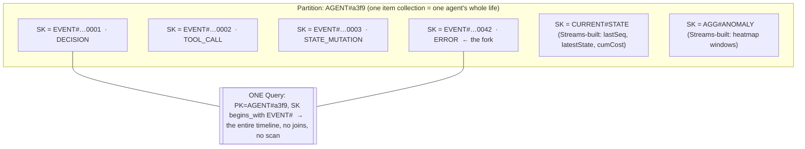
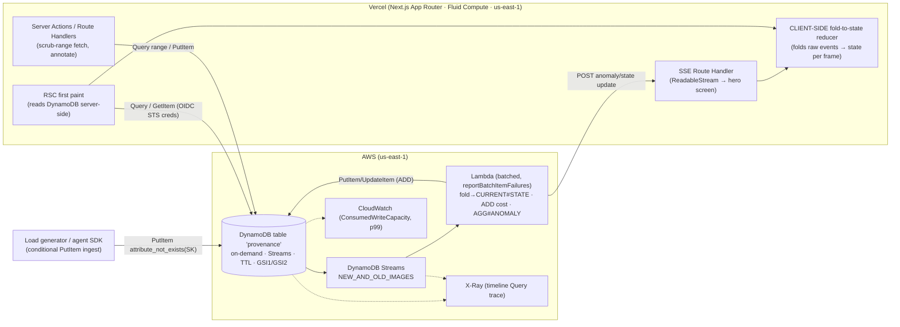

# Provenance — Time-Travel Debugger for AI Agent Fleets

**Purpose:** The complete, build-ready deep-dive for **Provenance**: a DynamoDB-backed agent-observability product where you scrub a slider backward through an agent's entire decision history and watch its state rewind — reconstructed *client-side* by folding a raw, append-only event log. This doc is everything a team needs to build it end-to-end under deadline.

> **Last updated / source:** 2026-06-18 · Generated from the H0 ideation workflow (`/tmp/h0_deepdives.txt` "DEEP DIVE: Provenance [G4]", cross-checked against [`IDEATION.md`](../../IDEATION.md) Phase 5 #2 and the DynamoDB grounding in [`../reference/aws-databases.md`](../reference/aws-databases.md)).

> **Composite score 8.81 (rank #2 of 32).** The single most *robust* build in the set: DynamoDB has **no connection pool to exhaust** (the #1 Vercel+Aurora demo-killer), it's single-region, the category (agent observability) is white-hot, and the time-travel interaction is unforgettable and hard to fake. Ideal **second submission** alongside Recall — shares zero infra, hits a different DB + different rubric.

---

## Table of Contents

1. [Snapshot](#1-snapshot)
2. [The load-bearing thesis](#2-the-load-bearing-thesis)
3. [Personas & jobs-to-be-done](#3-personas--jobs-to-be-done)
4. [Product spec](#4-product-spec)
5. [Data model](#5-data-model)
6. [System architecture](#6-system-architecture)
7. [AWS provisioning runbook](#7-aws-provisioning-runbook)
8. [Vercel / v0 build plan](#8-vercel--v0-build-plan)
9. [Submission artifacts for this project](#9-submission-artifacts-for-this-project)
10. [Demo video storyboard](#10-demo-video-storyboard)
11. [Build plan & milestones](#11-build-plan--milestones)
12. [Scope triage](#12-scope-triage)
13. [Risk register](#13-risk-register)
14. [Test plan](#14-test-plan)
15. [Production-grade polish checklist](#15-production-grade-polish-checklist)
16. [Open decisions for this project](#16-open-decisions-for-this-project)
17. [Related docs](#17-related-docs)

---

## 1. Snapshot

| Field | Value |
|---|---|
| **Final name** | Provenance |
| **Track (primary)** | Monetizable **B2B** — agent observability ("pays for itself the first time an agent loops and burns $4,000 of tokens overnight") |
| **Track (cross-entry)** | **Open Innovation** — the time-travel scrubber is genuinely novel UI; safety-net entry only, do **not** split the video's focus |
| **AWS database** | **Amazon DynamoDB** — single-table design + DynamoDB Streams → Lambda materialized views + TTL on ephemeral traces. **On-demand capacity** (writes are spiky/viral; textbook on-demand case + the write-storm scales without pre-provisioning) |
| **Prize-criteria target** | **Technological Implementation** + **Originality** (NOT the "polished v0 app" prettiness lane — you'll lose that to landing-page teams) |
| **Composite score** | **8.81** (rank #2 of 32; risk-adjusted-win 8.7, demo 9, originality 9, AWS-DB-fit 9) |
| **Region** | Single region (`us-east-1`) by design — trace ingestion, not a cross-region ledger. Co-locate the Vercel function region with the table region |
| **Build posture** | **Safest / most robust build in the set.** No connection pool to exhaust; single-region; least-fragile demo |

**Why it wins (one paragraph):** Provenance makes DynamoDB *the protagonist* by turning three of its native superpowers into things a judge can literally click on a live URL: (1) an **item-collection** key design (`AGENT#id` / `EVENT#<seq>`) that returns one agent's entire ordered life in **one Query** — no joins, no scan — which is exactly what powers the scrubber; (2) **Streams → Lambda** that materialize a `CURRENT#STATE` view and an anomaly heatmap *as the events land* (no batch job); and (3) a **client-side fold-to-state reducer** that reconstructs the agent's working memory, running spend, and tool-call stack purely from the raw log — true event sourcing, the thing competitors fake with checkpointing. The field will split into "pretty v0 apps with interchangeable backends" and "scales to millions with 12 seed rows"; Provenance is neither — the scrubber *cannot exist* without an append-only ordered item collection, and we seed real volume + show the CloudWatch capacity-vs-flat-p99 graph. It rides a hot category (LangSmith/AgentOps/Langfuse are real budgeted incumbents) with a UI none of them have.

---

## 2. The load-bearing thesis

> **The on-camera kill-shot (say verbatim):**
> *"Aurora chokes on the write rate and needs bolted-on logical replication just to fan out to a materialized view; DSQL gives me SQL I don't need, has no Streams, and a 10,000-row-per-transaction ceiling an append-heavy ingest path bumps into. The access pattern is one agent's ordered timeline — a pure key-condition Query, no joins, no scan. **DynamoDB is the only correct engine here.**"*

The product **IS** the event log. Agent telemetry is extreme high-write, append-only event sourcing: thousands of agents each emitting ordered tool-call / state / spend events per second. **Three DynamoDB properties are simultaneously load-bearing, and each is visible on screen:**

1. **Item-collection design.** `AGENT#id` as PK, `EVENT#<zero-padded-seq>` as SK → one agent's *entire ordered history* in ONE `Query` with a `begins_with` key condition. This is a pure key-condition lookup, not a relational join — so Aurora's joins buy nothing. This single Query is what the scrubber reads.
2. **Per-partition strict ordering + exactly-once stream delivery.** All events for one `AGENT#` land in one shard in the exact sequence they were written. This is *precisely why* "replay the log and you reconstruct true state" is correct rather than aspirational. Streams is the native CDC/event-sourcing backbone Aurora would need bolted-on logical replication to fake — and it would buckle at the write rate.
3. **Streams → Lambda materialized views.** The same write that the slider replays also updates the live anomaly heatmap: Streams → Lambda builds `CURRENT#STATE` (the folded current state + atomic cost counter) and `AGG#ANOMALY` *as events land*.

### Why the other two databases fail

| Engine | Why it's wrong here |
|---|---|
| **Aurora PostgreSQL** | The write rate (thousands of inserts/sec, spiky) is the wrong shape for a single writer. You'd **bolt on logical replication + a queue** just to fan out to a materialized view that Streams gives for free. And you'd gain joins you never use — the core read is **one key**. (Aurora PG is the right engine for [Recall](./01-recall.md)/[HourBank](./04-hourbank.md), where joins/vectors/constraints ARE the product — not here.) |
| **Aurora DSQL** | Gives you relational SQL and multi-region strong consistency you **do not need** (this is single-tenant trace ingestion, not a cross-region money ledger — that's [Settlement Floor](./05-settlement-floor.md)). It has **no Streams**, no extension ecosystem, and a **10k-row / 10 MiB per-transaction ceiling** that an append-heavy ingest path bumps into. You'd pay for the unicorn property (active-active strong consistency) the workload never exercises. |

> **Precision note for camera:** Say "**no Streams**" and "the write rate is the wrong shape" — both verified true. Do NOT claim DSQL "can't do appends"; it can, it just has no native CDC/stream and the txn-size ceiling. The unimpeachable kill-shots are: **Streams (native event-sourcing fan-out), the one-Query item-collection read, and the spiky high-write shape.**

### Judge Q&A rehearsal

| Anticipated hard question | Crisp answer |
|---|---|
| *"Where does the reconstructed state come from — is it pre-rendered on the server?"* | "No — and that's the whole thesis. The single Query returns the **raw events**; the **client** folds them into state as the slider moves. There's no snapshot table. Here's the reducer." *(Show the reducer code. This is the question that, answered wrong, deletes the product — see [§13](#13-risk-register).)* |
| *"Isn't this just a trace viewer like LangSmith?"* | "Incumbents do checkpoint-based state rollback **inside their own runtime**. We reconstruct state from a **raw immutable event log you can see on screen** — vendor-neutral, and the one-Query timeline is the proof that replay is cheap." |
| *"Why not Postgres with an events table and a window function?"* | "You'd be a single writer under thousands of spiky inserts/sec, and you'd bolt on logical replication to build the live anomaly view. Streams gives me CDC fan-out natively and the write latency stays flat as load 100x's — here's the CloudWatch graph." |
| *"How do you guarantee event ordering?"* | "Per-partition strict ordering: every `EVENT#` for one `AGENT#` lands in one shard in write order. The SK is a **zero-padded monotonic sequence** (`016d`) so lexical sort == chronological. We have a test asserting Query order == insertion order over thousands of events." |
| *"What about a single chatty agent — hot partition?"* | "Named failure mode. The natural fan-out across thousands of `AGENT#` PKs spreads writes; for a pathologically chatty agent we write-shard the SK space. We designed around it; we didn't pretend it away." |
| *"Is the money math safe?"* | "Integer **micro-dollars** end to end (`costUsdMicros`), never floats; we format to dollars only at render. A debugger that shows a wrong running total is dead on arrival." |
| *"Is real-time genuine or polling?"* | "Genuine: the stream Lambda pushes to an SSE Route Handler — the same write that hits Streams lights up the live heatmap. (If we had to cut SSE we'd poll `CURRENT#STATE` and say 'updates as events land' — still honest because the aggregate is genuinely Streams-built.)" |
| *"Why single-region — isn't that less impressive?"* | "We chose it. This is single-tenant trace ingestion; multi-region active-active is the wrong tool and the wrong cost. Choosing the right scope IS the engineering signal." |

---

## 3. Personas & jobs-to-be-done

**Primary — "Sam," Platform / ML "AI reliability" on-call engineer.** Runs fleets of LLM agents in production (autonomous coding / support / ops agents). Gets paged when one loops, overspends, or takes a destructive action.

| Job-to-be-done | Today (the pain) | With Provenance |
|---|---|---|
| "An agent went rogue overnight — *why?*" | Read a flat log line-by-line; reconstruct state in my head | Scrub the slider; watch state, tool-calls, and spend rewind to the exact fork event |
| "Which event made it loop?" | grep + guesswork across a trace tree | Land on the fork event; see the immutable record + OLD→NEW diff |
| "Prove what it cost and when" | Sum log lines, hope the math is right | A `CURRENT#STATE.cumCostUsdMicros` atomic counter + the spend meter rewinding frame-by-frame |
| "Catch the next one before it's $4k" | Nothing — find out from the bill | Streams-built anomaly heatmap flags the fork live as events land |

> **Incumbent gap (the wedge):** LangSmith, AgentOps, and Langfuse show you a **trace tree of what happened**, but to understand *why* an agent forked you read a flat log — there's no scrubbing back through **reconstructed state**. Provenance is the only one where you fold a raw, vendor-neutral event log into state.

**Budget authority:** Sam's team **already pays for observability** → Provenance is a **line-item swap, not a new budget**. That's the B2B monetization story.

**Secondary — "Dana," Eng Manager.** Has to explain to finance why an agent burned $4k overnight, and wants a **shareable, tamper-evident post-mortem permalink** to attach to the incident review. Drives the share/permalink + auditability narrative.

---

## 4. Product spec

### Core loop (numbered)

1. **Ingest (append).** An agent runs (real or replayed from a fixture) and emits an ordered stream of immutable events — `TOOL_CALL`, `STATE_MUTATION`, `SPEND`, `DECISION`, `ERROR` — each a conditional `PutItem` into its `AGENT#` item collection.
2. **Detect (Streams aggregate).** DynamoDB Streams → Lambda folds each event into `CURRENT#STATE` and increments `AGG#ANOMALY` — the live anomaly heatmap is built *as events land*, no batch job.
3. **Replay (one-Query timeline + client-side fold).** An engineer opens the agent's timeline (one `Query`), grabs the time-travel slider, and scrubs backward; the **client** folds the raw event log up to that timestamp into reconstructed state and renders it frame-by-frame.
4. **Diagnose.** Land on the exact event where the agent forked into a loop or overspent; inspect the immutable record, its inputs, and the OLD→NEW diff.
5. **Share.** Export/share that frozen frame as a permalinked, tamper-evident incident post-mortem.

> **The loop:** ingest → detect → replay → diagnose → share. **The DB is the spine of every step.**

### Screen-by-screen breakdown

| Screen | What it is | DB property it exposes |
|---|---|---|
| **Fleet overview** | Live grid of agent cards: status, current spend, event-rate sparkline, pulsing anomaly badge on flagged ones. Header counter ticks global events-ingested; flat p50-latency badge. **RSC first paint.** | `CURRENT#STATE` read (O(1)) + GSI1 fleet Query; "designed for scale" surface |
| **Agent Time-Travel Theater** (HERO) | Horizontal cinematic scrubber over the agent's full life; dragging rewinds 3 synced panes + the raw event lane. (Full state-table below.) | The one-Query item-collection read + the client-side fold |
| **Incident permalink / post-mortem** | A frozen frame at a specific event: reconstructed state, OLD-vs-NEW diff (Streams `NEW_AND_OLD_IMAGES`), cumulative spend at that instant, "this is where it went rogue" annotation. Shareable URL. | Auditability + the hash-chain (tamper-evidence) |
| **Live ingest / write-storm console** | A control to fire the load generator; a CloudWatch-style `ConsumedWriteCapacity` chart + events/sec + **p99 badge**; a toggle showing the X-Ray single-Query trace. | Flat-latency-under-load; the "designed for scale" proof |
| **Access-pattern panel** (data-model-as-thesis) | A rendered single-table item-collection view of one `AGENT#` (PK/SK + GSI rows) beside the **7-access-pattern → key-condition table**. | The architecture diagram *living inside the product* |

### Hero screen — Agent Time-Travel Theater

**Layout (top → bottom):**
- **The scrubber:** a horizontal cinematic timeline spanning the agent's full life, with the Streams-built **anomaly heatmap overlaid** (pulsing red at the fork point).
- **Three synced panes** that rewind as you drag:
  - **(a) Reconstructed STATE inspector** — working memory / variables, folded from the log.
  - **(b) TOOL_CALL card stack** — cards appear/disappear as you scrub.
  - **(c) SPEND meter** — an **animated counting number** that counts down/up as you move (the most visceral "this is real event sourcing" beat — invest in this micro-interaction).
- **The raw immutable event-stream lane** (below the scrubber): each record is a row with `seq#`, `type`, `hash` — so you **SEE the log that state is derived from**.

**Hero-screen states:**

| State | What it shows |
|---|---|
| **Empty** | Agent with no events yet → "No events recorded. This agent hasn't run." (a judge will open a fresh one) |
| **Loading** | Skeleton scrubber + skeleton panes; timeline Query in flight (Suspense fallback) |
| **Error** | Timeline fetch failed → retry affordance + the seq# of the last good event ("loaded through EVENT#…0042") |
| **Success** | Full scrubber, heatmap overlay, three panes synced to slider position |
| **Live-edge** | A still-running agent whose "now" is the live edge of the slider → a pulsing "● live" cap that advances as SSE events arrive |

**Key interactions / micro-interactions:**
- Drag → the fold reducer recomputes state from event[0..n]; the three panes animate to the new frame (debounced ~16ms / requestAnimationFrame, not per-pixel).
- Spend meter **counts down** as you scrub backward (CSS/JS tween between values, not a hard set).
- Heatmap cell hover → tooltip with the anomaly score + bucket window.
- Click an event row in the raw lane → the slider snaps to that seq#; the pane diff highlights.
- Relative timestamps on event rows ("2h ago").

---

## 5. Data model

Single table **`provenance`** — on-demand capacity, Streams = `NEW_AND_OLD_IMAGES`, TTL attribute = `ttl`.

```ts
// All items share PK (partition) + SK (sort). Money is ALWAYS integer micro-dollars.

// ── 1. EVENT item (the spine; append-only, immutable) ────────────────────────
{
  PK:    "AGENT#a3f9",                 // partition = one agent
  SK:    "EVENT#0000000000000042",     // EVENT#<zeroPadSeq:016d> — lexical == chronological
  type:  "TOOL_CALL",                  // TOOL_CALL | STATE_MUTATION | SPEND | DECISION | ERROR
  tsMillis:       1750000000042,
  payload:        { tool: "search_web", args: { q: "..." } },   // map
  tokenDelta:     1280,
  costUsdMicros:  4200,                // INTEGER micro-dollars — NEVER a float
  stateDelta:     { cursor: 7, retries: 1 },                     // the mutation to fold
  idempotencyKey: "run42-evt42",
  hashPrev:  "sha256:9c…",             // hash-chain → tamper-evident (auditability)
  hashSelf:  "sha256:1a…"
  // NOTE: no `ttl` on durable events; set ttl only on ephemeral debug traces (below)
}
// Written with ConditionExpression: attribute_not_exists(SK)  → idempotent ingest

// ── 2. CURRENT#STATE materialized item (built by Streams→Lambda) ─────────────
{
  PK: "AGENT#a3f9",
  SK: "CURRENT#STATE",
  lastSeq:          42,
  latestState:      { cursor: 7, retries: 1, memory: {…} },     // folded map
  cumCostUsdMicros: 184200,            // atomic ADD on each SPEND event
  status:           "RUNNING",         // RUNNING | DONE | ERRORED | LOOPING
  anomalyScore:     0.81
}   // Fleet grid reads this in O(1) (GetItem)

// ── 3. Anomaly aggregate item (incremented by the Streams Lambda) ────────────
{ PK: "AGENT#a3f9", SK: "AGG#ANOMALY",  windows: { /* bucket -> score */ } }
// (or per time-bucket: SK = "AGG#<bucket>" for a finer heatmap)

// ── 4. Ephemeral debug trace (same shape, auto-expires) ──────────────────────
{ PK: "AGENT#tmp-7", SK: "EVENT#…", ttl: 1750086400 /* ~24h epoch-seconds */ }
// TTL deletes at no read cost — the load-bearing TTL detail
```

**Why these exact choices (defend on camera):**
- **`EVENT#<zeroPadSeq:016d>`** — zero-padded so lexical SK order == chronological order. **Do NOT use raw epoch-ms** as the SK: two events in the same millisecond would tie and corrupt ordering. Use a monotonic per-agent `seq` (or `<epochMs>#<seq>` if you need both). An off-by-ordering bug here is invisible until demo day → **write a test** (see [§14](#14-test-plan)).
- **`NEW_AND_OLD_IMAGES`** — the OLD image powers the post-mortem diff for free.
- **`costUsdMicros` integer** — never float money in a debugger.

### Global secondary indexes

| GSI | Keys | Purpose |
|---|---|---|
| **GSI1** (fleet + global feed) | `GSI1PK = FLEET#<tenantId>`, `GSI1SK = <status>#<lastEventTs>` | Query the whole fleet, filter by status, sort by recency for the overview grid |
| **GSI2** (cross-agent anomaly inbox) | `GSI2PK = ANOMALY#<tenantId>`, `GSI2SK = <severity>#<ts>` | Sparse — only projected for `ERROR`/overspend events, so "what's on fire right now" is one Query |

### Access patterns → key condition (PUT THIS TABLE ON SCREEN)

| # | Access pattern | Operation & key condition |
|---|---|---|
| 1 | **One agent's full ordered timeline** *(THE scrubber query)* | `Query` `PK = AGENT#id` AND `SK begins_with EVENT#` — one round trip |
| 2 | Timeline window for a scrub range | `Query` `PK = AGENT#id` AND `SK between EVENT#a and EVENT#b` |
| 3 | Agent current state | `GetItem` `PK = AGENT#id`, `SK = CURRENT#STATE` |
| 4 | Fleet overview | `Query` GSI1 `PK = FLEET#tenant` |
| 5 | Anomaly inbox | `Query` GSI2 `PK = ANOMALY#tenant` |
| 6 | Cumulative spend at an instant | Derived from the client fold **OR** read `CURRENT#STATE.cumCostUsdMicros` |
| 7 | **Idempotent append** | `PutItem` with `ConditionExpression: attribute_not_exists(SK)` |

> **Hot-partition note (say on camera):** a single very chatty agent is a hot partition. Mitigate by write-sharding the SK space per agent *only if needed*; for the demo the natural fan-out across thousands of `AGENT#` PKs spreads writes. **Name the failure mode, show you designed around it.**

### Item-collection sketch (the data-model diagram — ship this)



---

## 6. System architecture



**Request / data path:**
- **Browser → RSC:** React Server Components render the first paint by reading DynamoDB directly server-side (fleet grid + initial timeline). No client loading flash; creds stay server-side.
- **Mutations / scrub-range:** Route Handlers / Server Actions, using AWS SDK v3 `DynamoDBDocumentClient`.
- **Write path:** ingest endpoint (or load generator) → conditional, idempotent `PutItem`.
- **Event-sourcing fan-out:** DynamoDB Streams (`NEW_AND_OLD_IMAGES`) → Lambda → writes `CURRENT#STATE` (fold + atomic `ADD` on cost) + `AGG#ANOMALY` items.
- **Real-time to UI:** the *same Lambda* POSTs anomaly/state updates to a Vercel Route Handler exposing a **Server-Sent Events `ReadableStream`** the hero screen subscribes to — "the same write hits Streams and updates the live view."
- **Replay/fold runs CLIENT-SIDE:** the timeline Query returns the raw events; the client reduces them to state as the slider moves. **True event sourcing — the server is NOT pre-computing each frame.** (This is the thesis; protect it — see [§13](#13-risk-register).)

**OIDC keyless AWS auth (do this first):** `awsCredentialsProvider({ roleArn })` from `@vercel/functions/oidc` → STS `AssumeRoleWithWebIdentity` → short-lived creds. **Zero long-lived AWS keys** anywhere. IAM trust policy keyed to `oidc.vercel.com/<TEAM_SLUG>`. (See [§7](#7-aws-provisioning-runbook) for the policy JSON and [`../reference/vercel-v0-playbook.md`](../reference/vercel-v0-playbook.md) for the pattern.)

**No connection pool to exhaust:** unlike Aurora, DynamoDB is HTTPS request/response — there is no Postgres connection ceiling to blow through under demo concurrency. This is the structural reason Provenance is the most robust build. **Fluid Compute** (`fluid: true`) still matters: it keeps the SSE/streaming functions warm so the demo has zero cold-start spinners.

**Caching matched to the consistency model:** Server Actions call `revalidateTag` after writes, mirroring the **eventually-consistent** materialized view (`CURRENT#STATE` lags the raw write by the Streams→Lambda hop). The raw timeline Query is **not** cached (freshness is the product). Don't claim strong consistency on the materialized view — narrate it as "updates as events land," which is honest.

---

## 7. AWS provisioning runbook

> Region: **`us-east-1`** — single-region by design (trace ingestion, not multi-region finance). Co-locate the Vercel function region with the table to keep the single-digit-ms latency story honest (a cross-region hop adds 100–300ms and ruins it).

**Ordered steps:**

1. **Create the table.**
   ```bash
   aws dynamodb create-table \
     --table-name provenance \
     --attribute-definitions \
       AttributeName=PK,AttributeType=S AttributeName=SK,AttributeType=S \
       AttributeName=GSI1PK,AttributeType=S AttributeName=GSI1SK,AttributeType=S \
       AttributeName=GSI2PK,AttributeType=S AttributeName=GSI2SK,AttributeType=S \
     --key-schema AttributeName=PK,KeyType=HASH AttributeName=SK,KeyType=RANGE \
     --billing-mode PAY_PER_REQUEST \
     --stream-specification StreamEnabled=true,StreamViewType=NEW_AND_OLD_IMAGES \
     --global-secondary-indexes \
       'IndexName=GSI1,KeySchema=[{AttributeName=GSI1PK,KeyType=HASH},{AttributeName=GSI1SK,KeyType=RANGE}],Projection={ProjectionType=ALL}' \
       'IndexName=GSI2,KeySchema=[{AttributeName=GSI2PK,KeyType=HASH},{AttributeName=GSI2SK,KeyType=RANGE}],Projection={ProjectionType=ALL}' \
     --region us-east-1
   ```
2. **Enable TTL** on the `ttl` attribute:
   ```bash
   aws dynamodb update-time-to-live --table-name provenance \
     --time-to-live-specification "Enabled=true, AttributeName=ttl" --region us-east-1
   ```
3. **Deploy the stream Lambda** (Node 20, `DynamoDBDocumentClient`): batched, `reportBatchItemFailures`, event-source filter to relevant types. It folds `STATE_MUTATION` into `CURRENT#STATE.latestState`, atomic `ADD` on `SPEND` into `cumCostUsdMicros`, increments `AGG#ANOMALY` on `ERROR`/overspend, and POSTs SSE notifications. Enable **X-Ray active tracing** on it.
4. **Wire the IAM role** for the Vercel OIDC provider (trust + permissions below).
5. **Seed real volume** *before* the demo (see seeding strategy).
6. **Capture screenshots** (see [§9](#9-submission-artifacts-for-this-project)).

**IAM role — trust policy (Vercel OIDC → STS AssumeRoleWithWebIdentity):**
```json
{
  "Version": "2012-10-17",
  "Statement": [{
    "Effect": "Allow",
    "Principal": { "Federated": "arn:aws:iam::<ACCOUNT_ID>:oidc-provider/oidc.vercel.com/<TEAM_SLUG>" },
    "Action": "sts:AssumeRoleWithWebIdentity",
    "Condition": {
      "StringEquals": {
        "oidc.vercel.com/<TEAM_SLUG>:aud": "https://vercel.com/<TEAM_SLUG>"
      },
      "StringLike": {
        "oidc.vercel.com/<TEAM_SLUG>:sub": "owner:<TEAM_SLUG>:project:provenance:environment:*"
      }
    }
  }]
}
```

**IAM role — least-privilege permissions (the app role; the Lambda gets its own role):**
```json
{
  "Version": "2012-10-17",
  "Statement": [{
    "Sid": "ProvenanceAppLeastPrivilege",
    "Effect": "Allow",
    "Action": ["dynamodb:Query", "dynamodb:GetItem", "dynamodb:PutItem", "dynamodb:BatchWriteItem"],
    "Resource": [
      "arn:aws:dynamodb:us-east-1:<ACCOUNT_ID>:table/provenance",
      "arn:aws:dynamodb:us-east-1:<ACCOUNT_ID>:table/provenance/index/*"
    ]
  }]
}
```
> Least-privilege action list: **`Query`, `GetItem`, `PutItem`** (+ `BatchWriteItem` for the seeder). The app role needs **no** `Scan`, no `DeleteItem`, no table-admin actions. The **Lambda** role separately needs `dynamodb:GetRecords/GetShardIterator/DescribeStream/ListStreams` on the stream ARN + `UpdateItem`/`PutItem` on the table. The point is: **no long-lived keys** — mention Secrets Manager only if you must store anything (you shouldn't need to).

**Env vars (Vercel, per environment — production / preview / development):**
```bash
AWS_REGION=us-east-1
AWS_ROLE_ARN=arn:aws:iam::<ACCOUNT_ID>:role/provenance-vercel-oidc
PROVENANCE_TABLE=provenance
# NO AWS_ACCESS_KEY_ID / AWS_SECRET_ACCESS_KEY anywhere — OIDC only.
```

**Seeding strategy — target volume + generator outline:**
- **Target:** a **few hundred thousand to low-millions** of events across **thousands of `AGENT#` partitions**, written BEFORE the demo so the row-count badge and the one-Query-over-a-long-timeline are credible (the "millions of rows, not 12 seed rows" bar). Include a handful of **scripted "rogue" agents** whose log contains a clear fork/loop/overspend (your demo agent's exact seq# pre-validated to land on a dramatic `ERROR`).
- **Method:** `BatchWriteItem` (25 items/call) from a Node script run locally with the same OIDC role (or temporary creds), parallelized across PKs. Keep one rogue agent's timeline long (~hundreds of events) so the scrub is visibly meaningful.

```ts
// seed.ts (outline) — run BEFORE the demo; start day one (it can take a while)
const AGENTS = 4_000, EVENTS_PER_AGENT = () => 50 + rand(450); // ~ up to ~2M events
for (const agent of agents) {
  let seq = 0, hashPrev = GENESIS, cum = 0;
  const events = [];
  for (let i = 0; i < EVENTS_PER_AGENT(); i++) {
    const type = pickType(agent);                       // weighted: mostly TOOL_CALL/STATE_MUTATION
    const costUsdMicros = type === "SPEND" ? rand(8000) : 0;  // integer micro-dollars
    cum += costUsdMicros;
    const sk = `EVENT#${String(seq).padStart(16, "0")}`; // 016d — lexical == chronological
    const hashSelf = sha256(hashPrev + sk + type);       // hash-chain
    events.push({ PK: `AGENT#${agent.id}`, SK: sk, type, tsMillis: agent.t0 + seq*step,
                  payload: synth(type), tokenDelta: rand(2000), costUsdMicros,
                  stateDelta: synthDelta(type), idempotencyKey: `${agent.run}-${seq}`,
                  hashPrev, hashSelf });
    hashPrev = hashSelf; seq++;
    if (agent.rogue && seq === agent.forkAt) events.push(forkEvent(agent, seq++)); // scripted ERROR/loop
  }
  await batchWrite("provenance", events);  // 25/req; let Streams build CURRENT#STATE + AGG#ANOMALY
}
```

---

## 8. Vercel / v0 build plan

**Step 1 — Generate the shell in v0** (honors "front-end in minutes"), then refine the time-travel interaction by hand. v0 prompt:

> *"Build a dark-mode AI-agent observability dashboard with shadcn/ui + Tailwind. Screen 1 'Fleet': a responsive grid of agent cards, each with a status pill, a current-spend figure, a tiny event-rate sparkline, and a pulsing red 'anomaly' badge on some cards; a sticky header with a large animated 'events ingested' odometer and a green 'p50 latency' badge. Screen 2 'Time-Travel Theater': a full-width horizontal slider/scrubber across the top with a colored heatmap strip overlaid; below it three side-by-side panels — a 'State' JSON inspector, a vertical stack of 'tool call' cards, and a large animated 'spend' counter (recharts/tremor); below those a dense table 'event lane' with columns seq, type, hash, time. Include a 'write-storm' control with a live area chart and a p99 badge. Polished empty/loading/error states, skeleton loaders, relative timestamps. Restrained palette: cool neutrals + one red accent for anomalies."*

Then **hand-refine**: the scrubber↔fold binding, the client-side reducer, the SSE subscription, and the spend-meter count-down tween.

**`vercel.json`:**
```json
{
  "functions": { "app/**": { "runtime": "nodejs20.x" } },
  "fluid": true,
  "regions": ["iad1"]
}
```
> `fluid: true` keeps SSE/streaming functions warm (zero cold-start spinners). `iad1` co-locates with `us-east-1`. Add a Vercel Cron only if you keep the live trickle-ingest counter.

**File tree (critical path):**
```
app/
  layout.tsx                      # dark mode default
  page.tsx                        # Fleet overview — RSC first paint (Query GSI1 + GetItem CURRENT#STATE)
  agent/[id]/page.tsx             # Time-Travel Theater — RSC fetch of the one-Query timeline
  agent/[id]/Theater.tsx          # 'use client' — scrubber + fold reducer + 3 panes
  incident/[id]/page.tsx          # frozen-frame permalink post-mortem
  api/
    ingest/route.ts               # POST → conditional PutItem (idempotent)
    timeline/[id]/route.ts        # scrub-range Query (SK between)
    stream/route.ts               # SSE ReadableStream (subscribed by Theater)
    storm/route.ts                # fire the load generator
    metrics/route.ts              # CloudWatch GetMetricData (WCU, p99) for the storm chart
lib/
  ddb.ts                          # DynamoDBDocumentClient via OIDC awsCredentialsProvider
  fold.ts                         # THE client-side reducer: events[] → state (pure fn)
  keys.ts                         # PK/SK builders + zero-pad seq (016d)
```

**Key dependencies:** `@aws-sdk/client-dynamodb`, `@aws-sdk/lib-dynamodb`, `@vercel/functions` (oidc), `@aws-sdk/client-cloudwatch` (metrics route), `recharts`/`tremor`, `shadcn/ui`.

**Critical-path code sketches:**

```ts
// lib/ddb.ts — OIDC keyless client (server-only)
import { DynamoDBClient } from "@aws-sdk/client-dynamodb";
import { DynamoDBDocumentClient } from "@aws-sdk/lib-dynamodb";
import { awsCredentialsProvider } from "@vercel/functions/oidc";

export const ddb = DynamoDBDocumentClient.from(new DynamoDBClient({
  region: process.env.AWS_REGION,
  credentials: awsCredentialsProvider({ roleArn: process.env.AWS_ROLE_ARN! }),
}));
```

```ts
// lib/fold.ts — THE THESIS. Pure, client-side, deterministic. Folds raw events → state.
export type Frame = { state: Record<string, unknown>; cumCostUsdMicros: number; toolStack: ToolCall[] };
export function foldTo(events: AgentEvent[], uptoSeq: number): Frame {
  return events
    .filter(e => e.seq <= uptoSeq)               // scrub position
    .reduce<Frame>((f, e) => {
      if (e.type === "STATE_MUTATION") Object.assign(f.state, e.stateDelta);
      if (e.type === "SPEND")          f.cumCostUsdMicros += e.costUsdMicros; // integer micro-$
      if (e.type === "TOOL_CALL")      f.toolStack.push(e.payload as ToolCall);
      if (e.type === "DECISION")       f.toolStack = []; // illustrative
      return f;
    }, { state: {}, cumCostUsdMicros: 0, toolStack: [] });
}
```

```tsx
// app/agent/[id]/page.tsx — RSC first paint: the one-Query timeline
import { ddb } from "@/lib/ddb";
import { QueryCommand } from "@aws-sdk/lib-dynamodb";
import Theater from "./Theater";

export default async function Page({ params }: { params: { id: string } }) {
  const { Items } = await ddb.send(new QueryCommand({          // ACCESS PATTERN #1
    TableName: process.env.PROVENANCE_TABLE,
    KeyConditionExpression: "PK = :pk AND begins_with(SK, :evt)",
    ExpressionAttributeValues: { ":pk": `AGENT#${params.id}`, ":evt": "EVENT#" },
  }));                                                          // ← one round trip, no joins, no scan
  return <Theater events={(Items ?? []) as AgentEvent[]} />;    // raw events handed to the client to FOLD
}
```

```ts
// app/api/ingest/route.ts — idempotent conditional append (ACCESS PATTERN #7)
import { ddb } from "@/lib/ddb"; import { PutCommand } from "@aws-sdk/lib-dynamodb";
export async function POST(req: Request) {
  const e = await req.json();
  try {
    await ddb.send(new PutCommand({
      TableName: process.env.PROVENANCE_TABLE, Item: e,
      ConditionExpression: "attribute_not_exists(SK)",          // exactly-once append
    }));
    return Response.json({ ok: true });
  } catch (err: any) {
    if (err.name === "ConditionalCheckFailedException") return Response.json({ ok: true, dedup: true });
    throw err;
  }
}
```

Use **Server Components** for first paint, **Server Actions** for ingest/annotate (`revalidateTag` after writes, mirroring the eventually-consistent view), **Suspense** streaming for the timeline, an **SSE Route Handler** for the live anomaly lane. Optimistic UI on annotate/share. Dark mode default. See [`../reference/vercel-v0-playbook.md`](../reference/vercel-v0-playbook.md) for OIDC + Fluid Compute details.

---

## 9. Submission artifacts for this project

**Required text:** name the database explicitly — **"Amazon DynamoDB."**

**Screenshots to capture (and what MUST be visible):**

- [ ] **DynamoDB console — the table.** Must show table name `provenance`, **item count** (proving real volume, not 12 rows), Streams **enabled** with `NEW_AND_OLD_IMAGES`, TTL **enabled** on `ttl`, and the **GSI1/GSI2** indexes.
- [ ] **DynamoDB console — a sample `AGENT#` item collection.** A single PK with the stack of typed SK rows (`EVENT#…`, `CURRENT#STATE`, `AGG#ANOMALY`) — this is the "intentional access-pattern modeling, not a bag of rows" proof. (NoSQL Workbench or a PartiQL result also works.)
- [ ] **CloudWatch — `ConsumedWriteCapacity` during the storm** climbing past several thousand writes/sec **next to a `SuccessfulRequestLatency` p99 line staying single-digit-ms flat.** The one image that screams "designed for scale." (Measure DynamoDB's *own* p99, not end-to-end-with-SSE.)
- [ ] **X-Ray — the single timeline Query trace.** Proves the timeline is genuinely one round trip, no joins, no scan.
- [ ] **The pairing shot:** the live Vercel frontend URL + Vercel **Team ID** alongside the AWS console table ARN, so a judge sees the exact frontend talking to the exact named DB (closes the "is this really wired up?" gap).

**The architecture diagram must contain:** the request path (Vercel RSC → OIDC/STS → DynamoDB → Streams → Lambda → SSE) **AND** — this is your gift — the **single-table item-collection diagram** (one `AGENT#` with its SK stack) + the **7-access-pattern → key-condition table**. Where most teams "draw boxes," you draw the **data model**. Ship both [§5](#5-data-model) mermaid + table as the diagram.

**Reminders:** demo on the **live published URL, never localhost**. Verify the URL resolves and the **Team ID** is correct in a **fresh incognito window** before recording (a dead link auto-deflates regardless of code). Optional bonus: a **public build thread** narrating the single-table design decision — it doubles as the artifact judges reward. See [`../reference/submission-checklist.md`](../reference/submission-checklist.md).

---

## 10. Demo video storyboard

**Total: 175s (< 180). Live Vercel URL throughout — never localhost.** Most memorable beat: **the spend meter counting DOWN as you scrub backward** while the state inspector and tool-call stack rewind in lockstep.

| Time | On-screen | Voiceover | Cursor / camera |
|---|---|---|---|
| **0:00–0:15** | Live fleet grid; header counter shows **millions of events ingested**; flat **p50 badge** | "This is Provenance. Every agent in this fleet is emitting an immutable event log into one DynamoDB table — thousands of writes a second, and read latency is flat." | Slow pan across the grid; let the odometer tick |
| **0:15–0:35** | An agent card **pulses red**; click → Time-Travel Theater opens | "This agent went rogue last night — looped and burned real money. The anomaly heatmap here was built by **DynamoDB Streams as the events landed** — we didn't run a batch job." | Click the red card; gesture at the heatmap strip |
| **0:35–0:75** | Grab the slider, scrub **backward**: state inspector rewinds, tool-call cards pop off the stack, **spend meter counts DOWN** frame by frame | "I'm scrubbing through its entire decision history. The state you see is being reconstructed on the fly **purely by folding the raw event log — true event sourcing. There's no snapshot table; the log is the source of truth.**" | Drag slowly right→left; let the spend number visibly tick down — **the memorable beat** |
| **0:75–0:95** | Land on the fork event; highlight the immutable record + **OLD-vs-NEW diff** + hash-chain; cut to **X-Ray overlay** | "Here's the exact event where it forked into the loop. **One Query** returned this agent's entire timeline — a single key-condition round trip, no joins, no scan." | Point cursor at the diff, then at the X-Ray single span |
| **0:95–1:25** | Hit the **write-storm** control → CloudWatch `ConsumedWriteCapacity` climbs past thousands/sec, **p99 badge stays single-digit-ms**; a NEW anomaly appears live on the heatmap via SSE | "Same write path under load: capacity scales, p99 stays flat — and watch, that write just hit Streams and lit up the live anomaly view in real time." | Press Storm; split attention to the flat p99 line and the new red cell |
| **1:25–1:50** | The **single-table item-collection diagram** + the **7-access-pattern table** | "`AGENT#id`, `EVENT#seq`. One agent's life is one item collection, one Query. **Aurora would choke on the write rate and need bolted-on replication to fan out; DSQL gives me SQL I don't need and has no Streams. DynamoDB is the only correct engine here.**" | Hold on the diagram; trace PK→SK with the cursor |
| **1:50–1:65** | Click **share** → incident permalink loads (frozen frame, tamper-evident) | "And this frozen frame is a shareable, tamper-evident post-mortem — the auditability your finance team asks for." | Click share; show the URL bar change |
| **1:65–1:75** | Architecture overlay (Vercel RSC → OIDC/STS → DynamoDB → Streams → Lambda → SSE) + **Team ID** on screen | "Front-end in minutes on Vercel, a back-end where the database is the protagonist. Provenance." | End card: live URL + Team ID + "Amazon DynamoDB" |

---

## 11. Build plan & milestones

Build **spine-first** so a working core exists even if time runs out. Rough budget assumes one focused builder over ~2.5 days (Provenance is the low-fragility build; OIDC is the only afternoon-eater).

| # | Milestone | Definition of done | Budget |
|---|---|---|---|
| **M1** | **Table + ingest + seed generator** | Table exists with Streams/TTL/GSIs; `/api/ingest` does conditional `PutItem`; seeder writes **hundreds of thousands+** events across thousands of `AGENT#` PKs incl. scripted rogue agents | ~0.5 day (seed runs in background) |
| **M2** | **One-Query timeline + client-side fold + slider** *(THE HERO)* | A `Query` returns one agent's full timeline; `lib/fold.ts` reduces raw events → state; the slider re-renders the 3 panes by re-folding. **If this works, you have a submission.** | ~0.75 day |
| **M3** | **Streams → Lambda materialized view + fleet grid** | Lambda folds `CURRENT#STATE` + increments `AGG#ANOMALY`; fleet grid reads `CURRENT#STATE` (O(1)) + GSI1; anomaly badges pulse | ~0.5 day |
| **M4** | **OIDC keyless auth end-to-end** *(start EARLY, in parallel with M1)* | One DynamoDB Query returns over OIDC **on day one** — no long-lived keys anywhere | ~0.5 day (front-load it) |
| **M5** | **Write-storm console + CloudWatch/X-Ray screenshots** | `/api/storm` fires load; `/api/metrics` reads CloudWatch; p99-flat + WCU-climbing graph captured; X-Ray single-Query trace captured | ~0.5 day |
| **M6** | **Share/permalink + access-pattern panel + polish** | Frozen-frame permalink; the data-model-as-thesis panel; dark mode, empty/loading/error/live-edge states, animated spend counter | ~0.5 day |

- [ ] M1 — data exists
- [ ] M2 — hero works (one-Query + fold + scrub)
- [ ] M3 — DB is the protagonist (Streams view + heatmap)
- [ ] M4 — OIDC proven day one
- [ ] M5 — scale evidence captured
- [ ] M6 — polish + share

---

## 12. Scope triage

**Cut in this order — the hero stays LAST:**

1. **Live SSE real-time push** → replace with a poll-on-an-interval of `CURRENT#STATE` for the heatmap. Still honest (the aggregate is genuinely Streams-built); narrate "updates as events land," don't claim websockets.
2. **Hash-chain / tamper-evidence** — nice auditability flavor, not load-bearing for the core demo.
3. **GSI2 anomaly-inbox + cross-agent view** — the per-agent `AGG#ANOMALY` item alone drives the heatmap.
4. **Share / permalink screen** — it's a static render of a frame; can be a deep link if needed.
5. **Live write-storm** — if CloudWatch won't cooperate on camera, **pre-capture the graph** as the required screenshot and narrate over it (still truthful).

> **NEVER CUT (these three ARE the thesis):**
> 1. The **single-Query timeline** (`PK=AGENT#id, SK begins_with EVENT#`).
> 2. The **client-side fold / scrub** reducer.
> 3. The **Streams-built `CURRENT#STATE`**.
>
> If you cut the fold, you no longer have an event-sourced product — just another trace viewer. Also never cut: **real seed volume** and the **live-URL deploy**.

---

## 13. Risk register

| Risk | Likelihood | Impact | Mitigation |
|---|---|---|---|
| **Fold silently degrades to server pre-rendered frames** → it becomes "just another trace viewer" and the *entire thesis dies* | Medium | **Fatal** | The fold MUST run **client-side** over the raw Query results; **say so on camera and be able to show `lib/fold.ts`**. A judge who probes asks "where does state come from?" — "pre-rendered" loses. |
| **OIDC keyless auth not wired in time** → panic-revert to long-lived AWS keys in env | Medium | **Fatal** (security judge notices; undercuts "production-shaped") | **Prove one OIDC-authed Query on day one (M4)** before building anything else. Never hardcode keys. |
| **Claiming scale/real-time without the artifacts** | Medium | High | Treat the **seed script** and the **CloudWatch capacity screenshot** as **P0 deliverables**, not nice-to-haves. The gap between claim and evidence is the fastest credibility killer. |
| **SK ordering bug** (raw epoch-ms ties, or non-padded seq) corrupts the entire timeline | Medium | High | Zero-pad seq `016d`; **write a test asserting Query order == insertion order** over thousands of events (see [§14](#14-test-plan)). Invisible until demo day otherwise. |
| **Float money** shows a wrong running total | Low | High | Integer **`costUsdMicros`** everywhere; format to dollars only at render. |
| **Hot partition** (one chatty agent) | Low (demo) | Medium | Natural fan-out across thousands of `AGENT#` PKs; write-shard the SK space only if needed. **Name it on camera.** |
| **Dead published URL / wrong Team ID** at submission | Low | **Fatal** (auto-deflate) | Verify URL + Team ID in a **fresh incognito window** before recording. |
| **Cold-start spinners** on the SSE/streaming functions | Low | Medium | **Fluid Compute** (`fluid: true`) keeps functions warm. (No connection pool to exhaust — DynamoDB's structural advantage.) |
| Seed of millions of rows doesn't finish in time | Medium | Medium | Start the seeder **day one**, run in background, parallelize `BatchWriteItem` across PKs. |

---

## 14. Test plan

**Correctness tests:**

- **Ordering invariant (the critical one):** write N=10,000 events into one `AGENT#` in known order; `Query` `begins_with EVENT#`; assert returned `seq` is strictly ascending and equals insertion order. *This is the adversarial test for this build* — an off-by-ordering bug corrupts every frame of the scrub and is invisible until demo day.
  ```ts
  test("Query order == insertion order over 10k events", async () => {
    const seqs = await queryTimeline("AGENT#order-test");
    expect(seqs).toEqual([...seqs].sort((a, b) => a - b));   // strictly ascending
    expect(seqs.length).toBe(10_000);                         // none dropped
  });
  ```
- **Idempotent append (no double-count):** replay the SAME event (same `SK`/`idempotencyKey`) twice; assert the second `PutItem` hits `ConditionalCheckFailedException` and `CURRENT#STATE.cumCostUsdMicros` is **not** double-incremented. (Adversarial analogue of the double-pay / oversell test in other builds.)
  ```ts
  test("replayed event does not double-count spend", async () => {
    await ingest(spendEvent);                 // first write
    const before = await currentState("AGENT#x");
    await ingest(spendEvent);                 // exact replay
    const after = await currentState("AGENT#x");
    expect(after.cumCostUsdMicros).toBe(before.cumCostUsdMicros);  // dedup held
  });
  ```
- **Fold determinism:** `foldTo(events, n)` is a pure function — assert same input → same `Frame`, and that folding to `lastSeq` equals the Streams-built `CURRENT#STATE.latestState` (the client fold and the server materialization agree).
- **Money integrity:** assert all `costUsdMicros` are integers; assert the rendered dollar string round-trips (`micros → "$X.XX"`).

**Load-test config sketch (k6) — drives the write-storm artifact:**
```js
// storm.js — fire the conditional-append ingest at thousands/sec
import http from "k6/http";
export const options = {
  scenarios: {
    storm: { executor: "ramping-arrival-rate", startRate: 200, timeUnit: "1s",
             preAllocatedVUs: 500, stages: [
               { target: 1000, duration: "20s" },
               { target: 5000, duration: "30s" },   // the spike
               { target: 5000, duration: "30s" },   // hold → CloudWatch shows flat p99
             ] },
  },
};
export default function () {
  const agent = `AGENT#storm-${Math.floor(Math.random() * 4000)}`; // fan out across PKs
  http.post(`${__ENV.URL}/api/ingest`, JSON.stringify(synthEvent(agent)),
            { headers: { "Content-Type": "application/json" } });
}
```
> Run k6 **externally** (so it can't starve the demo function), fan writes across thousands of PKs (avoid a hot partition), and read **DynamoDB's own** `SuccessfulRequestLatency` p99 from CloudWatch for the flat-line badge — not end-to-end time that includes SSE/HTTP overhead.

---

## 15. Production-grade polish checklist

- [ ] **Integer micro-dollars** (`costUsdMicros`) everywhere; format to dollars only at render.
- [ ] **Spend meter is an animated counting number** (tween between values) — the count-down on scrub-back is the single most visceral "real event sourcing" moment.
- [ ] **Zero-pad SK seq (`016d`)** + the ordering test in CI.
- [ ] **Dark mode by default**, one restrained accent (red for anomaly, everything else cool/neutral) — a debugger that's loud looks like a toy.
- [ ] **Real empty / loading / error / live-edge states** on the timeline (no events; fetch failure; a still-running agent whose "now" is the slider's live edge).
- [ ] **Relative timestamps** ("2h ago") on event rows; absolute on hover.
- [ ] **Latency number ON the badge as a literal value** (e.g. "p99 7ms"), a real measurement, not a vibe.
- [ ] **OIDC keyless** wired; zero long-lived AWS keys in env or client bundle.
- [ ] **Fluid Compute** on so the SSE/streaming functions have no cold-start spinner.
- [ ] **Verify published URL + Team ID** in a fresh incognito window before recording.
- [ ] **Record on the LIVE URL**, never localhost.
- [ ] **Ship the public build thread** narrating the single-table design (bonus points).
- [ ] Server-side only for all SDK calls; credentials never reach the client.

---

## 16. Open decisions for this project

- **Is Provenance built at all?** Per the [recommendation](../05-recommendation.md), Provenance is the **robust SECOND submission** alongside flagship [Recall](./01-recall.md) — built *only if* AWS/v0 credits land in time and a second builder exists. It shares **zero infra** with Recall and hits a different DB + rubric. Do **not** attempt 3+ submissions.
- **Real agents vs. replayed fixtures?** Default to **replayed fixtures from the seed generator** (deterministic, demo-safe). Wiring a real agent SDK to emit live events is a stretch goal, not a requirement — the fixtures are genuine event sourcing.
- **SSE vs. poll for the live heatmap?** Default to **SSE** (the "same write hits Streams and lights up the view" beat is strong). Fall back to polling `CURRENT#STATE` under time pressure (cut #1) — narrate honestly.
- **Anomaly scoring logic?** For the demo, a simple heuristic (loop detection via repeated tool-call signature; overspend threshold on `cumCostUsdMicros`) computed in the stream Lambda. A learned model is out of scope.
- **Tenancy in the keys.** GSI1/GSI2 carry `<tenantId>` — decide a single demo tenant vs. multi-tenant seed. Single tenant is simpler; multi-tenant makes the fleet grid richer. Default single tenant.
- **Open-Innovation framing emphasis.** Confirm we keep Open Innovation as a *silent* cross-entry and shoot the video **B2B-first** (do not split focus).

---

## 17. Related docs

- **Index / navigation:** [`../README.md`](../README.md)
- **What wins / failure modes / track odds:** [`../01-judging-model.md`](../01-judging-model.md)
- **The 22 serious concepts + comparison table:** [`../02-idea-universe.md`](../02-idea-universe.md)
- **The 10 generational ideas (Provenance is G4):** [`../03-generational-ideas.md`](../03-generational-ideas.md)
- **Full 32-concept scoring matrix (Provenance = rank #2):** [`../04-scoring-matrix.md`](../04-scoring-matrix.md)
- **The recommendation / decision tree (Provenance = robust 2nd):** [`../05-recommendation.md`](../05-recommendation.md)
- **Open questions / assumption register:** [`../06-open-questions.md`](../06-open-questions.md)
- **Sibling deep-dives:** [Recall](./01-recall.md) · [Sky Claim](./03-sky-claim.md) · [HourBank](./04-hourbank.md) · [Settlement Floor](./05-settlement-floor.md)
- **DynamoDB superpowers + screenshot proofs:** [`../reference/aws-databases.md`](../reference/aws-databases.md)
- **OIDC keyless, Fluid Compute, v0 patterns, pitfalls:** [`../reference/vercel-v0-playbook.md`](../reference/vercel-v0-playbook.md)
- **Required artifacts, demo rules, bonus, pre-flight:** [`../reference/submission-checklist.md`](../reference/submission-checklist.md)
