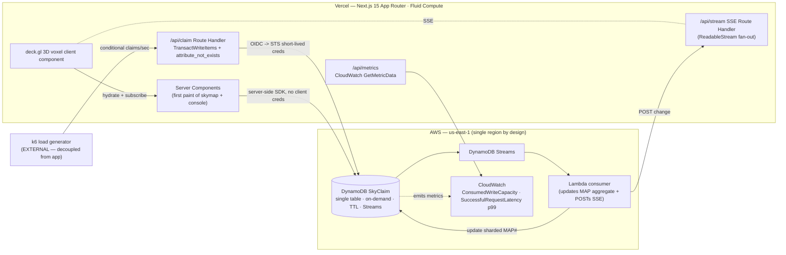

# Sky Claim — Deep-Dive Build Doc

**Purpose:** The build-ready spec for **Sky Claim** — live air-traffic control for the sub-400ft drone economy, where every flight atomically claims 3D airspace voxels before entering them and double-booking is *physically impossible* because the database refuses the second writer. DynamoDB · Open Innovation (Million-scale flavor).

> **Last updated / source:** Generated from the H0 ideation workflow (`IDEATION.md` Phase 5 #3 + `/tmp/h0_deepdives.txt` "DEEP DIVE: Sky Claim [S20]"). This is the authoritative build doc for the Sky Claim concept. All latency/row-count/ACU figures below are **targets to measure**, not facts — capture the real numbers off CloudWatch and k6 before recording.

---

## Table of Contents

1. [Snapshot](#1-snapshot)
2. [The load-bearing thesis](#2-the-load-bearing-thesis)
3. [Personas & jobs-to-be-done](#3-personas--jobs-to-be-done)
4. [Product spec](#4-product-spec)
5. [Data model](#5-data-model)
6. [System architecture](#6-system-architecture)
7. [AWS provisioning runbook](#7-aws-provisioning-runbook)
8. [Vercel / v0 build plan](#8-vercel--v0-build-plan)
9. [Submission artifacts for this project](#9-submission-artifacts-for-this-project)
10. [Demo video storyboard](#10-demo-video-storyboard)
11. [Build plan & milestones](#11-build-plan--milestones)
12. [Scope triage](#12-scope-triage)
13. [Risk register](#13-risk-register)
14. [Test plan](#14-test-plan)
15. [Production-grade polish checklist](#15-production-grade-polish-checklist)
16. [Open decisions for this project](#16-open-decisions-for-this-project)
17. [Related docs](#17-related-docs)

---

## 1. Snapshot

| Field | Value |
|---|---|
| **Concept ID** | S20 (serious-22), Phase 5 deep-dive #3 |
| **Submitted track** | **Track 4 — Open Innovation**, framed with a Million-scale / high-write systems flavor |
| **AWS database** | **Amazon DynamoDB** — single-table design, on-demand capacity, Streams (`NEW_AND_OLD_IMAGES`), TTL enabled |
| **Prize spear** | **Originality + Technological Implementation**, with **Design** as the multiplier that makes both legible |
| **Composite score** | **8.65** (rank #3 of 32). Sub-scores: Tech 9, Design 8.3, Impact 8, Originality **9**, Feasibility 6.7, DB-load-bearing **9.3**, Monetization 6.3, Wow 9 |
| **Monetization** | Per-flight deconfliction fees / B2B UTM-as-a-service — a **one-line mention**, never the pitch |
| **Region** | Single region (one city's airspace) by design — *explicitly* not multi-region. That honesty is part of the kill-shot. |

**Why it wins (one paragraph):** The field will be ~40% RAG chatbots and ~40% "scales to millions" CRUD with no proof. Sky Claim is neither. It makes the DynamoDB **conditional write the literal protagonist** — a head-to-head race for one cube of sky with a visible winner and loser — and turns an invisible distributed-systems property (exactly-one-winner under a write storm) into something a non-technical judge can *see happen* on the live URL. It owns **Originality** because UTM/drone airspace has zero hackathon precedent and reads as senior systems thinking, not a dropdown pick; it proves **Technological Implementation** harder than the scale-track entries because it backs the claim with a real k6 storm, a CloudWatch graph of write capacity 100×'ing while p99 latency stays flat, millions of real seeded rows, and a zero-oversell counter that never moves. Swap DynamoDB out and the product literally cannot guarantee deconfliction — that is the definition of load-bearing.

---

## 2. The load-bearing thesis

The protagonist is a single DynamoDB operation: a conditional `PutItem` on a `(geohash-voxel, time-bucket)` item with `attribute_not_exists`. Success = you own that cube of sky for that 15-second window (green). Failure = `ConditionalCheckFailed`, held by another flight, reroute (red). Exactly-one-winner deconfliction under unbounded concurrency, at single-digit-millisecond latency that **stays flat as flight count 100×'s**. This is the one property only DynamoDB makes visible.

### The verbatim on-camera kill-shot

> **"One conditional write with `attribute_not_exists`. Exactly one winner. The loser is rejected at the database, not by app logic that could race. Aurora would deadlock on these hot spatial rows the moment 5,000 flights hit one corridor; Aurora DSQL's optimistic concurrency would retry-storm those same contended voxels; and you don't need cross-region writes for one city's airspace. We didn't pick DynamoDB from a dropdown — it's the only one of the three that makes this correct *and* flat under load."**

### Why the other two databases fail

| DB | What breaks | The honest one-liner for camera |
|---|---|---|
| **Aurora PostgreSQL** | Under a write storm the contended voxels become a **lock-contention hotspot**. Row locks serialize every writer targeting the same spatial row; the demo deadlocks the instant 5,000 flights hit one delivery corridor. Latency is *not* flat — it climbs with contention. | "Aurora would serialize on the hot spatial rows and deadlock." |
| **Aurora DSQL** | Optimistic concurrency control **retry-storms** the contended voxels: every conflicting commit aborts with `SQLSTATE 40001` and retries, amplifying load *exactly where it's hottest*. And DSQL's signature feature — cross-region active-active strong consistency — is **dead weight** for one city's airspace. You'd pay the OCC tax for a capability you don't use. | "DSQL would retry-storm those same voxels, and you don't need multi-region for one city." |
| **DynamoDB** ✅ | The conditional write *is* a native primitive: no row locks, the second writer is rejected at the storage layer in single-digit ms, and latency stays flat as writes 100×. Plus it uniquely supplies the other two load-bearing pieces **for free**: **Streams** fan every successful claim into a materialized live-skymap view (event-sourcing the airspace state), and **TTL** auto-expires a reservation the instant its time-bucket passes — at zero read cost, no sweeper job, no cron, no lock to release. | "It's the only one of the three that's correct *and* flat under load." |

> **Kill-shot framing for the writeup:** Every access pattern — claim a voxel, query my corridor, expire on exit, build the live map — is known in advance and key-shaped. If you swapped the DB, the product breaks. That is the definition of load-bearing.

### Judge Q&A rehearsal

| Anticipated hard question | Crisp answer |
|---|---|
| "Isn't the conflict race just hardcoded? It resolves suspiciously fast." | "No — open the network panel. The loser gets a real `409` with `ConditionalCheckFailed` from DynamoDB. Tap the buttons yourself on the live URL." (Let the judge hammer them.) |
| "Your flat-latency line — is that end-to-end or the database?" | "It's DynamoDB's own `SuccessfulRequestLatency` p99 straight from CloudWatch — the DB's honest number, not my request time that would include SSE overhead. The k6 load generator runs *externally* so it can't starve the app." |
| "Why not just use a single contended row and a lock?" | "That's exactly why Aurora fails here — the hot row becomes a serialization point. DynamoDB's conditional write needs no lock; the second writer is rejected at the storage layer." |
| "How do you avoid a hot partition on the contended voxel?" | "The voxel reservation is **intentionally single-key** — that single-keyness is what makes deconfliction correct; you cannot shard a cube that must have exactly one owner. The time-bucket in the SK spreads writes across buckets, and the *materialized skymap aggregate* (which is allowed to be eventually-summed) is write-sharded across N suffixes. We designed *around* the one hot item we couldn't shard." |
| "How does the reservation get released?" | "TTL on `ttlEpoch`. The instant a flight's 15s time-bucket passes, DynamoDB silently deletes the reservation — zero read cost, no sweeper, no cron. The sky frees up behind the drone." |
| "Is this really at scale, or 12 demo rows?" | "1–3M real seeded voxel-claim items — a week of synthetic city traffic. The odometer is real. The k6 storm fires thousands of conditional claims/sec including a deliberately contended corridor." |
| "Why on-demand capacity instead of provisioned?" | "Airspace traffic is *spiky*, not steady — rush-hour delivery waves, an event, a disaster surge. On-demand is the correct cost+capacity choice and matches the workload." |
| "Why is this Open Innovation and not Million-scale?" | "We lead with Open Innovation because UTM is a novel domain, but the architecture argues the Million-scale case — flat single-digit-ms under a 5,000-flight write storm. Read it either way; both are true." |

---

## 3. Personas & jobs-to-be-done

**Primary — Commercial drone-fleet operations dispatcher.** Think a Zipline / Wing / Flytrex ops-console operator, or a city UTM coordinator, managing dozens-to-hundreds of simultaneous sub-400ft BVLOS flights — delivery, inspection, survey — over a dense urban area.

- **JTBD:** "Let me launch and route dozens of simultaneous flights through shared urban airspace without any two ever occupying the same cube of sky at the same time."
- **Job-defining fear:** A mid-air conflict, or a regulator asking *"prove these two drones could never occupy the same airspace."*
- **Needs:** Deconfliction that is **correct under burst load** (rush-hour delivery waves, an event, a disaster-response surge) and **auditable after the fact**.
- **Why credible:** FAA UTM and the sub-400ft drone economy are real; regulators are actively standardizing it; "atomic airspace deconfliction at scale" is a problem this persona would actually pay for.

**Secondary (the demo persona) — Two operators racing for the same contended corridor.** This dramatizes the conflict into the money shot: two big CLAIM buttons targeting the same voxel at the same time-bucket, one wins, one loses, live.

**Tertiary (implied judge persona) — The regulator / auditor.** Served by the Time-Travel scrubber: "replay the sky" as of any past instant from the Streams-built event log.

---

## 4. Product spec

### Core loop (numbered)

1. **Plan a corridor.** A drone operator (or the autopilot) plans a flight as an ordered list of 3D airspace voxels with timestamps. The client resolves the drawn corridor to a sequence of `(geohash7, altitude-band, 15s-time-bucket)` voxel keys.
2. **Claim each voxel.** For each voxel, fire a `TransactWriteItems` (VOXEL reservation + FLIGHT membership) with `attribute_not_exists`. **Success** = green claim (you own that cube of sky for that 15s window). **Failure** = `ConditionalCheckFailed` = red, voxel held by another flight, reroute.
3. **Fan out the claim.** Successful claims emit DynamoDB Stream records → Lambda updates the materialized live-skymap aggregate item + pushes an SSE event to all connected operator dashboards.
4. **Free the sky.** As each time-bucket elapses, TTL silently deletes the reservation — the sky "frees up" behind the drone with zero read cost and no sweeper.

> **The product insight the UI exposes:** airspace is a finite, contended, time-sliced resource, and double-booking it is *physically impossible* because the database refuses the second writer. That refusal, made visible, is the whole product.

### Screen-by-screen breakdown

| Screen | Purpose | Key elements |
|---|---|---|
| **Live Skymap (hero)** | The courtroom evidence. | Dark-mode 3D voxel grid over a city basemap (deck.gl `ColumnLayer`). Corridors glow as light-trails; each claimed voxel is a translucent cube. Pinned HUD: flat p99-latency badge, climbing flights/sec counter, total-claims odometer ticking toward millions. A rejected claim triggers a sharp red voxel flash + a toast. |
| **Conflict Arena (money shot)** | Make exactly-one-winner clickable. | Side-by-side panel, two operators, same voxel + same time-bucket. Two big `CLAIM 10:42:15` buttons. Tap both → one snaps green (`CLAIMED — you own this airspace`), the other red (`HELD — rerouting`) in <1s, winning flight id shown. Below: a live **`oversells: 0`** counter that never moves no matter how hard you hammer. |
| **Load Storm panel** | The credibility. | A `Run 5,000-flight storm` button fires the k6/load generator (run externally — see risk register). An embedded live `ConsumedWriteCapacity` sparkline (CloudWatch via a server route) climbing into the thousands, with the p99 `SuccessfulRequestLatency` line pinned flat beside it. Caption: *"writes 100×'d; latency didn't move."* |
| **My Corridor / Flight detail drawer** | Expose the single-table design. | Click any flight → **one DynamoDB Query** (`PK=FLIGHT#id`, `SK begins_with VOXEL#`) returns the entire claimed corridor as an ordered item collection in one round trip. Show the voxel list + the actual key-condition trace. "One round trip, no joins." |
| **Airspace Time-Travel / Audit** | Auditability for the regulator. | A scrubber over the Streams-built event log; drag the slider and watch voxels light and clear as of any past instant — *"replay the sky."* Sells event/history modeling, TTL expiry, auditability. |
| **Architecture & Access-Patterns page** | The required diagram, as a real page. | The dual-tier diagram (v0 frontend → Vercel Function → OIDC/STS → DynamoDB) + the single-table item-collection diagram + the 7-access-pattern → PK/SK/GSI table, rendered as a real product page (also screenshot-ready). |

### Hero screen states & micro-interactions — **Live Skymap + Conflict Arena**

| State | What the user sees |
|---|---|
| **Empty** | A faint voxel grid over the dark basemap with the label **"Airspace clear."** Intentional, not broken — looks like an ops console at 3am, not a failed fetch. |
| **Loading** | Skeleton HUD cards (mono-font placeholders for p99/odometer), the basemap rendered, voxels fading in as initial server data hydrates. No full-page spinner. |
| **Error** | A non-blocking toast (`Live feed degraded — reconnecting`) with the last-known skymap frozen + a dimmed overlay. The Conflict Arena buttons stay live (they hit the authoritative `/api/claim` directly, independent of the SSE feed). |
| **Success (claim won)** | The targeted cube snaps green with a subtle scale-pulse; the odometer ticks up; an SSE event lights the same cube on the *other* tab within ~1s. |
| **Success (claim lost)** | The targeted cube snaps red; toast: **`HELD by FLIGHT#A3 — rerouting`**; the `oversells: 0` counter is conspicuously *unmoved*. |

**Key micro-interactions:**

- **Optimistic fire, authoritative reconcile.** On tap, the cube optimistically pulses; it then reconciles to the real `200` (green) or `409` (red) response. The rejection has to feel *physical* — cube snap + color + a one-line toast.
- **Animated odometer** for total claims (mono font), so every frame radiates "real and at scale."
- **Red flash on rejection** propagates to all connected tabs via SSE — the two-tab moment.
- **Persistent evidence HUD** (p99 badge, flights/sec, odometer) pinned in every frame as a beautifully-typeset overlay.

---

## 5. Data model

**Single table: `SkyClaim`.** On-demand capacity. Streams: `NEW_AND_OLD_IMAGES`. TTL attribute: `ttlEpoch`. Item-collection design — VOXEL / FLIGHT / MAP / OPERATOR item types share one table.

### Single-table item shapes + GSIs

```text
TABLE SkyClaim  (on-demand · Streams=NEW_AND_OLD_IMAGES · TTL=ttlEpoch)

# 1) VOXEL reservation — the hot, contended item (the protagonist)
PK = VOXEL#{geohash7}#{altBand}     e.g. VOXEL#gcpvj0e#A3
SK = TIME#{epochBucket15s}          e.g. TIME#1782000015
attrs: flightId, operatorId, claimedAt, ttlEpoch (= bucket end), shardSalt,
       GSI1PK = TIME#{epochBucket15s}, GSI1SK = VOXEL#{geohash7}#{altBand}
WRITE = PutItem  ConditionExpression: attribute_not_exists(PK) AND attribute_not_exists(SK)
        -> exactly-one-winner.

# 2) FLIGHT corridor membership — one Query returns a whole flight's voxels
PK = FLIGHT#{flightId}
SK = VOXEL#{geohash7}#{altBand}#{epochBucket15s}
attrs: claimedAt, GSI2PK = OPERATOR#{operatorId}, GSI2SK = TIME#{epochBucket15s}
# written in the SAME TransactWriteItems as the VOXEL item, so corridor +
# reservation commit atomically (both succeed or both fail).

# 3) LIVE SKYMAP aggregate — materialized by Streams -> Lambda (write-sharded)
PK = MAP#{cityId}#{epochBucket15s}#shard{0..9}
SK = AGG
attrs: activeVoxelCount, activeFlightIds (string set), claimsPerSec
# write-sharded across N=10 suffixes so the materialized-view item is not a
# single hot key; summed on read.

# 4) OPERATOR / FLIGHT metadata
PK = OPERATOR#{operatorId}
SK = FLIGHT#{flightId}
attrs: status, plannedCorridorRef, createdAt

# --- GSIs (each named, each serves a specific access pattern) ---
GSI1 "byTimeBucket": GSI1PK = TIME#{epochBucket15s}, GSI1SK = VOXEL#{geohash7}#{altBand}
  -> "what's claimed in this 15s slice across the city" (skymap rebuild + time-travel)
GSI2 "byOperator":   GSI2PK = OPERATOR#{operatorId}, GSI2SK = TIME#{epochBucket15s}
  -> "all this operator's live claims, time-ordered" (ops console)
```

### Access-pattern → key/query table (the 7 patterns — put this in the product)

| # | Access pattern | Operation | Key / index |
|---|---|---|---|
| 1 | **Claim a voxel** (exactly-one-winner) | `TransactWriteItems` (PutItem ×2, conditional) | `PK=VOXEL#g#alt`, `SK=TIME#bucket` with `attribute_not_exists` |
| 2 | **Atomically add voxel to flight corridor** | Second item in the same `TransactWriteItems` | `PK=FLIGHT#id`, `SK=VOXEL#g#alt#bucket` |
| 3 | **Get a flight's whole corridor** | `Query` (one round trip, no joins) | `PK=FLIGHT#id`, `SK begins_with VOXEL#` |
| 4 | **Who owns this voxel right now?** | `GetItem` | `PK=VOXEL#g#alt`, `SK=TIME#bucket` |
| 5 | **What's claimed in this 15s slice (skymap)** | `Query` on GSI1 | `GSI1PK=TIME#bucket` |
| 6 | **All of an operator's live claims** | `Query` on GSI2 | `GSI2PK=OPERATOR#id`, `GSI2SK` time-ordered |
| 7 | **Read the live skymap aggregate** | `Query` MAP shards + sum | `PK begins_with MAP#city#bucket#shard` |
| (auto) | **Expire reservation on flight exit** | TTL (no operation) | `ttlEpoch` = bucket end |

### Hot-partition mitigation (name it explicitly on camera)

- The **time-bucket in the SK already spreads writes across buckets** for the voxel item.
- For the synthetic load test, the **AGG/skymap aggregate is write-sharded** across N suffixes (`MAP#city#bucket#shard{0..9}`) and summed on read — classic write-sharding so the materialized-view item isn't a single hot key.
- The **voxel reservation itself is INTENTIONALLY single-key** — that single-keyness is *what makes deconfliction correct*. The design relies on geographic + temporal spread of real traffic rather than sharding a cube that must have exactly one owner.

### Hero operation #1 — the conditional claim (TypeScript)

```ts
// app/api/claim/_claim.ts
import { DynamoDBClient } from "@aws-sdk/client-dynamodb";
import { DynamoDBDocumentClient, TransactWriteCommand } from "@aws-sdk/lib-dynamodb";
import { awsCredentialsProvider } from "@vercel/oidc-aws-credentials-provider";

const ddb = DynamoDBDocumentClient.from(
  new DynamoDBClient({
    region: "us-east-1",
    credentials: awsCredentialsProvider({ roleArn: process.env.AWS_ROLE_ARN! }),
  })
);

const TABLE = process.env.SKYCLAIM_TABLE!;

export type ClaimResult =
  | { ok: true; flightId: string; voxel: string; bucket: number }
  | { ok: false; reason: "HELD"; voxel: string; bucket: number };

/** Atomically claim ONE voxel-timebucket for a flight. Exactly-one-winner. */
export async function claimVoxel(
  flightId: string, operatorId: string,
  geohash7: string, altBand: string, bucket: number
): Promise<ClaimResult> {
  const voxelPK = `VOXEL#${geohash7}#${altBand}`;
  const ttlEpoch = bucket + 15; // reservation auto-expires when the bucket passes
  try {
    await ddb.send(new TransactWriteCommand({
      TransactItems: [
        { // 1) the reservation — the conditional write that decides the winner
          Put: {
            TableName: TABLE,
            Item: {
              PK: voxelPK, SK: `TIME#${bucket}`,
              flightId, operatorId, claimedAt: Date.now(), ttlEpoch,
              GSI1PK: `TIME#${bucket}`, GSI1SK: voxelPK,
            },
            ConditionExpression:
              "attribute_not_exists(PK) AND attribute_not_exists(SK)",
          },
        },
        { // 2) corridor membership — commits atomically with the reservation
          Put: {
            TableName: TABLE,
            Item: {
              PK: `FLIGHT#${flightId}`,
              SK: `VOXEL#${geohash7}#${altBand}#${bucket}`,
              claimedAt: Date.now(),
              GSI2PK: `OPERATOR#${operatorId}`, GSI2SK: `TIME#${bucket}`,
            },
          },
        },
      ],
    }));
    return { ok: true, flightId, voxel: voxelPK, bucket };
  } catch (e: any) {
    // ConditionalCheckFailed (inside TransactionCanceledException) => someone owns it.
    const cancelled = e?.name === "TransactionCanceledException";
    const conditionFailed = e?.CancellationReasons?.some(
      (r: any) => r?.Code === "ConditionalCheckFailed"
    );
    if (cancelled && conditionFailed) {
      return { ok: false, reason: "HELD", voxel: voxelPK, bucket };
    }
    throw e; // genuine error, not a lost race
  }
}
```

### Hero operation #3 — the single-Query corridor (TypeScript)

```ts
// "One round trip, no joins" — the corridor drawer artifact
import { QueryCommand } from "@aws-sdk/lib-dynamodb";

export async function getCorridor(flightId: string) {
  const res = await ddb.send(new QueryCommand({
    TableName: TABLE,
    KeyConditionExpression: "PK = :pk AND begins_with(SK, :sk)",
    ExpressionAttributeValues: { ":pk": `FLIGHT#${flightId}`, ":sk": "VOXEL#" },
  }));
  return res.Items ?? []; // ordered item collection, single request
}
```

### Item-collection sketch (mermaid)

```mermaid
erDiagram
    SkyClaim {
        string PK "VOXEL# / FLIGHT# / MAP# / OPERATOR#"
        string SK "TIME# / VOXEL# / AGG / FLIGHT#"
        string GSI1PK "TIME#bucket  (byTimeBucket)"
        string GSI1SK "VOXEL#geohash#alt"
        string GSI2PK "OPERATOR#id  (byOperator)"
        number ttlEpoch "auto-expiry"
    }
    VOXEL_RESERVATION ||--|| SkyClaim : "PK=VOXEL# SK=TIME#  (conditional, single-owner)"
    FLIGHT_MEMBERSHIP ||--|| SkyClaim : "PK=FLIGHT# SK=VOXEL#  (item collection)"
    MAP_AGGREGATE     ||--|| SkyClaim : "PK=MAP#city#bucket#shardN  (write-sharded)"
    OPERATOR_META     ||--|| SkyClaim : "PK=OPERATOR# SK=FLIGHT#"
```

---

## 6. System architecture



**Request / data path:**

- **First paint:** Server Components fetch the initial skymap + corridor data directly from DynamoDB via the AWS SDK (no creds on the client). The 3D map hydrates with that server data, then subscribes to the SSE stream for live updates.
- **Claim path:** `/api/claim` runs `TransactWriteItems` (VOXEL reservation + FLIGHT membership) with the `attribute_not_exists` condition; returns `200` (green) or `409` on `ConditionalCheckFailed` (red). This path is kept **thin and isolated** so its latency is the database's number, not your overhead.
- **Event path:** DynamoDB Streams → Lambda consumer that (a) updates the write-sharded `MAP#` aggregate and (b) POSTs the change to the Vercel SSE broadcast endpoint, which fans out to all connected dashboards → the two-tab live-update / red-flash moment.
- **Expiry:** TTL on `ttlEpoch` silently deletes reservations as time-buckets pass — the sky frees up behind the drone, zero read cost, no sweeper.

**OIDC keyless auth:** Vercel Functions authenticate to AWS via `@vercel/oidc-aws-credentials-provider` → `awsCredentialsProvider({ roleArn })` → short-lived STS `AssumeRoleWithWebIdentity` creds. IAM trust policy is keyed to `oidc.vercel.com/[TEAM_SLUG]`. **No long-lived AWS keys** — call this out on camera.

**Connection pooling / Fluid Compute:** `fluid: true` in `vercel.json` keeps warm pooled execution so the demo is spinner-free. Crucially, the DynamoDB SDK has **no connection pool to exhaust** (unlike Aurora's "too many connections" failure mode) — this is a quiet advantage of the DynamoDB choice for serverless.

**Real-time:** SSE Route Handler (`ReadableStream`) pushes Stream-derived changes to subscribed dashboards. *Consistency note:* the Conflict Arena's green/red verdict comes from the **direct `200`/`409` response**, NOT from the SSE feed — so it's instant and authoritative even if the live feed lags.

**Caching matched to the consistency model:** Read-heavy panels use `revalidateTag` after writes. The voxel-claim itself is a *conditional write* (strongly consistent decision at the storage layer); the skymap aggregate is *eventually* materialized via Streams, so it's fine for it to trail by ~1s — the UI never depends on the aggregate for the correctness verdict.

---

## 7. AWS provisioning runbook

**Region choice:** `us-east-1`. Rationale: single region by design — this is **one city's airspace**, so cross-region active-active is *not needed* (and that's the honest reason DSQL / Global Tables aren't used). `us-east-1` co-locates with the lowest Vercel function latency to DynamoDB and is the default region for the OIDC examples.

### Ordered steps

1. **Create the table.** `SkyClaim`, on-demand capacity (*"on-demand because airspace traffic is spiky, not provisioned"*). Partition key `PK` (S), sort key `SK` (S).
2. **Enable Streams** at creation: view type `NEW_AND_OLD_IMAGES`.
3. **Enable TTL** on attribute `ttlEpoch`.
4. **Create GSI1 `byTimeBucket`** (`GSI1PK` HASH, `GSI1SK` RANGE) and **GSI2 `byOperator`** (`GSI2PK` HASH, `GSI2SK` RANGE).
5. **Create the IAM role** trusted by Vercel's OIDC provider (trust policy below), with the least-privilege action list below.
6. **Deploy the Streams → Lambda consumer** (SAM/CDK or console): Node 20, reads the stream, updates the sharded `MAP#` aggregate, POSTs to the Vercel SSE endpoint.
7. **Seed 1–3M synthetic claim items** as a background job (see strategy below) — start this on day one so the odometer is real by demo time.
8. **Wire CloudWatch** — no extra setup needed for `ConsumedWriteCapacity` / `SuccessfulRequestLatency`; just confirm metrics flow and grant `cloudwatch:GetMetricData`.

```bash
# 1-4: create the table with Streams + GSIs (TTL set separately)
aws dynamodb create-table \
  --table-name SkyClaim \
  --billing-mode PAY_PER_REQUEST \
  --attribute-definitions \
      AttributeName=PK,AttributeType=S AttributeName=SK,AttributeType=S \
      AttributeName=GSI1PK,AttributeType=S AttributeName=GSI1SK,AttributeType=S \
      AttributeName=GSI2PK,AttributeType=S AttributeName=GSI2SK,AttributeType=S \
  --key-schema AttributeName=PK,KeyType=HASH AttributeName=SK,KeyType=RANGE \
  --stream-specification StreamEnabled=true,StreamViewType=NEW_AND_OLD_IMAGES \
  --global-secondary-indexes \
    '[{"IndexName":"byTimeBucket","KeySchema":[{"AttributeName":"GSI1PK","KeyType":"HASH"},{"AttributeName":"GSI1SK","KeyType":"RANGE"}],"Projection":{"ProjectionType":"ALL"}},
      {"IndexName":"byOperator","KeySchema":[{"AttributeName":"GSI2PK","KeyType":"HASH"},{"AttributeName":"GSI2SK","KeyType":"RANGE"}],"Projection":{"ProjectionType":"ALL"}}]' \
  --region us-east-1

# 3: enable TTL
aws dynamodb update-time-to-live --table-name SkyClaim \
  --time-to-live-specification "Enabled=true,AttributeName=ttlEpoch" --region us-east-1
```

### IAM role trust policy (Vercel OIDC)

```json
{
  "Version": "2012-10-17",
  "Statement": [{
    "Effect": "Allow",
    "Principal": { "Federated": "arn:aws:iam::<ACCOUNT_ID>:oidc-provider/oidc.vercel.com/<TEAM_SLUG>" },
    "Action": "sts:AssumeRoleWithWebIdentity",
    "Condition": {
      "StringEquals": {
        "oidc.vercel.com/<TEAM_SLUG>:aud": "https://vercel.com/<TEAM_SLUG>"
      },
      "StringLike": {
        "oidc.vercel.com/<TEAM_SLUG>:sub": "owner:<TEAM_SLUG>:project:sky-claim:environment:*"
      }
    }
  }]
}
```

### Least-privilege action policy

```json
{
  "Version": "2012-10-17",
  "Statement": [
    {
      "Sid": "SkyClaimTableRW",
      "Effect": "Allow",
      "Action": ["dynamodb:PutItem", "dynamodb:GetItem", "dynamodb:Query", "dynamodb:TransactWriteItems"],
      "Resource": [
        "arn:aws:dynamodb:us-east-1:<ACCOUNT_ID>:table/SkyClaim",
        "arn:aws:dynamodb:us-east-1:<ACCOUNT_ID>:table/SkyClaim/index/*"
      ]
    },
    {
      "Sid": "MetricsRead",
      "Effect": "Allow",
      "Action": ["cloudwatch:GetMetricData"],
      "Resource": "*"
    }
  ]
}
```

### Env vars

```bash
AWS_ROLE_ARN=arn:aws:iam::<ACCOUNT_ID>:role/sky-claim-vercel
AWS_REGION=us-east-1
SKYCLAIM_TABLE=SkyClaim
SSE_BROADCAST_URL=https://sky-claim.vercel.app/api/stream/ingest
SSE_INGEST_SECRET=<shared secret for the Lambda -> SSE POST>
CITY_ID=nyc
# No AWS access keys. OIDC -> STS only.
```

### Seeding strategy

- **Target volume:** 1–3M historical voxel-claim items = roughly one week of synthetic city traffic, so the odometer and "millions of rows" claim are *literally true*, not 12 seed rows.
- **Method:** A background job using `BatchWriteItem` (25 items/request, parallelized) writing across many geohash cells, altitude bands, and time-buckets so writes spread (no hot partition during seed). Backdate `claimedAt`; set `ttlEpoch` in the past for *expired* historical rows or future for "currently active" ones to populate the live skymap.
- **Start day one** as a detached background job so it finishes before demo.

```ts
// seed/generate.ts (outline)
const CELLS = geohashGrid(CITY_BBOX, 7);        // ~thousands of geohash7 cells
const ALT_BANDS = ["A1","A2","A3","A4"];        // 4 altitude bands
const WEEK_BUCKETS = range(NOW - 7*86400, NOW, 15); // 15s buckets over a week

for (const batch of chunk(syntheticFlights(150_000), 25)) {
  // each synthetic flight = an ordered corridor of ~12-20 voxels
  const items = batch.flatMap(f => f.corridor.map(v => ({
    PutRequest: { Item: {
      PK: `VOXEL#${v.geohash}#${v.alt}`, SK: `TIME#${v.bucket}`,
      flightId: f.id, operatorId: f.operatorId,
      claimedAt: v.bucket * 1000, ttlEpoch: v.bucket + 15,
      GSI1PK: `TIME#${v.bucket}`, GSI1SK: `VOXEL#${v.geohash}#${v.alt}`,
    }},
  })));
  await batchWriteWithBackoff(items);  // ~1-3M items total across all flights
}
```

---

## 8. Vercel / v0 build plan

### v0 prompt to generate the shell

> *"Build a dark-mode drone air-traffic-control ops console in Next.js + shadcn/ui + Tailwind. Aesthetic: NASA mission control / Flightradar24 — deep navy basemap, neon corridor accent trails, restrained palette, monospace for numbers. Screens: (1) a full-bleed Live Skymap dashboard with a pinned HUD overlay showing a p99-latency badge (mono), a flights/sec counter, and an animated total-claims odometer; (2) a Conflict Arena panel — two side-by-side operator cards each with a big `CLAIM 10:42:15` button, plus an `oversells: 0` counter; (3) a Load Storm panel with a `Run 5,000-flight storm` button and two sparkline charts side by side (write capacity climbing, latency flat); (4) a Flight detail drawer that lists a corridor of voxels and shows a code block of the DynamoDB query; (5) an Architecture & Access-Patterns page with a 7-row table. Include tasteful empty/loading/error states — an empty skymap should say 'Airspace clear', not look broken."*

Then hand-refine: the deck.gl 3D voxel layer, the SSE subscription, and the optimistic green/red claim feedback.

### `vercel.json`

```json
{
  "$schema": "https://openapi.vercel.sh/vercel.json",
  "functions": { "app/api/**/*": { "maxDuration": 60 } },
  "fluid": true
}
```

### File tree

```text
sky-claim/
├─ app/
│  ├─ page.tsx                      # Live Skymap (RSC first paint)
│  ├─ arena/page.tsx                # Conflict Arena
│  ├─ storm/page.tsx                # Load Storm panel
│  ├─ flight/[id]/page.tsx          # Corridor drawer (single Query)
│  ├─ architecture/page.tsx         # Access-pattern table + diagram
│  └─ api/
│     ├─ claim/route.ts             # POST -> TransactWriteItems (200/409)
│     ├─ stream/route.ts            # SSE ReadableStream (subscribe)
│     ├─ stream/ingest/route.ts     # Lambda POSTs changes here
│     ├─ corridor/[id]/route.ts     # one Query
│     └─ metrics/route.ts           # CloudWatch GetMetricData
├─ components/
│  ├─ Skymap3D.tsx                  # deck.gl ColumnLayer (client)
│  ├─ Skymap2D.tsx                  # FALLBACK 2D geohash grid (client)
│  ├─ ConflictArena.tsx
│  ├─ EvidenceHUD.tsx               # p99 / flights-sec / odometer
│  └─ AccessPatternTable.tsx
├─ lib/
│  ├─ ddb.ts                        # DocClient + OIDC creds
│  ├─ claim.ts                      # claimVoxel(), getCorridor()
│  └─ geohash.ts                    # corridor -> voxel keys
├─ seed/generate.ts
├─ load/storm.js                    # k6 script (run EXTERNALLY)
└─ vercel.json
```

**Key dependencies:** `@aws-sdk/client-dynamodb`, `@aws-sdk/lib-dynamodb`, `@aws-sdk/client-cloudwatch`, `@vercel/oidc-aws-credentials-provider`, `@vercel/functions`, `deck.gl` + `react-map-gl` + `maplibre-gl` (no Mapbox token needed), `ngeohash`, `shadcn/ui`.

### Critical-path code sketches

**Claim Route Handler (`app/api/claim/route.ts`):**

```ts
import { claimVoxel } from "@/lib/claim";

export async function POST(req: Request) {
  const { flightId, operatorId, geohash7, altBand, bucket } = await req.json();
  const r = await claimVoxel(flightId, operatorId, geohash7, altBand, bucket);
  return r.ok
    ? Response.json(r, { status: 200 })                 // green
    : Response.json(r, { status: 409 });                // red — ConditionalCheckFailed
}
```

**SSE Route Handler (`app/api/stream/route.ts`):**

```ts
export const dynamic = "force-dynamic";

export async function GET() {
  const stream = new ReadableStream({
    start(controller) {
      const send = (data: unknown) =>
        controller.enqueue(`data: ${JSON.stringify(data)}\n\n`);
      const unsub = subscribeToBroadcast(send);   // in-memory pub/sub fed by /ingest
      // @ts-expect-error cleanup on cancel
      controller.signal?.addEventListener?.("abort", unsub);
    },
  });
  return new Response(stream, {
    headers: { "Content-Type": "text/event-stream", "Cache-Control": "no-cache" },
  });
}
```

**Server Component first paint (`app/page.tsx`):**

```tsx
import { querySkymapSlice } from "@/lib/claim";
import { Skymap3D } from "@/components/Skymap3D";
import { EvidenceHUD } from "@/components/EvidenceHUD";

export default async function Page() {
  const bucket = Math.floor(Date.now() / 1000 / 15) * 15;
  const voxels = await querySkymapSlice(process.env.CITY_ID!, bucket); // GSI1, server-side
  return (
    <main className="dark relative h-screen w-screen bg-[#070b14]">
      <Skymap3D initialVoxels={voxels} />   {/* hydrates, then subscribes to /api/stream */}
      <EvidenceHUD />
    </main>
  );
}
```

**Live updates** via the SSE Route Handler the map subscribes to. **Read-heavy panels** call `revalidateTag` after writes to mirror the consistency model. AWS auth is OIDC keyless throughout — creds server-side only. **Deploy to Vercel on day one; demo from the deployed URL, full stop — never localhost in the video.**

---

## 9. Submission artifacts for this project

**Screenshots to capture (these two are the credibility core; one of them is the *required* AWS-DB-usage screenshot):**

- [ ] **CloudWatch graph** — `ConsumedWriteCapacity` (or `ConsumedWriteCapacityUnits`) climbing into the thousands while `SuccessfulRequestLatency` p99 stays single-digit-ms **flat**, on the `SkyClaim` table. Both series visible in one frame with the table name shown. *This is the one image that screams "designed for scale."*
- [ ] **k6 summary screenshot** — the run firing thousands of conditional claims/sec, including the deliberately contended corridor, with **zero oversells**. Show `http_req_duration` / iteration count.
- [ ] **(Strongly recommended) NoSQL Workbench / PartiQL** showing one `FLIGHT#` PK with a stack of `VOXEL#` SK rows returned by ONE query — proves intentional single-table item-collection modeling, not a bag of rows.
- [ ] **(Recommended) DynamoDB console** showing the table with **Streams enabled (stream ARN)** + the consuming Lambda's invocation metrics climbing in lockstep with writes — proves the event-sourced architecture. Plus TTL enabled visible on the table overview.

**What the architecture diagram must contain (the required dual-tier diagram):**
`[v0/Next.js on Vercel CDN + Functions] → [OIDC/STS] → [DynamoDB single table] --Streams--> [Lambda] --> [SSE broadcast → clients]`, with `[CloudWatch]` feeding the metrics panel. Both the frontend tier and the backend tier must be labeled. Include the **single-table item-collection diagram** + the **7-access-pattern → PK/SK/GSI table** (render it as the real `/architecture` page too).

**Team ID / URL reminders:**
- [ ] Capture the **Vercel Team ID** from the dashboard now and put it in the submission description.
- [ ] **Published Vercel project link** that actually resolves with live data (never localhost).
- [ ] Text description must **name the AWS database: Amazon DynamoDB**, and include the explanation of how it's used (the conditional-write deconfliction + Streams + TTL).
- [ ] **Demo video < 3 minutes** with working-app footage on the deployed URL.
- [ ] **Bonus:** publish the single-table design + 7-access-pattern table as a public build post — it doubles as proof you understand the engine.

---

## 10. Demo video storyboard

Target: **150s** (well under 180). The single most memorable beat: **the Conflict Arena green/red race (0:33–1:03)** — make a judge tap the buttons on the live URL.

| Time | On-screen | Voiceover | Cursor / camera |
|---|---|---|---|
| **0:00–0:18** (18s) | Live deployed URL: dark 3D city skymap, hundreds of corridors glowing, odometer ~1.2M claims, p99 badge **"6ms"**, flights/sec ticking. | "This is live air-traffic control for the sub-400ft drone economy. Every flight atomically claims the cube of sky it's about to fly through." | Slow orbit over the skymap; let the odometer tick visibly. |
| **0:18–0:33** (15s) | Hover a voxel; drawer shows one flight owns it for a 15s window. | "Airspace is a finite, time-sliced resource. In Sky Claim, double-booking it is physically impossible — and the database is the reason." | Cursor hovers a single translucent cube; it highlights. |
| **0:33–1:03** (30s) | **MONEY SHOT** — Conflict Arena, two operators, same voxel, same `10:42:15`. Tap both. One snaps **green ("CLAIMED")**, the other **red ("HELD — rerouting")** in <1s. | "One conditional write with `attribute_not_exists`. Exactly one winner. The loser is rejected at the database, not by app logic that could race." | Tap both buttons fast; point cursor at the **`oversells: 0`** counter. Briefly flash the network panel showing the `409`. |
| **1:03–1:38** (35s) | Load Storm: hit `Run 5,000-flight storm` (incl. a contended corridor). Embedded CloudWatch sparkline: write capacity climbs into thousands; p99 line flat. Cut to k6 summary screenshot. | "Five thousand flights, thousands of claims a second, into the same hot airspace. Write capacity 100×'d. Latency didn't move. Zero oversells. Aurora would deadlock on these rows; DSQL would retry-storm them." | Cursor traces the climbing capacity line, then the flat p99 line. Hard cut to k6 summary. |
| **1:38–2:08** (30s) | Click a flight → corridor drawer (the voxel list + the real Query trace). Then the Time-Travel scrubber: drag back, watch voxels light and clear. | "One DynamoDB Query returns the flight's entire claimed corridor — one round trip, no joins. Streams build the live map and the audit log; TTL frees each cube the instant the drone clears it — no sweeper." | Drag the scrubber slowly; voxels visibly clear behind the timeline. |
| **2:08–2:30** (22s) | Architecture + access-pattern page on screen. End card: deployed URL + **Team ID**. | "v0 frontend on Vercel, keyless OIDC to a single DynamoDB table, Streams to Lambda to the live map. Seven access patterns, all key-shaped, all known in advance. We didn't pick DynamoDB from a dropdown — it's the only one of the three that makes this correct *and* flat under load." | Pan the 7-row table; cut to the end card. |

---

## 11. Build plan & milestones

Build the load-bearing spine first, in this exact order, so a working core exists even if everything else slips. Rough budget assumes a focused multi-day sprint.

| # | Milestone | Definition of done | Budget |
|---|---|---|---|
| **M1** | **DynamoDB table + `/api/claim` conditional-write path** | Table live with Streams + TTL + GSIs. Two `curl` calls to the same voxel: one returns `200`, the other `409 ConditionalCheckFailed`. **This is the product.** | ~Day 1 (½ day) |
| **M2** | **Conflict Arena screen** (two buttons, green/red) wired to `/api/claim` | Plain shadcn, no 3D yet. Tap both → instant green/red via the direct `200`/`409`. `oversells: 0` counter present and provably stuck at 0. | ~Day 1 (½ day) |
| **M3** | **k6 load script + CloudWatch screenshots + zero-oversell** | External k6 fires thousands of claims/sec incl. a contended corridor. Captured CloudWatch graph (capacity up, p99 flat) + k6 summary. **Gates the whole pitch — capture early while schema is simple.** | ~Day 2 |
| **M4** | **Streams → Lambda → SSE + basic 2D/voxel map** | A successful claim lights up on a *second* browser tab within ~1s via SSE. Lambda updates the sharded MAP aggregate. | ~Day 2–3 |
| **M5** | **deck.gl 3D skymap + time-travel scrubber + architecture page** | 3D voxel grid renders real data; scrubber replays the Streams log; `/architecture` page shows the 7-pattern table + diagram. | ~Day 3–4 |
| **(parallel)** | **Seed 1–3M synthetic rows** (background job) | Odometer reads ~millions from real items by demo time. | Start Day 1, runs in background |
| **(continuous)** | **Deploy to Vercel day one** | Every milestone demoed from the deployed URL — never localhost. | Day 1 onward |

---

## 12. Scope triage

**Cut, in this order, if time runs short:**

1. **3D deck.gl voxel rendering → fall back to a 2D top-down geohash grid** with altitude-band tabs. The conflict + flatness story survives intact and a clean 2D heatmap still photographs well. *(This is the pre-built fallback — `Skymap2D.tsx` is already in the file tree.)*
2. **Time-Travel scrubber** (nice for auditability, not core to the win).
3. **Live CloudWatch streaming inside the Load Storm panel → captured CloudWatch screenshot + k6 summary.** Judges accept evidence screenshots; the live stream is a flourish.
4. **SSE multi-tab live fan-out → short-poll the skymap every 1s.** Acceptable *only as long as* the Conflict Arena's green/red is still instant via the direct `200`/`409`. **Do NOT poll-fake the conflict moment.**

> **NEVER CUT (these six are the submission):** the conditional-write claim path · the green/red Conflict Arena · the zero-oversell counter · the k6 + CloudWatch evidence · the single-table / 7-access-pattern diagram · the deployed URL + Team ID.

---

## 13. Risk register

| Risk | Likelihood | Impact | Mitigation |
|---|---|---|---|
| **Load test under-delivers: p99 spikes under the 5,000-flight storm** | Medium | High (kills the "flat latency" claim) | Measure DynamoDB's own `SuccessfulRequestLatency` from CloudWatch — NOT end-to-end request time that includes SSE overhead. Keep the claim path thin & isolated. |
| **SSE / skymap fan-out becomes the bottleneck under storm** | Medium | High | Decouple the load generator: run k6 **externally** so it can't starve the app server. The latency you report is the DB's, not the fan-out's. |
| **Conflict race looks faked / hardcoded to a judge** | Medium | High | Show the real `409 ConditionalCheckFailed` in the network panel; log the trace; let a judge tap the buttons themselves on the live URL. |
| **Serverless "too many connections" / cold starts mid-demo** | Low | Medium | Fluid Compute + the DynamoDB SDK (no connection pool to exhaust, unlike Aurora). Demo from a pre-warmed deployed URL. |
| **1–3M seed job doesn't finish in time** | Medium | Medium | Start it as a background write job on day one; parallelize `BatchWriteItem`; the odometer degrades gracefully to "hundreds of thousands" if needed. |
| **deck.gl 3D rendering eats too much time / breaks on demo hardware** | Medium | Medium | Pre-built 2D geohash-grid fallback (`Skymap2D.tsx`); the win survives without 3D. |
| **Hot-partition on the contended voxel during the storm** | Low | Medium | The voxel is intentionally single-key (correctness); time-bucket spreads writes; the *aggregate* is write-sharded. Name this explicitly — it's a strength, not a bug. |
| **Missing required artifact auto-deflates score** | Low | High | Pre-flight the submission checklist: Team ID, dual-tier diagram, AWS-DB screenshot, live URL. |

---

## 14. Test plan

### Correctness tests (the adversarial one is the spine — the **oversell**)

- [ ] **Double-spend / oversell (the critical one):** Fire two concurrent `claimVoxel` calls at the *same* `(geohash7, altBand, bucket)`. Assert **exactly one** returns `{ ok: true }` and the other returns `{ ok: false, reason: "HELD" }`. Then `GetItem` the voxel and assert there is exactly one `flightId`. Run this in a tight loop (1,000×) — the `oversells` count must stay **0**.
- [ ] **Idempotency / atomic corridor:** Assert that when the VOXEL reservation succeeds, the matching `FLIGHT#` membership row exists too (same `TransactWriteItems`); and when the reservation loses, *neither* row was written (transaction rollback).
- [ ] **TTL expiry:** Write a voxel with `ttlEpoch` in the near past; confirm it disappears (TTL deletes are async — verify within the TTL SLA window, not instantly) and that the corridor Query reflects the freed cube.
- [ ] **Single-Query corridor:** Assert `getCorridor(flightId)` returns the full ordered voxel set in one request (no pagination for a normal corridor length).
- [ ] **Streams → aggregate:** Assert a successful claim increments the sharded `MAP#` aggregate's `activeVoxelCount` (summed across shards) within ~1s.

### Load-test config sketch (k6 — run externally)

```js
// load/storm.js  — run with:  k6 run --vus 500 --duration 60s load/storm.js
import http from "k6/http";
import { check } from "k6";
import { Counter } from "k6/metrics";

const oversells = new Counter("oversells");
const BASE = __ENV.BASE_URL;            // the DEPLOYED Vercel URL, not localhost
const CONTENDED = { geohash7: "gcpvj0e", altBand: "A3" }; // the deliberate hot corridor

export const options = {
  scenarios: {
    storm:     { executor: "constant-vus", vus: 450, duration: "60s", exec: "spread" },
    contended: { executor: "constant-vus", vus: 50,  duration: "60s", exec: "collide" },
  },
};

// 450 VUs spread across the whole city (proves flat latency under volume)
export function spread() {
  const bucket = Math.floor(Date.now() / 1000 / 15) * 15;
  http.post(`${BASE}/api/claim`, JSON.stringify({
    flightId: `F${__VU}-${__ITER}`, operatorId: `OP${__VU}`,
    geohash7: randomCell(), altBand: randomBand(), bucket,
  }), { headers: { "Content-Type": "application/json" } });
}

// 50 VUs all hammer the SAME contended voxel+bucket (proves zero oversells)
export function collide() {
  const bucket = Math.floor(Date.now() / 1000 / 15) * 15;
  const res = http.post(`${BASE}/api/claim`, JSON.stringify({
    flightId: `C${__VU}-${__ITER}`, operatorId: `OP${__VU}`,
    geohash7: CONTENDED.geohash7, altBand: CONTENDED.altBand, bucket,
  }), { headers: { "Content-Type": "application/json" } });
  // exactly one of the colliders should win per bucket; any extra 200 == oversell
  check(res, { "claim resolved (200 or 409)": (r) => r.status === 200 || r.status === 409 });
}
```

> Capture the CloudWatch `ConsumedWriteCapacity` + `SuccessfulRequestLatency` p99 panel **during** this run — that graph, not the k6 throughput, is the headline evidence.

---

## 15. Production-grade polish checklist

- [ ] **Instant, tactile green/red claim feedback** — optimistic UI fires on tap, reconciles to the authoritative `200`/`409` with a sharp micro-interaction (cube snap + color, a subtle pulse, a one-line toast `HELD by FLIGHT#A3 — rerouting`). The rejection must feel *physical*.
- [ ] **Pinned evidence HUD** — persistent, beautifully-typeset overlay; mono font for the p99 number, animated odometer for total claims, so every frame radiates "real and at scale."
- [ ] **Intentional empty/loading/error states** — an empty skymap reads **"Airspace clear"** (faint voxel grid), not broken.
- [ ] **Dark mode with taste** — deep navy basemap, neon corridor trails, restrained accent palette; lean into NASA mission-control / Flightradar24 cues.
- [ ] **Show the real single-Query trace** in the corridor drawer (the actual key condition) so "one round trip, no joins" is verifiable, not narrated.
- [ ] **Put the 7-access-pattern table in the product itself** (`/architecture`), not just a slide — a clicking judge should find it.
- [ ] **Domain-fluent copy everywhere** — "voxel", "time-bucket", "deconfliction", "BVLOS". It signals you understand UTM (the Originality / senior-systems-thinking angle).
- [ ] **Skip responsive** — an ops console doesn't need it; spend that time on the 3D layer and the conflict micro-interaction.
- [ ] **OIDC keyless everywhere** — no AWS keys client-side or in env; say so on camera.
- [ ] **Pre-warm the deployment** before recording (Fluid Compute keeps it snappy).

---

## 16. Open decisions for this project

- [ ] **3D vs 2D for the hero?** Default to attempting deck.gl 3D, but timebox it — if it's not solid by M5, ship the 2D geohash grid. The win does not depend on 3D.
- [ ] **City basemap source.** MapLibre + a free style (no Mapbox token) vs. a stylized custom basemap. Recommend MapLibre to avoid token friction.
- [ ] **Live CloudWatch in-panel vs. captured screenshot.** Live is a flourish; the captured graph is the required artifact. Decide based on M3 time.
- [ ] **Geohash precision (7 vs 8) and altitude-band granularity.** Affects voxel count and seed volume. Geohash7 (~150m cells) keeps the grid legible; revisit if the skymap looks too sparse/dense.
- [ ] **SSE in-memory pub/sub durability.** Acceptable for a demo (single warm instance); note it as a known prod gap, not a fix-now item.
- [ ] **Monetization framing in the writeup** — one line on per-flight deconfliction fees / UTM-as-a-service. Confirm the exact sentence; do not let it expand into a pitch.

---

## 17. Related docs

- [README — index & navigation](../README.md)
- [01 — Judging model](../01-judging-model.md) · what wins, failure modes, track odds, bonus
- [02 — Idea universe](../02-idea-universe.md) · S20 in the full 22-concept comparison
- [04 — Scoring matrix](../04-scoring-matrix.md) · Sky Claim's 8.65 composite & sub-scores
- [05 — Recommendation](../05-recommendation.md) · the call & decision tree
- [06 — Open questions](../06-open-questions.md) · assumption register
- **Sibling deep-dives:** [01 — Recall](./01-recall.md) · [02 — Provenance](./02-provenance.md) · [04 — HourBank](./04-hourbank.md) · [05 — Settlement Floor](./05-settlement-floor.md)
- [Reference — AWS databases](../reference/aws-databases.md) · DynamoDB superpowers, screenshot proofs (CloudWatch flat-latency, single-table item-collection, Streams wiring)
- [Reference — Vercel / v0 playbook](../reference/vercel-v0-playbook.md) · OIDC keyless STS, Fluid Compute, SSE pitfalls
- [Reference — Submission checklist](../reference/submission-checklist.md) · required artifacts, demo rules, bonus, pre-flight
