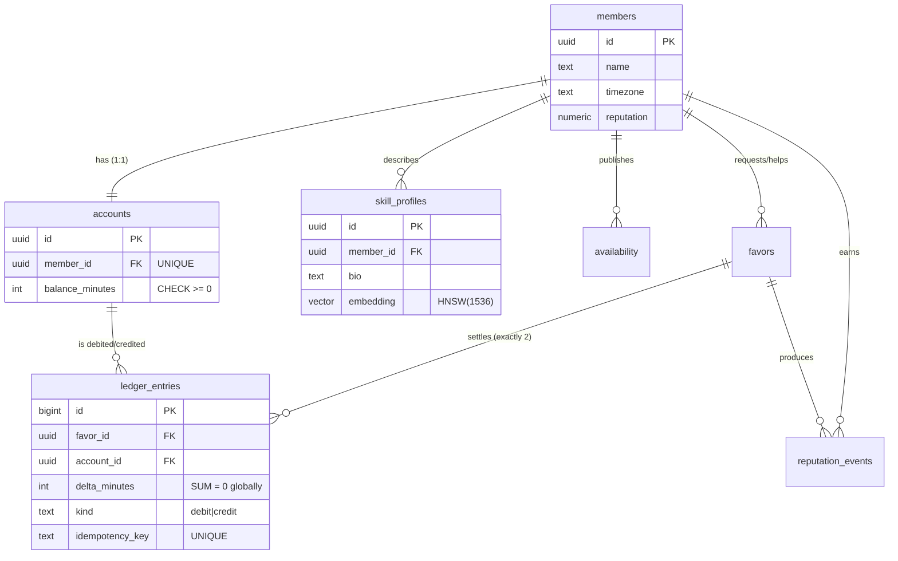
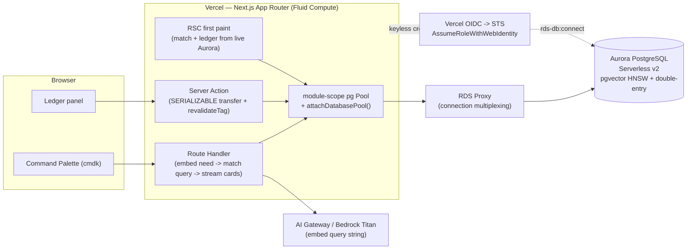

# HourBank — Deep Dive (Build-Ready)

**Purpose:** A complete, build-ready spec for **HourBank** (concept "Second Brain Market") — a self-balancing skills-and-favors **time-bank** for large communities, built on **Amazon Aurora PostgreSQL** so that two of Aurora's hardest superpowers — **pgvector HNSW semantic matching JOINed to relational filters** and a **SERIALIZABLE double-entry ledger that provably cannot overdraft** — co-exist in one engine, one query, one transaction.

> **Last updated / source:** 2026-06-18 · Generated from the H0 ideation workflow (`IDEATION.md` Phase 5 #4, and `/tmp/h0_deepdives.txt` → "DEEP DIVE: Second Brain Market [G10]").

---

## Table of Contents

1. [Snapshot](#1-snapshot)
2. [The load-bearing thesis](#2-the-load-bearing-thesis)
3. [Personas & jobs-to-be-done](#3-personas--jobs-to-be-done)
4. [Product spec](#4-product-spec)
5. [Data model](#5-data-model)
6. [System architecture](#6-system-architecture)
7. [AWS provisioning runbook](#7-aws-provisioning-runbook)
8. [Vercel / v0 build plan](#8-vercel--v0-build-plan)
9. [Submission artifacts for HourBank](#9-submission-artifacts-for-hourbank)
10. [Demo video storyboard](#10-demo-video-storyboard)
11. [Build plan & milestones](#11-build-plan--milestones)
12. [Scope triage](#12-scope-triage)
13. [Risk register](#13-risk-register)
14. [Test plan](#14-test-plan)
15. [Production-grade polish checklist](#15-production-grade-polish-checklist)
16. [Open decisions for this project](#16-open-decisions-for-this-project)
17. [Related docs](#17-related-docs)

---

## 1. Snapshot

| Field | Value |
|---|---|
| **Name** | HourBank (concept: "Second Brain Market") |
| **Track (submitted)** | **Monetizable B2C** (persona = an individual community member; monetization = premium matching / community-admin org subscription). Tag **Open Innovation** as the "novel currency" angle in the writeup without splitting demo focus. |
| **AWS DB** | **Amazon Aurora PostgreSQL Serverless v2** (PostgreSQL 16+), **pgvector 0.8.0** with HNSW index. Via **RDS Proxy** + **Vercel OIDC keyless STS**. |
| **Prize strategy** | Cash via **Technological Implementation + Originality**; credible on the $80k AWS-credits axis by making Aurora the protagonist. |
| **Composite score** | **8.51** (rank **#4** of 32). Sub-scores: AWS-DB-fit **10**, Tech **8.3**, Usefulness **9**, Design **8.7**, Originality **7.7**, Demoability **8**, Feasibility **6.3**, Scope-risk **6.3**, Load-bearing **9**, Avg-of-panel **8.0**. |
| **Single region** | `us-east-1` — correctness-first; no multi-region claims to over-promise. |

**Why it wins (one paragraph):** The 6,000+ field bifurcates into (a) pretty v0 apps with swappable backends and (b) "scales to millions" claims with no proof. HourBank sidesteps **both** by choosing the one workload where *exactly* Aurora PostgreSQL is correct — a free-text human need resolved by **pgvector HNSW ANN JOINed to three relational tables in a single query**, and an accepted favor settled by a **SERIALIZABLE double-entry transfer gated by `CHECK(balance_minutes >= 0)`** that the engine (not app code) refuses to overdraft. We don't claim user-scale we can't show; we claim **correctness we can prove**, backed by **50,000 real embedded profiles** so the HNSW `EXPLAIN ANALYZE` is genuine, and a **live double-spend rejection** on camera. The UI is courtroom evidence for both properties: a "Show the query" drawer surfaces the real SQL + EXPLAIN, and the overdraft attempt surfaces the actual Postgres `CHECK` error. Remove Aurora and both signature screens stop being expressible — that is the definition of load-bearing.

---

## 2. The load-bearing thesis

HourBank rests on **two hard properties that must co-exist in one engine, in one product** — and only Aurora PostgreSQL provides both:

1. **MATCHING** — a plain-English need ("someone who can review a Rust async lifetime bug, free this week, well-reputed, my timezone") becomes a query embedding and runs as a **pgvector HNSW ANN search** (`ORDER BY embedding <=> :q`) **JOINed in the SAME SQL** against availability windows, reputation, and timezone filters. Semantic relevance and relational predicates are resolved by one query planner, in one round trip.
2. **MONEY** — every accepted favor is a transfer in a **double-entry time-bank ledger**, executed as a **SERIALIZABLE transaction**; a `CHECK (balance_minutes >= 0)` constraint plus a debit+credit pair that must sum to zero makes it **provably impossible to spend hours you don't have**, even under a double-click or two concurrent bookings.

### The verbatim on-camera kill-shot

> **"DynamoDB has no vector-match query and can't express a non-negative double-entry ledger; DSQL has no pgvector and no constraint/trigger ecosystem — and this workload is single-region correctness-first, so DSQL's one unique property (multi-region active-active) buys nothing. This product needs semantic relevance *and* provable financial correctness in ONE engine, so it's Aurora PostgreSQL — and here's the live EXPLAIN and the live `CHECK` rejection to prove it."**

### Why the other two databases fail

| Database | Why it cannot run this product |
|---|---|
| **Amazon DynamoDB** | **No vector search** — there is no `ORDER BY embedding <=> :q` HNSW ANN primitive. **No ad-hoc relational match** — you cannot JOIN an ANN result against availability + reputation + timezone in one access pattern; you'd fan out N GetItems and rank in app code. Enforcing **non-negative double-entry** would require app-side conditional-write gymnastics (`attribute_not_exists` / `ConditionExpression` on a balance attribute) that still can't atomically write a *balanced debit+credit pair across two account items* with a global `SUM=0` invariant. The signature screens cannot be expressed. |
| **Amazon Aurora DSQL** | **No pgvector** (no extension ecosystem) → no semantic match at all. **No CHECK-constraint-as-product / no triggers / no FK** in the way this design leans on the engine to enforce invariants. **No SERIALIZABLE** isolation level (DSQL is snapshot-isolation OCC). And critically: the workload is **single-region correctness-first** — DSQL's *only* non-fakeable capability (multi-region active-active strong consistency) is **dead weight** here. Choosing DSQL would be reaching for the unicorn property the workload never exercises. |
| **Aurora PostgreSQL (chosen)** | Fuses **pgvector HNSW ANN + 3-table relational JOIN + filters in one query**, and **SERIALIZABLE + `CHECK` + `UNIQUE idempotency_key`** double-entry in one transaction. Both signature moments are expressible, provable, and screenshot-able from this engine alone. |

> **Kill-shot for the doc/diagram:** *The architecture diagram is the **DATA MODEL** (ER of `accounts`/`ledger_entries` + the pgvector `skill_profiles`), not boxes. The AWS-DB screenshot is a real `EXPLAIN ANALYZE` showing the HNSW Index Scan node **and** a `CHECK`-constraint rejection in the pg logs — most teams screenshot the RDS console; we screenshot the engine doing the work.*

### Judge Q&A rehearsal

| Anticipated hard question | Crisp answer |
|---|---|
| *"Is the overdraft rejection real, or an `if` in your app code?"* | "It's a Postgres `CHECK(balance_minutes >= 0)` constraint, enforced by the engine inside a `SERIALIZABLE` transaction. Watch — I'll surface the literal `23514 check_violation` error. App code never decides this." |
| *"Two people double-click / book concurrently — can both pass?"* | "No. The transfer runs at `SERIALIZABLE` isolation, so two bookings against the same balance can't both commit — one gets `40001 serialization_failure` and retries cleanly. A `UNIQUE idempotency_key` on `ledger_entries` makes a double-click a no-op." |
| *"Isn't this just a RAG / 'chat with docs' app with pgvector as an embedding store?"* | "No. Embeddings drive a **ranked human-matching query JOINed to three relational filters** — availability, reputation, timezone. The access pattern is non-trivial; there's no chatbot. The vector search is the *match*, not a side-feature." |
| *"Why minutes, not hours? Why integers?"* | "Money is `INTEGER` minutes everywhere — exact arithmetic. Floats would let rounding errors leak hours, and a time-bank that loses fractions of an hour is broken. We render as hours only at the UI layer." |
| *"How do you know the books balance globally, not just per-account?"* | "`SELECT SUM(delta_minutes) FROM ledger_entries` must equal `0` at all times — I pin it on screen as a live 'reconciled' assertion. Every favor inserts exactly two rows that sum to zero." |
| *"Is the 50k 'profiles' real or 12 seed rows?"* | "50,000 synthetic member profiles with realistic bios and **precomputed real embeddings** (batch-embedded offline, bulk-loaded via `COPY`). The `EXPLAIN ANALYZE` shows a true HNSW Index Scan over 50k vectors, not a seq scan over a toy set. Here's the row count." |
| *"Why Aurora Serverless v2 and not provisioned?"* | "ACUs scale **up** to build the HNSW index (the one bursty job), then scale **down** for cheap, low-QPS serving. Cost reasoning tied to the workload, not a sponsor checkbox." |
| *"Where do AWS credentials live?"* | "Nowhere long-lived. Vercel **OIDC keyless** → `AssumeRoleWithWebIdentity` → short-lived STS creds. Trust policy keyed to `oidc.vercel.com/<TEAM_SLUG>`. No AWS access keys in env." |

---

## 3. Personas & jobs-to-be-done

**Primary — "Maya," the community member (the lovable, demoable surface).**
A backend engineer in a **4,000-member developer community** (could equally be a 5,000-person alumni network, a large OSS org, a city mutual-aid group, or a company's internal skills marketplace). Maya has **6 banked hours** from helping others with Postgres, and right now needs **2 hours** of help debugging a Rust async lifetime issue.

- **JTBD:** *"When I have a specific need, I want to type it in plain English and instantly see ranked people who can actually help and are free now — so I can spend hours I've earned without posting into a noisy channel and waiting."*
- **JTBD:** *"When I spend my banked hours, I need to trust that I can never overdraft and the books can never be cheated — so the currency is worth holding."*

**Secondary / buyer — the community admin (B2C-adjacent monetization).**
Runs the community; buys HourBank as an org subscription (or premium matching). Cares that the time-currency is **provably sound** (audit, reconciliation) so members trust it, and that matching is **good enough that members actually transact** (engagement = retention).

**Tertiary (demo narrative only) — the helper "Sam."**
A second member who appears in the match results and receives the credit when Maya books. Used to dramatize the **balanced transfer** (Maya 2→0, Sam 4→6) and the **concurrent double-book** beat.

---

## 4. Product spec

### Core loop (numbered)

1. A member opens the **Command Palette** and types a need in plain English.
2. The server **embeds** the need (Vercel AI Gateway / Bedrock Titan), then runs **ONE Aurora SQL**: pgvector HNSW ANN over member skill-profile embeddings, JOINed to availability + reputation + timezone filters. Ranked matches **stream** back, each with a **similarity-score badge** (e.g. `0.91`) and a live availability chip ("Free now" / "Thu 2pm").
3. The member clicks a match and **proposes an offer of N hours**.
4. On **accept**, a **SERIALIZABLE transaction** debits the requester's account and credits the helper's account as a **balanced double-entry pair**, gated by `CHECK(balance_minutes >= 0)`. The Ledger panel animates both balances and the running **system total stays pinned at 0.00h**.
5. After the favor, both confirm completion → posts a **reputation event** (and optionally a settlement entry), feeding back into future match ranking.

> **The loop:** need → ranked human matches → booked transfer → reconciled ledger → reputation → better next match. **Every turn touches BOTH Aurora superpowers** — that is the point.

### Screen-by-screen breakdown

| Screen | Purpose | DB superpower it exposes |
|---|---|---|
| **Command Palette / Match (HERO)** | Type a free-text need → ranked human cards stream in with similarity badge, availability chip, rep stars, timezone. Collapsible **"Show the query"** drawer reveals the real pgvector + 3-table JOIN SQL and `EXPLAIN ANALYZE` with the **HNSW Index Scan node highlighted**. | pgvector HNSW ANN + relational JOIN |
| **Ledger panel** (split beside/below match) | Double-entry **T-account** view: your balance, the counterparty's balance, the **running system total pinned at 0.00h** with a green "reconciled" check. Animated number counters on transfer. A visible `Books balance: ∑ = 0` assertion. | SERIALIZABLE double-entry + global `SUM=0` |
| **Booking / Offer modal** | Pick hours; see your **projected balance after**. An inline guard previews *"You hold 2h, this needs 5h"* and the **Confirm flips to a hard rejection state** when you attempt the overdraft — surfacing the actual `CHECK`-constraint error from Postgres. | `CHECK(balance_minutes >= 0)` |
| **Profile / Skills** | A member's skill tags + the **natural-language bio that becomes their embedding**; availability calendar windows; reputation history; banked-hours balance and recent ledger entries (auditable). | Embedding source + audit |
| **Activity / Audit timeline** | Append-only feed of transfers and reputation events; each row clickable to its **double-entry pair** — demonstrates auditability and that every hour is accounted for. | `idempotency_key` + paired entries |

### Hero screen — states & micro-interactions

**Hero = Command Palette / Match.** Enumerated states:

- **Empty:** cmdk input focused, placeholder *"Describe what you need help with…"*, plus 3–4 example chips ("review a Rust async bug", "pair on a Terraform module", "explain a k8s networking issue"). Ledger panel shows Maya's real 6h balance. No spinner.
- **Loading / streaming:** on submit, render **skeleton result cards** immediately; cards **stream in** under `<Suspense>` as the Route Handler returns rows (embed → query → stream). A subtle "matching over 50,000 profiles…" micro-label.
- **Success:** ranked cards animate in, each with: similarity badge (`0.91`), availability chip (green "Free now" / neutral "Thu 2pm"), reputation stars, timezone label. The **"Show the query"** drawer is collapsed but pulses once to invite the click. Latency badge ("9ms over 50,000 profiles") in the drawer header.
- **Error:** if embed or query fails, an inline non-blocking error card — *"Couldn't reach the matcher. Retry?"* — never a raw stack trace. Ledger panel unaffected.
- **Zero-match:** *"No one matching that need is free right now — broaden your filters or post to the board."* (A judge *will* type something obscure.)

**Key micro-interactions:**
- **"Show the query" drawer:** slides open to reveal the **real SQL string + real `EXPLAIN ANALYZE`** fetched server-side (not a hardcoded screenshot), with the **HNSW Index Scan** line visually highlighted and the latency number on screen.
- **Animated ledger counters:** on accept, balances **count** (2 → 0, 4 → 6) rather than snapping; the system total holds `0.00h` with a green check that pulses "reconciled."
- **Overdraft guard → rejection:** the Confirm button morphs from "Confirm" → disabled "Insufficient balance" → on forced attempt, a designed rejection card surfacing the cleaned-up Postgres `CHECK` violation.
- **Optimistic accept:** the UI optimistically reflects the transfer, then reconciles to the committed transaction after the Server Action returns + `revalidateTag('ledger')`.

---

## 5. Data model

### Full DDL (Aurora PostgreSQL 16, pgvector 0.8.0)

```sql
CREATE EXTENSION IF NOT EXISTS vector;        -- pgvector 0.8.0
CREATE EXTENSION IF NOT EXISTS "uuid-ossp";   -- uuid generation (or pgcrypto/gen_random_uuid)

CREATE TABLE members (
  id          uuid PRIMARY KEY DEFAULT gen_random_uuid(),
  name        text NOT NULL,
  timezone    text NOT NULL,                  -- IANA tz, e.g. 'America/New_York'
  reputation  numeric NOT NULL DEFAULT 0
);

-- balance in MINUTES (integer) so time-currency math is exact; non-negative enforced AT THE ENGINE.
CREATE TABLE accounts (
  id              uuid PRIMARY KEY DEFAULT gen_random_uuid(),
  member_id       uuid NOT NULL UNIQUE REFERENCES members(id),
  balance_minutes integer NOT NULL DEFAULT 0,
  CONSTRAINT balance_non_negative CHECK (balance_minutes >= 0)   -- THE provable invariant
);

CREATE TABLE skill_profiles (
  id         uuid PRIMARY KEY DEFAULT gen_random_uuid(),
  member_id  uuid NOT NULL REFERENCES members(id),
  bio        text NOT NULL,                   -- the natural-language bio that becomes the embedding
  embedding  vector(1536) NOT NULL            -- pgvector column
);

-- HNSW ANN index (pgvector 0.8.0). cosine ops to match the <=> operator used in the query.
CREATE INDEX hnsw_profiles
  ON skill_profiles USING hnsw (embedding vector_cosine_ops)
  WITH (m = 16, ef_construction = 64);

CREATE TABLE availability (
  id         uuid PRIMARY KEY DEFAULT gen_random_uuid(),
  member_id  uuid NOT NULL REFERENCES members(id),
  starts_at  timestamptz NOT NULL,
  ends_at    timestamptz NOT NULL,
  is_open    boolean NOT NULL DEFAULT true
);
CREATE INDEX idx_availability_member_start ON availability (member_id, starts_at);

CREATE TABLE favors (
  id               uuid PRIMARY KEY DEFAULT gen_random_uuid(),
  requester_id     uuid NOT NULL REFERENCES members(id),
  helper_id        uuid NOT NULL REFERENCES members(id),
  requested_minutes integer NOT NULL CHECK (requested_minutes > 0),
  status           text NOT NULL DEFAULT 'proposed'
                   CHECK (status IN ('proposed','accepted','completed','cancelled')),
  created_at       timestamptz NOT NULL DEFAULT now()
);

-- DOUBLE-ENTRY: every accepted favor inserts EXACTLY TWO rows whose delta_minutes sum to zero.
-- The UNIQUE idempotency_key makes a double-click / retry a no-op (exactly-once transfer).
CREATE TABLE ledger_entries (
  id              bigint GENERATED ALWAYS AS IDENTITY PRIMARY KEY,
  favor_id        uuid NOT NULL REFERENCES favors(id),
  account_id      uuid NOT NULL REFERENCES accounts(id),
  delta_minutes   integer NOT NULL,           -- negative = debit, positive = credit
  kind            text NOT NULL CHECK (kind IN ('debit','credit')),
  created_at      timestamptz NOT NULL DEFAULT now(),
  idempotency_key text NOT NULL UNIQUE        -- exactly-once guard
);
CREATE INDEX idx_ledger_account ON ledger_entries (account_id);
CREATE INDEX idx_ledger_favor   ON ledger_entries (favor_id);

CREATE TABLE reputation_events (
  id         bigint GENERATED ALWAYS AS IDENTITY PRIMARY KEY,
  member_id  uuid NOT NULL REFERENCES members(id),
  favor_id   uuid NOT NULL REFERENCES favors(id),
  points     numeric NOT NULL,
  created_at timestamptz NOT NULL DEFAULT now()
);
```

**Engine-enforced invariants (NOT app code):**
- `accounts.balance_minutes >= 0` — `CHECK` constraint; the engine refuses an overdraft.
- The transfer runs at **`SERIALIZABLE`** isolation — two concurrent bookings against the same balance can't both pass the `CHECK`; the loser gets `40001`.
- `ledger_entries.idempotency_key UNIQUE` — exactly-once; a double-click is a no-op.
- Global reconciliation: `SELECT SUM(delta_minutes) FROM ledger_entries = 0` at all times.

### Access pattern → key/query table

| # | Access pattern | Query shape |
|---|---|---|
| 1 | **Ranked human match** (HERO) | `pgvector HNSW ANN` `ORDER BY embedding <=> :q` JOINed to `members` + `accounts` + `LEFT JOIN availability`, filtered by `timezone = ANY(:tzs)`, `LIMIT 10` |
| 2 | Member's current balance | `SELECT balance_minutes FROM accounts WHERE member_id = :id` (indexed by unique FK) |
| 3 | Propose favor | `INSERT INTO favors (...) VALUES (...) RETURNING id` |
| 4 | **Accept favor (transfer)** | `BEGIN ISOLATION LEVEL SERIALIZABLE` → `UPDATE accounts -N` (requester) + `UPDATE accounts +N` (helper) + 2× `INSERT ledger_entries` → `COMMIT` |
| 5 | System reconciliation | `SELECT SUM(delta_minutes) FROM ledger_entries` (must be `0`) |
| 6 | Activity row → double-entry pair | `SELECT * FROM ledger_entries WHERE favor_id = :id` (returns the 2 paired rows) |
| 7 | Show-the-query EXPLAIN | `EXPLAIN (ANALYZE, BUFFERS) <the match query>` (captured server-side, rendered in drawer) |

### Hero query #1 — the match (one query: ANN + 3-table JOIN + filter)

```sql
-- $1 = query embedding (vector(1536)); $2 = array of acceptable timezones (text[])
SELECT
  m.name,
  sp.bio,
  (1 - (sp.embedding <=> $1)) AS score,   -- cosine similarity, 1.0 = identical
  a.starts_at,
  m.reputation,
  acc.balance_minutes
FROM skill_profiles sp
JOIN members  m   ON m.id  = sp.member_id
JOIN accounts acc ON acc.member_id = m.id
LEFT JOIN availability a
       ON a.member_id = m.id
      AND a.is_open
      AND a.starts_at > now()
WHERE m.timezone = ANY($2)
ORDER BY sp.embedding <=> $1               -- HNSW Index Scan drives this; cosine distance
LIMIT 10;
```

> Run `EXPLAIN (ANALYZE, BUFFERS)` on exactly this statement. The plan must show an **`Index Scan using hnsw_profiles`** node (not a Seq Scan) and a sub-50ms total over 50k vectors. That plan, with the HNSW node highlighted, is the AWS-DB proof artifact. Tune `SET hnsw.ef_search` for recall-vs-latency; put the measured latency on screen ("9ms over 50,000 profiles" — label as a *measured* target).

### Hero transaction #2 — the SERIALIZABLE double-entry transfer

```sql
-- Run inside ONE SERIALIZABLE transaction. :req = requester account, :help = helper account,
-- :n = requested_minutes (positive integer), :favor = favor id, :idk = idempotency key prefix.
BEGIN ISOLATION LEVEL SERIALIZABLE;

  -- Debit the requester. The CHECK(balance_minutes >= 0) FIRES HERE if she can't afford it,
  -- raising SQLSTATE 23514 (check_violation) and aborting the whole transfer.
  UPDATE accounts
     SET balance_minutes = balance_minutes - :n
   WHERE id = :req;

  -- Credit the helper.
  UPDATE accounts
     SET balance_minutes = balance_minutes + :n
   WHERE id = :help;

  -- Two ledger rows whose delta_minutes sum to ZERO. idempotency_key UNIQUE => double-click is a no-op.
  INSERT INTO ledger_entries (favor_id, account_id, delta_minutes, kind, idempotency_key)
  VALUES (:favor, :req,  -:n, 'debit',  :idk || ':debit');

  INSERT INTO ledger_entries (favor_id, account_id, delta_minutes, kind, idempotency_key)
  VALUES (:favor, :help,  :n, 'credit', :idk || ':credit');

  UPDATE favors SET status = 'accepted' WHERE id = :favor;

COMMIT;
-- On 40001 (serialization_failure): the caller retries with the SAME idempotency_key (safe).
-- On 23514 (check_violation): hard reject — surface "Insufficient balance" to the UI, no retry.
-- On 23505 (unique_violation on idempotency_key): treat as already-applied — return success idempotently.
```

```ts
// Server Action wrapper (TypeScript, node-postgres). Maps SQLSTATE -> product behavior.
import { Pool } from "pg";
const pool = /* module-scope, see architecture */ globalThis.__pgPool as Pool;

const RETRYABLE = "40001"; // serialization_failure

export async function transfer(opts: {
  favorId: string; requesterAcct: string; helperAcct: string;
  minutes: number; idempotencyKey: string;
}): Promise<{ ok: true } | { ok: false; reason: "insufficient" | "conflict" }> {
  for (let attempt = 0; attempt < 4; attempt++) {
    const client = await pool.connect();
    try {
      await client.query("BEGIN ISOLATION LEVEL SERIALIZABLE");
      await client.query(
        "UPDATE accounts SET balance_minutes = balance_minutes - $1 WHERE id = $2",
        [opts.minutes, opts.requesterAcct]
      );
      await client.query(
        "UPDATE accounts SET balance_minutes = balance_minutes + $1 WHERE id = $2",
        [opts.minutes, opts.helperAcct]
      );
      await client.query(
        `INSERT INTO ledger_entries (favor_id, account_id, delta_minutes, kind, idempotency_key)
         VALUES ($1,$2,$3,'debit',$4), ($1,$5,$6,'credit',$7)`,
        [opts.favorId, opts.requesterAcct, -opts.minutes, `${opts.idempotencyKey}:debit`,
         opts.helperAcct, opts.minutes, `${opts.idempotencyKey}:credit`]
      );
      await client.query("UPDATE favors SET status = 'accepted' WHERE id = $1", [opts.favorId]);
      await client.query("COMMIT");
      return { ok: true };
    } catch (e: any) {
      await client.query("ROLLBACK").catch(() => {});
      if (e.code === "23514") return { ok: false, reason: "insufficient" }; // CHECK violation: hard reject
      if (e.code === "23505") return { ok: true };                          // idempotency_key dup: already applied
      if (e.code === RETRYABLE) continue;                                   // serialization fail: retry
      throw e;
    } finally {
      client.release();
    }
  }
  return { ok: false, reason: "conflict" };
}
```

### ER diagram



---

## 6. System architecture



**Request / data path:**
- **First paint:** the match + ledger screens are **React Server Components** that read live Aurora rows server-side — no client loading flash, no creds in the browser.
- **Match:** the Command Palette posts to a **Route Handler** that (a) embeds the free-text need via **AI Gateway / Bedrock Titan**, then (b) runs the pgvector + 3-table JOIN query and **streams** ranked cards back under `<Suspense>` (fallback = skeleton cards).
- **Mutations:** propose/accept are **Server Actions** that open a single `SERIALIZABLE` transaction (the `transfer()` above) and call `revalidateTag('ledger')` so balances reflect the authoritative DB immediately.

**OIDC keyless auth:** Vercel Functions authenticate to AWS via `@vercel/oidc-aws-credentials-provider` → `awsCredentialsProvider({ roleArn })` → short-lived **STS `AssumeRoleWithWebIdentity`** creds. IAM trust policy keyed to `oidc.vercel.com/<TEAM_SLUG>`. **No long-lived AWS keys** anywhere. Say it on camera.

**Connection pooling / Fluid Compute:** a single `pg Pool` at **module scope**, registered with **`attachDatabasePool(pool)`** from `@vercel/functions`, with **`fluid: true`** in `vercel.json` — Fluid Compute releases idle clients before the function suspends. This **kills the classic serverless "too many connections" Postgres failure** that murders demos. **RDS Proxy** sits in front for connection multiplexing under the spiky serverless caller.

**Real-time:** match results stream via `<Suspense>` + a streamed `ReadableStream` Route Handler. The ledger updates via optimistic UI + `revalidateTag('ledger')` after the Server Action commits (no websocket needed — the consistency model is "fresh on write," which `revalidateTag` matches exactly).

**Caching mirrors the consistency model:** read-heavy **match results are uncached** (freshness is the product — stale matches are useless). **Ledger writes** call `revalidatePath` / `revalidateTag('ledger')` so balances reflect the authoritative committed transaction immediately; optimistic UI reconciles to the commit. **Single region** (`us-east-1`) — correctness-first, no multi-region promises.

---

## 7. AWS provisioning runbook

> Region: **`us-east-1`** — the workload is correctness + relevance + provable ledger, **not** multi-region active-active (that would be the wrong reason to reach for DSQL, and DSQL can't run this query anyway). Single-region is correct and defensible. Keep all of this in one region to minimize latency from Vercel functions and to keep the cost story clean.

**Ordered steps:**

1. **Create the Aurora PostgreSQL Serverless v2 cluster** (engine PostgreSQL 16+). Set a sane **ACU min** (e.g. 0.5–1) so the on-camera first query isn't a cold scale-up, and a higher **ACU max** so the **HNSW index build** can scale up. Note the cost story: *"scale ACUs up to build the index, down for cheap serving."*
2. **Enable extensions:** connect via psql and run `CREATE EXTENSION vector;` (and `uuid-ossp`/`pgcrypto` for UUIDs). Verify `SELECT extversion FROM pg_extension WHERE extname='vector';` shows 0.8.0+.
3. **Create the schema** from the DDL in §5 — real `FOREIGN KEY`s, the `CHECK(balance_minutes >= 0)`, and `ledger_entries.idempotency_key UNIQUE`. These engine-enforced invariants are the whole point.
4. **Provision RDS Proxy** in front of the cluster (connection multiplexing for the serverless caller). Store the DB credentials in **Secrets Manager**; point the proxy at that secret.
5. **Create the IAM role** for the Vercel OIDC provider (trust policy below); attach a least-privilege policy granting `rds-db:connect` (IAM DB auth) and Secrets read.
6. **Build the HNSW index** on `skill_profiles.embedding` (after bulk-loading, see step 8 — building HNSW after `COPY` is far faster than incremental inserts).
7. **Set Vercel env vars** (per environment): `AWS_ROLE_ARN`, `AWS_REGION=us-east-1`, `RDS_PROXY_HOST`, `DB_NAME`, `DB_USER`. **No** `AWS_ACCESS_KEY_ID` / `AWS_SECRET_ACCESS_KEY` — OIDC keyless only. Embedding provider key (or AI Gateway binding) as `AI_GATEWAY_*`.
8. **Seed real volume** (the anti-"12 rows" move) — see strategy below.

### IAM role trust policy (Vercel OIDC) — JSON

```json
{
  "Version": "2012-10-17",
  "Statement": [
    {
      "Effect": "Allow",
      "Principal": {
        "Federated": "arn:aws:iam::<ACCOUNT_ID>:oidc-provider/oidc.vercel.com/<TEAM_SLUG>"
      },
      "Action": "sts:AssumeRoleWithWebIdentity",
      "Condition": {
        "StringEquals": {
          "oidc.vercel.com/<TEAM_SLUG>:aud": "https://vercel.com/<TEAM_SLUG>"
        },
        "StringLike": {
          "oidc.vercel.com/<TEAM_SLUG>:sub": "owner:<TEAM_SLUG>:project:hourbank:environment:*"
        }
      }
    }
  ]
}
```

### Least-privilege action list (attached policy)

```json
{
  "Version": "2012-10-17",
  "Statement": [
    {
      "Sid": "RdsIamDbConnect",
      "Effect": "Allow",
      "Action": "rds-db:connect",
      "Resource": "arn:aws:rds-db:us-east-1:<ACCOUNT_ID>:dbuser:<RESOURCE_ID>/<DB_USER>"
    },
    {
      "Sid": "ReadDbSecret",
      "Effect": "Allow",
      "Action": ["secretsmanager:GetSecretValue"],
      "Resource": "arn:aws:secretsmanager:us-east-1:<ACCOUNT_ID>:secret:hourbank/aurora-*"
    }
  ]
}
```

> If you embed via **Bedrock Titan** at request time, add `"bedrock:InvokeModel"` scoped to the Titan embeddings model ARN. If you instead use **Vercel AI Gateway**, no AWS Bedrock permission is needed.

### Env vars (Vercel)

| Var | Purpose |
|---|---|
| `AWS_ROLE_ARN` | The OIDC-assumable role ARN |
| `AWS_REGION` | `us-east-1` |
| `RDS_PROXY_HOST` | RDS Proxy endpoint |
| `DB_NAME`, `DB_USER` | Aurora database + IAM-auth user |
| `AI_GATEWAY_API_KEY` *(or Bedrock binding)* | embed the query string |
| *(intentionally absent)* | `AWS_ACCESS_KEY_ID` / `AWS_SECRET_ACCESS_KEY` — OIDC keyless |

### Seeding strategy

- **Target volume:** **~50,000** synthetic member skill-profiles with **realistic bios** and **precomputed real embeddings**, plus matching `accounts` (starting balances), `availability` windows, and a baseline of `favors` + `ledger_entries` (so `SUM(delta_minutes)=0` is real history, not empty). This beats the "pgvector over 5 docs faking it" failure mode and makes the HNSW `EXPLAIN ANALYZE` a true index scan.
- **Embed offline, not at seed-time-in-the-loop:** batch-embed the 50k bios via **Bedrock Titan** (or OpenAI) in chunks, write to a file, then bulk-load with **`COPY`** (orders of magnitude faster than per-row `INSERT`).
- **Build HNSW after load:** create `hnsw_profiles` *after* `COPY` so the index build is one bulk operation (ACUs scale up for it).

```ts
// seed/generate.ts — outline (pseudo/ts)
import { embedBatch } from "./embed";            // Bedrock Titan / OpenAI batch
import { writeCopyFile } from "./copy";          // emits TSV for COPY

const N = 50_000;
const SKILLS = ["Rust async", "Postgres tuning", "k8s networking", "React Server Components",
                "Terraform modules", "pgvector/HNSW", "iOS Swift concurrency", /* …~40 domains */];
const TZS = ["America/New_York","Europe/Berlin","Asia/Tokyo","America/Los_Angeles", /* … */];

// 1) Generate realistic, *varied* bios (templated over skill combos so embeddings cluster meaningfully)
const members = Array.from({ length: N }, (_, i) => {
  const primary = pick(SKILLS), secondary = pick(SKILLS);
  return {
    id: uuid(),
    name: fakeName(i),
    timezone: pick(TZS),
    reputation: gauss(50, 20),
    bio: `Backend engineer who loves ${primary} and ${secondary}. ` +
         `Happy to review ${primary} bugs and pair on ${secondary}.`,
    startBalanceMinutes: pick([0, 60, 120, 360, 600]),  // exact integer minutes
  };
});

// 2) Embed bios in batches (precompute; never embed 50k at query time)
const embeddings = await embedBatch(members.map(m => m.bio), { batchSize: 96 });

// 3) Emit COPY files for members, accounts, skill_profiles, availability
writeCopyFile("members.tsv",        members,    m => [m.id, m.name, m.timezone, m.reputation]);
writeCopyFile("accounts.tsv",       members,    m => [uuid(), m.id, m.startBalanceMinutes]);
writeCopyFile("skill_profiles.tsv", members,    (m, i) => [uuid(), m.id, m.bio, toVec(embeddings[i])]);
writeCopyFile("availability.tsv",   members,    m => randomOpenWindows(m.id));   // some "Free now"

// 4) psql: \COPY each table FROM the TSV; THEN CREATE INDEX hnsw_profiles; THEN ANALYZE;
// 5) Insert a few hundred historical favors + balanced ledger pairs so SUM(delta_minutes)=0 is real.
```

> **Pin "Maya" deterministically** in the seed: a known member with a **6h balance**, a known helper "Sam" with a **4h balance**, and a pre-validated need string that returns crisp ranked matches in <1s. Rehearse the demo on these exact rows.

---

## 8. Vercel / v0 build plan

### v0 prompt to generate the shell

> *"Build a clean, modern consumer web app called **HourBank** with shadcn/ui + Tailwind, dark mode by default. Two hero areas: (1) a **cmdk command palette** at the top where I type a free-text need; below it, **ranked result cards stream in** (skeleton loaders first), each card showing a person's name, a **similarity-score badge** (e.g. 0.91), an **availability chip** ("Free now" / "Thu 2pm"), reputation stars, and a timezone label; each card has a collapsible **"Show the query"** drawer that displays a monospace SQL block and an EXPLAIN plan. (2) A **double-entry ledger panel** beside the palette: a T-account view with my balance, the counterparty balance, **animated number counters**, and a pinned row "**Books balance: ∑ = 0**" with a green reconciled check. Add a **booking/offer modal** with an hours stepper that previews "You hold 2h, this needs 5h" and flips Confirm into a red rejection state. Consistent radius/spacing tokens, empty/loading/error states. Cleaner consumer aesthetic, not a control-room dashboard."*

Then **refine in-repo**: consistent design tokens, skeleton loaders on the streaming list, optimistic accept, the real `EXPLAIN` string in the drawer, the rejection state copy.

### `vercel.json`

```json
{
  "$schema": "https://openapi.vercel.sh/vercel.json",
  "functions": {
    "app/**": { "fluid": true }
  },
  "regions": ["iad1"]
}
```

> `fluid: true` keeps DB connections warm and lets `attachDatabasePool` release idle clients before suspend. `iad1` co-locates Vercel functions with Aurora in `us-east-1` for low DB round-trip latency.

### File tree

```
hourbank/
├─ app/
│  ├─ layout.tsx                 # dark mode default, shadcn theme
│  ├─ page.tsx                   # RSC first paint: match palette + ledger (live Aurora rows)
│  ├─ match/route.ts             # Route Handler: embed need -> match query -> stream cards
│  └─ actions/
│     ├─ transfer.ts             # "use server": SERIALIZABLE double-entry + revalidateTag
│     └─ propose.ts              # "use server": INSERT favor
├─ components/
│  ├─ command-palette.tsx        # cmdk input + streaming result list
│  ├─ result-card.tsx            # similarity badge, availability chip, rep stars
│  ├─ show-query-drawer.tsx      # real SQL + real EXPLAIN ANALYZE
│  ├─ ledger-panel.tsx           # T-account, animated counters, ∑=0 reconciled
│  └─ booking-modal.tsx          # hours stepper + overdraft rejection state
├─ lib/
│  ├─ db.ts                      # module-scope pg Pool + attachDatabasePool + OIDC creds
│  ├─ embed.ts                   # AI Gateway / Bedrock Titan embed(queryString)
│  └─ queries.ts                 # match SQL, EXPLAIN capture, reconciliation SUM
├─ seed/
│  ├─ generate.ts                # 50k profile + embedding generator (COPY files)
│  └─ load.sql                   # \COPY + CREATE INDEX hnsw_profiles + ANALYZE
├─ vercel.json
└─ package.json
```

### Key dependencies

`next` (App Router), `pg`, `@vercel/functions` (`attachDatabasePool`), `@vercel/oidc-aws-credentials-provider`, `@aws-sdk/client-sts` (assume-role via OIDC), `cmdk`, `shadcn/ui` + `tailwindcss`, AI SDK / AI Gateway client (or `@aws-sdk/client-bedrock-runtime` for Titan).

### `lib/db.ts` — module-scope pool + OIDC keyless

```ts
import { Pool } from "pg";
import { attachDatabasePool } from "@vercel/functions";
import { awsCredentialsProvider } from "@vercel/oidc-aws-credentials-provider";
import { Signer } from "@aws-sdk/rds-signer";

// One Pool per function instance (module scope). Reused across invocations on Fluid Compute.
const pool =
  (globalThis as any).__pgPool ??
  new Pool({
    host: process.env.RDS_PROXY_HOST,
    database: process.env.DB_NAME,
    user: process.env.DB_USER,
    max: 5,
    // IAM auth token via OIDC-assumed role (short-lived STS creds, no static keys)
    password: async () =>
      new Signer({
        region: process.env.AWS_REGION!,
        hostname: process.env.RDS_PROXY_HOST!,
        port: 5432,
        username: process.env.DB_USER!,
        credentials: awsCredentialsProvider({ roleArn: process.env.AWS_ROLE_ARN! }),
      }).getAuthToken(),
    ssl: { rejectUnauthorized: true },
  });

(globalThis as any).__pgPool = pool;
attachDatabasePool(pool); // release idle clients before the function suspends -> no "too many connections"

export { pool };
```

### `app/match/route.ts` — embed → match query → stream cards

```ts
import { pool } from "@/lib/db";
import { embed } from "@/lib/embed";
import { MATCH_SQL } from "@/lib/queries";

export async function POST(req: Request) {
  const { need, timezones } = await req.json();
  const queryEmbedding = await embed(need);                 // embed ONLY the query string at request time

  const stream = new ReadableStream({
    async start(controller) {
      const { rows } = await pool.query(MATCH_SQL, [toVector(queryEmbedding), timezones]);
      for (const r of rows) {
        controller.enqueue(new TextEncoder().encode(JSON.stringify(r) + "\n"));
      }
      controller.close();
    },
  });
  return new Response(stream, { headers: { "content-type": "application/x-ndjson" } });
}
```

### `app/actions/transfer.ts` — SERIALIZABLE Server Action

```ts
"use server";
import { revalidateTag } from "next/cache";
import { transfer } from "@/lib/queries"; // the retry-wrapped transfer() from §5

export async function acceptFavor(input: {
  favorId: string; requesterAcct: string; helperAcct: string;
  minutes: number; idempotencyKey: string;
}) {
  const res = await transfer(input);
  revalidateTag("ledger");          // balances reflect the authoritative committed transaction
  return res;                       // { ok:true } | { ok:false, reason:"insufficient"|"conflict" }
}
```

---

## 9. Submission artifacts for HourBank

**Required text:** name the AWS DB explicitly — **"Amazon Aurora PostgreSQL (Serverless v2) with pgvector 0.8.0."** Lead the description with the kill-shot from §2.

**Screenshot(s) proving AWS DB usage — capture these three (the engine doing the work, not just the console):**
- [ ] **`EXPLAIN (ANALYZE, BUFFERS)`** of the match query (§5 hero query #1) with the **`Index Scan using hnsw_profiles`** node visible, the 3-table JOIN, and a real latency number (sub-50ms over 50k vectors). *Primary artifact.*
- [ ] The **`CHECK(balance_minutes >= 0)` violation** — the actual Postgres error (`ERROR: new row for relation "accounts" violates check constraint "balance_non_negative"`, SQLSTATE `23514`) from the overdraft attempt, in psql or the returned error. *Proves the engine refuses the overdraft.*
- [ ] **`SELECT SUM(delta_minutes) FROM ledger_entries;`** returning `0` — books reconcile globally. *Proves double-entry integrity.*
- [ ] *(Supporting)* RDS console showing the Aurora Serverless v2 cluster + a CloudWatch ACU graph (the scale-up during HNSW build, then down). Secondary to the three above.

**Architecture diagram (required artifact) must contain:** the **DATA MODEL** front-and-center — the ER diagram of `accounts` / `ledger_entries` (annotated with `CHECK >= 0`, `SUM=0`, `idempotency_key UNIQUE`) and the pgvector `skill_profiles` (annotated `HNSW vector(1536)`) — *plus* the request path (Vercel RSC/Action → OIDC/STS → RDS Proxy → Aurora) and the **annotated hero query**. Most teams draw boxes; HourBank draws the data model.

**Vercel artifacts:** published **project URL** (must resolve and run with real data in a fresh incognito window — demo on the live URL, **never localhost**) and the **Vercel Team ID**. Put both on the closing title card of the video.

**Other required artifacts:** demo video **< 3 min**; working-app footage; written explanation of how Aurora is used (the two superpowers).

**Bonus (optional public build content):** publish one build-log thread on **(a)** the OIDC-keyless Vercel→Aurora auth path and **(b)** the SERIALIZABLE double-entry design — doubles as the bonus "public build content."

---

## 10. Demo video storyboard

**Total: 155s (under 180).** Demo on the **live Vercel URL** throughout — never localhost. **Single most memorable beat → the overdraft rejection (0:48–1:25):** the Confirm flips to a hard rejection surfacing the *literal* Postgres `CHECK(balance>=0)` error, narrated *"the engine, not my code, refuses the overdraft."*

| Time | On-screen | Voiceover | Cursor / camera |
|---|---|---|---|
| **0:00–0:18** (Hook) | Live Vercel URL loading the dashboard; Maya's real **6h balance** in the ledger panel. | *"In a 4,000-person community, HourBank lets you spend hours you've earned helping others — and the database makes it impossible to cheat the books or fake a match."* | Slow zoom onto the 6h balance; cursor idle. |
| **0:18–0:48** (Match) | Command Palette; type *"review a Rust async lifetime bug, free this week, my timezone."* Ranked cards **stream in** with badges (0.91, 0.88…), availability chips, rep stars. Open **"Show the query"** drawer → pgvector + 3-table JOIN SQL + `EXPLAIN ANALYZE`, **HNSW Index Scan node highlighted**, "9ms over 50,000 profiles." | *"One Aurora query: semantic match plus relational filters — availability, reputation, timezone. Here's the actual SQL and the live plan, an HNSW index scan over fifty thousand profiles."* | Type the need; cards stream; cursor opens the drawer, hovers the highlighted HNSW line. |
| **0:48–1:25** (Overdraft → correct booking) ⭐ | Maya holds **2h**; open booking modal; set **5h** → Confirm flips to **hard rejection** surfacing the real `CHECK(balance>=0)` error. Then set **2h** → accept: ledger animates **2→0** (Maya) / **4→6** (Sam); **system total pinned at 0.00h** with green reconciled check. | *"Maya holds two hours. She tries to spend five — and a SERIALIZABLE transaction with a CHECK constraint, the engine not my code, refuses the overdraft. Now she books the two hours she has: balances move, and the books stay pinned at zero."* | Drag the hours stepper to 5; click Confirm → red rejection; reset to 2; accept; watch counters animate. |
| **1:25–1:55** (Concurrency + audit) | Split-trigger **two concurrent bookings** against the same balance → one commits, one gets `40001` and **retries cleanly** (no double-spend). Click an **Activity** row → its matching **debit/credit pair**. Flash psql `SELECT SUM(delta_minutes) = 0`. | *"Two concurrent bookings against the same balance — exactly one commits, the other serialization-fails and retries. No double-spend. Every favor is a balanced pair, and across the whole community the books sum to zero."* | Click both "book" triggers; cursor points to the retry toast, then the paired entries, then the SUM=0. |
| **1:55–2:20** (Architecture + why-Aurora) | 10s animated diagram: Vercel (v0/Next.js, OIDC-keyless STS) → RDS Proxy → Aurora PG (pgvector HNSW + double-entry). | *"DynamoDB has no vector-match query and can't express a non-negative double-entry ledger; DSQL has no pgvector and no constraint ecosystem. This product needs both in one engine — so it's Aurora PostgreSQL."* | Diagram animates left-to-right along the data path. |
| **2:20–2:35** (Close) | Live URL + **Vercel Team ID** card; "Amazon Aurora PostgreSQL." | *"Front-end in minutes with v0, a back-end designed for scale and correctness. HourBank — where every hour is accounted for."* | Hold on the title card. |

---

## 11. Build plan & milestones

> **Spine-first.** Build the **SERIALIZABLE double-entry transfer + `CHECK(balance>=0)` + `idempotency_key`** *first* — it's the riskiest correctness claim and the most defensible demo moment, and it's pure SQL/Server Action work independent of embeddings.

| # | Milestone | Definition of done | Budget |
|---|---|---|---|
| **M1** | Schema + balanced-pair transfer | DDL applied to Aurora; `transfer()` runs; **in psql: overdraft → `23514`, valid transfer → `SUM(delta_minutes)=0`**. | ~0.5 day |
| **M2** | pgvector + HNSW + match query | `skill_profiles` + `hnsw_profiles`; seed a **few hundred** real embeddings; match query runs; `EXPLAIN` shows the HNSW Index Scan. | ~0.5 day |
| **M3** | Scale the seed | **50k** profiles with precomputed embeddings loaded via `COPY`; HNSW built; `EXPLAIN ANALYZE` shows a true index scan over 50k with a measured sub-50ms latency. | ~0.5 day |
| **M4** | v0 hero screens wired | Command Palette (streaming cards) + Ledger panel (animated counters, ∑=0) rendering live Aurora rows via RSC first paint + Server Actions. | ~1 day |
| **M5** | OIDC keyless → RDS Proxy → Aurora | A single Aurora query returns over **OIDC-assumed STS creds** through RDS Proxy with module-scope pool + `attachDatabasePool`; **no static keys**; survives a connection-storm probe. | ~0.5 day (do early, parallel) |
| **M6** | "Show the query" EXPLAIN drawer + concurrency double-book | Drawer renders **real** SQL + **real** `EXPLAIN ANALYZE` captured server-side; concurrent double-book demo shows one commit + one `40001` retry. | ~0.5 day |
| **M7** | Submission artifacts + deploy | Live URL resolves in incognito; the 3 screenshots captured; architecture diagram (data model); Team ID recorded; demo recorded on live URL. | ~0.5 day |

> **Checkpoint:** if **M1 (transaction)** and **M2/M3 (match query over real data)** both work by mid-build, the submission is already winning; everything after is polish.

---

## 12. Scope triage

**Cut in this order (protect the spine):**

1. The **completion/settlement reversal entry + reputation feedback loop** — stub reputation as a static seeded number; match ranking still works without live rep updates.
2. The **editable availability calendar UI** — keep availability as a simple chip filter on seeded windows; drop the editor.
3. The **cross-community Activity/Audit timeline** as a full feature — keep just enough to click **one** transfer and show its debit/credit pair.
4. The **live concurrency double-book demo** — if flaky on camera, replace with a **recorded terminal** showing the `40001` serialization error (still honest, still proves it).
5. Live request-time **Bedrock embedding of profiles** — all profile embeddings are precomputed offline anyway; only the single query string is embedded at request time.

**NEVER CUT (the five that ARE the thesis):**
- [ ] The **SERIALIZABLE + `CHECK(balance>=0)` overdraft rejection** (engine-enforced, surfaced live).
- [ ] The **pgvector HNSW + 3-table JOIN match query** with the **"Show the query" EXPLAIN drawer**.
- [ ] **Real 50k-row seed volume** with precomputed embeddings.
- [ ] The **live deployed Vercel URL** (demo on it, never localhost).
- [ ] **OIDC-keyless AWS auth** (no long-lived keys).

---

## 13. Risk register

| Risk | Likelihood | Impact | Mitigation |
|---|---|---|---|
| **Overdraft slips through** because the non-negative check was an app-code `if`, not an engine constraint (a judge double-clicks). | Medium | **Fatal** | Non-negative balance MUST be a Postgres `CHECK`; transfer MUST be `SERIALIZABLE` + `idempotency_key UNIQUE`. Test adversarially before recording (§14). |
| **Concurrent double-book both commit** (serialization not actually enforced). | Medium | **Fatal** | `SERIALIZABLE` isolation + retry-on-`40001`. Test: two parallel transfers vs a 2h balance → exactly one commits, `SUM=0` holds. |
| **Serverless connection exhaustion** ("too many connections") kills the demo mid-recording. | Medium | High | RDS Proxy + Fluid Compute (`fluid:true`) + module-scope `pg Pool` + `attachDatabasePool`; load-test before recording, not the night before. |
| **Embedding latency** makes the match feel slow on camera. | Medium | Medium | Precompute all 50k profile embeddings offline; embed only the single query string at request time; keep an ACU floor so the query is warm. |
| **HNSW recall too low** → the obvious-best helper isn't ranked #1 in the demo. | Low | Medium | Tune `ef_search` for recall-vs-latency; pre-validate the exact demo need string returns crisp top matches. |
| **"12 rows" credibility killer** — judge suspects toy data. | Low | High | Seed 50k real embedded profiles; show the row count; `EXPLAIN ANALYZE` shows a true index scan, not a seq scan. |
| **OIDC keyless not wired in time** → panic-revert to static AWS keys in env (a security-aware judge notices). | Medium | High | Prove **one OIDC-authed Aurora query** on day one (M5) before building UI. |
| **Dead/slow live URL** during judging. | Low | **Fatal** | Verify the published URL + Team ID in a fresh incognito window before recording; keep TTFB low via RSC first paint + warm ACU floor. |
| **Floats leak fractional hours** → wrong running total. | Low | High | Integer **minutes** everywhere; render as hours only at the UI. Test exact arithmetic. |

---

## 14. Test plan

### Correctness tests (the adversarial ones are non-negotiable)

```ts
// test/ledger.spec.ts — run against real Aurora (or a Postgres with the same DDL)

test("overdraft is rejected by the engine (23514), not app code", async () => {
  // Maya holds 120 minutes (2h). Try to transfer 300 (5h).
  const res = await transfer({ ...maya, minutes: 300, idempotencyKey: "t1" });
  expect(res).toEqual({ ok: false, reason: "insufficient" });
  const sum = await one("SELECT SUM(delta_minutes)::int AS s FROM ledger_entries");
  expect(sum.s).toBe(0); // books still balanced; nothing partially applied
});

test("ADVERSARIAL double-spend: two concurrent transfers vs a 2h balance => exactly one commits", async () => {
  // Fire BOTH in parallel against the same 120-minute balance, each asking 120.
  const [a, b] = await Promise.all([
    transfer({ ...maya, minutes: 120, idempotencyKey: "race-A" }),
    transfer({ ...maya, minutes: 120, idempotencyKey: "race-B" }),
  ]);
  const wins = [a, b].filter(r => r.ok).length;
  expect(wins).toBe(1);                                  // never 2 (no double-spend)
  const bal = await one("SELECT balance_minutes FROM accounts WHERE id=$1", [maya.requesterAcct]);
  expect(bal.balance_minutes).toBe(0);                   // exactly one debit applied
  const sum = await one("SELECT SUM(delta_minutes)::int AS s FROM ledger_entries");
  expect(sum.s).toBe(0);                                 // global reconciliation holds
});

test("double-click is a no-op (idempotency_key UNIQUE)", async () => {
  const r1 = await transfer({ ...maya, minutes: 60, idempotencyKey: "click-1" });
  const r2 = await transfer({ ...maya, minutes: 60, idempotencyKey: "click-1" }); // same key
  expect(r1.ok).toBe(true);
  expect(r2.ok).toBe(true);                              // returns success idempotently
  const debits = await one(
    "SELECT count(*)::int AS c FROM ledger_entries WHERE idempotency_key LIKE 'click-1%'");
  expect(debits.c).toBe(2);                              // exactly one debit + one credit, not four
});

test("ledger SK/order + global reconciliation over a few thousand transfers", async () => {
  await runRandomTransfers(3000);                        // mixed valid/invalid
  const sum = await one("SELECT SUM(delta_minutes)::int AS s FROM ledger_entries");
  expect(sum.s).toBe(0);                                 // SUM = 0 invariant survives volume
});

test("match query uses the HNSW index, not a seq scan", async () => {
  const plan = await many("EXPLAIN (ANALYZE) " + MATCH_SQL, [qVec, ["America/New_York"]]);
  const text = plan.map(r => r["QUERY PLAN"]).join("\n");
  expect(text).toMatch(/Index Scan using hnsw_profiles/);
  expect(text).not.toMatch(/Seq Scan on skill_profiles/);
});
```

### Load-test sketch (k6) — concurrency stress on the transfer path

```js
// k6 run hourbank-transfer.js  — hammer the booking endpoint to prove no double-spend under load
import http from "k6/http";
import { check } from "k6";

export const options = {
  scenarios: {
    contended_booking: {
      executor: "constant-vus",
      vus: 50,            // 50 virtual users racing for the SAME balance
      duration: "30s",
    },
  },
};

export default function () {
  const res = http.post(`${__ENV.BASE}/api/book`, JSON.stringify({
    requesterAcct: __ENV.MAYA_ACCT,    // all hit one balance on purpose
    helperAcct:    __ENV.SAM_ACCT,
    minutes: 60,
    idempotencyKey: `${__VU}-${__ITER}`,
  }), { headers: { "content-type": "application/json" } });

  // The invariant: the server NEVER lets the balance go negative; oversells must be 0.
  check(res, {
    "no 5xx (no unhandled serialization storm)": (r) => r.status < 500,
    "balance never negative (server enforces CHECK)": (r) =>
      JSON.parse(r.body).balanceMinutes >= 0,
  });
}
// After the run: assert SELECT SUM(delta_minutes)=0 and the balance equals exactly
// (start - committed_minutes); count of committed transfers must equal the balance delta.
```

---

## 15. Production-grade polish checklist

- [ ] Store balances and ledger deltas in **`INTEGER` minutes**, never floats; render as hours in the UI.
- [ ] The **"Show the query" drawer shows the REAL SQL string + REAL `EXPLAIN ANALYZE`** captured server-side — not a hardcoded screenshot (judges who click around will check).
- [ ] **Pin the system total to `0.00h`** with a **live "reconciled" assertion** derived from `SELECT SUM(delta_minutes)` — books visibly balance globally, not just per-account.
- [ ] Seed **50k** real embedded profiles via **`COPY`** so `EXPLAIN` shows a true **HNSW Index Scan**; tune `ef_search` for recall-vs-latency; put the **latency number on screen**.
- [ ] The **overdraft REJECTION is a designed state**, not a stack trace — surface the cleaned-up Postgres `CHECK` error message.
- [ ] **Optimistic UI on accept** that reconciles to the committed transaction; `revalidateTag('ledger')` after the Server Action so balances are authoritative.
- [ ] Keep all AWS SDK / `pg` calls in **Server Components / Route Handlers / Actions** — never leak creds client-side; use **OIDC-keyless STS** and say so on camera.
- [ ] **Dark mode** + consistent shadcn tokens + **animated number counters** on the ledger (sells "shippable product" over "hackathon demo").
- [ ] Real **empty / loading / error / zero-match / rejection** states on the match screen.
- [ ] Relative timestamps on activity rows; skeleton loaders on the streaming match list.
- [ ] Verify the **published Vercel URL + Team ID** in a fresh **incognito** window before recording; record on the **live URL**, never localhost.

---

## 16. Open decisions for this project

- [ ] **Embedding provider:** Vercel **AI Gateway** vs **Bedrock Titan** at request time. (Titan adds a `bedrock:InvokeModel` IAM grant; AI Gateway keeps AWS perms tighter.) Either is fine; pick one and keep model dims at **1536** to match the schema.
- [ ] **DB auth mode:** IAM DB auth via **`rds-db:connect`** (in DDL/runbook) vs pulling the password from **Secrets Manager**. IAM auth is the cleaner "no secret" story for the OIDC narrative — default to it.
- [ ] **Aesthetic confirmation:** IDEATION open-question #6 flags HourBank as the **cleaner consumer product** (vs control-room dashboards). Confirm the v0 prompt direction stays consumer, not data-dense.
- [ ] **Reputation in ranking:** is reputation a hard filter, a `LIMIT`-stage re-rank, or just displayed? For the demo, display + light tiebreak is enough; full re-ranking is a cut candidate (§12).
- [ ] **`ef_search` value:** choose the recall-vs-latency point and lock the number you put on screen (measure it; don't fabricate).
- [ ] **Track copy:** submit **B2C**, tag **Open Innovation** in the writeup — confirm no focus-splitting in the video.

---

## 17. Related docs

- **Index / navigation:** [`../README.md`](../README.md)
- **Judging model (what wins, failure modes, bonus):** [`../01-judging-model.md`](../01-judging-model.md)
- **Idea universe (22 serious concepts):** [`../02-idea-universe.md`](../02-idea-universe.md)
- **Generational ideas (incl. G10 HourBank source):** [`../03-generational-ideas.md`](../03-generational-ideas.md)
- **Scoring matrix (HourBank = 8.51, rank #4):** [`../04-scoring-matrix.md`](../04-scoring-matrix.md)
- **Recommendation & decision tree:** [`../05-recommendation.md`](../05-recommendation.md)
- **Open questions & assumptions:** [`../06-open-questions.md`](../06-open-questions.md)
- **Sibling deep dives:**
  - [`./01-recall.md`](./01-recall.md) — Recall (Aurora PostgreSQL, B2B) — the flagship; shares the pgvector + EXPLAIN-drawer playbook.
  - [`./02-provenance.md`](./02-provenance.md) — Provenance (DynamoDB, B2B/Open).
  - [`./03-sky-claim.md`](./03-sky-claim.md) — Sky Claim (DynamoDB, Open Innovation).
  - [`./05-settlement-floor.md`](./05-settlement-floor.md) — Settlement Floor (Aurora DSQL) — the *other* double-entry/no-double-pay story; contrast the SERIALIZABLE-vs-OCC trade-off.
- **Reference — AWS databases (Aurora PG vs DSQL vs DynamoDB; screenshot proofs):** [`../reference/aws-databases.md`](../reference/aws-databases.md)
- **Reference — Vercel/v0 playbook (OIDC, Fluid Compute, `attachDatabasePool`):** [`../reference/vercel-v0-playbook.md`](../reference/vercel-v0-playbook.md)
- **Reference — submission checklist:** [`../reference/submission-checklist.md`](../reference/submission-checklist.md)
