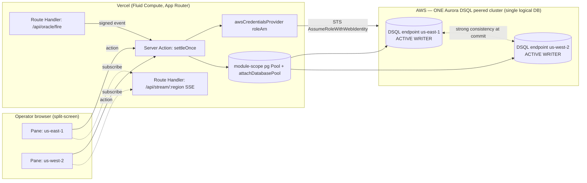

# Settlement Floor — Deep-Dive Build Doc

**Purpose:** The complete, build-ready spec for *Settlement Floor* — a parametric-microinsurance settlement engine that pays out micropolicies the instant an oracle fires, with **exactly-once, strongly-consistent, cross-region relational money movement** on a two-region peered **Amazon Aurora DSQL** cluster. This is the highest-ceiling / highest-risk concept in the portfolio: it wins the DSQL lane outright if the plumbing works, and collapses if it doesn't. Build the verdict before the courtroom.

> **Last updated / source:** H0 ideation workflow (Phase 5 deep dive + DB/Vercel/judging grounding). All latency, row-count, and ACU figures below are **targets to measure on the live cluster**, not facts — capture the real numbers on camera.

---

## Table of contents

- [1. Snapshot](#1-snapshot)
- [2. The load-bearing thesis](#2-the-load-bearing-thesis)
- [3. Personas & jobs-to-be-done](#3-personas--jobs-to-be-done)
- [4. Product spec](#4-product-spec)
- [5. Data model](#5-data-model)
- [6. System architecture](#6-system-architecture)
- [7. AWS provisioning runbook](#7-aws-provisioning-runbook)
- [8. Vercel / v0 build plan](#8-vercel--v0-build-plan)
- [9. Submission artifacts for this project](#9-submission-artifacts-for-this-project)
- [10. Demo video storyboard](#10-demo-video-storyboard)
- [11. Build plan & milestones](#11-build-plan--milestones)
- [12. Scope triage](#12-scope-triage)
- [13. Risk register](#13-risk-register)
- [14. Test plan](#14-test-plan)
- [15. Production-grade polish checklist](#15-production-grade-polish-checklist)
- [16. Open decisions for this project](#16-open-decisions-for-this-project)
- [17. Related docs](#17-related-docs)

---

## 1. Snapshot

| Field | Value |
|---|---|
| **Final name** | Settlement Floor |
| **Primary track** | Monetizable **B2B** (parametric microinsurance exchange) |
| **Secondary track** | **Million-scale global** (the active-active resilience story IS the scale evidence) |
| **AWS database** | **Amazon Aurora DSQL** — one multi-region peered cluster, `us-east-1` + `us-west-2`, both active writers, single logical database |
| **Frontend / deploy** | Next.js App Router on Vercel (v0-generated shell), Fluid Compute, OIDC-keyless AWS auth |
| **Composite score** | **8.41** (rank #5 of 32) — Technical 9.3, Design 7.7, Impact 8.7, Originality 8.0 |
| **Prize strategy** | Win the **DSQL lane outright**. Don't compete in the crowded pgvector/RAG or DynamoDB-leaderboard lanes. Be the only submission that puts DSQL's single non-fakeable capability on screen as a live exhibit. |

**Why it wins (one paragraph):** The field splits into *pretty-v0-apps-with-interchangeable-backends* and *scales-to-millions-with-no-proof*. Settlement Floor is neither. It chooses the one database property that is impossible to fake — **strongly-consistent relational writes from two active regions against one shared balance** — and stages it as courtroom evidence: a real double-pay race where one transaction commits green and the duplicate dies at commit with the literal `SQLSTATE 40001 serialization_failure`, plus a live region-kill where the surviving region keeps paying with zero failover. The DB is non-substitutable, the hard problem is visible, the scale claim is backed by 50,000 seeded policies and a CloudWatch latency panel, and the architecture diagram doubles as the data model. The judge-memory hook writes itself: *"the app where you watched a double-pay get rejected and a region die without missing a payment."*

---

## 2. The load-bearing thesis

### The verbatim on-camera kill-shot

> **"DynamoDB Global Tables' last-writer-wins can double-pay a shared capital pool across regions; single-region Aurora PostgreSQL physically cannot accept writes in two regions at once; only Aurora DSQL gives strongly-consistent active-active relational money movement — so the second debit of the same claim loses at commit with SQLSTATE 40001, and the pool can never go negative, across regions, with no two-phase-commit stall and no failover script."**

Lead the written submission description with this sentence. Say it almost verbatim at the 45-second and 165-second beats of the demo.

### Why the other two databases fail

A parametric payout is **money movement that must settle EXACTLY ONCE** even when two regional endpoints and a retrying oracle webhook observe the same event simultaneously and both attempt to debit one shared capital pool.

| Database | What it does on the shared-pool concurrent debit | Verdict |
|---|---|---|
| **DynamoDB Global Tables (MREC)** | Eventual, **last-writer-wins** replication. Two regions debit the shared pool concurrently → the later write silently overwrites the earlier → **double-pay against real capital**, no error raised. | ❌ Silently incorrect |
| **DynamoDB Global Tables (MRSC, GA Jun 2025)** | Strongly-consistent reads, but **key-value across exactly 3 regions** (3 replicas, or 2 + 1 witness). Cannot express a relational `accounts JOIN claims` debit atomically; `TransactWriteItems` is single-region-scoped. | ❌ Wrong shape (not relational, region-count fixed) |
| **Single-region Aurora PostgreSQL** | `SERIALIZABLE` and perfectly correct — but **one writer**. It physically cannot accept writes in two regions at once. A region outage = a failover wait, during which **payouts stop**. | ❌ Correct but not active-active; stalls on region loss |
| **Aurora DSQL** | Snapshot-isolation **OCC**: each transaction runs lock-free against its region's snapshot; conflicts are detected **at commit**. The second debit of the same pool/claim loses with a Postgres serialization failure (`SQLSTATE 40001` / `OC000`) and retries idempotently. The pool can never go negative; the claim can never pay twice; **no 2PC stall, no failover**. | ✅ The only fit |

The workload needs **strongly-consistent RELATIONAL writes from two active regions against one balance.** That intersection belongs to DSQL alone.

> **Kill-shot for the precision-minded judge:** DSQL *does* support basic and recursive CTEs and `CHECK` constraints — do **not** over-claim that it lacks them. The unimpeachable facts are: (a) no foreign keys, (b) no triggers, (c) no sequences, (d) no `SERIALIZABLE` (it offers snapshot isolation + OCC), and (e) a hard **10,000-row / 3,000-modification / 10 MiB per-transaction limit**. The schema is *designed around* all five — see [§5](#5-data-model).

### Judge Q&A rehearsal

| Anticipated hard question | Crisp answer |
|---|---|
| *"DSQL punishes high-frequency balance updates — won't your one pool row thrash under OCC?"* | "Exactly why we **write-shard** the pool into N=16 balance rows. Each payout debits one randomly-chosen `pool_shard`; solvency is `SUM(balance)`. Conflicts spread across N rows so 40001 stays rare. We made the failure visible: the heatmap's *unshard* toggle spikes the retry meter on camera." |
| *"Isn't this just Splitwise with two regions?"* | "No shared expenses, no users settling debts. This is **B2B settlement integrity** for an MGA running millions of micropolicies — the buyer is a treasury/claims manager whose nightmare is a retrying oracle double-paying real capital. The DB property *is* the product." |
| *"Couldn't a single-region Aurora with a unique constraint do exactly-once too?"* | "Single-region exactly-once, yes. But the moment that region degrades, payouts halt during failover. Our exhibit is the region kill: us-west-2 keeps clearing claims with **zero pause** while us-east-1 is dark, then sees every missed settlement instantly on reconnect. Single-writer Aurora cannot do that." |
| *"How do you know it's actually two regions and not a mocked div?"* | "Two real DSQL regional endpoints, region labels visible, gauge moving in lockstep within ~1s, and the AWS console screenshot showing both peered regions ACTIVE. The double-pay 40001 rejection and the region-kill continuity are things you **cannot fake** without a genuine peered cluster." |
| *"What's your measured commit latency?"* | "Live p50/p99 badge on screen, sourced from a CloudWatch custom metric — [target p50 < 15 ms intra-region, p99 < 60 ms; measure and label the real number]. We show the number; we don't claim it." |
| *"DSQL has no foreign keys — how is referential integrity guaranteed?"* | "Enforced in the Server Action transaction: we read the policy + pool inside the same transaction we write the settlement, so the snapshot is consistent and OCC rejects any conflicting concurrent mutation at commit. PKs are app-generated ULIDs (no sequences). `CHECK(balance >= 0)` and `UNIQUE(oracle_event_id)` carry the invariants the DB *can* enforce." |
| *"Why not batch thousands of payouts per transaction for throughput?"* | "DSQL caps a transaction at ~10k rows / 10 MiB. Each settlement touches ~5 rows, well under the cap. Batching would risk the limit AND widen the OCC conflict surface. We keep transactions small and concurrent — that's the right shape for OCC." |

---

## 3. Personas & jobs-to-be-done

| Persona | Role | Job-to-be-done | What they buy |
|---|---|---|---|
| **Priya — Capital/Treasury Manager at an MGA** (primary buyer, B2B) | Owns the capital pool backing flight-delay / crop-weather / event-cancellation parametric lines. Sells millions of low-value policies globally. | "When an oracle fires, pay the right policyholders **exactly once** and never let a retrying webhook or a regional failover double-pay or stall — my pool's solvency and our regulator standing depend on it." | **Provable, regulator-defensible exactly-once settlement** that keeps paying through a regional outage. |
| **Marcus — Operations / Settlement Analyst** (secondary viewer in demo) | Watches the live Settlement Floor during a payout storm. | "I need to SEE, in real time, that the pool is solvent and every payout settled exactly once across both regions — and prove it if compliance asks." | A live, auditable settlement floor with an append-only double-entry ledger that reconciles to zero. |
| **Dana — Reinsurer / Capital Provider** (tertiary, the funding story) | Provides the capital behind the pool; cares about tail risk. | "Show me the system can't oversell my capital even under a globally-concurrent claim spike." | Capital-adequacy gauge + the *pool-never-went-negative* assertion as a continuous, on-screen invariant. |

**JTBD one-liner:** *Settle parametric payouts exactly once, globally, without a treasurer ever fearing a double-pay or a failover gap.*

---

## 4. Product spec

### Core loop (numbered)

1. **Oracle event fires.** A flight delay crosses a threshold (or a weather/quake parametric trigger). A signed webhook is posted to the **nearest** regional endpoint.
2. **Server Action opens ONE DSQL transaction** that:
   1. **Idempotency-guards** on `oracle_event_id` — `INSERT` a `settlement` row whose `UNIQUE(oracle_event_id)` will lose at commit if a peer region already claimed it.
   2. **JOINs** `policy → coverage_pool` to find matching `ACTIVE` policies and the payout amount.
   3. **Debits one randomly-chosen `pool_shard` row** with `CHECK(balance >= 0)` (write-sharding to dodge the hot-row OCC death spiral).
   4. **Flips the policy** `ACTIVE → PAID` and bumps its `version`.
   5. **Writes the append-only ledger** (balanced `POOL` debit + `PAYOUT` credit netting to zero).
   6. **COMMIT.**
3. **Commit succeeds in one region** and is **strongly consistent** in the peer. The duplicate webhook's transaction hits `40001` at commit; the app catches it, sees the settlement already exists, and **returns the same result idempotently** — exactly-once.
4. **Both region panes reflect identical state** within ~1s: the policy card flips `ACTIVE → PAID` and the Capital-Adequacy gauge ticks down in lockstep on both tabs.

> **Loop = oracle fires → settle-once → both regions reflect identical state → pool stays solvent.**

### Screen-by-screen breakdown

| Screen | Purpose | Key contents |
|---|---|---|
| **① Settlement Floor (HERO, split-screen)** | Show two real regions settling one shared pool in lockstep. | Left pane `us-east-1`, right pane `us-west-2`, both bound to the SAME pool. Center: live oracle-event ticker raining events. Policy cards flip `ACTIVE→PAID` with animated badges. Capital-Adequacy gauge (`SUM(shard.balance) / reserved_exposure`) decrements on **both** panes within ~1s. Persistent badge: measured **p50/p99 commit latency** + a **"globally-consistent settlements committed"** counter. |
| **② Double-Pay Courtroom (THE EXHIBIT)** | Prove exactly-once at commit. | A **"Fire same event into BOTH regions"** button. Two concurrent transactions race the same `oracle_event_id` against the same pool shard. UI shows one **COMMITTED** (green) and one **REJECTED** with the literal `SQLSTATE 40001 serialization_failure (OC000)` in a monospace code chip, plus a running **"pool never went negative"** assertion that stays green. *This is the screen that wins.* |
| **③ Region Kill / Resilience panel** | Prove active-active continuity. | A toggle that **severs the us-east-1 connection** mid-storm. The us-east-1 pane shows `endpoint unreachable`; us-west-2 **keeps settling** with no pause; the committed counter keeps climbing. On reconnect, us-east-1 **instantly** reflects every settlement it missed (strongly consistent, no replay UI). Narrated: *"no failover, no data loss, no stale read."* |
| **④ Pool & Ledger drawer** | Prove real relational work. | Click any `PAID` policy → a detail sheet runs a real multi-table read (`policy JOIN coverage_pool JOIN pool_shard JOIN ledger_entry`) showing the append-only ledger lines reconciling the debit to zero — relational, not a key lookup. |
| **⑤ Pool Shard heatmap (senior-intent)** | Make the hot-row problem legible. | A grid of the N shard rows lighting up as writes spread. A **"unshard"** toggle that visibly **spikes the OCC 40001 retry-rate meter** — turning the failure you designed around into a clickable exhibit. |

### Hero screen states & micro-interactions (Screen ①)

| State | UI |
|---|---|
| **Empty** | Both panes show the seeded pool at full capital, gauge at ~100%, ticker idle with a *"Start oracle storm"* CTA. Skeleton-free. |
| **Loading (first paint)** | Server Component renders real DSQL data on the server; no client spinner for initial state. Per-card settle shows a 200ms shimmer only on the flipping card. |
| **Active (storm running)** | Events rain in the center column; cards flip with an optimistic badge then confirm on commit; gauge animates a counting number down; latency badge updates p50/p99 every commit; committed counter ticks up. |
| **Error (commit conflict / transient)** | On a `40001` that is NOT a duplicate (transient shard conflict), the card briefly shows a yellow *"retrying…"* chip, then settles green after exponential-backoff retry. No data loss visible. |
| **Success (settled)** | Card is green `PAID` with a *"committed Xs ago"* relative timestamp and the committing region label (`@ us-west-2`). Gauge reflects the debit on both panes. |

**Micro-interactions:** optimistic card flip on settle → confirm/rollback on commit; animated counting gauge (not a jump); the `40001` code chip uses a monospace font and a red border; *"pool never went negative"* assertion is a persistent green pill that would flip red on any violation (it never does); dark mode default; relative timestamps that tick.

---

## 5. Data model

DSQL has **no foreign keys, no triggers, no sequences, no `SERIALIZABLE` isolation**, and a **10k-row / 3k-modification / 10 MiB per-transaction** cap. The schema is designed around all of these: referential integrity lives in the Server Action; PKs are app-generated **ULIDs**; exactly-once is a `UNIQUE` constraint + a `40001`-catch; the capital pool is **write-sharded**; every settlement touches ~5 rows.

### DDL (Aurora DSQL — single logical database, written from both regions)

```sql
-- One row per insurance line. NOT debited directly (that would be the hot row).
CREATE TABLE coverage_pool (
  pool_id          UUID         NOT NULL DEFAULT NULL,  -- app-generated ULID; no sequences
  name             TEXT         NOT NULL,
  total_capital    NUMERIC(18,2) NOT NULL,
  reserved_exposure NUMERIC(18,2) NOT NULL DEFAULT 0,
  created_at       TIMESTAMPTZ  NOT NULL DEFAULT now(),
  PRIMARY KEY (pool_id)
);

-- WRITE-SHARDING: each pool's capital is split across N shards (e.g. 16).
-- A payout debits ONE randomly-chosen shard; solvency = SUM(balance) across shards.
-- This spreads concurrent debits across N rows so OCC conflicts stay rare.
CREATE TABLE pool_shard (
  shard_id     UUID          NOT NULL,
  pool_id      UUID          NOT NULL,
  shard_index  INT           NOT NULL,
  balance      NUMERIC(18,2)  NOT NULL,
  PRIMARY KEY (shard_id),
  CHECK (balance >= 0)              -- the DB enforces non-negative capital
);
CREATE INDEX idx_pool_shard_pool ON pool_shard (pool_id, shard_index);

CREATE TABLE policy (
  policy_id        UUID          NOT NULL,
  pool_id          UUID          NOT NULL,
  holder_ref       TEXT          NOT NULL,
  trigger_type     TEXT          NOT NULL,      -- 'FLIGHT_DELAY' | 'WEATHER' | 'QUAKE'
  trigger_threshold NUMERIC       NOT NULL,
  payout_amount    NUMERIC(18,2)  NOT NULL,
  region_origin    TEXT          NOT NULL,
  status           TEXT          NOT NULL DEFAULT 'ACTIVE'
                     CHECK (status IN ('ACTIVE','PAID','EXPIRED')),
  version          INT           NOT NULL DEFAULT 0,  -- optimistic version, app-bumped
  PRIMARY KEY (policy_id)
);
CREATE INDEX idx_policy_pool_status ON policy (pool_id, status);
CREATE INDEX idx_policy_trigger     ON policy (trigger_type);

-- The idempotency anchor. PK is the dedupe key: a 2nd webhook with the same id loses.
CREATE TABLE oracle_event (
  oracle_event_id  TEXT          NOT NULL,      -- e.g. 'FLIGHT:UA123:2026-06-18:DELAY'
  source           TEXT          NOT NULL,
  trigger_type     TEXT          NOT NULL,
  observed_value   NUMERIC       NOT NULL,
  fired_at         TIMESTAMPTZ   NOT NULL DEFAULT now(),
  PRIMARY KEY (oracle_event_id)
);

-- UNIQUE(oracle_event_id) is what makes the duplicate webhook LOSE at commit (40001).
CREATE TABLE settlement (
  settlement_id    UUID          NOT NULL,
  oracle_event_id  TEXT          NOT NULL,
  policy_id        UUID          NOT NULL,
  pool_id          UUID          NOT NULL,
  shard_id         UUID          NOT NULL,
  amount           NUMERIC(18,2)  NOT NULL,
  committed_region TEXT          NOT NULL,      -- 'us-east-1' | 'us-west-2'
  committed_at     TIMESTAMPTZ   NOT NULL DEFAULT now(),
  PRIMARY KEY (settlement_id),
  UNIQUE (oracle_event_id)                      -- EXACTLY-ONCE per event, enforced by DB
);

-- Append-only double-entry: each settlement writes a balanced POOL-debit + PAYOUT-credit
-- pair that must net to zero.
CREATE TABLE ledger_entry (
  entry_id      UUID          NOT NULL,
  settlement_id UUID          NOT NULL,
  account       TEXT          NOT NULL CHECK (account   IN ('POOL','PAYOUT')),
  direction     TEXT          NOT NULL CHECK (direction IN ('DEBIT','CREDIT')),
  amount        NUMERIC(18,2)  NOT NULL,
  created_at    TIMESTAMPTZ   NOT NULL DEFAULT now(),
  PRIMARY KEY (entry_id)
);
CREATE INDEX idx_ledger_settlement ON ledger_entry (settlement_id);
```

> **DSQL note:** `DEFAULT NULL` on a UUID PK is a placeholder — DSQL has no `gen_random_uuid()` guarantee across versions and **no sequences**, so PKs are generated in the app as ULIDs and passed explicitly in every `INSERT`. Do not rely on server-side defaults for identity.

### Access-pattern → query table

| Access pattern | Primary table / index | Operation |
|---|---|---|
| Find ACTIVE policies matching a trigger | `idx_policy_pool_status` (`pool_id, status`) + filter on `trigger_type` | `SELECT` inside settle txn |
| Dedupe an oracle event | `oracle_event` PK / `settlement.UNIQUE(oracle_event_id)` | `INSERT … ` (loses at commit if dup) |
| Debit one capital shard | `pool_shard` PK (random `shard_index` → `shard_id`) | `UPDATE … SET balance = balance - $amt WHERE shard_id = $sid` (CHECK ≥ 0) |
| Compute pool solvency (gauge) | `idx_pool_shard_pool` | `SELECT SUM(balance) FROM pool_shard WHERE pool_id = $p` |
| Render ledger drawer | `idx_ledger_settlement` + joins | 4-table `JOIN` read |
| Recent settlements (SSE feed) | `settlement` ordered by `committed_at` | `SELECT … ORDER BY committed_at DESC LIMIT N` |

### The hero query — the exactly-once settle transaction (TypeScript over `pg`)

```ts
// app/lib/settle.ts  — runs inside a Vercel Server Action / Route Handler.
import { ulid } from "ulidx";
import type { PoolClient } from "pg";
import { getPool } from "@/lib/db";          // module-scope pg Pool, see §6
import { pickRandomShardId } from "@/lib/shards";

const SERIALIZATION_FAILURE = "40001";        // Postgres OC000 / serialization_failure

export type SettleResult =
  | { status: "COMMITTED"; settlementId: string; region: string }
  | { status: "ALREADY_SETTLED"; settlementId: string; region: string };

export async function settleOnce(
  oracleEventId: string,
  policyId: string,
  poolId: string,
  payoutAmount: string,        // string to preserve NUMERIC precision
  region: string,
  attempt = 0,
): Promise<SettleResult> {
  const pool = getPool();
  const client = await pool.connect();
  try {
    await client.query("BEGIN");

    // (1) idempotency INSERT — UNIQUE(oracle_event_id) will lose at COMMIT if a peer
    //     region already settled this event. We also INSERT the oracle_event row.
    const settlementId = ulid();
    const shardId = await pickRandomShardId(client, poolId);   // random of N=16

    await client.query(
      `INSERT INTO oracle_event (oracle_event_id, source, trigger_type, observed_value)
       VALUES ($1,'ORACLE','FLIGHT_DELAY',0)
       ON CONFLICT (oracle_event_id) DO NOTHING`,
      [oracleEventId],
    );

    // (2) JOIN policy -> coverage_pool inside the same snapshot (referential integrity
    //     enforced here because DSQL has no FK).
    const { rows: pol } = await client.query(
      `SELECT p.policy_id, p.payout_amount, p.status, p.version
         FROM policy p
         JOIN coverage_pool cp ON cp.pool_id = p.pool_id
        WHERE p.policy_id = $1 AND p.pool_id = $2 AND p.status = 'ACTIVE'`,
      [policyId, poolId],
    );
    if (pol.length === 0) {
      await client.query("ROLLBACK");
      // already paid by the peer, or expired — treat as idempotent no-op
      return await fetchExisting(client, oracleEventId, region);
    }

    // (3) debit ONE random shard with CHECK(balance>=0) — write-sharding.
    const debit = await client.query(
      `UPDATE pool_shard
          SET balance = balance - $1
        WHERE shard_id = $2 AND balance >= $1
      RETURNING shard_id`,
      [payoutAmount, shardId],
    );
    if (debit.rowCount === 0) {
      await client.query("ROLLBACK");
      throw new Error("INSUFFICIENT_CAPITAL_ON_SHARD"); // caller may re-pick a shard
    }

    // (4) flip policy ACTIVE -> PAID with optimistic version bump.
    await client.query(
      `UPDATE policy SET status = 'PAID', version = version + 1
        WHERE policy_id = $1 AND version = $2 AND status = 'ACTIVE'`,
      [policyId, pol[0].version],
    );

    // (5) settlement row (UNIQUE oracle_event_id) + balanced double-entry ledger.
    await client.query(
      `INSERT INTO settlement
         (settlement_id, oracle_event_id, policy_id, pool_id, shard_id, amount, committed_region)
       VALUES ($1,$2,$3,$4,$5,$6,$7)`,
      [settlementId, oracleEventId, policyId, poolId, shardId, payoutAmount, region],
    );
    await client.query(
      `INSERT INTO ledger_entry (entry_id, settlement_id, account, direction, amount) VALUES
         ($1,$2,'POOL','DEBIT',$4), ($3,$2,'PAYOUT','CREDIT',$4)`,
      [ulid(), settlementId, ulid(), payoutAmount],
    );

    // (6) COMMIT — OCC conflict is detected HERE, not earlier.
    await client.query("COMMIT");
    return { status: "COMMITTED", settlementId, region };
  } catch (err: any) {
    await safeRollback(client);

    if (err?.code === SERIALIZATION_FAILURE) {
      // The duplicate webhook / cross-region race lost at commit.
      const existing = await fetchExisting(client, oracleEventId, region);
      if (existing) return existing;                 // exactly-once: return the winner
      if (attempt < 5) {                             // transient shard conflict: retry
        await backoff(attempt);
        return settleOnce(oracleEventId, policyId, poolId, payoutAmount, region, attempt + 1);
      }
    }
    throw err;
  } finally {
    client.release();
  }
}

async function fetchExisting(client: PoolClient, oracleEventId: string, region: string) {
  const { rows } = await client.query(
    `SELECT settlement_id FROM settlement WHERE oracle_event_id = $1`, [oracleEventId]);
  return rows.length
    ? ({ status: "ALREADY_SETTLED", settlementId: rows[0].settlement_id, region } as const)
    : null;
}
const backoff = (n: number) => new Promise(r => setTimeout(r, 25 * 2 ** n + Math.random() * 25));
async function safeRollback(c: PoolClient) { try { await c.query("ROLLBACK"); } catch {} }
```

### The ledger-drawer relational read (proves real JOINs)

```sql
SELECT s.settlement_id, s.committed_region, s.committed_at,
       p.holder_ref, p.trigger_type, p.payout_amount,
       cp.name AS pool_name,
       sh.shard_index,
       le.account, le.direction, le.amount
  FROM settlement   s
  JOIN policy        p  ON p.policy_id  = s.policy_id
  JOIN coverage_pool cp ON cp.pool_id   = s.pool_id
  JOIN pool_shard    sh ON sh.shard_id  = s.shard_id
  JOIN ledger_entry  le ON le.settlement_id = s.settlement_id
 WHERE s.settlement_id = $1
 ORDER BY le.direction;          -- DEBIT then CREDIT, nets to zero
```

### ER diagram

```mermaid
erDiagram
    coverage_pool ||--o{ pool_shard   : "split into N shards"
    coverage_pool ||--o{ policy       : "covers"
    policy        ||--o| settlement   : "paid by (exactly once)"
    oracle_event  ||--o| settlement   : "triggers (UNIQUE)"
    pool_shard    ||--o{ settlement   : "debited from"
    settlement    ||--o{ ledger_entry : "double-entry (nets to 0)"

    coverage_pool { uuid pool_id PK; numeric total_capital; numeric reserved_exposure }
    pool_shard    { uuid shard_id PK; uuid pool_id; int shard_index; numeric balance }
    policy        { uuid policy_id PK; uuid pool_id; text status; int version; numeric payout_amount }
    oracle_event  { text oracle_event_id PK; text trigger_type; numeric observed_value }
    settlement    { uuid settlement_id PK; text oracle_event_id UK; text committed_region }
    ledger_entry  { uuid entry_id PK; uuid settlement_id; text account; text direction; numeric amount }
}
```

> **No FK lines are constraints** — DSQL has no FKs. The relationships above are *enforced in the Server Action's single transaction*. The diagram documents the logical model; the integrity comes from the snapshot read + OCC at commit.

---

## 6. System architecture



### Request / data path (the critical path)

1. Oracle simulator (`/api/oracle/fire`) posts a **signed** event to the Server Action bound to a chosen region (`NEXT_PUBLIC_REGION` → server-side endpoint map).
2. Server Action acquires a client from the **module-scope `pg` Pool**, runs the `settleOnce` transaction against that region's DSQL endpoint.
3. `BEGIN → idempotency INSERT → policy/pool JOIN → shard debit (CHECK ≥ 0) → policy UPDATE → ledger INSERT → COMMIT`, wrapped in the `40001` catch-and-idempotent-return.
4. On commit, `revalidateTag('settlements')` invalidates the recent-settlements cache; the per-region **SSE** Route Handler tails recent settlements and pushes the new state to **both** panes within ~1s — so the peer region reflects the cross-region write live.

### OIDC keyless auth (do this first)

```ts
// app/lib/db.ts
import { awsCredentialsProvider } from "@vercel/oidc-aws-credentials-provider";
import { DsqlSigner } from "@aws-sdk/dsql-signer";
import { Pool } from "pg";
import { attachDatabasePool } from "@vercel/functions";

const REGION = process.env.DSQL_REGION!;                 // 'us-east-1' | 'us-west-2'
const ENDPOINT = process.env.DSQL_ENDPOINT!;             // region's cluster endpoint host
const ROLE_ARN = process.env.AWS_ROLE_ARN!;

let _pool: Pool | null = null;
export function getPool(): Pool {
  if (_pool) return _pool;
  _pool = new Pool({
    host: ENDPOINT,
    port: 5432,
    database: "postgres",
    user: "admin",
    ssl: { rejectUnauthorized: true },
    max: 4,                          // small per-instance cap; Fluid Compute reuses warm
    // password is generated PER CONNECTION via DsqlSigner (short-lived auth token)
    password: async () => {
      const signer = new DsqlSigner({
        hostname: ENDPOINT,
        region: REGION,
        credentials: awsCredentialsProvider({ roleArn: ROLE_ARN }), // STS web-identity
      });
      return await signer.getDbConnectAdminAuthToken();
    },
  });
  attachDatabasePool(_pool);         // release idle clients before the function suspends
  return _pool;
}
```

- **No long-lived AWS keys.** `awsCredentialsProvider({ roleArn })` mints short-lived STS creds via `AssumeRoleWithWebIdentity`; the DSQL admin auth token is generated per connection by `DsqlSigner`.
- **IAM trust policy keyed to `oidc.vercel.com/[TEAM_SLUG]`** — see [§7](#7-aws-provisioning-runbook).

### Connection pooling / Fluid Compute

- `fluid: true` in `vercel.json`. Module-scope `pg` Pool created once; `attachDatabasePool(pool)` from `@vercel/functions` releases idle clients before the instance suspends — defeats the classic serverless *"too many clients"* Postgres failure that kills demos under concurrency.
- Keep functions warm before recording (`vercel:status` / a warm-up ping loop).

### Real-time + caching matched to the consistency model

- **SSE per region** (`/api/stream/us-east-1`, `/api/stream/us-west-2`) tails recent settlements; `revalidateTag('settlements')` after each commit pushes fresh state. Because DSQL is **strongly consistent at commit**, the peer-region SSE read is guaranteed to see the committed write — *no eventual-consistency caveat to explain away on camera.*
- **Caching rule:** never cache pool balance or settlement state across the consistency boundary. Cache only static seed metadata (pool names, policy holder labels). The gauge must read live (`SUM(balance)`), never a stale snapshot — that's the whole point.

---

## 7. AWS provisioning runbook

> Region rationale: **`us-east-1` + `us-west-2`** — both are GA DSQL regions, ~60ms apart (visible cross-country RTT makes the "strongly consistent across a real distance" story tangible), and `us-east-1` is the default OIDC/STS path. Use two regions a judge recognizes.

### Ordered steps

1. **Create the multi-region peered DSQL cluster.** In `us-east-1`, create a cluster; in `us-west-2`, create the peer; link them (peered, both active writers, single logical DB). Confirm both regional endpoints show **ACTIVE** as writers in the console.
2. **Create the IAM role** assumable via Vercel OIDC (trust + permission policies below). Note the **Role ARN** → Vercel env.
3. **Add Vercel as an OIDC identity provider** (`oidc.vercel.com`) in IAM, audience `https://vercel.com/[TEAM_SLUG]`.
4. **Create the schema** ([§5](#5-data-model)) by connecting with `DsqlSigner` admin token from a local script (`psql`-over-token or `node`). Verify `UNIQUE(oracle_event_id)` and `CHECK(balance >= 0)` exist.
5. **Seed real volume** (below). Verify `SELECT count(*) FROM policy` ≈ 50,000 and `SELECT count(*) FROM ledger_entry` is in the millions if time allows.
6. **Instrument CloudWatch:** commit-latency metric + a custom `settlements_committed` metric the app emits per commit. This backs the on-screen p50/p99 badge.
7. **Capture the submission screenshot:** DSQL console showing **both peered regions ACTIVE** + the CloudWatch latency panel.

### IAM role — trust policy (Vercel OIDC)

```json
{
  "Version": "2012-10-17",
  "Statement": [
    {
      "Effect": "Allow",
      "Principal": { "Federated": "arn:aws:iam::ACCOUNT_ID:oidc-provider/oidc.vercel.com" },
      "Action": "sts:AssumeRoleWithWebIdentity",
      "Condition": {
        "StringEquals": {
          "oidc.vercel.com:aud": "https://vercel.com/TEAM_SLUG",
          "oidc.vercel.com:sub": "owner:TEAM_SLUG:project:settlement-floor:environment:production"
        }
      }
    }
  ]
}
```

### IAM role — permission policy (least privilege)

```json
{
  "Version": "2012-10-17",
  "Statement": [
    {
      "Sid": "DsqlConnectBothRegions",
      "Effect": "Allow",
      "Action": ["dsql:DbConnect", "dsql:DbConnectAdmin"],
      "Resource": [
        "arn:aws:dsql:us-east-1:ACCOUNT_ID:cluster/CLUSTER_ID_EAST",
        "arn:aws:dsql:us-west-2:ACCOUNT_ID:cluster/CLUSTER_ID_WEST"
      ]
    },
    {
      "Sid": "EmitCommitMetric",
      "Effect": "Allow",
      "Action": "cloudwatch:PutMetricData",
      "Resource": "*",
      "Condition": { "StringEquals": { "cloudwatch:namespace": "SettlementFloor" } }
    }
  ]
}
```

> Least-privilege action list: `dsql:DbConnect`, `dsql:DbConnectAdmin` (admin only because we generate the admin auth token; drop to `DbConnect` + a scoped DB user if time allows), `cloudwatch:PutMetricData` (namespace-scoped). Nothing else.

### Env vars (Vercel project)

| Var | Example | Notes |
|---|---|---|
| `AWS_ROLE_ARN` | `arn:aws:iam::ACCOUNT_ID:role/settlement-floor-dsql` | Assumed via OIDC |
| `DSQL_REGION` | `us-east-1` / `us-west-2` | Per-deployment or per-request region |
| `DSQL_ENDPOINT_EAST` | `CLUSTER_ID_EAST.dsql.us-east-1.on.aws` | Cluster endpoint host |
| `DSQL_ENDPOINT_WEST` | `CLUSTER_ID_WEST.dsql.us-west-2.on.aws` | Cluster endpoint host |
| `ORACLE_WEBHOOK_SECRET` | (random) | HMAC for signed oracle events |
| `NEXT_PUBLIC_REGION` | `us-east-1` | Drives the pane label + endpoint map |

### Seeding strategy + target volume

- **Target:** 3–5 `coverage_pool` rows; **50,000 `policy` rows** (mostly `ACTIVE`); **16 `pool_shard` rows per pool** with balances summing to `total_capital`; a **backlog of `oracle_event` rows** to drive the storm; **millions of `ledger_entry` rows** if time allows so the row-count screenshot is credible.
- **Critical:** each seed transaction must stay **under the 10k-row / 10 MiB DSQL limit** — batch inserts in chunks of ~1,000 rows per transaction, never one giant load.

```ts
// scripts/seed.ts (outline)
const POOLS = 4, SHARDS = 16, POLICIES = 50_000, BATCH = 1_000;
for (const pool of makePools(POOLS)) {
  await tx(c => insertPool(c, pool));
  await tx(c => insertShards(c, pool, SHARDS, pool.totalCapital / SHARDS)); // sum = capital
}
for (let i = 0; i < POLICIES; i += BATCH) {                 // chunked < 10k rows/txn
  await tx(c => insertPolicies(c, makePolicies(BATCH, randomPool())));
}
await tx(c => insertOracleBacklog(c, makeEvents(2_000)));    // storm fuel
// optional: replay historical settlements to inflate ledger_entry into the millions
```

---

## 8. Vercel / v0 build plan

### v0 prompt to generate the shell (paste into v0.app)

> *"Build a dark-mode B2B fintech dashboard called **Settlement Floor** in Next.js App Router + Tailwind + shadcn/ui. Top: a split-screen with two equal panes labeled `us-east-1` (left) and `us-west-2` (right), each with a region badge and a connection-status dot. Center column between them: a vertical 'oracle event ticker' that streams event chips downward. Each pane shows a grid of compact **policy cards** with a status badge (`ACTIVE` amber → `PAID` green) and a 'committed Xs ago' timestamp, plus a large **Capital Adequacy gauge** (animated counting number, percentage ring). A persistent top bar shows two stats: **p50/p99 commit latency** and a **'globally-consistent settlements committed'** counter. Add buttons: 'Start oracle storm', 'Fire same event into BOTH regions', and a 'Sever us-east-1' toggle. Add a **monospace red code-chip** component for showing `SQLSTATE 40001 serialization_failure (OC000)`. Add a side drawer for a settlement's ledger detail (4-row table). Add a small NxN **shard heatmap** grid with an 'unshard' toggle and a 'retry-rate' meter. Use a green persistent pill reading 'pool never went negative'. Fintech aesthetic, high information density, no spinners on first paint."*

Generate the shell in hour 1; then refine by hand for dual-region binding and SSE.

### `vercel.json`

```json
{
  "framework": "nextjs",
  "functions": { "app/**": { "fluid": true } },
  "crons": [{ "path": "/api/oracle/cron", "schedule": "*/1 * * * *" }]
}
```

> The cron is optional (see [§12](#12-scope-triage)) — a judge clicking *"Start oracle storm"* is fine.

### File tree

```text
settlement-floor/
├─ app/
│  ├─ page.tsx                       # hero split-screen (Server Component first paint)
│  ├─ actions/settle.ts              # Server Action -> settleOnce()
│  ├─ api/
│  │  ├─ oracle/fire/route.ts        # signed event -> settle (one or both regions)
│  │  ├─ oracle/cron/route.ts        # optional storm generator
│  │  └─ stream/[region]/route.ts    # SSE per region (revalidateTag-driven)
│  └─ components/
│     ├─ RegionPane.tsx  PolicyCard.tsx  CapitalGauge.tsx
│     ├─ EventTicker.tsx ErrorCodeChip.tsx LedgerDrawer.tsx ShardHeatmap.tsx
├─ lib/
│  ├─ db.ts            # module-scope pg Pool + DsqlSigner + OIDC (see §6)
│  ├─ settle.ts        # settleOnce() exactly-once txn (see §5)
│  ├─ shards.ts        # pickRandomShardId, solvency SUM
│  └─ metrics.ts       # PutMetricData settlements_committed + latency
├─ scripts/seed.ts
├─ vercel.json
└─ package.json
```

### Key dependencies

`pg`, `@aws-sdk/dsql-signer`, `@vercel/oidc-aws-credentials-provider`, `@vercel/functions`, `@aws-sdk/client-cloudwatch`, `ulidx`, `shadcn/ui` + `tailwindcss`, `nuqs` (optional, region toggle in URL).

### Server Action (critical path)

```ts
// app/actions/settle.ts
"use server";
import { settleOnce } from "@/lib/settle";
import { emitCommitMetric } from "@/lib/metrics";
import { revalidateTag } from "next/cache";

export async function fireEvent(input: {
  oracleEventId: string; policyId: string; poolId: string;
  payoutAmount: string; region: string;
}) {
  const t0 = performance.now();
  const res = await settleOnce(
    input.oracleEventId, input.policyId, input.poolId, input.payoutAmount, input.region);
  await emitCommitMetric(input.region, performance.now() - t0, res.status);
  revalidateTag("settlements");        // push fresh state to both region SSE streams
  return res;                          // {status:'COMMITTED'|'ALREADY_SETTLED', ...}
}
```

### SSE Route Handler (peer-region sync)

```ts
// app/api/stream/[region]/route.ts
export const dynamic = "force-dynamic";
export async function GET(_req: Request, { params }: { params: { region: string } }) {
  const stream = new ReadableStream({
    async start(controller) {
      const enc = new TextEncoder();
      const tick = async () => {
        const rows = await recentSettlements();          // strongly-consistent read
        controller.enqueue(enc.encode(`data: ${JSON.stringify(rows)}\n\n`));
      };
      const id = setInterval(tick, 800);                  // ~1s peer reflection
      await tick();
      // @ts-expect-error abort wiring
      _req.signal.addEventListener("abort", () => clearInterval(id));
    },
  });
  return new Response(stream, {
    headers: { "Content-Type": "text/event-stream", "Cache-Control": "no-store" },
  });
}
```

---

## 9. Submission artifacts for this project

- [ ] **Screenshot 1 — DSQL cluster page:** AWS console showing **both peered regions (`us-east-1` + `us-west-2`) ACTIVE as writers**, single logical cluster. Must be the definitive "active-active strong consistency" proof. This is the mandatory *"screenshot proving AWS DB usage."*
- [ ] **Screenshot 2 — CloudWatch panel:** commit-latency graph + the custom `settlements_committed` metric climbing. Backs the on-screen p50/p99 badge.
- [ ] **Screenshot 3 (bonus) — row count:** `SELECT count(*) FROM policy` (≈50,000) and `ledger_entry` (millions) in a query console — kills the "12 demo rows" doubt.
- [ ] **Architecture diagram = REGION TOPOLOGY** (not box-art): Vercel → OIDC/STS → **one peered DSQL cluster, both regions as writers, with an OCC-conflict box** at the center. Judges reward the data-model/topology diagram over generic boxes. Use the [§6](#6-system-architecture) mermaid as the basis.
- [ ] **Published Vercel project link** (the LIVE deployed URL — never localhost) + **Vercel Team ID** (capture from the dashboard now, put it in the written description).
- [ ] **Written description leads with the kill-shot sentence** from [§2](#2-the-load-bearing-thesis) and **names the AWS DB: Amazon Aurora DSQL.**
- [ ] **Demo video < 3:00** (see [§10](#10-demo-video-storyboard)).
- [ ] **Bonus public-build content:** a build-log thread documenting the **hot-row sharding redesign** — signals senior intent.

> See [`../reference/submission-checklist.md`](../reference/submission-checklist.md) for the full required-artifacts list and demo rules, and [`../reference/aws-databases.md`](../reference/aws-databases.md) for the canonical DSQL screenshot proofs.

---

## 10. Demo video storyboard

Total ≤ 180s. Demo on the **LIVE Vercel URL**. Keep functions warm before recording.

| Time | On-screen | Voiceover | Cursor / camera |
|---|---|---|---|
| **0–15s** | Split-screen Settlement Floor, two real region tabs (`us-east-1` \| `us-west-2`) bound to ONE pool. | "Settlement Floor pays 50,000 flight-delay and weather micropolicies the instant an oracle fires — every payout a strongly-consistent cross-region ledger write that can never double-pay or read stale." | Cold open on live URL; slow pan across both panes. |
| **15–45s** | Click **Start oracle storm**. Events rain; cards flip `ACTIVE→PAID`; the capital gauge decrements **in lockstep on both panes** within ~1s. Latency badge + committed counter climb into the thousands. | "Fifty thousand live policies, real capital. Watch both regions reflect the same state — strongly consistent, no stale read." | Hover the gauge on both panes to show lockstep. |
| **45–95s** | **THE EXHIBIT.** Click **Fire same event into BOTH regions**. UI shows one **COMMITTED** (green), one **REJECTED** with the literal `SQLSTATE 40001 serialization_failure (OC000)` code chip; the *"pool never went negative"* pill stays green. | "An oracle retries and hits both regions at once — a real double-pay race against one pool. DSQL's optimistic concurrency rejects the duplicate at commit. **Exactly once.**" | Zoom the code chip; point at the green assertion pill. |
| **95–135s** | **THE KILL.** Toggle **Sever us-east-1**; that pane → `endpoint unreachable`. `us-west-2` **keeps paying**, counter keeps climbing, no pause. Reconnect — `us-east-1` instantly shows every missed settlement. | "Now a region fails mid-settlement. No pause. No failover. No data loss. No stale read." | Drag the toggle; let a beat of silence sell the continuity; reconnect. |
| **135–165s** | Quick cut to **AWS DSQL console** (two peered regions ACTIVE) + **CloudWatch latency**; then the **shard heatmap** with **unshard** spiking the retry meter. | "We write-shard the pool so optimistic concurrency stays fast even under a payout storm — here's what happens if we don't." | Click *unshard*; let the retry meter visibly spike, then re-shard. |
| **165–180s** | **Region-topology architecture diagram** (Vercel → OIDC/STS → DSQL peered). End on the live URL. | "DynamoDB would last-writer-win and double-pay; single-region Aurora can't write in two regions at once. Only Aurora DSQL settles money, exactly once, everywhere." | Hold on the diagram; cut to the URL. |

> **Single most memorable beat:** the **45–95s double-pay rejection** — the literal `40001` code chip appearing while the *"pool never went negative"* pill stays green. That is the shot a DSQL-literate judge cannot un-see and cannot get from any other database.

---

## 11. Build plan & milestones

**Spine-first: build the verdict before the courtroom.** Nothing else matters if the exactly-once transaction doesn't work on a real two-region cluster.

| # | Milestone | Definition of done | Budget |
|---|---|---|---|
| **M0** | Peered DSQL cluster + schema | Both regions ACTIVE; schema applied with `UNIQUE(oracle_event_id)` + `CHECK(balance>=0)`; 16 shards per pool. | 0.5 day |
| **M1** | `settleOnce` transaction + `40001` wrapper | A single settle commits; ledger nets to zero; duplicate `oracle_event_id` returns idempotently. | 0.5 day |
| **M2** | **Double-pay race proof (script)** | Fire same `oracle_event_id` at BOTH endpoints concurrently → exactly one COMMITTED, one `40001`; `SUM(balance)` never negative; settlement count == distinct event count. **This proof is the entire submission's spine.** | 0.5 day |
| **M3** | OIDC keyless auth + Fluid pooling | Server Action connects via STS web-identity; `attachDatabasePool` wired; no "too many clients" under 50 concurrent fires. | 0.5 day |
| **M4** | Seed 50k policies + shards + oracle backlog | Row-count query screenshot-ready; chunked under txn limit. | 0.5 day |
| **M5** | v0 hero shell + dual-region binding | Two panes hit two real endpoints; region labels; cards flip; gauge animates. | 1 day |
| **M6** | SSE peer-region sync | Peer pane reflects a cross-region commit within ~1s; `revalidateTag` wired. | 0.5 day |
| **M7** | Courtroom exhibit + region-kill + heatmap | `40001` code chip; sever toggle; shard heatmap + unshard retry spike. | 1 day |
| **M8** | CloudWatch metrics + latency badge | p50/p99 badge live from `PutMetricData`; committed counter live. | 0.5 day |
| **M9** | Artifacts + demo record | All [§9](#9-submission-artifacts-for-this-project) artifacts captured; ≤180s video on live URL. | 0.5 day |

Rough budget: ~6 working days for one strong full-stack dev; M0–M2 (the spine) are non-negotiable and come first.

---

## 12. Scope triage

**Cut in this order if scope bites:**

1. **Shard heatmap + unshard retry-spike screen** — keep sharding in the backend (correctness/perf); if time bites, narrate it over the architecture slide instead of building the interactive grid.
2. **Vercel Cron oracle simulator** — replace with a manual *"fire event" / "start storm"* button (a judge clicking a button is fine; cron adds nothing on camera).
3. **Two separate Vercel deployments** — collapse to ONE app with a region-toggle that opens two panes against the two endpoints; still real, less ops.
4. **Streaming ledger drawer's fancy `<Suspense>`** — a static JOIN read on click is enough to prove relational work.

**NEVER cut (these five ARE the win):**

- ✅ The live **two-region split-screen** (two real DSQL endpoints, region labels, gauge in lockstep within ~1s).
- ✅ The **`40001` double-pay rejection exhibit**.
- ✅ The **region-kill continuity** (surviving region keeps paying, dark region catches up on reconnect).
- ✅ The on-screen **latency / committed counter**.
- ✅ The **AWS DSQL console screenshot** (both peered regions ACTIVE) + CloudWatch latency.

---

## 13. Risk register

| Risk | Likelihood | Impact | Mitigation |
|---|---|---|---|
| **Hot-row OCC death spiral** — every payout collides on one pool balance row, `40001` blizzard collapses throughput | High (without fix) | Critical | **Write-shard** the pool into N=16 `pool_shard` rows; debit a random shard; solvency = `SUM`. Turn it into the heatmap exhibit. |
| **Serverless connection storm** — "too many clients" crashes the demo under concurrency | Med | Critical | Module-scope `pg` Pool + `attachDatabasePool` + `fluid:true`; small `max`; warm before recording. |
| **DSQL missing FK/triggers/serializable** breaks naive porting | High | High | Referential integrity in the Server Action; exactly-once via `UNIQUE(oracle_event_id)` + `40001`-catch; app-generated ULIDs (no sequences). |
| **10k-row / 10 MiB per-txn limit** bites on seed or batch | Med | High | Seed in ~1k-row chunks; each settle touches ~5 rows; **never** batch thousands of payouts into one txn. |
| **Second region faked / single-region deploy** — DSQL-literate judge calls it out | Med | Critical | Two genuine endpoints; console screenshot of both ACTIVE; region-kill exhibit that can't be faked. |
| **Latency claimed not measured** | Med | High | Live p50/p99 badge from CloudWatch; label every number as measured. |
| **Demo connection wobble on camera** | Low–Med | High | Fluid pooling keeps it snappy; warm functions; record on the live URL; have a backup take. |
| **Cross-region commit slower than narrated** | Low | Med | Measure first; set the on-screen target to the real number; intra-region commits are the common path. |

---

## 14. Test plan

### Correctness tests (the adversarial spine — M2)

```ts
// test/double-pay.test.ts  — THE test that is the submission's spine.
test("same oracle_event_id fired at BOTH regions settles exactly once", async () => {
  const evt = "FLIGHT:UA123:2026-06-18:DELAY";
  const before = await sumPoolBalance(POOL);

  const [a, b] = await Promise.allSettled([
    fireEvent({ ...base, oracleEventId: evt, region: "us-east-1" }),
    fireEvent({ ...base, oracleEventId: evt, region: "us-west-2" }),
  ]);

  const settlements = await countSettlements(evt);
  expect(settlements).toBe(1);                          // exactly once
  const committed = [a, b].filter(r => statusIs(r, "COMMITTED")).length;
  const idempotent = [a, b].filter(r => statusIs(r, "ALREADY_SETTLED")).length;
  expect(committed).toBe(1);                            // one winner
  expect(idempotent).toBe(1);                           // loser returned the winner idempotently

  const after = await sumPoolBalance(POOL);
  expect(after).toBe(before - PAYOUT);                  // debited ONCE, not twice
  expect(after).toBeGreaterThanOrEqual(0);              // pool never negative
});

test("ledger nets to zero for every settlement", async () => {
  const rows = await allLedgerEntries();
  for (const s of groupBy(rows, "settlement_id"))
    expect(sumSigned(s)).toBe(0);                       // DEBIT + CREDIT = 0
});

test("policy can never flip to PAID twice", async () => {
  // second UPDATE with stale version affects 0 rows -> no double-pay
});

test("oversell: 16 concurrent payouts on a shard with capital for 15", async () => {
  // 15 COMMITTED, 1 INSUFFICIENT_CAPITAL_ON_SHARD or re-picks; SUM never < 0
});
```

Additional correctness checks: region-kill (sever us-east-1, confirm us-west-2 commits keep landing; reconnect and assert us-east-1 reads the missed settlements with no replay); idempotent retry (fire the same event 100× sequentially → exactly one settlement).

### Load-test sketch (k6) — backs the million-scale claim

```js
// k6 run -e BASE=$URL load/storm.js
import http from "k6/http";
import { check } from "k6";
export const options = {
  scenarios: {
    storm: { executor: "ramping-vus", startVUs: 0,
      stages: [{ duration: "30s", target: 200 }, { duration: "60s", target: 200 }] },
  },
  thresholds: { http_req_duration: ["p(95)<200"] },   // target; measure & record real
};
export default function () {
  // unique event per iteration => no artificial dedupe; measures pure settle throughput
  const id = `EVT:${__VU}:${__ITER}:${Date.now()}`;
  const res = http.post(`${__ENV.BASE}/api/oracle/fire`,
    JSON.stringify({ oracleEventId: id, region: __VU % 2 ? "us-west-2" : "us-east-1" }),
    { headers: { "Content-Type": "application/json" } });
  check(res, { "settled 200": r => r.status === 200 });
}
```

Run k6 while watching the shard heatmap and the `40001` retry meter — sharded vs unsharded throughput is the senior-intent evidence. Record p50/p99 from CloudWatch for the badge.

---

## 15. Production-grade polish checklist

- [ ] Literal `SQLSTATE 40001 serialization_failure (OC000)` in a **monospace code chip** on rejection — show the error, don't paraphrase it.
- [ ] **Measured p50/p99 commit latency** live badge from a CloudWatch custom metric.
- [ ] Dual-region is **real**: two panes → two genuine DSQL endpoints, region labels visible, gauge moving in lockstep within ~1s, **never a `setInterval` faking it**.
- [ ] Optimistic policy-card flip on settle (confirm/rollback on commit).
- [ ] Skeleton loaders on the ledger drawer; **no spinner on first paint** (Server Component).
- [ ] Persistent green **"pool never went negative"** assertion pill.
- [ ] **"committed Xs ago"** relative timestamps + committing-region label on each card.
- [ ] Dark mode; animated counting numbers on the gauge (not jumps).
- [ ] Seed **real volume** (50k policies, millions of ledger rows if possible) so the storm looks like a product.
- [ ] Region-topology architecture diagram (not box-art) baked into the app as a demo moment AND the submission artifact.
- [ ] Vercel **Team ID** + published live URL captured into the written description early.
- [ ] Functions warmed before recording; record only on the live URL.
- [ ] OIDC keyless auth — **no long-lived AWS keys anywhere**, nothing AWS-secret in the client bundle.

---

## 16. Open decisions for this project

- **One deployment with a region toggle, or two deployments?** Two real Vercel URLs is the strongest split-screen story but doubles ops; one app with a region-toggle is still real. Decide by M5 based on remaining budget (default: one app, region-toggle — see [§12](#12-scope-triage)).
- **Admin token vs scoped DB user.** Ship with `DbConnectAdmin` for speed; downgrade to a scoped DB user + `DbConnect` if time allows (tighter least-privilege story for judges).
- **Shard count N.** Start N=16; tune against the k6 storm — too few thrashes OCC, too many dilutes the heatmap visual. Record the chosen N and why.
- **Cross-region commit latency target.** Measure intra-region and cross-region separately; decide which number leads the badge (default: show intra-region p50 + cross-region p99 to be honest about distance).
- **Oracle event taxonomy for the demo.** Lead with flight-delay (instantly legible) or weather/quake (more "real-world impact")? Default: flight-delay primary, one weather pool for variety.
- **SSE poll interval.** 800ms gives ~1s peer reflection; tighten only if the live cluster sustains it without connection pressure.

---

## 17. Related docs

- [`../README.md`](../README.md) — index & navigation
- [`../01-judging-model.md`](../01-judging-model.md) — what wins, track odds, bonus
- [`../03-generational-ideas.md`](../03-generational-ideas.md) — Settlement Floor [G2] in context
- [`../04-scoring-matrix.md`](../04-scoring-matrix.md) — the 8.41 composite, methodology
- [`../05-recommendation.md`](../05-recommendation.md) — the call & decision tree
- [`../06-open-questions.md`](../06-open-questions.md) — assumption register
- [`./02-provenance.md`](./02-provenance.md) — sibling DynamoDB B2B deep dive
- [`../reference/aws-databases.md`](../reference/aws-databases.md) — DSQL vs DynamoDB vs Aurora PG; screenshot proofs
- [`../reference/vercel-v0-playbook.md`](../reference/vercel-v0-playbook.md) — OIDC, Fluid Compute, connection pooling, pitfalls
- [`../reference/submission-checklist.md`](../reference/submission-checklist.md) — required artifacts, demo rules, pre-flight
