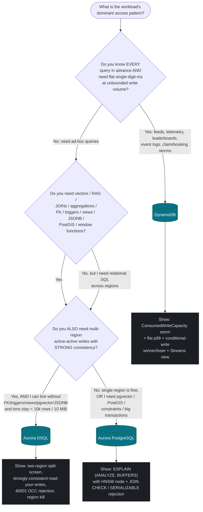

# AWS Databases Reference — DynamoDB vs Aurora DSQL vs Aurora PostgreSQL

**Purpose:** The decision and execution reference for picking ONE of the three eligible AWS databases, using its *signature* feature in the demo's critical path, and proving it on camera. Built for the H0 hackathon ("Front-end in minutes. Back-end designed for scale.") — eligible engines are **Amazon Aurora PostgreSQL**, **Amazon Aurora DSQL**, and **Amazon DynamoDB**.

**Last updated / source:** the H0 ideation workflow (`../../IDEATION.md`, `/tmp/h0_dbground.json`, `/tmp/h0_ground.txt`).

> **One-line thesis (read this first):** Make the database the protagonist and the frontend its courtroom evidence. Pick the workload where *exactly one* of these three is correct, say in one sentence why the other two fail, and put that DB's hard property on a live, clickable screen. If your screenshot could have come from any database, you picked wrong — and judges treat "DB as a glorified user table" as a hard-rule rejection.

---

## Table of Contents

- [1. Decision flowchart](#1-decision-flowchart)
- [2. Engine: DynamoDB](#2-engine-dynamodb)
- [3. Engine: Aurora DSQL](#3-engine-aurora-dsql)
- [4. Engine: Aurora PostgreSQL](#4-engine-aurora-postgresql)
- [5. Per-project: "why the other two fail"](#5-per-project-why-the-other-two-fail)
- [6. Screenshot-proof catalog (per engine)](#6-screenshot-proof-catalog-per-engine)
- [7. The hard problems and how to design around them](#7-the-hard-problems-and-how-to-design-around-them)
- [8. Common pitfalls](#8-common-pitfalls)
- [9. Quick-reference limits table](#9-quick-reference-limits-table)
- [Related docs](#related-docs)

---

## 1. Decision flowchart

Start from the **access pattern**, not the data. The three questions that decide everything: *Do you know every query in advance?* → *Do you need vectors/joins/analytics?* → *Do you need multi-region active-active strong consistency?*



**The sharpest forks, stated bluntly:**

| Fork | DynamoDB | Aurora DSQL | Aurora PostgreSQL |
|---|---|---|---|
| **Multi-region** | Active-active key-value, eventual (Global Tables / MREC) or strong across **exactly 3 regions** (MRSC) | Active-active **relational** writes, strong consistency — *its unique claim* | Single primary writer; cross-region = read replicas / async global DB (not active-active strong) |
| **Vectors / RAG / semantic search** | None | None (no extension ecosystem) | **pgvector 0.8.0 HNSW** — the only choice |
| **Write-throughput shape** | Spiky / viral / unbounded / high-write → **best** | Moderate, transactional, correctness-first | Moderate; single writer + connection limits are the ceiling |
| **Relational features (FK, triggers, views, JSONB, sequences, extensions)** | Not relational at all | Lacks all of these | **Has all of them** |
| **Transaction size** | 100 items / `TransactWriteItems` | **Hard ceiling: ≤ 10,000 modified rows / ≤ 10 MiB per txn** → rules out bulk/ETL | Effectively unbounded (subject to instance) |
| **Money / ledgers** | Can't enforce cross-row balance invariants | Global, can't-double-spend-across-regions → **DSQL** | Single-region / one writer → **Aurora PG** (SERIALIZABLE + CHECK + FK) |
| **Event sourcing / CDC / fan-out** | **DynamoDB Streams** — purpose-built | Bolt on EventBridge / logical replication | Bolt on logical replication / LISTEN-NOTIFY |

> **Tie-breaker for judges:** choose the DB whose UNIQUE capability is visible in the demo. Avoid picking a DB whose superpower you can't put on screen.

---

## 2. Engine: DynamoDB

> *In this doc set, DynamoDB is the backbone for **Provenance** (agent observability time-travel, single-table event log) and **Sky Claim** (3D airspace voxel deconfliction). It is the safest build because there is **no connection pool to exhaust** — the single most common Vercel+Aurora demo-killer.*

### Superpowers

- **Single-digit-ms reads/writes at literally any scale.** Throughput is provisioned/auto-scaled per table, so a viral spike to millions of writes/sec has the same per-item latency as 10 req/sec. The DB stays flat on a latency graph while load 100×'s — *nothing else here does that visibly.*
- **Predictable cost + latency via single-table design.** Model ALL access patterns up front as partition key (PK) + sort key (SK) item collections. One query with a key-condition + `begins_with(SK)` returns a pre-joined hierarchy (e.g. `AGENT#123` + all `EVENT#…` rows) in one round trip — no joins, no scan.
- **DynamoDB Streams.** Every write emits an ordered change record (`NEW_AND_OLD_IMAGES`) you fan out to Lambda — the native event-sourcing/CDC backbone for materialized views, leaderboards, websocket/SSE fan-out, audit logs, derived aggregates, *without a separate queue.*
- **Global Tables.** Multi-active multi-region replication. MREC (eventual) gives ~sub-second cross-region propagation with last-writer-wins; **MRSC (Multi-Region Strong Consistency, GA June 2025)** gives strongly-consistent reads across **exactly 3 regions** (3 replicas, or 2 replicas + 1 witness).
- **Conditional writes + atomic counters + `TransactWriteItems` (up to 100 items, ACID).** `attribute_not_exists` / version checks give optimistic concurrency for idempotency, inventory decrements, seat holds, and "claim this slot" patterns — correct under massive concurrency, no row locks.
- **TTL** for automatic expiry (sessions, holds, ephemeral traces) at no read cost; **DAX** for microsecond cached reads; **PartiQL** for a SQL-ish surface in demos without losing the NoSQL model.

### Killer demo patterns

- **Live write-storm dashboard.** Drive a load generator (or "tap to react" from the audience). Show a CloudWatch graph of `ConsumedWriteCapacityUnits` climbing to thousands/sec while p99 `SuccessfulRequestLatency` stays flat at single-digit ms. The whole pitch ("designed for scale") is visible in one chart.
- **High-concurrency claim/booking (the Sky Claim money shot).** Two operators tap "CLAIM" on the same voxel; `attribute_not_exists` guarantees exactly one winner (green), the other gets `ConditionalCheckFailedException` (red) in < 1s, and an "oversells: 0" counter never moves.
- **Streams-driven materialized view (the Provenance hero).** Raw immutable events land; Streams → Lambda folds them into a `CURRENT#STATE` item + anomaly aggregate; the UI scrubs back through reconstructed state. The Streams view IS the product.
- **Single-query timeline / feed.** Item-collection design (`AGENT#id` PK, `EVENT#<zeroPadSeq>` SK) returns a full ordered history in ONE Query; show the single-query X-Ray trace vs the equivalent multi-call/multi-join path.
- **Global active-active.** Write in `us-east-1`, watch it appear in `eu-west-1` within ~1s on a split-screen (MREC), or demo MRSC strongly-consistent reads from a second region right after a write.

### Signature features to show on camera

1. A **conditional write** rejecting a duplicate/second-claim live (`ConditionalCheckFailedException` in the network panel).
2. The **flat-p99-under-storm** CloudWatch graph next to `ConsumedWriteCapacity`.
3. A **single-table item-collection diagram** + a literal **access-pattern → PK/SK/GSI** table on screen.
4. **Streams → Lambda** invocation metrics climbing in lockstep with writes.
5. **TTL** expiring ephemeral items (the sky frees up behind the drone; traces age out at 24h).

### Do NOT use when

- You need ad-hoc analytics, arbitrary filtering, `GROUP BY`/aggregations across the dataset, or you don't yet know your access patterns — `Scan` is the anti-pattern.
- The product's value is relational integrity / complex multi-entity joins / reporting — you'd be rebuilding a query planner in app code.
- You need vector/semantic search, full-text search, or pgvector-style recommendations as a core feature.
- You need strong consistency across **more than 3 regions**, or referential FK constraints + serializable multi-statement transactions across many entities.

---

## 3. Engine: Aurora DSQL

> *In this doc set, Aurora DSQL is the backbone for **Settlement Floor** (parametric-insurance exactly-once payouts across a peered `us-east-1` + `us-west-2` cluster). The highest-ceiling, highest-risk pick: the entire submission rests on standing up two genuine peered regions + the OCC retry wrapper + write-sharded hot rows. Only attempt as a flagship with dedicated DSQL plumbing time — never as an "easy second."*

### Superpowers

- **Serverless, distributed, ACID SQL with PostgreSQL wire compatibility AND multi-region STRONG consistency.** Every transaction committed in one region is strongly consistent in peer regions. The unicorn: relational semantics + horizontal scale + active-active, no sharding, no failover scripts.
- **Active-active multi-region writers.** Both endpoints of a peered cluster are a single logical database accepting concurrent reads *and* writes with strong consistency. **Optimistic concurrency control (OCC)** means no two-phase-commit stalls; conflicts are detected **at commit** (`SQLSTATE 40001`). Availability targets: 99.99% single-region / 99.999% multi-region.
- **Zero operational surface.** No instances, no version upgrades, no storage provisioning, no connection-pool tuning. Scales compute and storage automatically and independently (down to zero). You write SQL; AWS runs the globally distributed system.
- **Standard SQL you already know.** JOINs, secondary indexes, SELECT/INSERT/UPDATE with snapshot isolation. Standard PostgreSQL drivers (`pg`) connect over the normal protocol, so a v0/Next.js app uses a normal client — fast to build.
- **Designed for global correctness-critical workloads.** Strong consistency + ACID means money, ledgers, and bookings can't double-spend or read stale across regions. AWS explicitly positions it for global financial transactions.
- **Performance that holds across regions.** AWS benchmarks read/write up to ~4× faster than other popular distributed SQL databases (Spanner/CockroachDB-class), with commit latency that holds as you add regions. *(Label as a vendor claim to verify, not a measured fact.)*

### Killer demo patterns

- **Active-active ledger (THE DSQL hero shot).** Split-screen of two deployed frontends pointed at two regions (e.g. `us-east-1` / `us-west-2`). Transfer money / book inventory in both simultaneously; balances stay strongly consistent and a double-spend attempt is rejected at commit. Nobody else can show strongly-consistent cross-region writes on a relational DB.
- **Region-failure resilience.** Kill/disconnect one regional endpoint mid-demo; the app keeps reading AND writing against the other endpoint with no data loss and no failover wait, then reconciles when the region returns (Settlement Floor's "no replay UI" moment).
- **OCC conflict visualization (the "Double-Pay Courtroom").** Fire two concurrent transactions touching the same row from two regions; show one committing and the other getting `SQLSTATE 40001 serialization_failure (OC000)` in a code chip, then a clean retry succeeding — correctness without locks.
- **Relational power on a distributed DB.** Run a real multi-table JOIN (policy ⋈ coverage_pool ⋈ ledger) and show `EXPLAIN` / sub-100ms results — you didn't give up SQL to get global scale.
- **Latency map.** A widget showing identical low write-commit latency from clients in multiple regions hitting their nearest endpoint, with a counter of globally-consistent committed transactions.

### Signature features to show on camera

1. The **two-region split screen** with a value (capital gauge / balance) decrementing **in lockstep on both panes** within ~1s.
2. The **`SQLSTATE 40001`** OCC rejection chip on a concurrent double-write, then a successful retry.
3. A **region kill** mid-storm; the surviving region keeps settling, and the killed region catches up on reconnect.
4. The console **multi-region cluster page** showing both endpoints ACTIVE as writers + the peer/witness region.
5. A **`EXPLAIN`** on a real multi-table JOIN returning sub-100ms — proves you kept SQL.

### Do NOT use when

- You depend on PostgreSQL features DSQL **does not support**: foreign-key constraints, triggers, views, sequences, stored procedures, many extensions, and JSONB. Apps relying on these need rewrites (FK → app-layer validation, triggers → EventBridge). *(Precision note: DSQL **does** support basic CTEs — do NOT claim it lacks recursive CTEs; the unimpeachable "DSQL can't" kill-shots are PostGIS, pgvector, FK/trigger/view/sequence, and `EXCLUDE` constraints.)*
- **Bulk / ETL / large writes:** the hard limit of **10,000 modified rows and 10 MiB per transaction** makes large migrations, batch jobs, and bulk loads unsuitable.
- You need **pgvector / semantic search / full-text search**, or heavy analytical OLAP — DSQL is OLTP and lacks the vector + extension ecosystem.
- **Single-region simple CRUD** where the distributed/strong-consistency machinery is overkill — Aurora PG or DynamoDB is cheaper/simpler. DSQL earns its place ONLY when global strong consistency or active-active is the requirement.

---

## 4. Engine: Aurora PostgreSQL

> *In this doc set, Aurora PostgreSQL is the backbone for **Recall** (recursive-CTE supply-DAG trace + PostGIS geo + pgvector incident clustering in one SERIALIZABLE statement — the flagship) and **HourBank** (pgvector HNSW human-matching JOINed to availability/reputation + a SERIALIZABLE double-entry ledger with `CHECK(balance>=0)`).*

### Superpowers

- **Full PostgreSQL.** Real foreign keys, `CHECK` constraints, triggers, views, materialized views, window functions, CTEs, recursive CTEs, `SERIALIZABLE` isolation, JSONB, and the entire extension ecosystem. When correctness and rich relational modeling ARE the product, this is the only choice.
- **pgvector 0.8.0 with HNSW + IVFFlat.** Native vector similarity search co-located with relational data. JOIN a semantic ANN search against user/permission/metadata tables in ONE query — RAG, semantic search, recommendations, dedup — without a separate vector DB. 0.8.0 brings up to ~9× faster queries and far better recall. *(Treat the multiplier as a version claim to verify.)*
- **PostGIS** for geospatial: `geography`/`geometry` types, GiST spatial indexes, distance/containment queries — Recall's store-pin map is one PostGIS JOIN.
- **`EXCLUDE` constraints over `tstzrange` (GiST).** The DB itself guarantees no overlapping confirmed bookings — correctness-under-contention as a one-line declarative guarantee (the Overbook pattern).
- **Aurora Serverless v2 (renamed "Aurora Serverless" in 2026).** Auto-scales ACUs up to build a memory-hungry HNSW index, then down for cheap serving. Up to **15 low-latency read replicas** for read fan-out.
- **Complex analytical + transactional in the SAME engine.** `GROUP BY`, aggregations, recursive CTEs, geospatial, time-series — the planner does the heavy lifting so the frontend exposes genuine insight, not just key lookups.
- **Financial correctness.** ACID + `NUMERIC`/integer types + constraints + `SERIALIZABLE` make ledgers, invoicing, and reconciliation provably correct in a single region. Combine with row-level security for multi-tenant SaaS.
- **Familiar tooling/ORMs** (Prisma/Drizzle/SQLAlchemy), zero-ETL integrations, and Bedrock for embeddings — the fastest path from a v0 frontend to a data-rich backend with joins + vectors.

### Killer demo patterns

- **Semantic search / RAG that's visibly relational (the pgvector hero).** Type NL → embed → pgvector HNSW ANN JOINed with hard filters (price, tenant, permissions, timezone, in-stock) — show the SQL + `EXPLAIN` with the vector index node beside the JOIN. One query does semantic + relational.
- **Recursive-graph + geo + vector in ONE statement (the Recall hero).** A `SERIALIZABLE` recursive CTE walks an FK-constrained supply DAG, JOINing PostGIS store geography and a pgvector incident cluster — graph recursion + geospatial + similarity fused, with the recursive-union node, HNSW scan, and GiST spatial join all visible in `EXPLAIN`.
- **Live query plan.** Run `EXPLAIN (ANALYZE, BUFFERS)` on a multi-table JOIN with aggregation and put the plan on screen — proves the DB (not app code) does the relational work, with the HNSW/index nodes visible.
- **Financial dashboard with provable integrity (the HourBank ledger).** A `SERIALIZABLE` double-entry transfer gated by `CHECK(balance>=0)`; show a constraint/serialization violation being **rejected** (the actual pg error), then a correct double-entry that balances (`SUM(delta_minutes) = 0`).
- **Real-time analytics view.** A materialized view or window-function query powering a leaderboard/cohort/funnel chart, refreshed and shown updating.

### Signature features to show on camera

1. `EXPLAIN (ANALYZE, BUFFERS)` showing an **HNSW Index Scan** next to a hash/nested-loop JOIN (and, for Recall, a recursive-union node + GiST spatial join).
2. A **`CHECK` / `SERIALIZABLE` rejection** — the literal pg error when an overdraft or unbalanced/concurrent write is refused by the engine, not app code.
3. The **ER diagram** as your architecture artifact (most teams draw boxes; you draw the data model with the JOINs your queries run).
4. **`\d`** output showing the `vector` column + HNSW index definition + a `ORDER BY embedding <=> $1 LIMIT k` query returning ranked results.
5. A **Serverless v2 ACU autoscaling** CloudWatch graph (spike to build HNSW, scale back down).

### Do NOT use when

- You need **multi-region active-active writes with strong consistency** — single-region Aurora has one primary writer; cross-region is read replicas or async global DB, not active-active strong (use **DSQL**).
- **Unbounded, unpredictable hyperscale write throughput** (millions of writes/sec) or a hard single-digit-ms-at-any-scale SLA — connection limits and a single writer are the ceiling (use **DynamoDB**).
- Pure key-value / wide-column access where you already know every pattern and want flat cost+latency — DynamoDB is simpler and cheaper.
- Workloads that are 99% simple lookups with no joins/vectors/analytics — you're paying for a query planner you don't use.

---

## 5. Per-project: "why the other two fail"

For each of the 5 deep-dive projects, the chosen engine plus the **one-sentence kill-shot** for why each *other* engine is the wrong tool. Say these verbatim on camera.

| Project | Track | **Chosen** | Why the second engine fails | Why the third engine fails |
|---|---|---|---|---|
| **Recall** — outbreak/recall console | B2B | **Aurora PostgreSQL** | **DynamoDB** can't do recursive traversal or ad-hoc joins over a supply DAG. | **Aurora DSQL** has no PostGIS and no extensions, so no geo and no pgvector — only Aurora PG fuses graph recursion + geospatial + vector similarity in one statement. |
| **Provenance** — agent observability time-travel | B2B / Open | **DynamoDB** | **Aurora PG**'s joins buy nothing (the core read is one key) and it buckles at the spiky write rate, needing bolted-on logical replication to fan out. | **Aurora DSQL** gives unused active-active, has **no Streams**, and a 10k-row/txn ceiling — the timeline is a pure key-condition Query, so DynamoDB is the only correct engine. |
| **Sky Claim** — 3D airspace voxel deconfliction | Open (million-scale flavor) | **DynamoDB** | **Aurora PG** would serialize on the hot spatial rows and deadlock the moment 5,000 flights hit one corridor. | **Aurora DSQL**'s OCC would retry-storm those same contended voxels, and you don't need cross-region for one city's airspace. |
| **HourBank** — time-credit market | B2C / Open | **Aurora PostgreSQL** | **DynamoDB** has no vectors, no ad-hoc match, and can't enforce a non-negative double-entry invariant across rows. | **Aurora DSQL** has no pgvector and no constraint/trigger ecosystem, and single-region correctness means its one unique property (active-active) buys nothing. |
| **Settlement Floor** — exactly-once global payouts | B2B / Million-scale | **Aurora DSQL** | **DynamoDB** Global Tables' last-writer-wins (eventual) can double-pay a shared capital pool across regions. | **Aurora PG** cannot accept writes in two regions at once (single primary writer) — only DSQL gives strongly-consistent active-active relational money movement. |

**The reusable one-liners (memorize the shape):**

> - **Aurora PG:** "needs multi-row ACID + JOINs + pgvector/PostGIS in one query — Dynamo can't JOIN, DSQL lacks the extensions."
> - **Aurora DSQL:** "needs strongly-consistent writes in 2+ regions with no failover ops — Aurora needs a primary, Dynamo Global Tables are eventually consistent."
> - **DynamoDB:** "needs predictable single-digit-ms at high spiky write volume — Aurora's connection limits and DSQL's OCC retries hurt here."

---

## 6. Screenshot-proof catalog (per engine)

The submission **requires** a screenshot proving AWS DB usage. It must show **real activity** (item counts, query metrics, an EXPLAIN plan) — never an empty table. Build a "Query Inspector" / "Show the query" surface into the app early so it doubles as a demo moment AND the deliverable.

### DynamoDB

- [ ] **Global Tables replication view** — console "Global tables" tab showing replicas in 2–3 regions with replication status/lag, next to a CloudWatch `ReplicationLatency` graph. Proves multi-region active-active is real, not a single table.
- [ ] **MRSC three-region topology** — console showing the global table across **exactly 3 regions** (or 2 replicas + 1 witness) with Multi-Region Strong Consistency enabled — a config no eventual-consistency demo could fake.
- [ ] **Flat-latency-under-load** — CloudWatch dashboard: `ConsumedWriteCapacityUnits` spiking to thousands/sec while `SuccessfulRequestLatency` p99 stays single-digit ms. One image that screams "designed for scale." *(Measure DynamoDB's own `SuccessfulRequestLatency`, not end-to-end time that includes SSE overhead.)*
- [ ] **Single-table item collection** — NoSQL Workbench (or a PartiQL result) showing one PK with a stack of typed SK rows (`EVENT#…`, `CURRENT#STATE`, `AGG#ANOMALY`) returned by ONE Query. Proves intentional access-pattern modeling, not a bag of rows.
- [ ] **Streams wired up** — console showing the stream ARN + the consuming Lambda's invocation metrics climbing in lockstep with writes.
- [ ] **X-Ray single-Query trace** — the timeline/corridor read as one round trip vs the equivalent multi-call path.

### Aurora DSQL

- [ ] **Multi-region cluster page** — console showing a peered/linked cluster across two regions, **both endpoints ACTIVE as writers**, with the witness/peer region — the definitive "active-active strong consistency" proof.
- [ ] **Split-screen write test** — two browser windows on the two regional endpoints; a balance/inventory value identical in both immediately after a cross-region write, plus a rejected double-spend (`40001` OCC conflict) — the strong-consistency money shot.
- [ ] **`EXPLAIN` on a multi-table JOIN** returning in sub-100ms — proves you kept real SQL while getting distributed scale.
- [ ] **OCC retry-rate meter** — the Settlement Floor "unshard" toggle visibly spiking the `40001` retry rate, then sharding bringing it back down (senior-intent evidence).

### Aurora PostgreSQL

- [ ] **`EXPLAIN (ANALYZE, BUFFERS)` on a pgvector HNSW query JOINed with relational filters** — the plan visibly using the **HNSW Index Scan** node next to a hash/nested-loop join is irrefutable "the DB is doing the work" evidence. (For Recall, also the recursive-union + GiST spatial join nodes.)
- [ ] **pgvector index definition + query** — `\d` output showing the `vector` column and HNSW index, plus `ORDER BY embedding <=> $1 LIMIT k` returning ranked semantic results JOINed to metadata. Proves vector search is native, not a separate service.
- [ ] **Serverless v2 ACU autoscaling graph** — CloudWatch `ServerlessDatabaseCapacity` spiking up to build an HNSW index then scaling back down — scale-to-fit economics.
- [ ] **Constraint / serialization rejection** — a psql/log screenshot of a transaction failing on a `CHECK` / unique / `40001` serialization conflict, proving financial correctness is enforced by the DB. (HourBank: the literal `CHECK(balance_minutes>=0)` violation + `SELECT SUM(delta_minutes) = 0`.)

### For ALL three (closes the "is this really wired up?" gap)

- [ ] A screenshot pairing the **deployed Vercel frontend URL + Vercel Team ID** alongside the **AWS console resource ARN** — so the judge sees the exact frontend talking to the exact named AWS DB.

---

## 7. The hard problems and how to design around them

Design around the named hard problem and **surface it** — add a one-line caption in the demo when it fires. This is the difference between "toy" and "real."

### 7.1 Hot partition / hot row (write contention)

The same logical key gets hammered by concurrent writers: a viral tip total, a leaderboard rank counter, a single capital-pool balance, the most-claimed voxel corridor.

- **DynamoDB — write-sharding.** Spread the hot key across `N` suffixes (`PERF#id#SHARD#0..N`, `MAP#cityId#bucket#shard`) so writes fan out across partitions; aggregate with a fan-in read or a Streams-built rollup item. *Exception:* Sky Claim's voxel reservation is **intentionally single-key** — single-keyness is exactly what makes deconfliction correct; here you spread load by putting the **time-bucket in the SK** instead.
- **Aurora DSQL — write-sharding the balance.** A single hot balance row makes OCC thrash (every concurrent debit conflicts at commit). Split the pool into `pool_shard` rows; debit a randomly-chosen shard so concurrent writes touch different rows. Settlement Floor's "unshard" toggle visibly spikes the `40001` retry rate — that's the proof you understood the failure.
- **Aurora PostgreSQL — avoid the hot UPDATE.** A single `UPDATE balance` row serializes under contention. Use append-only `ledger_entries` + a derived/materialized balance, or partition counters — don't make every writer fight for one row.

```ts
// DynamoDB write-sharding: spread a hot aggregate across N shards
const SHARDS = 16;
const shard = Math.floor(Math.random() * SHARDS);
await ddb.send(new UpdateCommand({
  TableName: "SkyClaim",
  Key: { PK: `MAP#${cityId}#${bucket}`, SK: `AGG#SHARD#${shard}` },
  UpdateExpression: "ADD claimCount :one",
  ExpressionAttributeValues: { ":one": 1 },
}));
// read path fans in: Query SK begins_with "AGG#SHARD#" and sum claimCount
```

### 7.2 Idempotency (exactly-once under retries)

A double-clicked button, a retrying oracle webhook, or an at-least-once queue must not bill/pay/claim twice.

- **DynamoDB:** conditional `PutItem` keyed on an idempotency token / sequence: `ConditionExpression: attribute_not_exists(SK)`. The duplicate write fails cleanly; the side effect happens exactly once. (Provenance: `attribute_not_exists(SK)` on `EVENT#<zeroPadSeq>`; Sky Claim: `attribute_not_exists(PK) AND attribute_not_exists(SK)` on the voxel.)
- **Aurora PG:** `idempotency_key UNIQUE` on the ledger row inside the transaction — a duplicate violates the unique constraint and rolls back.
- **Aurora DSQL:** an `oracle_event_id` uniqueness guard checked inside the transaction; if a peer region already claimed it, you **lose at commit** (`40001`), then return idempotently after re-reading the existing settlement.

```sql
-- Aurora PG: exactly-once double-entry inside one SERIALIZABLE transaction
BEGIN ISOLATION LEVEL SERIALIZABLE;
  INSERT INTO ledger_entries (favor_id, account_id, delta_minutes, kind, idempotency_key)
  VALUES ($1, $req_acct, -$mins, 'debit',  $key||':debit')   -- UNIQUE(idempotency_key) blocks dupes
       , ($1, $help_acct, +$mins, 'credit', $key||':credit');
  UPDATE accounts SET balance_minutes = balance_minutes - $mins WHERE id = $req_acct;  -- CHECK(balance_minutes>=0) refuses overdraft
  UPDATE accounts SET balance_minutes = balance_minutes + $mins WHERE id = $help_acct;
COMMIT;
```

### 7.3 OCC retry (Aurora DSQL serialization conflicts)

DSQL detects conflicts **at commit**, not on write. Concurrent transactions touching the same row → one commits, the loser raises `SQLSTATE 40001`. **You must wrap every transaction in a bounded retry with backoff** — without it, the demo throws errors at the worst moment.

```ts
// Aurora DSQL: retry on serialization_failure (40001 / OC000)
async function withOccRetry<T>(fn: () => Promise<T>, max = 5): Promise<T> {
  for (let attempt = 0; ; attempt++) {
    try { return await fn(); }
    catch (e: any) {
      const isConflict = e?.code === "40001" || /serialization_failure|OC000/.test(e?.message ?? "");
      if (!isConflict || attempt >= max) throw e;
      await new Promise(r => setTimeout(r, 25 * 2 ** attempt + Math.random() * 25)); // jittered backoff
    }
  }
}
```

> **Make it visible, not hidden:** the loser's `40001` rejection IS the proof of correctness. Show it in a code chip, then show the clean retry succeed — don't swallow it silently.

### 7.4 TTL (ephemeral state, no sweeper)

Holds, sessions, raw traces, and time-elapsed reservations should expire automatically — never with a cron sweeper that you have to defend.

- **DynamoDB TTL:** set an epoch-seconds attribute (`ttlEpoch`); DynamoDB deletes the item after it passes, at no read cost. Sky Claim frees a voxel the instant its 15s time-bucket elapses; Provenance ages out raw traces at ~24h. *(Note: TTL deletion is best-effort, typically within 48h — never rely on it for correctness, only for cleanup.)*

### 7.5 Connection limits (Aurora / DSQL on serverless Vercel)

Opening a new Postgres connection per Vercel invocation → "too many clients" → the **single most common Vercel+Aurora demo-killer.**

- Create a `pg Pool` once at **module scope** and call `attachDatabasePool(pool)` from `@vercel/functions` so idle clients release before the function suspends.
- Enable `fluid: true` in `vercel.json` (Fluid Compute) to keep instances warm and reuse pooled connections.
- For Aurora PG, also front it with **RDS Proxy**.
- Co-locate the Vercel Function region with the AWS DB region (a cross-region round trip adds 100–300ms and ruins the "single-digit-ms" story).

See `./vercel-v0-playbook.md` for the full OIDC-keyless + Fluid Compute + pooling setup.

---

## 8. Common pitfalls

> Each of these is an instant credibility killer with the judges. Avoid by construction.

- **DB as a glorified user table.** If the UI is just CRUD and the DB choice isn't load-bearing (joins, consistency, scale, streams, vectors), it reads as generic — a **hard-rule rejection**. The frontend must visibly expose the data model and access pattern.
- **Connection exhaustion** (Aurora/DSQL) — no pooling / no `attachDatabasePool` + Fluid → "too many clients" crash under any concurrency.
- **Region latency tax** — Vercel Functions in a different AWS region than the DB → 100–300ms per round trip → kills the latency story.
- **Fake real-time** — polling on `setInterval` and calling it "real-time" looks hollow next to genuine Streams/SSE or LISTEN/NOTIFY. Wire actual change propagation or don't claim it.
- **Seeded data that doesn't move** — a dashboard of static fixtures with no live write during the demo. Always perform a write on camera and show it propagate.
- **"Scales to millions" on 12 rows** — seed 1M+ rows; show the row count + a measured query latency on screen. (Recall/HourBank: 50k–200k profiles/clauses; Sky Claim: 1–3M claims; Provenance: hundreds of thousands → low millions of events.)
- **Multi-region claimed, single-region deployed** — for DSQL/Global Tables, you MUST stand up a real second region and show a cross-region write, or a DSQL-literate judge deflates the whole thesis.
- **Leaking AWS credentials** — never ship `AWS_SECRET` in client bundles or hardcode long-lived keys. Use OIDC keyless auth (`@vercel/oidc-aws-credentials-provider`). Exposed keys are an instant disqualifier.
- **Aurora in a private subnet with no path from Vercel** — VPC peering / Secure Compute / a public-but-locked-down endpoint; test the **production** deployment, not just localhost.
- **No proof of DB usage** — a UI that abstracts the DB away leaves nothing to screenshot. Include a Query Inspector / metrics view showing real table activity.
- **OCC conflicts swallowed (DSQL)** — the `40001` rejection is your headline evidence; surface it, don't hide it.
- **Reconstructing state on the server instead of client-side (Provenance)** — if the "time-travel fold" silently becomes "pre-render every frame on the server and stream pictures," it's just another trace viewer and the thesis dies. The fold MUST run client-side over the single-Query results.
- **Over-scoping the AI** — a chatbot that doesn't touch the data model wastes demo time. AI should be grounded on DB rows (RAG over pgvector, anomaly explanations), reinforcing the database story. For Settlement Floor specifically: **do NOT add an AI chatbot** — it dilutes the one thing you're unbeatable at.
- **Demo > 3 min or burying the lede** — the strongest moment (multi-region flip, scale counter, EXPLAIN reveal, conflict rejection) must appear in the first ~30 seconds.

---

## 9. Quick-reference limits table

> ⚠️ **Verify every number against current AWS docs before you cite it on camera.** Limits change; some are soft (raisable via support) and some are hard. Where a figure is a vendor performance claim, it is labeled as such — treat it as a target to measure, not a fact to assert.

### DynamoDB

| Property | Value | Notes |
|---|---|---|
| Max item size | **400 KB** | Includes attribute names + values; offload large blobs to S3. |
| `TransactWriteItems` / `TransactGetItems` | **up to 100 items**, **≤ 4 MB** aggregate | ACID across items in one Region. |
| `BatchWriteItem` | up to 25 put/delete requests | Not atomic (per-item success/failure). |
| `Query` / `Scan` response | **1 MB per page** | Paginate with `LastEvaluatedKey`. |
| Partition throughput ceiling | **~3,000 RCU / ~1,000 WCU per partition** | The hot-partition wall → write-shard. |
| On-demand throughput | scales automatically | "On-demand because traffic is spiky, not provisioned." |
| Streams record retention | **24 hours** | `NEW_AND_OLD_IMAGES` for full before/after. |
| TTL deletion | best-effort, **typically within 48h** of expiry | Cleanup only — never rely on for correctness. |
| MRSC regions | **exactly 3** (3 replicas, or 2 + 1 witness) | Strong cross-region reads (GA June 2025). |
| Latency | single-digit-ms reads/writes at any scale | Measure `SuccessfulRequestLatency` p50/p99. |

### Aurora DSQL

| Property | Value | Notes |
|---|---|---|
| Max **modified rows per transaction** | **10,000** | Hard limit → rules out bulk/ETL. |
| Max **transaction size** | **10 MiB** | Combined with row limit, batch loads are unsuitable. |
| Isolation | **snapshot isolation + OCC** | Conflicts detected at commit → `SQLSTATE 40001`. |
| Multi-region | active-active, strong consistency | Both endpoints are writers; single logical DB. |
| Availability target | 99.99% single-region / 99.999% multi-region | Vendor SLA target — verify. |
| **Unsupported PG features** | FK constraints, triggers, views, sequences, stored procedures, many extensions, JSONB | Rewrite: FK → app validation; triggers → EventBridge. |
| **Supported** | JOINs, secondary indexes, basic + recursive CTEs, snapshot-isolation SELECT/INSERT/UPDATE | Do NOT claim it lacks recursive CTEs. |
| pgvector / PostGIS | **not available** | No extension ecosystem. |
| Performance claim | ~4× faster than other distributed SQL | Vendor benchmark claim — measure, don't assert. |

### Aurora PostgreSQL

| Property | Value | Notes |
|---|---|---|
| pgvector | **0.8.0** | HNSW + IVFFlat; ~9× faster queries claim (verify against version). |
| HNSW index | `USING hnsw (embedding vector_cosine_ops)` | Tune `m` (e.g. 16), `ef_construction` (e.g. 64); set `ef_search` at query time. |
| Vector dimension | up to **2,000** for an HNSW-indexed `vector` column | 1536 = OpenAI/Titan-class embeddings fit. |
| Distance operators | `<=>` cosine, `<->` L2, `<#>` inner product | Match the operator class to your index. |
| Isolation levels | READ COMMITTED → REPEATABLE READ → **SERIALIZABLE** | Use SERIALIZABLE for money; expect/handle `40001`. |
| Constraints | FK, `CHECK`, `UNIQUE`, `EXCLUDE` (GiST over ranges) | `EXCLUDE` over `tstzrange` = no-overlap guarantee. |
| Serverless v2 capacity | scales in **ACUs** (0.5-ACU steps), independent reader scaling | Scale up to build HNSW, down to serve. |
| Read replicas | up to **15** | Read fan-out. |
| Extensions | PostGIS, pgvector, pg_trgm, full ecosystem | The reason to pick PG over the other two. |
| Max connections | bounded by instance/ACU size | The single-writer ceiling → RDS Proxy + pooling. |

---

## Related docs

- Index & navigation: [`../README.md`](../README.md)
- What wins / failure modes / track odds: [`../01-judging-model.md`](../01-judging-model.md)
- All 22 serious concepts + comparison table: [`../02-idea-universe.md`](../02-idea-universe.md)
- Vercel/v0 integration, OIDC, Fluid Compute, pitfalls: [`./vercel-v0-playbook.md`](./vercel-v0-playbook.md)
- Required artifacts + demo rules + pre-flight: [`./submission-checklist.md`](./submission-checklist.md)
- Deep dives: [`../deep-dives/01-recall.md`](../deep-dives/01-recall.md) · [`../deep-dives/02-provenance.md`](../deep-dives/02-provenance.md) · [`../deep-dives/03-sky-claim.md`](../deep-dives/03-sky-claim.md) · [`../deep-dives/04-hourbank.md`](../deep-dives/04-hourbank.md) · [`../deep-dives/05-settlement-floor.md`](../deep-dives/05-settlement-floor.md)
