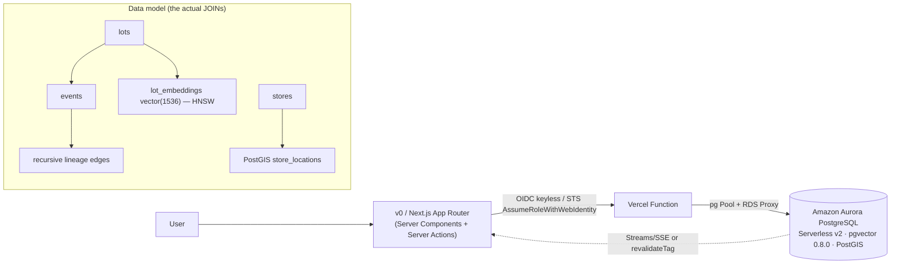

# H0 Submission Checklist

**Purpose:** A build-ready, do-not-skip checklist for assembling and submitting the H0 entry — every required artifact with concrete acceptance criteria, a "how to nail each one" playbook, the demo-video judging rubric, the bonus-content strategy, the auto-deflate avoidance list, and a day-of pre-submission sequence you run in a fresh incognito window before you click submit.

> _Last updated: from the H0 ideation workflow. Authoritative source: [`../../IDEATION.md`](../../IDEATION.md)._

This doc is written against the recommended flagship — **Recall (Aurora PostgreSQL, Monetizable B2B)** — but every section is annotated so it applies verbatim if you ship **Provenance (DynamoDB)** or **Settlement Floor (Aurora DSQL)** instead. See [`../deep-dives/01-recall.md`](../deep-dives/01-recall.md), [`../deep-dives/02-provenance.md`](../deep-dives/02-provenance.md), [`../deep-dives/05-settlement-floor.md`](../deep-dives/05-settlement-floor.md), and [`../05-recommendation.md`](../05-recommendation.md).

---

## Table of contents

- [1. The required-artifacts checklist (with acceptance criteria)](#1-the-required-artifacts-checklist-with-acceptance-criteria)
- [2. How to nail each artifact](#2-how-to-nail-each-artifact)
- [3. Bonus-content strategy (one evidence-rich post)](#3-bonus-content-strategy-one-evidence-rich-post)
- [4. Demo-video rubric (criterion → what to show)](#4-demo-video-rubric-criterion--what-to-show)
- [5. Auto-deflate avoidance list](#5-auto-deflate-avoidance-list)
- [6. Day-of pre-submission checklist](#6-day-of-pre-submission-checklist)
- [Appendix A — per-DB screenshot recipe](#appendix-a--per-db-screenshot-recipe)
- [Appendix B — artifact file manifest](#appendix-b--artifact-file-manifest)

---

## 1. The required-artifacts checklist (with acceptance criteria)

Every box below maps to an explicit H0 submission requirement. **A missing required artifact auto-deflates the entry regardless of code quality** (see [§5](#5-auto-deflate-avoidance-list)). Treat acceptance criteria as pass/fail — if you can't tick the criterion, the artifact is not done.

- [ ] **A1 — Text description that NAMES the AWS database.**
  - Acceptance: the prose states the exact engine in plain words — `Amazon Aurora PostgreSQL` (Recall/HourBank), `Amazon DynamoDB` (Provenance/Sky Claim), or `Amazon Aurora DSQL` (Settlement Floor). Not "AWS database," not "a serverless DB," not just a logo.
  - Acceptance: it includes the one-sentence **why-this-DB / why-not-the-other-two** kill-shot (e.g. Recall: _"Aurora PostgreSQL because we run recursive lineage traversal + a PostGIS spatial join + a pgvector ANN match in one statement — DynamoDB can't JOIN or recurse, DSQL has no PostGIS/pgvector."_).
  - Acceptance: it names the track (Monetizable B2B for the flagship) and the buyer in one line.

- [ ] **A2 — Demo video, strictly under 3:00.**
  - Acceptance: runtime is `< 3:00` on the uploaded file (target 2:30–2:55; the [deep-dive scripts](../deep-dives/01-recall.md) are timed to fit). Verify the actual exported duration, not the editor estimate.
  - Acceptance: the signature moment (live EXPLAIN / double-pay rejection / write-storm flat-p99) appears in the **first 30 seconds** — never a 60s intro before the payoff.
  - Acceptance: hosted on a link the judges can open (YouTube/Vimeo/Loom unlisted is fine), playback verified in incognito, audio present and intelligible.

- [ ] **A3 — Working-app footage (real interaction, not a slideshow).**
  - Acceptance: the video shows a **live write performed on camera** that then propagates/renders — never only static seeded fixtures. (Recall: ingest an event → graph re-traverses; DynamoDB: a tap lands on the live counter; DSQL: a settle commits and the peer pane ticks.)
  - Acceptance: footage is the deployed Vercel URL visible in the address bar — **not `localhost`** (auto-deflate trigger; see [§5](#5-auto-deflate-avoidance-list)).
  - Acceptance: at least one moment shows real volume on screen (row/item count in the hundreds of thousands → millions) and a measured latency badge.

- [ ] **A4 — Explanation of how the AWS database is used.**
  - Acceptance: describes the **data model** (ER diagram for Aurora; single-table item-collection + access-pattern table for DynamoDB; region topology for DSQL), not just "we store data in it."
  - Acceptance: names the **signature feature on the critical path**: recursive CTE / window function / HNSW ANN / SERIALIZABLE transaction (Aurora); conditional write + Streams→materialized view + TTL (DynamoDB); OCC conflict + active-active strong consistency (DSQL).
  - Acceptance: names the **hard problem you designed around** (idempotency key, hot-partition write-sharding, OCC retry, `CHECK` constraint) — one line each.

- [ ] **A5 — Published Vercel project link (the LIVE deployed URL).**
  - Acceptance: it's a production deployment URL (`https://<project>.vercel.app` or custom domain), **not** a preview/branch URL and **not** the v0 editor link.
  - Acceptance: opens cold in a fresh incognito window with no login wall, no `vercel login` redirect, no 401/403, no "deployment not found."
  - Acceptance: the deployed app **reaches the AWS DB and shows real data** (Aurora-in-private-subnet teams: confirm the prod function has a VPC/Secure-Compute path — a localhost-only-works app fails here; see [§5](#5-auto-deflate-avoidance-list)).

- [ ] **A6 — Vercel Team ID.**
  - Acceptance: the literal Team ID string is in the submission text (Vercel dashboard → **Settings → General → Team ID**, format `team_xxxxxxxxxxxxxxxxxxxxxxxx`).
  - Acceptance: the Team ID belongs to the same team that owns the published deployment in A5 (judges cross-check).

- [ ] **A7 — Architecture diagram showing frontend AND backend.**
  - Acceptance: both tiers are present and connected — frontend (v0/Next.js App Router on Vercel) → Vercel Function/Server Action → **auth hop (OIDC keyless / STS)** → the named AWS DB.
  - Acceptance: it is **also a data-model diagram**, not just boxes — judges reward the team that draws the ER diagram / single-table item-collection / region topology (this is the cheapest way to out-class the field; see [§2](#2-how-to-nail-each-artifact)).
  - Acceptance: every component drawn actually exists in the repo/demo (no phantom Kafka/Redis/5-microservices; that's an instant credibility kill — see [§5](#5-auto-deflate-avoidance-list)).

- [ ] **A8 — Screenshot proving AWS DB usage.**
  - Acceptance: it is the AWS console / a real query tool showing **real activity** — item counts, row counts, capacity metrics, an `EXPLAIN ANALYZE` plan, or a peered-cluster topology — **not an empty table**.
  - Acceptance: it visibly ties to YOUR resource (table/cluster name matching the repo) and ideally shares the frame with the Vercel URL + Team ID so the "is this really wired up?" gap is closed.
  - Acceptance: it shows the **DB's unique property** (the screenshot could not have come from a different engine). See [Appendix A](#appendix-a--per-db-screenshot-recipe) for the exact recipe per DB.

- [ ] **A9 — (Optional, bonus) Public build content.**
  - Acceptance: one substantive, evidence-rich post (blog/thread) titled around the load-bearing DB decision, with the diagram + load-test graph + a code snippet, echoing the "front-end in minutes, back-end designed for scale" tagline. Published only after A1–A8 are solid. See [§3](#3-bonus-content-strategy-one-evidence-rich-post).

---

## 2. How to nail each artifact

### A1 — Text description that names the DB
Open with the data model, not the feature list. One-paragraph template:

> _Recall is an outbreak-traceability console for grocery/food-safety ops (FSMA 204, 24-hour FDA SLA). It runs on **Amazon Aurora PostgreSQL** (Serverless v2, pgvector 0.8.0). One query fuses three things only Postgres can do in a single statement: a **recursive CTE** walking the supply-chain lineage graph, a **PostGIS spatial join** against store locations, and a **pgvector HNSW** match over lot descriptions. DynamoDB can't JOIN or recurse; DSQL has neither PostGIS nor pgvector. Track: Monetizable B2B. Buyer: VP of Food Safety with a federal deadline and a budget._

Rule: a reader who knows the three AWS DBs should finish your first paragraph already agreeing your choice was forced, not picked from a dropdown.

### A2 + A3 + A4 — The demo video and its narration
- Storyboard from the timed script in your deep dive ([Recall](../deep-dives/01-recall.md) ~2:35, [Sky Claim](../deep-dives/03-sky-claim.md) ~2:30, [Settlement Floor](../deep-dives/05-settlement-floor.md) ~3:00→trim to <2:55).
- Lead with the kill-shot moment. Structure: **cold-open on the live URL with the scale/latency badge already on screen (0–15s) → the signature DB moment (15–75s) → a second proof (concurrency / EXPLAIN / region kill) → the data-model diagram + why-this-DB sentence → end card with the live URL + Team ID.**
- On-screen text reinforces the audio: caption the hard property when it fires ("rejected at the database — SQLSTATE 40001", "one Query, one round trip, no joins", "p99 6ms while WCU climbs to thousands").
- Cursor direction: physically click into the EXPLAIN drawer / network panel / CloudWatch tab on camera so the evidence is seen being produced, not asserted.
- Record at 1080p+, screen-only (no webcam clutter over the data), and **do the live write on camera** — the single fastest way to prove the app is real.

### A5 — Published Vercel link
- Deploy from `main` to production; copy the canonical production URL, not a `*-git-*` preview.
- Co-locate the Vercel Function region with the AWS DB region (the region-latency tax otherwise destroys the single-digit-ms story — see [`vercel-v0-playbook.md`](./vercel-v0-playbook.md)).
- For Aurora/DSQL: prove the **production** deployment reaches the DB (pooling via `attachDatabasePool` + Fluid Compute, RDS Proxy, and VPC/Secure-Compute if private). "Works on localhost" is not acceptance — A5 is about the deployed URL.

### A6 — Team ID
- Grab it once, early, and paste it into your draft submission immediately so it's never the thing you're hunting for at 01:50 GMT+2. Path: Vercel → Settings → General → **Team ID**.

### A7 — Architecture diagram = data model
- Draw the request path AND the schema in one image. Use a mermaid diagram in the repo so it's versioned and reproducible:



- For DynamoDB: replace the schema subgraph with the **single-table item-collection diagram + a literal `access-pattern → PK/SK/GSI` table**. For DSQL: draw the **two-region peered topology** (us-east-1 + us-west-2, both writers, the OCC-conflict-at-commit box).
- Verify every box exists in the repo before exporting. A diagram component with no code behind it is diagram-driven fiction (see [§5](#5-auto-deflate-avoidance-list)).

### A8 — DB-usage screenshot
- Capture it from a state with **real activity**: run the demo first, then screenshot. An empty table proves nothing.
- Pick the shot that only your engine could produce (see [Appendix A](#appendix-a--per-db-screenshot-recipe)).
- Best-in-class: one composite image with the AWS console (resource name + metrics) on one half and the deployed Vercel URL + Team ID on the other — it answers "named DB?", "real activity?", and "really wired up?" in a single frame.

---

## 3. Bonus-content strategy (one evidence-rich post)

> **Kill-shot:** Bonus content is near-free points top contenders will claim, so skipping it is a relative penalty — but polished build content on a hollow app reads as marketing and _hurts_. Earn it only after A1–A8 are solid.

**What to publish:** exactly ONE substantive artifact — an annotated architecture / data-model post (blog or thread) titled around the load-bearing decision. Examples:
- _"Why our outbreak console runs recursion + PostGIS + pgvector in one Aurora query"_ (Recall)
- _"Event-sourcing a million agent traces on DynamoDB single-table design"_ (Provenance)
- _"Read-your-writes across two regions with Aurora DSQL — and rejecting a double-pay at commit"_ (Settlement Floor)

**What to include (make the post double as judge evidence — judges often read the linked content):**
- [ ] The architecture/data-model diagram (the same A7 image).
- [ ] The access-pattern table (DynamoDB) or the ER diagram + the actual hero SQL (Aurora) or the region topology (DSQL).
- [ ] The load-test / EXPLAIN / CloudWatch graph (the A8-class evidence).
- [ ] One real code snippet of the signature feature (the recursive CTE, the conditional write, the SERIALIZABLE transaction with `CHECK`).
- [ ] A 60–90s clip of the signature screen with the latency/consistency moment.
- [ ] The literal hackathon tagline echoed: **"front-end in minutes, back-end designed for scale."**
- [ ] The public Vercel link.

**When to do it:** the day before submission, after the working core + DB proof + required artifacts are locked. One substantive, evidence-rich piece beats five shallow posts — do not burn build time chasing volume.

---

## 4. Demo-video rubric (criterion → what to show)

The four judging criteria are **Technological Implementation, Design, Impact & Real-world Applicability, Originality.** Map every second of the video to at least one. If a criterion has no on-screen evidence, the video is not done.

| Criterion | What the judge wants to see | Concrete on-screen proof (flagship = Recall) | Generic-by-DB equivalent |
|---|---|---|---|
| **Technological Implementation** | The DB's signature feature on the critical path + honest hard-problem modeling + measured evidence | Live `EXPLAIN (ANALYZE, BUFFERS)` showing the HNSW node **and** the recursive-CTE/PostGIS join in one sub-100ms plan; 250k+ edge row count; CloudWatch ACU graph | DynamoDB: conditional write rejecting a dup + Streams→materialized view + CloudWatch WCU climbing while p99 stays flat. DSQL: live `SQLSTATE 40001` rejection + region kill with no failover. |
| **Design** | A signature screen that makes the backend's hard property visible/clickable; tight design system; real empty/loading/error states; freshness matched to consistency model | The graph (recursion) → map (spatial) → rail (vector) tri-panel; click a node, the lineage re-traverses live; dark control-room aesthetic, skeletons, optimistic UI | Any DB: the screen should be _unintelligible without the backend_ — a reconciling ledger, a real-time leaderboard, a scrubbable event timeline, a multi-region status panel. |
| **Impact & Real-world Applicability** | A named, dated, budgeted buyer and a real-world number | FSMA 204, 24-hour FDA traceback SLA, enforcement July 2028; "this turns a 7-day recall into minutes" | State the buyer + the dollar/regulatory pain in one sentence; show the workflow a real operator would run. |
| **Originality** | An interaction that could only exist on this data model | Lineage traversal + spatial blast-radius + semantic lot-match fused in one query — no other entrant's stack can express it | DynamoDB: time-travel scrub over a raw event log. DSQL: a watchable double-pay rejection + live region death. Avoid the RAG-chatbot/CRUD archetypes entirely. |

**Sequencing rule:** open with Tech + Design fused in the first 30s (the live signature screen), land Originality in the middle (the interaction nobody else can build), and close with Impact (the buyer + the why-this-DB kill-shot) over the data-model diagram and the end card (URL + Team ID).

---

## 5. Auto-deflate avoidance list

These are instant credibility kills. Each line is a do-NOT; treat the list as a pre-flight veto gate.

**Missing-artifact deflates (regardless of code quality):**
- [ ] ❌ No Vercel **Team ID** in the submission text.
- [ ] ❌ Architecture diagram missing one tier (frontend-only or backend-only) — it must show **both** frontend and backend connected.
- [ ] ❌ No **AWS-DB-usage screenshot**, or a screenshot of an **empty table** with no activity.
- [ ] ❌ Demo video **over 3:00**, or hosted at a link that doesn't play for an anonymous viewer.
- [ ] ❌ Text description that never names the exact DB engine.

**"Looks fake / never ran" deflates:**
- [ ] ❌ Demo shows **`localhost`** in the address bar instead of the deployed Vercel URL.
- [ ] ❌ The published URL **doesn't reach the DB in production** (works on localhost only — classic Aurora-in-private-subnet / connection-exhaustion failure).
- [ ] ❌ "Scales to millions" claimed over a **dozen seed rows** with no load test.
- [ ] ❌ **Multi-region / active-active** claimed (DSQL) with a single-region deploy and no cross-region write or region-kill shown.
- [ ] ❌ **Sub-ms / single-digit-ms** latency claimed with **no measurement, no p99, no CloudWatch graph**.
- [ ] ❌ Architecture diagram with **Kafka / Redis / 5 microservices / an ML pipeline** that appear nowhere in the repo.
- [ ] ❌ A demo video that **never shows the deployed URL, real data, or the database** (heavy cuts hiding that it doesn't run end to end).
- [ ] ❌ **Polling on a `setInterval`** dressed up as "real-time" instead of genuine Streams/SSE.
- [ ] ❌ **Static seeded data that never moves** — no live write performed on camera.
- [ ] ❌ **AWS keys leaked into the client** or long-lived keys hardcoded (use OIDC keyless — exposed keys are a security red flag and a disqualifier).
- [ ] ❌ The DB used as a **glorified user/CRUD table** with no load-bearing property visible (the hackathon's hard rule).

---

## 6. Day-of pre-submission checklist

Run this sequence on submission day, in order. Stop and fix before proceeding past any failed step. The deadline is **2026-06-30, 02:00 GMT+2** — start this no later than **T-3 hours**.

**Phase 1 — Freeze and deploy (T-3h)**
- [ ] Final code merged to `main`; tag/commit recorded.
- [ ] Production deploy succeeded on Vercel (build logs clean, no warnings about missing env vars).
- [ ] All required env vars set for **Production** scope (OIDC role ARN, DB endpoint/region, AI Gateway key) — not just Preview/Development.
- [ ] Seed data at real volume confirmed present in the prod DB (row/item count matches what the UI claims).

**Phase 2 — Verify the live artifacts in a FRESH INCOGNITO window (T-2h)**
- [ ] Open the **published Vercel URL** in a brand-new incognito/private window (no cookies, not logged into Vercel). It loads with **no login wall, no 401/403, no "deployment not found."**
- [ ] The signature screen renders **real data from the AWS DB** (not a fixture) — perform one live write and watch it propagate.
- [ ] The measured latency badge / row count is visible and non-zero.
- [ ] Copy the **production URL** from the incognito address bar — this exact string goes in the submission.
- [ ] Open Vercel → Settings → General; copy the **Team ID** (`team_…`); confirm it owns the deployment above. Paste both into the submission draft now.

**Phase 3 — Verify every required artifact (T-1.5h)**
- [ ] A1 text description names the DB + has the kill-shot + names the track. ✅
- [ ] A2 video file duration is **< 3:00**, plays in incognito, audio works, signature moment in first 30s. ✅
- [ ] A3 footage is the live URL (not localhost) with a live write on camera. ✅
- [ ] A4 DB-usage explanation covers data model + signature feature + hard problem. ✅
- [ ] A5 live URL re-verified in incognito (Phase 2). ✅
- [ ] A6 Team ID pasted and matches the deployment. ✅
- [ ] A7 architecture diagram shows both tiers + is a data-model diagram + every box exists in the repo. ✅
- [ ] A8 DB screenshot shows real activity, your named resource, and the DB's unique property. ✅
- [ ] A9 bonus post published (if doing it) and linked. ✅

**Phase 4 — Adversarial self-review (T-1h)**
- [ ] Walk [§5](#5-auto-deflate-avoidance-list) line by line; confirm not one ❌ applies.
- [ ] Have a teammate (or yourself on a different machine/network) open the live URL cold and click around for 60 seconds — it must not break.
- [ ] Re-watch the video end to end on the hosted link at the destination platform (not your local file).

**Phase 5 — Submit (T-45m, never at T-0)**
- [ ] Paste all fields into the submission form; double-check the URL and Team ID character-for-character.
- [ ] Attach/link video, diagram, screenshot, bonus post.
- [ ] Submit. Then **re-open the submitted entry as a third party** and confirm every link resolves.
- [ ] Screenshot the submitted confirmation for your records.

---

## Appendix A — per-DB screenshot recipe

Pick the shot that only your engine could have produced (the tie-breaker: if your screenshot could come from any database, you picked the wrong shot or the wrong DB).

| DB | Best A8 screenshot | Why it's irrefutable |
|---|---|---|
| **Aurora PostgreSQL** (Recall/HourBank) | `EXPLAIN (ANALYZE, BUFFERS)` showing the **HNSW Index Scan node** next to the recursive-CTE/PostGIS join nodes, sub-100ms; plus the `\d` showing the `vector` column + HNSW index | Proves vector search is native and the DB (not app code) does the relational work; a `CHECK`/serialization-conflict rejection in pg logs is a strong second shot |
| **DynamoDB** (Provenance/Sky Claim) | CloudWatch dashboard: `ConsumedWriteCapacityUnits` spiking to thousands/sec while `SuccessfulRequestLatency` p99 stays single-digit ms; plus NoSQL Workbench showing one PK with a stack of typed SK rows (one item collection) | Flat-latency-under-storm + intentional single-table item-collection design — no eventual-consistency or CRUD demo can fake either |
| **Aurora DSQL** (Settlement Floor) | DSQL console showing the **two peered regions both ACTIVE as writers** (+ witness), beside a CloudWatch commit-latency panel; plus the `SQLSTATE 40001` rejection in the app | A peered multi-region cluster cannot be faked single-region; the 40001 is the active-active strong-consistency money shot |

See [`./aws-databases.md`](./aws-databases.md) for the full superpowers / screenshot-proof catalog.

## Appendix B — artifact file manifest

Keep all submission artifacts in one folder so the day-of phase is copy-paste, not hunt-and-gather:

```
/submission
  description.md          # A1 + A4 (final text, DB named, kill-shot)
  demo.mp4               # A2/A3 (< 3:00, exported, duration-verified)
  demo-link.txt          # hosted video URL (incognito-verified)
  architecture.png       # A7 (both tiers + data model; exported from mermaid in repo)
  db-proof.png           # A8 (real activity + your resource + Vercel URL/Team ID in frame)
  live-url.txt           # A5 (production URL, copied from incognito address bar)
  team-id.txt            # A6 (team_… , matches the deployment)
  bonus-post-link.txt    # A9 (optional; published only after A1–A8 lock)
```

Cross-references: [`../reference/vercel-v0-playbook.md`](./vercel-v0-playbook.md) (deploy/OIDC/Fluid Compute pitfalls), [`../01-judging-model.md`](../01-judging-model.md) (failure modes + bonus rationale), [`../05-recommendation.md`](../05-recommendation.md) (which DB/track to commit to).
