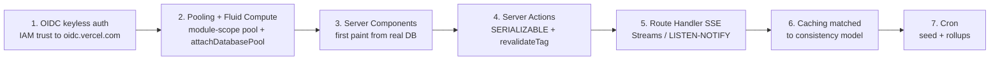

# Vercel / v0 Playbook

**Purpose:** The build-ready integration manual for the *frontend-and-deploy* half of an H0 submission — how to generate the UI fast with v0, then wire it to your chosen AWS database (DynamoDB / Aurora PostgreSQL / Aurora DSQL) the *correct* way so the database can be the protagonist and the live URL is its courtroom evidence. Every pattern here has real code you can paste.

> **Last updated:** 2026-06-18 · **Source:** the H0 ideation workflow (grounding in `/tmp/h0_vercelground.json` + `/tmp/h0_ground.txt`).

> **One-sentence thesis (carry it through every decision below):** *Don't pitch features; pitch a data model, and let the UI prove it.* v0 gets you a designed product in minutes; the integration patterns below are what stop it from being a "pretty app with an interchangeable backend" — the #1 failure mode judges punish.

---

## Table of contents

- [1. What v0 generates well (and how to prompt it)](#1-what-v0-generates-well-and-how-to-prompt-it)
- [2. The integration spine (order of operations)](#2-the-integration-spine-order-of-operations)
- [3. Pattern A — OIDC keyless AWS auth (do this FIRST)](#3-pattern-a--oidc-keyless-aws-auth-do-this-first)
- [4. Pattern B — Fluid Compute + connection pooling (Aurora / DSQL)](#4-pattern-b--fluid-compute--connection-pooling-aurora--dsql)
- [5. Pattern C — DynamoDB over OIDC (AWS SDK v3)](#5-pattern-c--dynamodb-over-oidc-aws-sdk-v3)
- [6. Pattern D — Server Components for first paint](#6-pattern-d--server-components-for-first-paint)
- [7. Pattern E — Server Actions + SERIALIZABLE transactions + revalidateTag](#7-pattern-e--server-actions--serializable-transactions--revalidatetag)
- [8. Pattern F — Route Handler SSE for real real-time](#8-pattern-f--route-handler-sse-for-real-real-time)
- [9. Pattern G — Caching matched to your consistency model](#9-pattern-g--caching-matched-to-your-consistency-model)
- [10. Pattern H — Vercel Cron for seeding & rollups](#10-pattern-h--vercel-cron-for-seeding--rollups)
- [11. Config reference — vercel.json, vercel.ts, env vars, file tree](#11-config-reference--verceljson-vercelts-env-vars-file-tree)
- [12. Pitfalls that kill demos (each with the fix)](#12-pitfalls-that-kill-demos-each-with-the-fix)
- [13. Deploy / verification pre-flight checklist](#13-deploy--verification-pre-flight-checklist)
- [Related docs](#related-docs)

---

## 1. What v0 generates well (and how to prompt it)

v0 (v0.app / v0.dev) is a Next.js App Router + shadcn/ui + Tailwind generator. It is exceptional at the *surface area that makes a data model look like a product*. Lean into its strengths; do the data wiring yourself.

### 1.1 v0's superpowers — use these to render the DB's hard property

| v0 nails | H0 use it for | Maps to which DB property |
|---|---|---|
| Data-dense dashboards: KPI cards, sparklines, sortable/filterable/faceted tables, recharts/tremor | The signature screen | Aurora aggregates / Dynamo throughput |
| Real-time-feeling surfaces: live tables, presence avatars, optimistic toggles, "just now" timestamps, badge pulses | Two-tab collaboration moment | Dynamo Streams / Aurora LISTEN-NOTIFY |
| Master-detail / split / drawer / sheet panels, timeline & activity feeds, kanban | The "join reveal" or event-history view | Aurora JOINs / single-table item collections / event sourcing |
| Multi-step wizards, command palette (cmdk), inline validation, **money/currency inputs** | Financial-correctness write path | Aurora/DSQL SERIALIZABLE transactions |
| AI chat / assistant panels with streaming bubbles, tool-call cards, "thinking" state (wired to Vercel AI SDK) | Grounded RAG / "explain this anomaly" | pgvector similarity search |
| Map / calendar / seat / inventory grids, availability heatmaps | Scarcity / inventory access patterns | Dynamo conditional writes, Aurora constraints |
| Theming: dark mode, radius/spacing tokens, tasteful color system | Whole-product polish in seconds | — |
| One-click deploy to Vercel + per-branch preview URLs | The required **published project link + Team ID** | — |

### 1.2 How to prompt v0 (concrete recipe)

Prompt v0 in **three passes**, not one mega-prompt — each pass keeps the generation focused and the diff reviewable.

**Pass 1 — the signature screen, described as a data shape, not a feature.**

```text
Build a Next.js App Router page (TypeScript, shadcn/ui, Tailwind, dark mode) called
"Ledger". Layout: left = a virtualized transactions table with columns
[time, from, to, amount (currency), status badge]; right = a sticky "Account
balance" card with a large animated number counter and a "p99 read latency" badge.
Above the table: a row-count chip reading "2,341,902 rows". Below: a "Transfer"
button opening a sheet with a multi-step form (amount currency input, recipient
combobox, confirm). Include loading skeletons, an empty state, an error state,
and a success toast. Do NOT add any data fetching — leave the data as a typed
prop `transactions: Transaction[]` and `balance: number` so I can wire a Server
Component. Define the Transaction type.
```

> Notice what this prompt does: it asks for the **on-screen evidence** (row-count chip, latency badge, animated balance), it forces a **real write path** (the Transfer sheet), and it **refuses client data fetching** so you can keep credentials server-side. That single instruction — *"leave the data as a typed prop, do NOT add data fetching"* — is the most important thing you will tell v0.

**Pass 2 — the states and the architecture overlay.** Ask v0 for a 10-second animated diagram component (`<ArchitectureOverlay/>`) tracing `v0 frontend → Vercel Function → OIDC/STS → AWS DB`. This doubles as the **required architecture diagram** artifact *and* a demo moment.

**Pass 3 — polish & refine.** Tighten spacing, ensure every list has loading/empty/error/success states, add the "updated just now" relative timestamp wired to a `lastUpdated` prop.

### 1.3 Prompting rules that prevent rework

- [ ] **Always say "Server Components, App Router, do not fetch on the client."** v0 defaults to client `useEffect` fetching — that path can't hold AWS credentials and forces a loading flash.
- [ ] **Hand v0 your types.** Paste your `Transaction` / `LeaderboardEntry` / `SearchResult` interface so generated components are typed against your real schema.
- [ ] **Ask for the evidence chrome explicitly** (row counter, latency badge, "just now" timestamp, similarity-score badges). Judges score what's *on screen*; if you don't ask, v0 won't add it.
- [ ] **Keep AI panels grounded.** When you ask v0 for a chat/assistant, tell it the assistant streams from a Server Action that "receives DB rows as context" — never a free-floating chatbot.
- [ ] **Match freshness UI to consistency** (see §9): strong-consistency → "read-your-writes, no optimistic flicker"; eventual → "optimistic update then reconcile."

---

## 2. The integration spine (order of operations)

Do these in order. Each depends on the previous one working.



> **Region rule (non-negotiable):** set your Vercel Function region to the **same AWS region as your DB** (see §11). A cross-region hop adds 100–300 ms per round trip and destroys the "single-digit-ms" story. This is the cheapest win in the entire playbook.

---

## 3. Pattern A — OIDC keyless AWS auth (do this FIRST)

**Why:** Vercel Functions present an OIDC token to AWS STS and assume an IAM role via `AssumeRoleWithWebIdentity`, getting **short-lived** credentials. No `AWS_SECRET_ACCESS_KEY` in env, nothing leakable into a client bundle. This is both the secure path *and* a great on-camera line: *"Vercel authenticates to AWS with zero long-lived keys — short-lived STS credentials per request."* Leaked or hardcoded keys are an instant disqualifier (see §12).

### 3.1 Install

```bash
npm i @vercel/oidc-aws-credentials-provider @vercel/functions
# plus the SDK clients you need:
npm i @aws-sdk/client-dynamodb @aws-sdk/lib-dynamodb       # DynamoDB
# or, for Aurora/DSQL over the data API / signer:
npm i @aws-sdk/client-dsql @aws-sdk/credential-providers   # DSQL token signing
```

### 3.2 Enable OIDC on the Vercel project

Project → **Settings → Security → OpenID Connect (OIDC)** → enable, **Issuer mode: Team**. This makes the issuer `https://oidc.vercel.com/[TEAM_SLUG]`. Note your **Team Slug** and **Team ID** now — the Team ID is a required submission field.

### 3.3 IAM trust policy (the AWS side)

Create an IAM role (e.g. `h0-vercel-runtime`) with this **trust** policy. The `sub` scopes which Vercel project/environment may assume the role; the `aud` is your team issuer host.

```json
{
  "Version": "2012-10-17",
  "Statement": [
    {
      "Effect": "Allow",
      "Principal": {
        "Federated": "arn:aws:iam::<AWS_ACCOUNT_ID>:oidc-provider/oidc.vercel.com/<TEAM_SLUG>"
      },
      "Action": "sts:AssumeRoleWithWebIdentity",
      "Condition": {
        "StringEquals": {
          "oidc.vercel.com/<TEAM_SLUG>:aud": "https://vercel.com/<TEAM_SLUG>"
        },
        "StringLike": {
          "oidc.vercel.com/<TEAM_SLUG>:sub": "owner:<TEAM_SLUG>:project:<PROJECT_NAME>:environment:*"
        }
      }
    }
  ]
}
```

You must first register the OIDC provider in IAM (one-time):

```bash
aws iam create-open-id-connect-provider \
  --url "https://oidc.vercel.com/<TEAM_SLUG>" \
  --client-id-list "https://vercel.com/<TEAM_SLUG>"
```

Then attach a **least-privilege permissions** policy to the role — only the table/cluster you use:

```json
{
  "Version": "2012-10-17",
  "Statement": [
    {
      "Sid": "DynamoOnlyThisTable",
      "Effect": "Allow",
      "Action": ["dynamodb:Query", "dynamodb:PutItem", "dynamodb:GetItem", "dynamodb:UpdateItem", "dynamodb:BatchWriteItem"],
      "Resource": [
        "arn:aws:dynamodb:<REGION>:<ACCOUNT>:table/h0-app",
        "arn:aws:dynamodb:<REGION>:<ACCOUNT>:table/h0-app/index/*"
      ]
    },
    {
      "Sid": "DsqlConnect",
      "Effect": "Allow",
      "Action": ["dsql:DbConnect", "dsql:DbConnectAdmin"],
      "Resource": "arn:aws:dsql:<REGION>:<ACCOUNT>:cluster/<CLUSTER_ID>"
    }
  ]
}
```

### 3.4 Use the provider in code (works for any AWS SDK v3 client)

```ts
// lib/aws.ts  — server-only
import { awsCredentialsProvider } from "@vercel/oidc-aws-credentials-provider";

export const credentials = awsCredentialsProvider({
  roleArn: process.env.AWS_ROLE_ARN!,            // arn:aws:iam::...:role/h0-vercel-runtime
  // optional: roleSessionName, region inherited from client
});
```

```ts
// lib/dynamo.ts
import { DynamoDBClient } from "@aws-sdk/client-dynamodb";
import { DynamoDBDocumentClient } from "@aws-sdk/lib-dynamodb";
import { credentials } from "./aws";

const base = new DynamoDBClient({
  region: process.env.AWS_REGION,                // co-located with the function (see §11)
  credentials,                                   // <- OIDC keyless
});
export const ddb = DynamoDBDocumentClient.from(base, {
  marshallOptions: { removeUndefinedValues: true },
});
```

> **Local dev:** run `vercel env pull` then `vercel dev`. The Vercel CLI mints a dev OIDC token so the *same* keyless path works locally — you never need static keys on your laptop either. If you must use static keys locally, gate them behind `process.env.VERCEL ? credentials : fromEnv()` and **never** commit them.

---

## 4. Pattern B — Fluid Compute + connection pooling (Aurora / DSQL)

**Why:** Postgres (Aurora & DSQL speak the wire protocol) has a hard connection ceiling. A naive `new Client()` per invocation produces `too many clients already` the instant your demo sees concurrency — the single most common Vercel+Aurora failure. The fix is a **module-scope pool** plus **`attachDatabasePool`** so idle clients are released before Fluid Compute suspends the instance, plus Fluid Compute itself to keep instances warm (kills cold-start spinners).

### 4.1 The canonical pooled connection

```ts
// lib/db.ts  — server-only, module scope so it survives across invocations
import { Pool } from "pg";
import { attachDatabasePool } from "@vercel/functions";

const pool = new Pool({
  connectionString: process.env.DATABASE_URL,   // Aurora endpoint OR RDS Proxy endpoint
  max: 5,                                        // keep SMALL: many warm instances * max can exhaust Aurora
  idleTimeoutMillis: 10_000,
  ssl: { rejectUnauthorized: true },
});

// Tell Fluid Compute to drain idle clients before the instance suspends.
// This is what prevents connection leakage across the serverless lifecycle.
attachDatabasePool(pool);

export { pool };
```

```ts
// usage anywhere server-side
import { pool } from "@/lib/db";

export async function getBalance(accountId: string) {
  const { rows } = await pool.query(
    "select balance from accounts where id = $1",
    [accountId],
  );
  return rows[0]?.balance ?? 0;
}
```

### 4.2 Aurora DSQL token-based connection (no static password)

DSQL uses an IAM-signed auth token instead of a password. Generate it server-side with the OIDC credentials and feed it as the pool password. Tokens are short-lived; regenerate per pool refresh.

```ts
// lib/dsql.ts
import { Pool } from "pg";
import { attachDatabasePool } from "@vercel/functions";
import { DsqlSigner } from "@aws-sdk/dsql-signer";
import { credentials } from "./aws";

const signer = new DsqlSigner({
  hostname: process.env.DSQL_ENDPOINT!,          // <cluster>.dsql.<region>.on.aws
  region: process.env.AWS_REGION!,
  credentials,                                   // OIDC keyless
});

const pool = new Pool({
  host: process.env.DSQL_ENDPOINT,
  port: 5432,
  user: "admin",
  database: "postgres",
  ssl: { rejectUnauthorized: true },
  max: 5,
  // password is an async function so each new connection gets a fresh signed token
  password: async () => signer.getDbConnectAdminAuthToken(),
});
attachDatabasePool(pool);
export { pool };
```

### 4.3 Turn Fluid Compute on

`vercel.json`:

```json
{
  "functions": {
    "app/**": { "runtime": "nodejs22.x" }
  },
  "fluid": true,
  "regions": ["us-east-1"]
}
```

> **Belt and braces for Aurora:** put **RDS Proxy** in front of the Aurora endpoint and point `DATABASE_URL` at the proxy. RDS Proxy multiplexes thousands of client connections onto a small pool of real DB connections — the production-grade answer to serverless connection storms. Use Secrets Manager + IAM for the proxy. DSQL does not need RDS Proxy (it has no fixed connection ceiling the same way), but still pool + `attachDatabasePool` to avoid per-invocation token-signing latency.

---

## 5. Pattern C — DynamoDB over OIDC (AWS SDK v3)

**Why:** DynamoDB is HTTP, so there is no connection-pool problem — but you still want the client created **once at module scope** to reuse the keep-alive socket and avoid re-resolving credentials per request. Use `DynamoDBDocumentClient` (from §3.4) so you write plain JS objects, not the wire-format attribute maps.

### 5.1 One Query per screen (single-table design surfaced in UI)

Model item collections so each screen is exactly one `Query`. This is the access pattern *as the product* (activity feed, leaderboard, inbox).

```ts
// lib/queries.ts
import { QueryCommand } from "@aws-sdk/lib-dynamodb";
import { ddb } from "./dynamo";

// One PK with a stack of typed SKs: USER#123 -> [PROFILE, ORDER#..., EVENT#...]
export async function getUserTimeline(userId: string, limit = 50) {
  const out = await ddb.send(
    new QueryCommand({
      TableName: "h0-app",
      KeyConditionExpression: "pk = :pk and begins_with(sk, :sk)",
      ExpressionAttributeValues: { ":pk": `USER#${userId}`, ":sk": "EVENT#" },
      ScanIndexForward: false,    // newest first
      Limit: limit,
    }),
  );
  return out.Items ?? [];
}
```

### 5.2 Conditional write that rejects a duplicate (the "no double-spend" Dynamo moment)

```ts
import { PutCommand } from "@aws-sdk/lib-dynamodb";
import { ddb } from "./dynamo";

export async function claimSeat(seatId: string, userId: string) {
  try {
    await ddb.send(
      new PutCommand({
        TableName: "h0-app",
        Item: { pk: `SEAT#${seatId}`, sk: "CLAIM", userId, ts: Date.now() },
        ConditionExpression: "attribute_not_exists(pk)", // idempotent / no double-claim
      }),
    );
    return { ok: true };
  } catch (e: any) {
    if (e.name === "ConditionalCheckFailedException") return { ok: false, reason: "taken" };
    throw e;
  }
}
```

> Trigger that `ConditionalCheckFailedException` live on camera with a one-line caption ("conditional write rejected the duplicate") — it's irrefutable proof the DB is doing the work.

---

## 6. Pattern D — Server Components for first paint

**Why:** Fetch from the AWS DB directly inside an `async` React Server Component so the initial dashboard renders server-side with **real data and no client loading flash**. Credentials and SDK calls stay 100% server-side — they never reach the bundle. This is also what makes v0's "leave data as a typed prop" hand-off clean: the Server Component fetches, the v0-generated client component renders.

```tsx
// app/ledger/page.tsx  — a Server Component (no "use client")
import { pool } from "@/lib/db";
import { LedgerView } from "@/components/ledger-view"; // v0-generated, typed props

export default async function LedgerPage() {
  const t0 = performance.now();
  const [{ rows: txns }, { rows: bal }, { rows: cnt }] = await Promise.all([
    pool.query("select id, ts, from_acct, to_acct, amount, status from txns order by ts desc limit 50"),
    pool.query("select balance from accounts where id = $1", ["acct_demo"]),
    pool.query("select count(*)::bigint as n from txns"),
  ]);
  const readMs = Math.round(performance.now() - t0);

  return (
    <LedgerView
      transactions={txns}
      balance={bal[0].balance}
      rowCount={Number(cnt[0].n)}   // feeds the "2,341,902 rows" chip
      readMs={readMs}               // feeds the "p99 latency" badge
    />
  );
}
```

For slow aggregates, wrap them in `<Suspense>` and stream:

```tsx
import { Suspense } from "react";

export default function Page() {
  return (
    <>
      <FastKpis />                                   {/* renders immediately */}
      <Suspense fallback={<ChartSkeleton />}>
        <ExpensiveRollupChart />                     {/* streams in when ready */}
      </Suspense>
    </>
  );
}
```

---

## 7. Pattern E — Server Actions + SERIALIZABLE transactions + revalidateTag

**Why:** This is the financial-correctness money shot. A Next.js **Server Action** runs a multi-statement transaction at `SERIALIZABLE` isolation so two concurrent transfers can't double-spend; on success it calls `revalidateTag` so cached reads refresh to the authoritative balance. Optimistic UI on the client gives instant feedback that reconciles to the DB.

```ts
// app/ledger/actions.ts
"use server";

import { pool } from "@/lib/db";
import { revalidateTag } from "next/cache";

export async function transfer(formData: FormData) {
  const from = String(formData.get("from"));
  const to = String(formData.get("to"));
  const amount = Number(formData.get("amount"));
  const idemKey = String(formData.get("idemKey")); // client-generated UUID -> idempotency

  const client = await pool.connect();
  try {
    await client.query("begin isolation level serializable");

    // idempotency guard: a unique index on idem_key makes retries safe
    await client.query(
      "insert into transfers(idem_key, from_acct, to_acct, amount) values ($1,$2,$3,$4)",
      [idemKey, from, to, amount],
    );

    // the CHECK constraint `balance >= 0` is what actually blocks the overdraft
    await client.query("update accounts set balance = balance - $1 where id = $2", [amount, from]);
    await client.query("update accounts set balance = balance + $1 where id = $2", [amount, to]);

    await client.query("commit");
  } catch (e: any) {
    await client.query("rollback");
    // 40001 = serialization_failure -> retry; 23514 = check_violation -> reject (overdraft)
    if (e.code === "40001") return transfer(formData);            // bounded retry in practice
    if (e.code === "23505") return { ok: true, deduped: true };   // idem replay
    if (e.code === "23514") return { ok: false, reason: "insufficient_funds" };
    throw e;
  } finally {
    client.release();
  }

  revalidateTag(`balance:${from}`);
  revalidateTag(`balance:${to}`);
  return { ok: true };
}
```

> **DSQL variant:** DSQL is `SERIALIZABLE`-by-default with optimistic concurrency control (OCC). Drop the explicit `set isolation level` and instead **catch the OCC conflict and retry** (DSQL surfaces it as a serialization failure, code `40001`). That retry-on-conflict loop *is* the DSQL story — caption it on camera ("OCC conflict, retried, committed").

Client side, the v0 form uses `useOptimistic` so the balance updates instantly then reconciles when the action resolves:

```tsx
"use client";
import { useOptimistic } from "react";
import { transfer } from "@/app/ledger/actions";

export function TransferButton({ balance }: { balance: number }) {
  const [optimisticBalance, setOptimistic] = useOptimistic(balance);
  return (
    <form action={async (fd) => {
      setOptimistic((b) => b - Number(fd.get("amount")));
      await transfer(fd); // revalidateTag inside reconciles to authoritative value
    }}>
      {/* fields... */}
      <button>Transfer</button>
      <span>Balance: {optimisticBalance}</span>
    </form>
  );
}
```

---

## 8. Pattern F — Route Handler SSE for real real-time

**Why:** Polling on `setInterval` and calling it "real-time" looks hollow. If you claim collaboration or live updates, wire **real** change propagation. The Vercel side is a Route Handler returning a Server-Sent Events `ReadableStream`; the source is either DynamoDB Streams (via a Lambda fan-out) or Aurora `LISTEN/NOTIFY`.

### 8.1 The SSE Route Handler (client-facing, on Vercel)

```ts
// app/api/stream/route.ts
export const dynamic = "force-dynamic"; // never cache an SSE stream
export const runtime = "nodejs";

import { pool } from "@/lib/db";

export async function GET() {
  const encoder = new TextEncoder();
  const client = await pool.connect();

  const stream = new ReadableStream({
    async start(controller) {
      await client.query("listen ledger_changes"); // Postgres LISTEN
      client.on("notification", (msg) => {
        controller.enqueue(encoder.encode(`data: ${msg.payload}\n\n`));
      });
      // heartbeat so proxies don't drop the connection
      const hb = setInterval(() => controller.enqueue(encoder.encode(": ping\n\n")), 15_000);
      controller.error = () => { clearInterval(hb); client.release(); };
    },
    cancel() { client.release(); },
  });

  return new Response(stream, {
    headers: {
      "Content-Type": "text/event-stream",
      "Cache-Control": "no-cache, no-transform",
      Connection: "keep-alive",
    },
  });
}
```

Postgres side — emit on write (a trigger calls `pg_notify`):

```sql
create or replace function notify_ledger() returns trigger as $$
begin
  perform pg_notify('ledger_changes', row_to_json(new)::text);
  return new;
end; $$ language plpgsql;

create trigger ledger_changed after insert on txns
  for each row execute function notify_ledger();
```

### 8.2 DynamoDB Streams variant

Hang a Lambda on the table's stream; the Lambda writes the change to a fan-out surface the Vercel SSE handler reads from (e.g. a lightweight pub/sub, or a "latest changes" partition the handler polls *server-side* — the client still gets a true push via SSE). The console showing **stream ARN + Lambda invocation metrics climbing in lockstep with writes** is your screenshot proof.

### 8.3 Client subscription (drives the two-tab moment)

```tsx
"use client";
import { useEffect, useState } from "react";

export function LiveFeed() {
  const [events, setEvents] = useState<any[]>([]);
  useEffect(() => {
    const es = new EventSource("/api/stream");
    es.onmessage = (e) => setEvents((prev) => [JSON.parse(e.data), ...prev].slice(0, 100));
    return () => es.close();
  }, []);
  return <ul>{events.map((e, i) => <li key={i}>{e.summary}</li>)}</ul>;
}
```

> **Demo:** open the app in two browser windows side by side; write in one, watch it land in the other within ~1 s. This single moment communicates "real-time/collaboration state" instantly.

---

## 9. Pattern G — Caching matched to your consistency model

**Why:** The rendering strategy should *echo the DB design*. Match cache directives to the consistency guarantee so the UI never lies about freshness.

| Read shape | Directive | When |
|---|---|---|
| Read-heavy dashboard panel, OK slightly stale | `fetch(url, { next: { revalidate: 30, tags: ["dash"] } })` or `Cache-Control: s-maxage=30, stale-while-revalidate=300` | Aggregates, leaderboards |
| Must reflect a write you just made (read-your-writes) | `export const dynamic = "force-dynamic"` or `fetch(..., { cache: "no-store" })` | Balance after a transfer; DSQL strong reads |
| Eventually consistent source (Dynamo eventual reads, Global Tables) | Optimistic UI + reconcile, short `revalidate`, show "updated just now" | Cross-region eventual reads |
| Invalidate exactly after a write | `revalidateTag("balance:acct_demo")` from the Server Action (see §7) | Targeted on-demand refresh |

```ts
// strongly-consistent read path
export const dynamic = "force-dynamic";        // page-level: always fresh

// cached read path with tag-based invalidation
async function getDashboard() {
  const res = await fetch(`${process.env.INTERNAL_API}/rollup`, {
    next: { revalidate: 30, tags: ["dash"] },
  });
  return res.json();
}
```

> Rule of thumb: **strong consistency → `no-store`/`force-dynamic` so you can show read-your-writes; eventual consistency → optimistic + reconcile and *say so* in the UI.** Matching UX to the consistency story is the clearest proof your DB choice was intentional.

---

## 10. Pattern H — Vercel Cron for seeding & rollups

**Why:** Keep the request path fast by moving write-heavy work off it. Crons seed the 1M+ rows that turn "toy" into "real", backfill pgvector embeddings, compute nightly rollups, and do DynamoDB TTL-style cleanup — all great "million-scale" narrative material.

`vercel.json`:

```json
{
  "crons": [
    { "path": "/api/cron/rollup", "schedule": "0 * * * *" },
    { "path": "/api/cron/embed-backfill", "schedule": "*/15 * * * *" }
  ]
}
```

```ts
// app/api/cron/rollup/route.ts
import { pool } from "@/lib/db";

export async function GET(req: Request) {
  // Vercel sends this header; verify it so only Cron can trigger the job
  if (req.headers.get("authorization") !== `Bearer ${process.env.CRON_SECRET}`) {
    return new Response("Unauthorized", { status: 401 });
  }
  await pool.query(`
    insert into daily_rollup (day, total_volume)
    select date_trunc('day', ts), sum(amount) from txns
    group by 1 on conflict (day) do update set total_volume = excluded.total_volume
  `);
  return Response.json({ ok: true });
}
```

> **Seeding tip:** seed once via a protected cron or a `vercel dev` script — generate 1M+ rows so `SELECT`/`Query` is non-trivial, then surface the row count in the UI (§6). For Dynamo, use `BatchWriteItem` in a loop; for Aurora, use `COPY`/`generate_series`.

---

## 11. Config reference — vercel.json, vercel.ts, env vars, file tree

### 11.1 `vercel.json` (full example)

```json
{
  "$schema": "https://openapi.vercel.sh/vercel.json",
  "framework": "nextjs",
  "regions": ["us-east-1"],
  "fluid": true,
  "functions": {
    "app/api/stream/route.ts": { "maxDuration": 300 },
    "app/**": { "runtime": "nodejs22.x" }
  },
  "crons": [
    { "path": "/api/cron/rollup", "schedule": "0 * * * *" }
  ]
}
```

> **`regions` MUST equal your AWS DB region.** This one line is the difference between a single-digit-ms badge and a 250 ms one.

### 11.2 `vercel.ts` (typed config alternative)

If you prefer the typed config (Vercel's `vercel.ts`), the same shape with type-safety:

```ts
// vercel.ts
import type { Config } from "vercel";

const config: Config = {
  framework: "nextjs",
  regions: ["us-east-1"],          // == AWS DB region
  fluid: true,
  functions: {
    "app/api/stream/route.ts": { maxDuration: 300 },  // long-lived SSE
    "app/**": { runtime: "nodejs22.x" },
  },
  crons: [{ path: "/api/cron/rollup", schedule: "0 * * * *" }],
};

export default config;
```

### 11.3 Environment variables (set per-environment: production / preview / development)

```bash
# Identity (no static AWS keys — OIDC mints credentials)
AWS_ROLE_ARN=arn:aws:iam::123456789012:role/h0-vercel-runtime
AWS_REGION=us-east-1

# Aurora / DSQL
DATABASE_URL=postgresql://user@h0-proxy.proxy-xxxx.us-east-1.rds.amazonaws.com:5432/app?sslmode=require
DSQL_ENDPOINT=abc123.dsql.us-east-1.on.aws

# DynamoDB
DDB_TABLE=h0-app

# Jobs
CRON_SECRET=<random-32-bytes>

# AI (if using grounded RAG via AI Gateway + Vercel AI SDK)
AI_GATEWAY_API_KEY=<key>
```

> Set these with `vercel env add <NAME> production` (and `preview`, `development`). Pull locally with `vercel env pull`. **Never** add `AWS_SECRET_ACCESS_KEY` — its absence is the proof OIDC is doing the work.

### 11.4 File tree (App Router)

```text
.
├── app/
│   ├── ledger/
│   │   ├── page.tsx            # Server Component, first paint (§6)
│   │   └── actions.ts          # Server Action, SERIALIZABLE txn (§7)
│   ├── api/
│   │   ├── stream/route.ts     # SSE Route Handler (§8)
│   │   └── cron/rollup/route.ts# Cron target (§10)
│   └── layout.tsx
├── components/                 # v0-generated, typed-prop client components
│   ├── ledger-view.tsx
│   └── architecture-overlay.tsx
├── lib/
│   ├── aws.ts                  # awsCredentialsProvider (§3)
│   ├── db.ts                   # pg Pool + attachDatabasePool (§4)
│   ├── dsql.ts                 # DSQL signed-token pool (§4.2)
│   ├── dynamo.ts               # DynamoDBDocumentClient (§5)
│   └── queries.ts
├── vercel.json                 # fluid + regions + crons (§11.1)
└── package.json
```

### 11.5 Aurora in a private subnet

If Aurora lives in a private subnet (the secure default), the deployed Vercel app **cannot reach it** even though localhost worked through your VPN. Fix with one of:

- **Vercel Secure Compute** + VPC peering (the production answer), or
- a **public-but-locked-down** RDS endpoint with a security group allowing only Vercel's egress, or
- route through **RDS Proxy** exposed appropriately.

DSQL and DynamoDB are public AWS endpoints (IAM-gated) so they have no subnet problem — another reason they're fast to ship for a hackathon. **Test the deployed URL, not just `vercel dev`.**

---

## 12. Pitfalls that kill demos (each with the fix)

> Each of these has ended a hackathon demo. The fix is in the same row.

| # | Pitfall | What it looks like | The fix |
|---|---|---|---|
| 1 | **Connection exhaustion** | `too many clients already` the moment two judges click at once | Module-scope `Pool` (`max: 5`) + `attachDatabasePool` + `fluid: true`; RDS Proxy for Aurora (§4) |
| 2 | **Region latency tax** | Snappy in dev, 250 ms everywhere in prod; latency badge embarrasses you | Set `regions` in `vercel.json` to the **exact AWS DB region** (§11.1) |
| 3 | **Leaked / hardcoded AWS keys** | `AWS_SECRET_ACCESS_KEY` in env or, worse, in the client bundle — instant DQ | OIDC keyless auth, `awsCredentialsProvider`; assert no static keys exist (§3) |
| 4 | **Fake real-time** | `setInterval` polling dressed up as "live collaboration" | Real SSE off DynamoDB Streams or `LISTEN/NOTIFY` (§8) |
| 5 | **Localhost in the video** | Demo shows `localhost:3000` — judges can't tell it's deployed | Record against the **published Vercel URL**; show the URL bar |
| 6 | **DB in a private subnet, no path from Vercel** | Deployed app errors on every query though dev worked | Secure Compute/VPC peering, or locked-down public endpoint; **test prod** (§11.5) |
| 7 | **DB as a glorified user table** | UI is plain CRUD; the DB choice isn't load-bearing | Build a signature screen that's *unintelligible without the backend* (join reveal / pgvector ranking / live write / cross-region read) |
| 8 | **Cold starts & spinners everywhere** | Every click shows a spinner; feels fragile | `fluid: true` keeps instances warm; Server Components for first paint; pooled connections (§4, §6) |
| 9 | **Seeded data that doesn't move** | Static fixtures; nothing changes during the demo | Perform a **write on camera** and show it propagate; seed 1M+ rows for real volume (§10) |
| 10 | **No proof of DB usage** | UI abstracts the DB away; nothing to screenshot | Add a query-inspector / metrics panel; capture the AWS console with **real activity** (item counts, query metrics) |
| 11 | **Over-scoped AI** | A chatbot that never touches the data model; burns demo time | Ground AI on DB rows (RAG over pgvector, anomaly explanations) via a Server Action so it reinforces the DB story |
| 12 | **Artifacts left to the last minute** | No architecture diagram, can't find the Team ID | Build the `<ArchitectureOverlay/>` early (doubles as diagram); record Team ID/Slug when you enable OIDC (§3.2) |
| 13 | **Demo > 3 min / buried lede** | The killer moment is at 2:40 | Put the strongest moment (cross-region flip / scale counter / join reveal) in the **first 30 s**; keep video < 3 min |

---

## 13. Deploy / verification pre-flight checklist

Run this top-to-bottom **against the deployed URL**, not `vercel dev`.

**Identity & access**
- [ ] OIDC enabled on the Vercel project (Team issuer mode); Team Slug + **Team ID recorded** for submission.
- [ ] IAM OIDC provider registered (`oidc.vercel.com/<TEAM_SLUG>`); trust policy scoped to the project; least-privilege permissions attached (§3).
- [ ] `AWS_ROLE_ARN` + `AWS_REGION` set for production **and** preview; **no `AWS_SECRET_ACCESS_KEY` anywhere** (grep the repo and the env).
- [ ] A deployed Function successfully assumes the role and reads the DB (check Runtime Logs).

**Performance & connections**
- [ ] `vercel.json` `regions` == AWS DB region (§11.1). Measure a real round-trip latency on the deployed URL; it should be single-digit-to-low-double-digit ms.
- [ ] `fluid: true`; Pool `max` small; `attachDatabasePool(pool)` present. Hammer the deployed URL with ~50 concurrent requests (k6/`hey`) — **no `too many clients`**.
- [ ] RDS Proxy in front of Aurora (if Aurora); DSQL token-signing pool works on a cold instance.

**Data is real and moves**
- [ ] 1M+ rows/items seeded; row count visible in the UI.
- [ ] A **write on camera** propagates: Server Action transaction commits and the balance updates (§7); SSE pushes the change to a second tab within ~1 s (§8).
- [ ] The engine's signature feature fires visibly: SERIALIZABLE/OCC blocks a double-spend, *or* conditional write rejects a duplicate, *or* pgvector returns ranked results, *or* a cross-region read echoes a write.

**Consistency & caching**
- [ ] Strong-consistency reads use `no-store`/`force-dynamic`; eventual reads use optimistic+reconcile with honest "just now" labels (§9).
- [ ] `revalidateTag` fires after writes; cached panels refresh without a full reload.

**Real-time**
- [ ] SSE Route Handler has `maxDuration` set, heartbeat enabled, `Cache-Control: no-cache` (§8). Two-tab demo works on the deployed URL.

**Jobs**
- [ ] Crons defined in `vercel.json`; cron endpoints check `CRON_SECRET` (§10). Rollup/embedding job ran at least once in prod.

**Submission artifacts (mandatory)**
- [ ] Published **Vercel project link** + **Vercel Team ID**.
- [ ] **Architecture diagram** (frontend + backend) — the `<ArchitectureOverlay/>` exported as an image.
- [ ] **Screenshot proving AWS DB usage** — AWS console with real activity (item counts / query metrics / replication status), paired with the deployed URL + Team ID in frame (see `../reference/aws-databases.md` for per-engine screenshot recipes).
- [ ] Text description **names the AWS database** and explains *why it's load-bearing* (and in one sentence each, why the other two would be wrong).
- [ ] Demo video **< 3 min**, working-app footage, killer moment in the first 30 s, recorded against the **live URL** (no localhost).
- [ ] (Bonus) One evidence-rich build-in-public post echoing "front-end in minutes, back-end designed for scale" — only after the core is solid.

---

## Related docs

- AWS database selection, superpowers, and screenshot-proof recipes → [`./aws-databases.md`](./aws-databases.md)
- Required artifacts, demo rules, pre-flight → [`./submission-checklist.md`](./submission-checklist.md)
- What wins / failure modes / track odds → [`../01-judging-model.md`](../01-judging-model.md)
- Flagship build (Aurora PostgreSQL, B2B) → [`../deep-dives/01-recall.md`](../deep-dives/01-recall.md)
- DSQL active-active build → [`../deep-dives/05-settlement-floor.md`](../deep-dives/05-settlement-floor.md)
- Index → [`../README.md`](../README.md)
