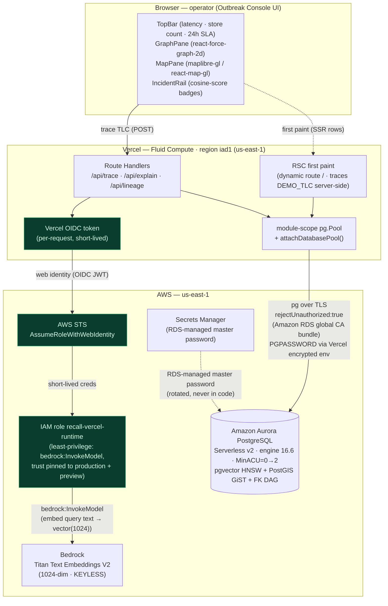
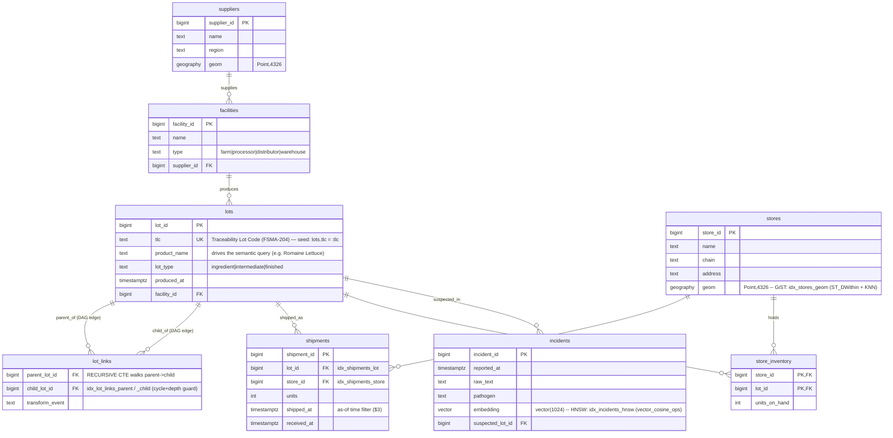

# Recall — Architecture Diagram

**The Outbreak Console** — a live FSMA-204 recall-dispatch console. Paste a contaminated Traceability Lot Code (TLC) and **one SERIALIZABLE SQL statement** traces the lot through an FK-constrained supply DAG to every affected store, maps them with PostGIS, and surfaces semantically-similar past incidents with pgvector — all in one round trip to **Amazon Aurora PostgreSQL (Serverless v2)**.

- **Live:** https://recall-h0.vercel.app
- **Database (the one named in the submission):** Amazon Aurora PostgreSQL, Serverless v2, engine 16.6, `us-east-1`, cluster `recall-aurora`, scale-to-zero (MinACU=0, auto-pause 300s) / MaxACU=2. Extensions: **pgvector 0.8** (HNSW, `vector_cosine_ops`) + **PostGIS** (GiST geography).
- **Frontend:** Next.js 16 App Router (RSC first paint + Route Handlers) on Vercel **Fluid Compute**, region `iad1` (co-located with Aurora `us-east-1`).

> **Read this diagram the way judges score it:** most teams draw boxes; the winner draws the data model. The [data-model / ER diagram](#2-data-model--the-supply-dag-the-centerpiece) is the centerpiece — it is annotated to show exactly which index serves which leg of the one hero query.

---

## Table of contents

1. [Request / data path (frontend ↔ backend)](#1-request--data-path-frontend--backend)
2. [Data model — the supply DAG (the centerpiece)](#2-data-model--the-supply-dag-the-centerpiece)
3. [The one query — three fused index paths](#3-the-one-query--three-fused-index-paths)
4. [Export to PNG for the Devpost upload](#4-export-to-png-for-the-devpost-upload)

---

## 1. Request / data path (frontend ↔ backend)

End-to-end: the operator's browser, the Vercel Next.js runtime, **keyless OIDC → STS → IAM role** (no long-lived AWS keys exist anywhere), and the two AWS calls that fire on every trace — one to Aurora over a **TLS-verified** connection, one to Bedrock Titan v2 to embed the query string.



**What the path guarantees (the on-camera security story):**

- **No long-lived AWS keys anywhere.** The Vercel runtime presents a per-request OIDC token; AWS STS exchanges it (`AssumeRoleWithWebIdentity`) for short-lived credentials scoped to `recall-vercel-runtime`. Bedrock is therefore called **keyless** from the edge. (Local dev uses `@xenova/transformers` all-MiniLM-L6-v2 / 384-dim — zero credits; `EMBED_DIM` is one config constant: 1024 cloud / 384 local.)
- **TLS-verified DB connection.** `pg` connects with `rejectUnauthorized:true` against the **Amazon RDS global CA bundle**; the DB password is delivered as `PGPASSWORD` via Vercel encrypted env, and the RDS-managed master lives in Secrets Manager.
- **Least-privilege, pinned trust.** The IAM role's trust policy is pinned to production + preview (no wildcard); the permissions policy grants only `bedrock:InvokeModel`.
- **Serverless-correct pooling.** A module-scope `pg.Pool` plus `attachDatabasePool` releases idle clients before the Fluid function suspends — the #1 Vercel + Aurora demo-killer, handled.
- **First-paint vs. interaction.** The RSC traces `DEMO_TLC` (`PRD-OUTBREAK-0001`, Romaine Lettuce) server-side so the console renders with real data; subsequent traces/scrubs hit the Route Handlers. The trace is **never cached** — a stale recall scope is dangerous.

---

## 2. Data model — the supply DAG (the centerpiece)

This is the artifact judges reward: the actual FK-constrained schema behind the live database, **annotated to show which index serves which leg of the hero query**. The recursion walks `lot_links` (a self-edge DAG on `lots`); the spatial join rides `stores.geom`; the similarity search rides `incidents.embedding`.



**Index → hero-query leg map (these are the nodes the live `/api/explain` proves):**

| Schema object | Index | Hero-query leg it serves | EXPLAIN node |
|---|---|---|---|
| `lot_links(parent_lot_id)` | `idx_lot_links_parent` | RECURSIVE CTE `contaminated` walking the FK-constrained supply DAG, depth + cycle (`path` visited-set) guarded | **Recursive Union** + index scan |
| `stores.geom` (`geography(Point,4326)`) | `idx_stores_geom` (GiST) | `spatial_stores` CTE — `ST_DWithin` + KNN order for the affected-store map | **GiST Spatial Path** |
| `incidents.embedding` (`vector(1024)`) | `idx_incidents_hnsw` (`vector_cosine_ops`) | `similar_incidents` — `ORDER BY embedding <=> $2 LIMIT 5` for the IncidentRail | **HNSW Index Scan** |
| `shipments(lot_id)`, `shipments(store_id)` | `idx_shipments_lot`, `idx_shipments_store` | `affected` CTE — joins implicated lots → stores, `SUM(units)` | Index scans |

> **Why only Aurora PostgreSQL.** DynamoDB cannot do recursive graph traversal or ad-hoc joins. Aurora DSQL has **no PostGIS, no pgvector, and no foreign keys** (so no FK-enforced DAG integrity). Only Aurora PostgreSQL fuses graph recursion + geospatial + vector similarity + serializable correctness in one statement. (Precision: DSQL *does* support basic CTEs — the unimpeachable points are PostGIS + pgvector + FK integrity.) The FK constraints on `lot_links` and `shipments` are what make the trace **trustworthy** — the edges are valid by engine enforcement, not by hope.

---

## 3. The one query — three fused index paths

`lib/db/queries/trace.ts → TRACE_SQL` is the entire product: **one SERIALIZABLE statement** (`BEGIN ISOLATION LEVEL SERIALIZABLE`, with `40001` serialization-failure retry) whose `EXPLAIN` proves three index paths fire live in one round trip.

1. **Recursive Union** — `WITH RECURSIVE contaminated` seeds at `lots.tlc = $1`, then walks the FK-constrained DAG `JOIN lot_links ll ON ll.parent_lot_id = c.lot_id`, guarded by `c.depth < TRACE_MAX_DEPTH` and `ll.child_lot_id <> ALL(c.path)` (cycle defense). → drives the igniting **supply graph**.
2. **GiST Spatial Path** — `spatial_stores AS MATERIALIZED` runs `ST_DWithin(s.geom, …)` ordered by `s.geom <-> …` over `idx_stores_geom`; the `affected` CTE joins implicated lots' `shipments` to those stores and `SUM(units)`. → drives the **PostGIS store map**.
3. **HNSW Index Scan** — `similar_incidents` runs `ORDER BY i.embedding <=> $2::vector LIMIT 5` over `idx_incidents_hnsw`, scoring `1 - (embedding <=> $2)` as cosine. → drives the **IncidentRail** cosine-score badges.

Per-transaction planner tuning is scoped with `SET LOCAL` (`random_page_cost = 1.1`, `enable_seqscan = off`) so the vector + relational index paths stay engaged at demo volume — affecting only the trace transaction.

**Verified live over real Aurora:** 80,000 lots · **250,000 `lot_links` edges** · 250,000 shipments · 1,400 stores across **38 US states** · 2,000 incidents (all real 1024-dim embeddings). Tracing `DEMO_TLC = PRD-OUTBREAK-0001` (Romaine Lettuce) reaches **1,400 stores across 38 states, 2,583,144 units, 83 contaminated lots / 82 edges**. Latency: p50 ~144ms (bench), warm API ~305–514ms over 580k rows; first request ~15s **only** when resuming from scale-to-zero auto-pause. CloudWatch `ServerlessDatabaseCapacity` verified at **0.0 ACU idle** (≈$0) → 2.0 ACU under load.

---

## 4. Export to PNG for the Devpost upload

Devpost wants an image. Both diagrams above are valid Mermaid; render and export either way:

**Option A — mermaid.live (fastest, no install):**

1. Open https://mermaid.live.
2. Paste one ```mermaid``` block's body (everything between the fences) into the left **Code** pane.
3. Click **Actions → PNG** (or **SVG** for crisp scaling), then upload to Devpost. Export each diagram separately.

**Option B — VS Code (offline):**

1. Install the **Markdown Preview Mermaid Support** extension (or **Mermaid Markdown Syntax Highlighting** + **Markdown PDF**).
2. Open this file, open the Markdown preview (`Cmd/Ctrl+Shift+V`).
3. Right-click a rendered diagram → **Copy Image**, or use **Markdown PDF: Export (png)** to render the whole doc.

**Option C — CLI (reproducible, for CI):**

```bash
npx -p @mermaid-js/mermaid-cli mmdc -i diagram.mmd -o architecture.png -b transparent -s 3
```

> Tip: export at 2–3× scale (`-s 3` on the CLI, or the SVG path on mermaid.live) so the index annotations stay legible when Devpost downscales the upload.
